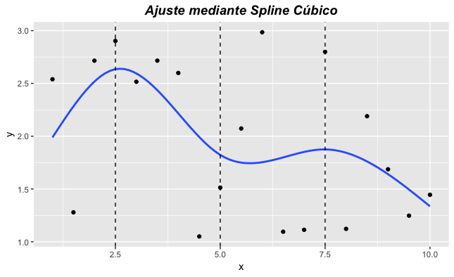

---
output:
  html_document: default
  pdf_document: default
---
\mainmatter

# Curva de Rendimientos

<!-- La curva de rendimientos es una herramienta utilizada ampliamente, por quienes toman las decisiones de política monetaria o planifican sus inversiones, de acuerdo con la valoración, negociación o cobertura sobre instrumentos financieros. Se ha comprobado que la geometría de la curva de rendimientos en los mercados desarrollados incorpora información relevante para la predicción de las recesiones económicas. De igual manera, en finanzas la curva de rendimientos se convierte en un vector de precios de referencia importante para la fijación de las tasas de interés a diferentes plazos y por riesgo de crédito para bancos, prestamistas, colocadores de bonos y, en general, para todos los participantes del mercado de dinero. -->

<!-- Los resultados revelan las bondades en el ajuste de las redes neuronales artificiales (RNA), la curva de Svensson, la curva de Nelson-Siegel y los polinomios locales. No obstante, se recomienda utilizar la curva de Svensson en la estimación de las tasas de interés, debido a la interpretabilidad de sus parámetros y a su superioridad sobre la -->
<!-- Curva de Nelson-Siegel. -->

La curva de rendimientos es una representación grafica que muestra la relación que existe entre los rendimientos de una clase particular de títulos valores y el tiempo que falta para su vencimiento, lo cual es conocido como la estructura temporal de la tasa de interés (ETTI) para instrumentos con riesgo similar pero con diferentes plazos de maduración. La ETTI es un indicador de la evolución futura de los tipos de interés y de inflación, además, la mayoría de los activos financieros se valoran mediante este indicador, por lo cual también se considera básico en el diseño de estrategias de gestión de riesgos y en la toma de decisiones de inversión y financiación. Existen cuatro formas que puede adoptar una curva de rendimientos:


+ **Curva ascendente**: generalmente, la curva de rendimientos tiene esta      forma, lo que indica que los inversionistas requieren mayores rendimientos     para vencimientos de más largo plazo, es decir, que los rendimientos         varían directamente con los plazos. 
+ **Curva descendente**: indica que los rendimientos disminuyen a medida que   aumentan los plazos.
+ **Curva horizontal**: indica que independientemente del plazo de vencimient   o, los rendimientos son los mismos; para períodos muy largos, todas las      curvas de rendimientos tienden a aplanarse.

+ **Curva horizontal**: indica que independientemente del plazo de vencimiento, los rendimientos son los mismos; para períodos muy largos, todas las      curvas de rendimientos tienden a aplanarse.

+ **Curva creciente y decreciente**: es el reflejo de una situación en la    que los rendimientos de corto y largo plazo son los mismos y los rendimientos  de mediano plazo son los que varían.

<!-- \begin{figure}[h] -->
<!--   \scalebox{0.80}{\includegraphics{images/tipo_curvas.jpg}} -->
<!-- \caption{Tipos de curva de rendimiento.} -->
<!-- \label{tipos_c} -->
<!-- \end{figure} -->


<!--  -->


```{r , echo=FALSE, fig.align='center',fig.cap="Tipos de Curvas",label=tipos}
knitr::include_graphics("images/tipo_curvas.jpg")
```

Es de esperar que una pendiente negativa de la curva de rendimientos (Ver Figura \@ref(fig:tipos) ) o curva invertida (tasas de largo plazo menores a las de corto plazo) indique expectativas de una recesión futura y, por lo tanto, menores tasas de interés futuras; esto se puede explicar ya que los rendimientos esperados contienen información sobre los planes de consumo de los agentes. 

Entre las teorías que explican la pendiente de la curva de rendimientos, se encuentran:


+ **La teoría de la preferencia por la liquidez**: consiste en que los inversionistas prefieren manejar títulos a corto plazo, pues éstos tienen una sensibilidad menor a los cambios en las tasas de interés y ofrecen una mayor flexibilidad en las inversiones si se compara con los títulos de largo plazo. Además, los prestatarios prefieren deuda a largo plazo, pues la de corto plazo los expone al riesgo de hacer una refinanciación de la deuda en condiciones adversas. Ambas situaciones, generan entonces, tasas de corto plazo relativamente bajas. En su conjunto, estos dos grupos de preferencias implican que en condiciones normales existe una Prima de Riesgo por Vencimiento (PRV) que aumenta en función de los años de vencimiento, haciendo que la curva de rendimientos posea una pendiente ascendente \cite{DO}.

+ **La teoría de la segmentación del mercado**: considera el mercado de renta fija como una serie de distintos mercados, los inversionistas y los emisores están restringidos por el sector específico de maduración. De acuerdo con esta teoría, la curva de rendimientos refleja una serie de condiciones de oferta y demanda que crean una secuencia de precios de equilibrio de mercado (tasas de interés) de los fondos \cite{DO}.

+ **La teoría del Hábitat Preferido**: plantea que los inversionistas intentarán liquidar sus inversiones en el menor plazo posible mientras que los prestamistas querrán tomar un plazo más largo; por lo tanto, dado que no se encuentran oferta y demanda de fondos para un mismo plazo, algunos inversionistas o prestatarios se verán motivados a cambiar el plazo de la inversión o el financiamiento pero, para lograrlo, deben ser compensados con un premio por el riesgo cuyo tamano reflejará la extesión de la aversión al riesgo.

+ **La Hipótesis de las Expectativas (HE)**: plantea que las tasas de interés de largo plazo deben reflejar por completo la información revelada por las futuras tasas de interés de corto plazo esperadas \cite{YS}, o sea que los tipos de largo plazo no son más que una suma ponderada de los tipos de corto plazo esperados \cite{FR}. Así, se puede afirmar entonces que la HE es una teoría que plantea que las tasas de interés exclusivamente representan las tasas previstas en el futuro.

##Metodologías de estimación de la Curva de Rendimientos.

La curva de rendimientos presenta empíricamente una serie de dificultades, debido a que se construye a través de una serie de precios (tasas) de instrumentos financieros discontinuos en el tiempo que, por lo general, están lejos de ser una curva suave. Para su estimación existen diversas metodologías, las paramétricas y las no paramétricas. Las metodologías paramétricas se basan en modelos asociados a una familia funcional que obedece al comportamiento de alguna distribución de probabilidad, sobre la cual suponemos que las características de la población de interés pueden ser descritas. Es así como, los modelos diseñados en este contexto, basados en regresión, buscan describir el comportamiento de una variable de interés con otras llamadas exógenas, a través de funciones de vínculo lineales o no lineales.


##Metodologías Paramétricas.

Estadísticamente, un modelo paramétrico es una familia funcional que
obedece al comportamiento de alguna distribución de probabilidad, sobre la cual suponemos que las características de la población de interés
pueden ser descritas. Es así como, los modelos diseñados en este contexto,
basados en regresión, buscan describir el comportamiento de una
variable de interés con otras llamadas exógenas, a través de funciones de
vínculo lineales o no lineales.


###Metodología Nelson y Siegel

Nelson y Siegel introducen un modelo paramétrico para el ajuste
de los rendimientos hasta la madurez de los bonos del tesoro de Estados
Unidos que se caracteriza por ser parsimonioso y flexible en modelar
cualquier forma típica asociada con las curvas de rendimientos. La estructura
paramétrica asociada a este modelo permite analizar el comportamiento
a corto y a largo plazo de los rendimientos y ajustar -sin
esfuerzos adicionales-, curvas monótonas, unimodales o del tipo S.


Una clase de funciones que genera fácilmente las formas usuales de las
curvas de rendimientos es la asociada con la solución de ecuaciones en
diferencia. La teoría de expectativas sobre la estructura de las tasas de
interés promueve la investigación en este sentido, dado que si las tasas
spot son producidas por medio de una ecuación diferencial, entonces las
tasas forward -siendo pronósticos-, serán la solución de las ecuaciones
diferenciales. La expresión paramétrica propuesta por Nelson y Siegel
 que describe las tasas forward es exhibida a continuación:


$$\displaystyle{f(m) = \beta_{0} + \beta_{1} e^{\frac{-m}{\tau}} +\beta_{2} \left(\frac{-m}{\tau}\right)e^{\frac{-m}{\tau}}}$$

donde $m$ denota la madurez del activo y $\beta_{0}$, $\beta_{1}$, $\beta_{2}$ y $\tau$ los parámetros a ser
estimados. Puesto que las tasas spot pueden ser obtenidas a través de tasas
forward por medio de la expresión:

$$\displaystyle{s(m) = \int_{0}^{m}f(x)dx}$$

la ecuación que determina las tasas spot $s(m)$ de activos con madurez m es dada por:

$$\displaystyle{s(m) = \beta_{0}+ \beta_{1}\frac{\left(1-e^\frac{-m}{\tau}\right)}{m/\tau} + \beta_{2} \left(\frac{\left(1-e^\frac{-m}{\tau}\right)}{m/\tau} -  e^\frac{-m}{\tau}\right)}$$

cuya ecuación es lineal si conocemos $\tau$ .

El valor límite del rendimiento es $\beta_{0}$ cuando el plazo al vencimiento $m$ es grande, mientras que, cuando el plazo al vencimiento $m$ es pequeño el
rendimiento en el límite es $\beta_{0}+\beta_{1}$. Igualmente, los coeficientes del
modelo de tasas forward pueden ser interpretados como medidas de
fortaleza al corto, mediano y largo plazo. La contribución al largo plazo
es determinada por $\beta_{0}$, $\beta_{1}$ lo hace al corto plazo ponderado por la
función monótona creciente (decreciente) $e^{\frac{-m}{\tau}}$ cuando $\beta_{1}$ es negativo
(positivo) y $\beta_{2}$ lo hace al mediano plazo ponderado por la función
monótona creciente (decreciente) $(\frac{-m}{\tau}) e^{\frac{-m}{\tau}}$ cuando $\beta_{2}$ es negativo
(positivo). Una de las principales utilidades de la curva ha sido para
propósitos de control de la política monetaria.

Consecuentemente, $s(m)$ será la ecuación utilizada para captar la relación
subyacente entre los rendimientos y los plazos al vencimiento o madurez,
sin recurrir a modelos más complejos que involucren un mayor número
de parámetros. Adicionalmente, dado que la curva de Nelson-Siegel
proporciona tasas spot compuestas continuas, estas deben transformarse
en cantidades discretas, a través de la función de descuento.


$$\displaystyle{s_{d}(m) = e^{\frac{s(m)}{100}} - 1}$$

###Metodología Svensson

En la curva de Nelson-Siegel se destaca que cada coeficiente del modelo
contribuye en el comportamiento de las tasas forward en el corto,
mediano y largo plazo; no obstante, Svensson \cite{Sv} propone una nueva
versión de la curva de Nelson-Siegel donde un cuarto término es incluido
para producir un efecto adicional y semejante al proporcionado por:
$\beta_{3}(\frac{m}{\tau_{2}})e^{\frac{-m}{\tau_{2}}}$.

En este caso, la función para describir la dinámica de las tasas forward es,


$$\displaystyle{f(m) = \beta_{0} + \beta_{1} e^{\frac{-m}{\tau_{1}}} +\beta_{2} \left(\frac{-m}{\tau_{1}}\right)e^{\frac{-m}{\tau_{1}}} + \beta_{3}\left(\frac{-m}{\tau_{2}}\right)e^{\frac{-m}{\tau_{2}}} }$$


La curva spot de Svensson puede ser derivada a partir de la curva
forward en forma semejante a la descrita para el modelo de Nelson-
Siegel, obteniendo la siguiente expresión:

$$\displaystyle{s(m) = \beta_{0}+ \beta_{1}\frac{\left(1-e^\frac{-m}{\tau_{1}}\right)}{m/\tau_{1}} + \beta_{2} \left(\frac{\left(1-e^\frac{-m}{\tau_{1}}\right)}{m/\tau_{1}} -  e^\frac{-m}{\tau_{1}}\right) + \beta_{3} \left(\frac{\left(1-e^\frac{-m}{\tau_{2}}\right)}{m/\tau_{2}} -  e^\frac{-m}{\tau_{2}}\right)}$$


La función de descuento tiene que ser utilizada con el fin de obtener las
tasas estimadas para cada día de negociación o trading. Svensson \cite{Sv}
propone estimar los parámetros de la curva cero cupón (curva spot),
minimizando una medida de ajuste tal como la suma de cuadrados del
error sobre los precios spot; sin embargo, enfatiza en que los precios
pueden llegar a ser mal ajustados para los activos de madurez corta. En
lugar de llevar el análisis por este camino, propone estimar los
rendimientos fundamentado, principalmente, en que las decisiones de la
política económica se basan en el comportamiento de las tasas y que
obteniendo las tasas a través de la curva, los precios pueden ser
calculados una vez la función de descuento es evaluada. De esta manera,
los parámetros son escogidos minimizando la suma de cuadrados de la
diferencia entre los rendimientos observados y estimados por la curva.

La estimación es realizada por medio de máxima verosimilitud, mínimos
cuadrados no lineales o el método de momentos generalizados. En
muchos casos, como afirma Svensson \cite{Sv}, el modelo de Nelson-
Siegel proporciona ajustes satisfactorios, aunque en algunos casos
cuando la estructura de las tasas de interés es más compleja, el ajuste del
modelo de Nelson-Siegel es poco satisfactorio y el modelo de Svensson
logra desempeñarse mejor.

###Polinomios de componentes principales.

Hunt y Terry \cite{HT} propone un ajuste de la curva de rendimientos
utilizando polinomios. Si frecuentemente la curva es especificada como,

(@ecu1) 
$$
y(\tau) = \beta_{0} + \beta_{1}\tau +\beta_{2}\tau^2 +\beta_{3}\tau^3
$$

La cual puede captar todas la formas que puede asumir la curva, su
principal problema recae en el ajuste para aquellas tasas con períodos de
vencimiento bastante largos. Aunque los autores conocen sobre las
propiedades de parsimonia y de ajuste asociados con la curva de Nelson-
Siegel, critican los problemas que acarrea la estimación de sus
parámetros, proponiendo el ajuste de la curva de polinomios, bajo
algunas modificaciones.

Una transformación sobre el término de plazos ($\tau$) que remueve la
inestabilidad asociada con las tasas a largo plazo del polinomio de la ecuación @ecu1 es
sugerida. El modelo recomendado, siguiendo la notación de Hunt y
Terry (1998) es:

(@ecu2)
$$
y(\tau) = \beta_{0} + \sum_{i=1}^{p} \beta_{i} \frac{1}{(1+\tau)^i}
$$

donde,

$$\displaystyle{y(0) = \sum_{i=0}^{p}\beta_{i},   \text{ con } y(\infty) = \beta_{0}   }$$


Investigaciones relacionadas con curvas de rendimientos, han llegado a
la conclusión que modelos con tres o cuatro parámetros son suficientes
para obtener un buen ajuste de los datos (Hunt \cite{H}). Por tal motivo,
Hunt y Terry \cite{HT} proponen restringir $p$ a tres o cuatro. Aunque este
número de parámetros no necesariamente determina si realmente la
bondad de ajuste pueda llegar a ser satisfactoria, los autores proponen
utilizar componentes principales sobre los primeros $p$ términos
polinomiales $1/(1 + \tau)$, con el fin de seleccionar $k<p$ variables, a ser
incluidas en la ecuación @ecu2. Utilizar las componentes principales
proporcionará un menor error de ajuste en comparación con la ecuación @ecu1,
debido a su capacidad para captar variabilidad. Una descripción
detallada respecto al cálculo de las componentes principales en el
esquema polinomial es dada por Hunt y Terry \cite{HT}.

###Polinomios trigonométricos.

Las funciones trigonométricas pueden ser utilizadas para capturar de
forma satisfactoria las distintas configuraciones que pueden asumir las
curvas de rendimientos. En este caso, el modelo puede ser descrito como
$y(\tau) = \beta_{0} + \beta_{1}cos(\gamma_{1}\tau) + \beta_{2}sen(\gamma_{2}\tau)$; donde $\tau$ representa la duración o la
madurez del papel, en tanto que $\beta_{0}$, $\beta_{1}$, $\beta_{2}$, $\gamma_{1}$ y $\gamma_{2}$ son los parámetros
objeto de interés. Cualquier metodología de optimización no lineal puede
ser utilizada para estimar los parámetros del modelo (Nocedal y Wright
\cite{NW}). Aunque podría asumirse un parámetro de fase en el modelo, este
no es considerado por motivos de parsimonia.


###Metodología Diebold-Li

##Metodologías no Paramétricas

La regresión no paramétrica se ha convertido en los últimos años en un
área de excesivo estudio, debido a sus ventajas relativas respecto a los
modelos de regresión basado en funciones. Entre las características más
importantes de estos modelos tenemos, la flexibilidad en los supuestos y
el ajuste dirigido específicamente a través de los datos.


Dentro de un marco estadístico supondremos que tenemos un conjunto
de n observaciones $(x_{i}, y_{i})$, $i= 1, 2,., n$, independientes, donde se intenta
establecer las relaciones existentes entre una respuesta y un conjunto de
variables explicativas de forma semejante a los modelos de regresión
clásica.


El modelo que relaciona este conjunto de variables es dado por:

$$\displaystyle{y_{i} = m(x_{i}) + \epsilon_{i}}$$


donde la función $m(.)$ no específica una relación paramétrica, sino
permitir que los datos determinen la relación funcional apropiada. Bajo
estas condiciones la idea es que la media m(.) sea suave, suavidad que
puede controlarse acotando la segunda derivada, $|m''(x)| \leq M$, para todo
$x$ y $M$ una constante.

###Regresión Kernel

El método más simple de suavizamiento es el suavizador Kernel. Un
punto x se fija en el soporte de la función $m(.)$ y una ventana de
suavizamiento es definida alrededor de x. Frecuentemente, la ventana de
suavizamiento es simplemente un intervalo de la forma $(x - h, x + h)$,
donde h es un parámetro conocido como bandwidth.

La estimación Kernel es un promedio ponderado de las observaciones
dentro de la ventana de suavizamiento,

(@ecu3)
$$
\hat{m}(x) = \frac{\sum_{i=1}^{n} K(\frac{x_{i}-x}{h}) y_{i}}{\sum_{i=1}^{n} K(\frac{x_{i}-x}{h})}
$$

donde $K(.)$ es la función Kernel de ponderación. La función Kernel es escogida
de tal forma que las observaciones más próximas a x reciben mayor peso. Una
función frecuentemente utilizada es la bicuadrática:


$$
K(x) = \left\{
\begin{array}{ll}
(1-x^2)^2 &  \text{ si }  -1 \leq x  \leq 1 \\
0   & \text{ si }  x \ge 1,  x<-1
\end{array}
\right.
$$

Sin embargo, otro tipo de funciones de peso son utilizadas, tal como la
gaussiana, $K(x) = (2 \sqrt{\pi})^{-1} e^{\frac{-x^2}{2}}$ y la familia beta simétrica $K(x) = \frac{(1-x^2)_{+}^{\gamma}}{Beta(0.5,\gamma+1)}, \text{ con } \gamma = 0,1,...$

Note que cuando escogemos $\gamma = 0, 1, 2$ y $3$ obtenemos las funciones Kernel uniforme (Box), de Epanechnikov, la bipeso y la tripeso, respectivamente.

El suavizador Kernel puede ser representado como,


(@ecu4)
$$
\hat{m}(x) = \sum_{i=1}^{n} l_{i}(x) y_{i} 
$$

donde,

$$\displaystyle{l_{i} = \frac{K(\frac{x_{i}-x}{h})}{\sum_{j=1}^{n} K(\frac{x_{j}-x}{h})} }$$


La estimación Kernel en la ecuación @ecu3 es llamada la estimación de Nadaray- Watson, en honor a sus creadores. Su simplicidad lo hace de fácil comprensión e implementación; no obstante, se sabe que los ajustes en los extremos son sesgados. Una referencia ideal para un desarrollo más completo sobre este tema puede encontrarse en Fan y Gijbels \cite{FG}.

###Polinomios locales


Conocida también como regresión local, la idea es aproximar la función suave m(.) por medio de un polinomio de bajo orden en una vecindad entorno de un punto x. Por ejemplo, una aproximación lineal local es $m(x_{i}) \approx a_{0} + a_{1}(x_{i}-x)$ para $x - h \leq x_{i} \leq x+h$. Una aproximación local cuadrática es:

$$\displaystyle{m(x_{i}) \approx  a_{0} + a_{1}(x_{i}-x) + \frac{a_{2}}{2}(x_{i}-x)^2}$$


La aproximación local puede ser ajustada a través de mínimos cuadrados ponderados localmente. Una función Kernel y un bandwidth son definidos como en la regresión Kernel. Los coeficientes $\hat{a}_{0}$ y $\hat{a}_{1}$, son escogidos de tal forma que se pueda minimizar la expresión,


(@ecu5)
$$
 \sum_{i=1}^{n} K(\frac{x_{i}-x}{h}) (y_{i}-a_{0}-a_{1}(x_{i}-x))^2 
$$

Reescribiendo la ecuación @ecu5 en términos matriciales obtenemos, $X^{T}W(\tilde{Y}-X \tilde{a})$. Donde X es la matriz diseño para cada regresión lineal, $\tilde{a}$ el vector de
parámetros, W la matriz diagonal de pesos $K(\frac{x_{i}-x}{h})$ y $\tilde{Y}$ el vector de observaciones de orden n.

El vector de parámetros estimado está dado por $ \hat{\tilde{a}} = (X^{T}WX)X^{T}W \tilde{Y} $
y en forma semejante con la ecuación @ecu4, tenemos que: $l(x)_{nx1} = e_{1}^{T} (X^{T}WX)X^{T} \tilde{Y}$ donde $e_{1}^{T}$
es un vector de ceros de tamaño n, exceptuando la primera entrada cuyo valor es 1.

Finalmente, la selección del h está basado en procedimientos de bondad de ajuste que permite obtener el mejor modelo. Entre los más utilizados sobresalen los métodos de validación cruzada generalizada y plug-in, los cuales son descritos detalladamente en Fan y Gijbels \cite{FG}.

###Splines suavizados

Las funciones polinomiales se caracterizan por tener todas las derivadas en cualquier punto de su soporte; no obstante, cuando ciertas funciones no poseen un alto grado de suavidad en determinados puntos, el ajuste debido a estas funciones de polinomios no siempre será satisfactoria en estos tramos.

Para sobrellevar esta desventaja, el ajuste de polinomios de bajo orden localmente, con discontinuidades en ciertos puntos (knots), resulta en el conocido método de splines.


###Splines de polinomios

Suponga que queremos aproximar la función $m(.)$ por una función spline. Frecuentemente, el spline cúbico es utilizado para esta aproximación, sin embargo, otro tipo de splines pueden ser definidos.


Siguiendo la notación de Fan y Gijbels \cite{FG}, sea $t_{1}, t_{2}, t_{3},...,t_{J}$ el conjunto de nodos o knots en orden creciente, tal que en cada intervalo  ($-\infty$, $t_{1}$], $[t_{1}, t_{2}],..., [t_{J-1}, t_{J}]$, [$t_{J}, \infty$), funciones cúbicas continuas diferenciables son ajustadas. En este caso el espacio parámetrico es (J+4)-dimensional.

Un conjunto de splines cúbicos son ampliamente utilizados en la obtención de la función de splines, estas son las bases de potencias. Las mismas se definen como sigue, $(x- t_{j})_{+}^{3}, j= 1,2,...,J,1,x,x^2,x^3$ donde $x_{+}$ es la parte positiva de x. Así por ejemplo, la función de suavizamiento puede ser expresada como,

(@ecu6)
$$
m(x) = \sum_{j=1}^{J+4} \theta_{j}B_{j}(x) 
$$

siendo $B_{j}(x), j = 1, 2,... , J+4$, la base polinomial descrita anteriormente.

Los regresores definidos de esta forma pueden ocasionar problemas de estimación (multicolinealidad), motivo por el cual, los $B_{j}(x)$ son
redefinidos como,


$$\displaystyle{ B_{j}(x) = \frac{x-x_{j}}{x_{j+k-1}-x_{j}} B_{j,k-1}(x) + \frac{x_{j+k}-x}{x_{j+k}-x_{j}} B_{j+1,k-1}(x) }$$
suponiendo que $B_{j,1}=1$ para $x_{j} \leq x \leq x_{j+1}$ y cero en caso contrario. El proceso de estimación de la ecuación @ecu6 es realizado a través de mínimos cuadrados penalizados.

Adicionalmente, una desventaja del método, es su sensibilidad al número y ubicación de los nodos, motivo por el cual han sido propuestos diferentes procedimientos para su selección.

###Splines suavizados

El proceso de suavizamiento a través de este método está basado en la minimización de la funcíon,

$$\displaystyle{ \sum_{i=1}^{n} (y_{i}-m(x_{i})^2 + \lambda \int m''(x)^2dx  }$$
donde $\lambda$ es una constante especificada de suavizamiento. El mecanismo de optimización intenta crear un balance entre el sesgo de estimación y la suavidad de la curva ajustada. El parámetro $\lambda$ puede asumirse variable (Abramovich y Steinberg \cite{AS}) y estimado a través de validación cruzada generalizada.

###Supersuavizador de Friedmann


Las metodologías usuales de suavizamiento asumen que el parámetro suavizador es constante, factor que sumado a la forma de la curva subyacente puede hacer que surjan problemas, tal como el aumento en la varianza de la componente del error y/o a variaciones incontrolables de la segunda derivada de la función subyacente sobre el conjunto predictor. El suavizador propuesto por Friedman \cite{F} intenta corregir estos problemas, asumiendo que el bandwidth es variable sobre el conjunto de predictores.


Formalmente, se puede estimar un bandwidth para cada $x$, al igual que el correspondiente valor óptimo de suavizamiento, minimizando la expresión $e^{2}(m,h) = E(Y - m(X|h(X)))^2$ con respecto a las funciones $m(x)$ y $h(x)$. La expresión anterior puede reescribirse como,

(@ecu7)
$$
e^{2}(m,h) = E(E(Y - m(X|h(X)))^2|X)
$$

de tal forma que podemos minimizar el error con respecto a $m$ y $h$ para cada valor de $x$.

Como en el caso del bandwidth constante, se comienza aplicando un suavizador lineal local muchas veces sobre diferentes valores discretos de $h$, $0 < h < n$. Friedman \cite{F} propone utilizar tres conjuntos de valores, $h=0,05n$, $h=0,2n$ y $h=0,5n$, los cuales llama suavizadores ``tweeter", ``midrange" y ``woofer", respectivamente.

Para estimar la ecuación @ecu7 se utiliza el residual de la validación cruzada de la ecuación @ecu8 cuya descripción completa puede encontrarse en Friedman \cite{F},


(@ecu8)
$$
 r_{i}(h)= \frac{|y_{i}-m(x_{i}|h)|}{\left(1-\frac{1}{h}-\frac{(x_{i}-\bar{x}_{h})^2}{V_{h}}\right)}  
$$

siendo $\bar{x}_{h}$ y $V_{h}$, la media y varianza de los $x$, bajo un $h$ preeestablecido. Igualmente, Friedman \cite{F} aconseja suavizar $|r_{i}(h)|$ contra $x_{i}$, utilizando los $\hat{e}(m, h|x_{i})$, en procura de seleccionar la mejor amplitud de intervalo o bandwith, $\hat{e}(m, h_{vc}(x_{i})|x_{i})=min_{h} \hat{e}(m, h|x_{i})$, donde $h_{vc} (x_{i})$ es el mejor bandwidth bajo la validación cruzada respecto a cada $x_{i}$ , mientras que $h$ toma los valores de los suavizadores antes definidos.

De esta manera, el mejor valor suavizado dado $x_{i}$, siguiendo la notación de Friedman \cite{F}, $s^{*}(x_{i})$, estará asociado con el bandwidth: "tweeter", "midrange"  o "woofer" que minimice el error bajo la validación cruzada. Es posible a través de esta metodología obtener para cada vecindad en torno a $x_{i}$ diferentes bandwith y suavizados que proporcionan resultados óptimos, por tal razón, Friedman \cite{F} propone seleccionar la mejor amplitud de intervalo, suavizando los $h_{vc} (x_{i})$ contra $x_{i}$ utilizando el suavizador ``midrange", mientras que la curva estimada es obtenida interpolando entre los dos suavizadores con los bandwith estimados más parecidos.


Una suposición general establece que la curva subyacente que describe el comportamiento de los datos es suave, así que sería posible modificar el bandwidth en procura de un mayor suavizamiento, sacrificando exactitud numérica. Con este fin, Friedman \cite{F} propone un método de cálculo del bandwidth,

$$\displaystyle{h(x_{i}) = h_{vc}(x_{i}) + (h_{w} - h_{vc}(x_{i}))R_{i}^{10-\alpha}}$$

 con, 


$$\displaystyle{R_{i} = \left[\frac{\hat{e}(h_{vc}(x_{i})|x_{i})}{\hat{e}(h_{w}(x_{i})|x_{i})} \right] }$$


donde $0 < \alpha < 10$, $h_{w}$ es la amplitud calculada utilizando 
el suavizador "woofer" y $h_{vc}(.)$ la amplitud obtenida bajo la validación cruzada para cada observación. Sin importar el $\alpha$, cuando la contribución relativa de cada una de estas amplitudes no difiere significativamente, la amplitud de intervalo o bandwidth seleccionada es la determinada por el suavizador "woofer"; no obstante, si la eficiencia relativa está asociada con la amplitud bajo la validación cruzada, entonces, la ecuación en proporcionará esta amplitud. En otros casos, dependiendo del desempeño relativo y el parámetro $\alpha$ definido por el usuario, la ecuación proporcionará una amplitud, resultado de la combinación lineal entre el suavizador ``woofer" \hspace*{0.01 cm} y el obtenido bajo validación cruzada.

Una vez el bandwidth de suavización variable ha sido obtenido, los siguientes pasos son realizados sobre el conjunto de observaciones,


+ Suavice los datos con los bandwidth "tweeter", "midrange" y "woofer".
+ Suavice los residuales absolutos (12) obtenidos bajo cada bandwidth en el paso anterior, utilizando una amplitud de intervalo "midrange".
+ Seleccione el mejor bandwidth para cada observación, minimizando el error sobre la salida del paso (2).
+ Suavice los mejores bandwidth estimados en el paso (3) utilizando amplitud de intervalo "midrange".
+ Utilice los bandwidth suavizados para interpolar entre los valores suavizados obtenidos en el paso 1.


Las principales deficiencias atribuidas a esta técnica están asociadas con la pérdida de independencia entre los residuales $\epsilon_{i}$ relativo al orden de los predictores $x_{i}$, subestimando (sobre-estimando) cuando la correlación es positiva-alta (negativa-alta).

###Redes neuronales artificiales

Los recientes desarrollos investigativos han mostrado la capacidad de las redes neuronales para la detección de patrones, clasificación y predicción a través del aprendizaje por medio de la experiencia. Su importancia actual, sin lugar a dudas, es consecuencia del desarrollo computacional, punto de partida para su divulgación, desenvolvimiento teórico y práctico en diversos campos del conocimiento.

Una de las mayores áreas de aplicación de las redes neuronales es la predicción (Sharda \cite{SH}). Dentro de este contexto, las redes resultan ser una herramienta atractiva para los investigadores, comparada con las metodologías tradicionales basada en modelos de funciones.

Las redes neuronales artificiales intentan emular el comportamiento biológico del cerebro humano. Como sabemos, el cerebro humano es un conjunto complejo de interconexiones de elementos simples llamados nodos o neuronas. Cada nodo recibe una señal de entrada proveniente de otros nodos o a través de estímulos externos; localmente el nodo procesa la información recibida por medio de una función de transferencia o activación y produce una señal de salida transformada, que irá hacia otros nodos o como una respuesta, consecuencia de un estímulo. Aunque cada nodo individualmente no proporciona información realmente valiosa, en conjunto, pueden realizar un sorprendente número de tareas de forma eficiente. Esta característica hace de las redes neuronales un mecanismo poderoso computacionalmente para aprender a partir de ejemplos y después generalizar para casos nunca antes considerados.


Aunque diferentes arquitecturas de redes neuronales han sido propuestas (Haykin \cite{Ha}), la más utilizada es la red multilayer Perceptron (MLP). Una red MLP está compuesta de varias capas y nodos o neuronas. Los nodos de la primera capa son los encargados de recibir la información del exterior, mientras que la última capa es encargada de proporcionar la respuesta asociada a esta información. Entre estas dos capas puede haber innumerables capas y nodos. Adicionalmente, los nodos de capas adyacentes están completamente conectados.

Para un problema de pronóstico con redes neuronales, las entradas a la red son asociadas con variables independientes o explicativas. En este caso la relación funcional estimada establecida por la red neuronal será de la forma $y_{t}=f(x_{1}, x_{2},..., x_{p})$; donde $x_{1}, x_{2},..., x_{p}$ son p variables exógenas y y una variable endógena. En este sentido la red es equivalente a un modelo de regresión no lineal. Igualmente, en el contexto del pronóstico de series temporales, las entradas de la red son series rezagadas de la original y la salida representa su valor futuro. En este caso la red haría un mapeo de la siguiente forma $y_{t}= f (y{t-1}, y{t-2}, ..., y{t-p})$, donde $y_{t}$ es la observación en el tiempo t. Bajo estas características la red asemeja un modelo autorregresivo en el pronóstico de series temporales. Una discusión respecto a la relación existente entre las redes neuronales y la metodología de Box-Jenkins es dada por Suykens, Vandewalle y Moor \cite{SVM}.

Antes de que la red sea utilizada para realizar alguna tarea específica, debe ser entrenada. Básicamente, entrenar es el proceso de determinar los pesos (eje central de la red neuronal). El conocimiento aprendido por la red es almacenado en cada una de los arcos que representan las conexiones entre los nodos. Es a través de estas conexiones que las redes pueden realizar complejos mapeos no lineales desde los nodos de entrada hasta los nodos de salida. El entrenamiento de la MLP es supervisado, caso en el cual la respuesta deseada o valor objetivo para cada patrón de entrada o ejemplo está siempre disponible.

Los datos de entrenamiento son ingresados a la red en forma de vectores de variables o como patrones de entrada. Cada elemento en el vector de entrada es asociado con un nodo de la capa de entrada; de esta forma, el número de entradas a la red es igual a la dimensión del vector de entrada. Para el pronóstico de series temporales el número de variables de entrada es difícil de establecer, no obstante, una ventana de rezagos fija es constituida a lo largo de la serie. El total de datos disponible es usualmente dividido en un conjunto de entrenamiento y otro de prueba. El primero es utilizado para estimar los pesos de la red, mientras que el segundo es empleado para evaluar la capacidad de generalización de la red.


Para el proceso de entrenamiento, patrones de entrada son ingresados a la red. Los valores de activación de los nodos de entrada son multiplicados por su peso respectivo y acumulados en cada nodo sobre la primera capa. El total es evaluado en una función de activación y asumido como la salida del respectivo nodo. A esta salida algunos investigadores la identifican como la activación del nodo y es la entrada de otros nodos en capas siguientes de la red hasta que los valores de activación de la salida sean encontrados. El algoritmo de entrenamiento es utilizado para encontrar los pesos que minimicen una medida global de error tal como la suma de cuadrados del error (SSE).


En el pronóstico con series temporales, un patrón de entrenamiento consiste de un conjunto de valores fijos de variables en rezago de la serie. Suponga que tenemos N observaciones $y_{1}, y_{2}, ..., y_{N}$ para el proceso de entrenamiento y se requiere pronosticar un paso al frente, entonces con una red neuronal de n nodos de entrada, tenemos $N-n$ patrones de entrenamiento. El primer patrón de entrenamiento estará conformado por $y_{1}, y_{2}, ..., y_{n}$ como las entradas y $y_{n+1}$ como el valor objetivo. El segundo patrón de entrenamiento será $y_{2}$, $y_{3}$, ..., $y_{n+1}$ y el valor de salida deseado $y_{n+2}$. Finalmente, el último patrón de entrada será $y_{N-n}, y_{N-n+1}, ..., y_{N-1}$ y $y_{N}$ el valor objetivo. Frecuentemente, una función objetivo basada en la SSE es minimizada durante el proceso de entrenamiento,


$$\displaystyle{E = \frac{1}{2} \sum_{i=n+1}^{N}(y{i}-a{i})^2 }$$

donde $a_{i}$ es la salida actual de la red.

Una descripción más detallada sobre las diferentes arquitecturas de red existentes, el número óptimo de capas ocultas y neuronas, las funciones de activación más utilizadas, los algoritmos de entrenamiento, la normalización de los datos, como también de otros temas relacionados con sus ventajas y deficiencias (Haykin \cite{Ha}, Kaastra y Boyd \cite{KB}, Zhang, Patuwo y Hu \cite{ZPH}, Isasi y Galván \cite{IG}), entre otros.


###Metodología Splines Cúbicos de Suavizado

####Teoría de interpolación

En el subcampo matem\'atico del an\'alisis num\'erico, se denomina interpolaci\'on a la obtenci\'on de nuevos puntos partiendo del conocimiento de un conjunto discreto de puntos. En ciertos casos el usuario conoce el valor de una funci\'on $f(x)$ en una serie de puntos $x_{1}, x_{2},..., x_{N}$, pero no se conoce una 
expresi\'on anal\'itica de $f(x)$ que permita calcular el valor de la funci\'on para un punto arbitrario. 

Un ejemplo claro son las mediciones de laboratorio, donde se mide cada minuto un valor, pero se requiere el valor en otro punto que no ha sido medido. Otro ejemplo son mediciones de temperatura en la superficie
de la Tierra, que se realizan en equipos o estaciones meteorol\'ogicas y se necesita calcular la temperatura en un punto cercano, pero distinto al punto de medida.

La idea de la interpolaci\'on es poder estimar $f(x)$ para un valor de x arbitrario, a partir de la construcci\'on de una curva o superficie que une los puntos donde se han realizado las mediciones y cuyo valor si se conoce. Se asume que el punto arbitrario x se encuentra dentro de los l\'imites de los puntos de medici\'on, en caso contrario se llamar\'ia extrapolaci\'on. Un proceso de interpolaci\'on se realiza en dos etapas:


+ Hacer un ajuste de los datos disponibles con una funci\'on interpolante.
+ Evaluar la funci\'on interpolante en el punto de inter\'es x.


Este proceso en dos etapas no es necesariamente el m\'as 
eficiente. La mayor\'ia de algoritmos comienzan con un punto cercano $f(x_{i})$, y poco a poco van aplicando correcciones m\'as pequenas a medida que la informaci\'on de valores $f(x_{i})$ m\'as distantes son incorporadas. El procedimiento toma aproximadamente $O(N^{2})$ operaciones. Si la funci\'on tiene un comportamiento suave, la \'ultima correci\'on ser\'a la m\'as peque\~na y puede ser utilizada para estimar un l\'imite a rango de error.

Dentro de las intepolaciones m\'as usadas podemos destacar,


+ Interpolaci\'on lineal.
+ Interpolaci\'on de Hermite.
+ Interpolaci\'on polin\'omica.
+ Interpolaci\'on de Splines.


####Interpolaci\'on lineal

La interpolaci\'on lineal es un procedimiento muy utilizado para estimar los valores que toma una funci\'on en un intervalo del cual conocemos sus valores en los extremos $(x_{1}, f(x_{1}))$ y $(x_{2},f(x_{2}))$. Para estimar este valor utilizamos la aproximaci\'on a la funci\'on $f(x)$ por medio de una recta $r(x)$ (de ah\'i el nombre de interpolaci\'on lineal, ya que tambi\'en existe la interpolaci\'on cuadr\'atica). 


La expresi\'on de la interpolaci\'on lineal se obtiene del polinomio interpolador de Newton de grado uno. Aunque s\'olo existe un \'unico polinomio que interpola una serie de puntos, existen diferentes formas de calcularlo. Este m\'etodo es \'util para situaciones que requieran un n\'umero bajo de puntos para interpolar, ya que a medida que crece el n\'umero de puntos, tambi\'en lo hace el grado del polinomio.

Existen ciertas ventajas en el uso de este polinomio respecto al polinomio interpolador de Lagrange. Por ejemplo, si fuese necesario a\~nadir alg\'un nuevo punto o nodo a la funci\'on, tan s\'olo habr\'ia que calcular este \'ultimo punto, dada la relaci\'on de recurrencia existente y demostrada anteriormente. El primer paso para hallar la f\'ormula de la interpolaci\'on es definir la pendiente de orden $n$ de manera recursiva, as\'i,


+ $f_{0}(x_{i})$ es el t\'ermino i-\'esimo de la secuencia. 
+ $\displaystyle{f_{1}(x_{0},x_{1}) = \frac{f_{0}(x_{1})-f_{0}(x_{0})}{x_{1}-x_{0}}}$
  \item $\displaystyle{f_{2}(x_{0},x_{1},x_{2}) = \frac{f_{1}(x_{1},x_{2})-f_{1}(x_{0},x_{1})}{x_{2}-x_{0}}}$

En general,

$$\displaystyle{f_{i}(x_{0},x_{1},...,x_{i-1},x_{i}) = \frac{f_{i-1}(x_{1},...,x_{i-1},x_{i})-f_{i-1}(x_{0},x_{1},...,x_{i-1} )}{x_{i}-x_{0}}}$$

donde  $\displaystyle{x_{i}-x_{j}}$ representa la distancia entre dos elementos.

Puede apreciarse c\'omo en la definici\'on general se usa la pendiente del paso anterior, $f_{i-1}(x_{1},...,x_{i-1},x_{i})$, a la cual se le resta la pendiente previa de mismo orden, es decir, el sub\'indice de los t\'erminos se decrementa en 1, como si se desplazara, para obtener $f_{i-1}(x_{0},x_{1},...,x_{i-1})$.

N\'otese tambi\'en que aunque el t\'ermino inicial siempre es $x_{0}$ este puede ser en realidad cualquier otro, por ejemplo, se puede definir $f_{1}(x_{i-1},x_{i})$ de manera an\'aloga al caso mostrado arriba. Una vez conocemos la pendiente, ya es posible definir el polinomio de grado $n$ de manera tambi\'en recursiva, as\'i,


+ $p_{0}(x) = f_{0} (x_{0}) =x_{0}$.  Se define as\'i ya que este valor es el \'unico que se ajusta a la secuencia original para el primer t\'ermino. 
+ $\displaystyle{p_{1}(x) = p_{0}(x) +  f_{1} (x_{0},x_{1}) (x-x_{0})}$.
+ $\displaystyle{p_{2}(x) = p_{1}(x) +  f_{2} (x_{0},x_{1},x_{2}) (x-x_{0})(x-x_{1})}$.

En general,

$$\displaystyle{p_{i}(x) = p_{i-1}(x) +  f_{i} (x_{0},x_{1},...,x_{i-1},x_{i}) \prod_{j=0}^{i-1}(x-x_{j})}$$

####Interpolaci\'on de Lagrange

Empezamos con un conjunto de $n+1$ puntos en el plano (que tengan diferentes coordenadas x), $(x_{0}, y_{0}), (x_{1}, y_{1}), (x_{2}, y_{2}),...,(x_{n}, y_{n})$. As\'i, queremos encontrar una funci\'on polin\'omica que pase por esos $n+1$ puntos y que tengan el menor grado posible. Un polinomio que pase por varios puntos determinados se llama un polinomio de interpolaci\'on.

Una posible soluci\'on viene dada por el  polinomio de interpolaci\'on de Lagrange. Lagrange public\'o su f\'ormula en 1795 pero ya hab\'ia sido publicada en 1779 por Waring y redescubierta por Euler en 1783.

Dado un conjunto de $k + 1$ puntos $(x_{0}.x_{1}),...,(x_{k}.x_{k+1})$, donde todos los $x_{j}$ se asumen distintos, el polinomio interpolador en la forma de Lagrange es la combinaci\'on lineal,

$$\displaystyle{L(x) = \sum_{j=0}^{k} y_{j} l_{j}(x)}$$
donde $ l_{j}(x)$ son las bases polin\'omicas de Lagrange,


$$\displaystyle{l_{j}(x) = \prod_{i=0,i \neq j}^{k} \frac{x-x_{i}}{x_{j}-x_{i}}  }$$

La funci\'on que estamos buscando es una funci\'on polin\'omica $L(x)$ de grado $k$ con el problema de interpolaci\'on puede tener tan solo una soluci\'on, pues la diferencia entre dos tales soluciones, ser\'ia otro polinomio de grado $k$ a lo sumo, con $k+1$ ceros. Por lo tanto, $L(x)$ es el \'unico polinomio interpolador.


Si se aumenta el n\'umero de puntos a interpolar (o nodos) con la intenci\'on de mejorar la aproximaci\'on a una funci\'on, tambi\'en lo hace el grado del polinomio interpolador as\'i obtenido, por norma general. De este modo, aumenta la dificultad en el c\'alculo, haci\'endolo poco operativo manualmente a partir del grado 4, dado que no existen m\'etodos directos de resoluci\'on de ecuaciones de grado 4, salvo que se puedan tratar como ecuaciones bicuadradas, situaci\'on extremadamente rara.

La tecnolog\'ia actual permite manejar polinomios de grados superiores sin grandes problemas, a costa de un elevado consumo de tiempo de computaci\'on. Pero, a medida que crece el grado, mayores son las oscilaciones entre puntos consecutivos o nodos. Se podr\'ia decir que a partir del grado 6 las oscilaciones son tal que el m\'etodo deja de ser v\'alido, aunque no para todos los casos.

Sin embargo, pocos estudios requieren la interpolaci\'on de tan s\'olo 6 puntos. Se suelen contar por decenas e incluso centenas. En estos casos, el grado de este polimonio ser\'ia tan alto que resultar\'ia inoperable. Por lo tanto, en estos casos, se recurre a otra t\'ecnica de interpolaci\'on, como por ejemplo a la Interpolaci\'on polin\'omica de Hermite o a los splines c\'ubicos. Otra gran desventaja, respecto a otros m\'etodos de interpolaci\'on, es la necesidad de recalcular todo el polinomio si se var\'ia el n\'umero de nodos.

Aunque el polinomio interpolador de Lagrange se emplea mayormente para interpolar funciones e implementar esto f\'acilmente en una computadora, tambi\'en tiene otras aplicaciones en el campo del \'algebra exacta, lo que ha hecho m\'as c\'elebre a este polinomio, por ejemplo en el campo de los proyectores ortogonales.

####Interpolaci\'on de Hermite

El objetivo de esta interpolaci\'on Hermite es minimizar el error producido en la interpolaci\'on de Lagrange de la funci\'on $f(x)$ sobre el intervalo $[a, b]$ sin aumentar el grado del polinomio interpolador.


Dados un entero no negativo N y  N + 1 puntos $(x_{0},..., x_{N})$ de la recta distintos dos a dos y los valores $f^{(j)} (x_{i})$, donde $0<i<N$ y $0<j<k_{i-1}$ de una funci\'on f y de sus derivadas, encontrar un polinomio de grado $m = (k_{0} +k_{1} +...+k_{n-1},)$ tal que,

$$\displaystyle{P^{(j)} (x_{i}) = f^{(j)} (x_{i}), para \hspace{0.2cm} 0<i<N \hspace{0.2cm}y \hspace{0.2cm} 0<j<k_{i-1}}$$
El problema de interpolaci\'on de Hermite tiene soluci\'on \'unica, que se llama polinomio interpolador de Hermite. En lugar de interpolar sobre un soporte de puntos (de Tchebycheff) donde en general se desconoce el valor de la funci\'on, de hace de otra manera, imponiendo unas condiciones al polinomio,

+ Igualar el valor de la funci\'on en en los puntos del soporte, $P (x_{i}) = f^{(j)}$.
+ Igualar el valor de algunas derivadas de la funci\'on tambi\'en en los puntos del soporte, $P^{(j)} (x_{i}) = f^{(j)} (x_{i})$.


Por lo que podemos dejar el polinomio de Hermite de grado (n-1) expresado de la siguiente manera,

$$\displaystyle{L(x) = \sum_{j=0}^{k} y_{j} l_{j} (x) }$$
donde $l_{j}(x)$ son los polinomios de la base de Lagrange.

####Interpolaci\'on Polin\'omica

Asumamos que se tiene una tabla con $n$ puntos, $(x_{1},y_{1})...,(x_{n},y_{n})$, donde los valores $x_{i}$, para $i=1,...,n$ est\'an ordenados de forma creciente y todos ellos son distintos. Supongamos que dichos puntos se representan en un plano cartesiano y se quiere determinar una curva suave que interpole dichos valores. As\'i, se desea determinar una curva que est\'e definida para todos los $x$ y tome los valores correspondientes de $y$, esto es, que interpole todos los datos de la tabla. Cabe destacar que los puntos considerados se les conoce como nodos.


La primera idea natural es usar una funci\'on polinomial que represente esta curva, la cual se puede representar como sigue,


$$\displaystyle{P_{n} = \sum_{i=0}^{n-1} a_{i}x^{i}}$$
tal curva se le conoce como funci\'on polinomial interpoladora de grado n. N\'otese que en cada nodo se satisface que $P_{n}(x_{k})=y_{k}$, donde $k=1,...,n$.


As\'i, se tiene que si la tabla es representada mediante una funci\'on subyacente $f(x)$ tal que $f(x_{k})=y_{k}$, para todo $k$, entonces esta funci\'on puede ser aproximada mediante $P_{n}$, en los puntos intermedios.


No ser\'ia err\'oneo pensar que a medida que los nodos se incrementan, la aproximaci\'on ser\'ia cada vez mejor, lamentablemente esto no siempre es cierto, debido a que en el caso de tener una data con mucho ruido la interpolaci\'on no tendr\'ia mucho sentido ya que la varianza de los valores interpolados ser\'ia muy grande. En este caso, los polinomios interpoladores resultantes ser\'ian una mala representaci\'on de la funci\'on subyacente.

Para evitar este fen\'omeno, puede ser de utilidad relajar la condici\'on de que $f(x)$ deber\'ia ser una funci\'on que interpole todos los valores dados y en su lugar usar un trozo de un polinomio local de interpolaci\'on. La funci\'on mediante la cual se logra esta interpolaci\'on se le conoce como spline.

####Splines

Una funci\'on spline $S(x)$ es una funci\'on que consta de trozos de polinomios unidos por ciertas condiciones de suavizado. Un ejemplo simple, es una funci\'on poligonal (spline de primer grado), la cual se forma por polinomios lineales unidos, los cuales se definen entre cada par de nodos. Entre los nodos $x_{j}$ y $x_{j+1}$ se define un spline de primer grado como sigue, 

$$\displaystyle{S(x) = a_{j}x + b_{j} = S_{j}(x)}$$

este spline es lineal. Usualmente $S(x)$ se define como $S_{1}(x)$ para $x<x_{1}$ y como $S_{n-1}(x)$ para $x>x_{n}$, donde $x_{1}$ y $x_{n}$ son nodos frontera (Ver Figura \@ref(fig:spline1)).

```{r , echo=FALSE, fig.align='center',fig.cap="Spline Lineal",label=spline1}
knitr::include_graphics("images/spline_lineal.png")
```

Un spline de segundo grado es una uni\'on de polinomios cuadr\'aticos tal que $S(x)$ y su derivada $S^{(1)}(x)$ son continuas (Ver Figura \@ref(fig:spline2)). Los polinomios $P(x)$ a trav\'es de los que construimos el Spline tienen grado 2. Esto quiere decir, que va a tener la forma $P(x) = ax^2 + bx + c$.

```{r , echo=FALSE, fig.align='center',fig.cap="Spline Cuadrático",label=spline2}
knitr::include_graphics("images/spline_cuadratico.png")
```


Como en la interpolaci\'on segmentaria lineal, vamos a tener $N-1$ ecuaciones (donde N son los puntos sobre los que se define la funci\'on). La interpolaci\'on cuadr\'atica nos va a asegurar que la funci\'on que nosotros generemos a trozos con los distintos $P(x)$ va a ser continua, ya que para sacar las condiciones que ajusten el polinomio, vamos a determinar como condiciones,

+ Que las partes de la funci\'on a trozos P(x) pasen por ese punto. Es decir, que las dos Pn(x) que rodean al f(x) que queremos aproximar, sean igual a f(x) en cada uno de estos puntos.
+ Que la derivada en un punto siempre coincida para ambos "lados" de la funci\'on definida a trozos que pasa por tal punto com\'un.
+ Esto sin embargo no es suficiente, y necesitamos una condici\'on m\'as, la cual se obtiene a partir de una condici\'on de borde.

Por su parte un spline c\'ubico, se representa mediante la uni\'on de polinomios c\'ubicos con primera y segunda derivada continuas (Ver Figura \@ref(fig:spline3)). Este spline debido a su flexibilidad es el m\'as usado en las aplicaciones.

```{r , echo=FALSE, fig.align='center',fig.cap="Spline Cúbico",label=spline3}

```

Formalmente un spline c\'ubico con nodos $x_{1},...x_{n}$ se define a partir de un conjunto de polinomios de la forma,\\


$$\displaystyle{S_{j}(x) = a_{j} + b_{j}x +c_{j}x^2 +d_{j}x^3}$$
con $x_{j}<x<x_{j+1}$, sujeto a las siguientes condiciones,


$$
\begin{array}{cc}
 \displaystyle{a_{j-1} + b_{j-1}x_{j} +c_{j-1}x_{j}^2 +d_{j-1}x_{j}^3 = a_{j} + b_{j}x_{j} +c_{j}x_{j}^2 +d_{j}x_{j}^3} \\
\displaystyle{ b_{j-1} +2c_{j-1}x_{j} +3d_{j-1}x_{j}^2 = b_{j} +2c_{j}x_{j} +3d_{j}x_{j}^2} \\
\displaystyle{ 2c_{j-1} +6d_{j-1}x_{j} = 2c_{j} +6d_{j}x_{j}}\\
\displaystyle{ c_{0} = d_{0} = c_{n} =d_{n}}
\end{array}
$$

As\'i para n nodos, existen $4(n-1)$ variables y $4(n-1)-2$ restricciones. Las mismas se deben a la necesidad de que el spline c\'ubico sea igual en los valores dados en cada nodo. Las primeras tres restricciones aseguran que la funci\'on resultante en su primera y segunda derivada sean continuas en los nodos. La restricci\'on final significa que el spline c\'ubico es lineal en el punto inicial y final de la muestra. Sin embargo, es importante resaltar que el spline c\'ubico tiene tercera derivada discontinua en los nodos.

Debido a que hacen falta dos restricciones de borde, estas se deben a\~nadir. As\'i  $S^{(2)}(x_{1}) = S^{(2)}(x_{n}) = 0$ son las restricciones faltantes, estan hacen referencia a que el spline sea un spline c\'ubico natural. Como se mencion\'o al inicio si se considera una interpolaci\'on polinomial global de un conjunto de datos con mucho ruido pueden surgir aproximaciones no deseables e inestables. En constrate, un spline c\'ubico de interpolaci\'on encaja perfectamente con la suavidad de la funci\'on subyacente.

```{r , echo=FALSE, fig.align='center',fig.cap="Comparativo Splines",label=spline4}
knitr::include_graphics("images/Comparativo_splines.png")
```


Otra caracter\'istica de los splines es que con la adici\'on de un par\'ametro s\'olo se aumenta la dimensionalidad del espacio de par\'ametros en una unidad, ya que tres de los cuatro par\'ametros est\'an restringidos. De igual forma, al incrementar el n\'umero de nodos los splines toman formas funcionales m\'as flexibles, lo cual muestra la relaci\'on entre el grado aproximaci\'on que se logra con el spline y el n\'umero de nodos que lo definen. Un comparativo para la interpolaci\'on lineal usando splines de primer, segundo y tercer grado, se muestra en la Figura \@ref(fig:spline4).


Mientras que las funciones spline son una herramienta interesante para interpolar funciones suaves, encontrarlas num\'ericamente no es tarea f\'acil. Una manera eficiente y muy estable para generar los splines necesarios para aproximar la funci\'on subyacente $f(x)$, es usando las bases de los B-splines c\'ubicos.

####Bases de splines

En el subcampo matem\'atico de an\'alisis num\'erico, una B-spline o Basis spline (o traducido una l\'inea polin\'omica suave b\'asica), es una funci\'on spline que tiene el m\'inimo soporte con respecto a un determinado grado, suavidad y partici\'on del dominio. Un teorema fundamental establece que cada funci\'on spline de un determinado grado, suavidad y partici\'on del dominio, se puede representar como una combinaci\'on lineal de B-splines del mismo grado y suavidad, y sobre la misma partici\'on. El t\'ermino B-spline fue propuesto por Isaac Jacob Schoenberg y es la abreviatura de spline b\'asica. Las B-splines pueden ser evaluadas de una manera num\'ericamente estable por el algoritmo de Boor. De un modo simplificado, se han creado variantes potencialmente m\'as r\'apidas que el algoritmo de Boor, pero adolecen comparativamente de una menor estabilidad.


Una B-spline es simplemente una generalizaci\'on de una curva de B\'ezier, que puede evitar el fen\'omeno Runge sin necesidad de aumentar el grado de la B-spline. Este fen\'omeno, se presenta al realizar interpolaci\'on lineal usando nodos equidistantes, b\'asicamente es un problema que se presenta con el error de aproximaci\'n en los extremos del intervalo que se este considerando, as\'i a medida que crece el n\'umero de nodos el error de aproximaci\'on se incrementa. 


Supongamos que tenemos un conjunto infinito de nodos $...<x_{-2}<x_{-1}<x_{0}<x_{1}<x_{2}<...$, entonces el j-\'esimo B-spline de grado cero es igual a $B^{0}_{j}(x)=1$, si $x_{j} \leq x \leq x_{j+1}$ y $B^{0}_{j}(x)=0$ en otro caso. Con la funci\'on $B^{0}_{j}(x)$ como punto de partida se puede generar B-splines de grados mayores mediante la siguiente f\'ormula recursiva,\\


$$\displaystyle{B^{k}_{j}(x) = \frac{(x-x_{j})B^{k-1}_{j}(x)}{x_{j+k}-x_{j}} + \frac{(x_{j+k+1}-x)B^{k-1}_{j+1}(x)}{x_{j+k+1}-x_{j+1}}}$$
para $k\geq 1$. As\'i un B-spline de grado $k$ se define como,\\


$$\displaystyle{S^{k}(x) = \sum_{j=-\infty}^{\infty} \theta^{k}_{j} B^{k}_{j-k}(x)}$$
Los coeficientes $\theta^{k}_{j}$ se llaman puntos de control o puntos de Boor. Hay $m-(n+1)$ puntos de control que forman una envoltura convexa. Note que los B-splines de grado positivo no son ortogonales y por ende no poseen una expresi\'on simple para sus coeficientes.

Sin embargo, los c\'alculos empleados para los B-splines interpoladores de grado cero y uno, son bastante sencillos,\\


$$\displaystyle{S^{0}(x) = \sum_{j=-\infty}^{\infty} y_{j} B^{0}_{j}(x),\hspace{0.4cm} S^{1}(x) = \sum_{j=-\infty}^{\infty} y_{j} B^{1}_{j-1}(x) }$$
Cuando los nodos son equidistantes, la B-spline se dice que es uniforme, de otro modo ser\'a no uniforme. Si dos nodos tj son id\'enticos, cualquiera de las posibles formas indeterminadas 0/0 se consideran 0.


####B-spline uniforme

Cuando la B-spline es uniforme, las B-splines b\'asicas para un determinado grado n son s\'olo copias cambiadas de una a otra. Una alternativa no recursiva de la definici\'on de la B-splines $m-n+1$ b\'asica es,


$$\displaystyle{B_{j}^{n}(t)= B_{n}(t-t_{j}), \hspace{0.2cm}para \hspace{0.2cm}j=0,...,m-n-1 }$$
con,

$$\displaystyle{B_{n}(t):= \frac{n+1}{n} \sum_{i=0}^{n+1}w_{i}^{n}(t - t_{i})_{+}^{n}   }$$
donde,

$$\displaystyle{w_{i}^{n} := \prod_{j=0, j\neq i}^{n+1} \frac{1}{t_{j}- t_{i}}}$$
n\'otese que $(t - t_{i})_{+}^{n}$ es la funci\'on potencia truncada definida como,


$$
(t - t_{i})_{+}^{n} :=  \left\{
\begin{array}{ll}
0 &  \text{ si }  t < t_{i} \\
(t - t_{i})^{n}   & \text{ si }  t \ge t_{i}
\end{array}
\right.
$$

####B-spline cardinal

Si se define $B_{0}$ como la funci\'on caracter\'istica de ${\displaystyle [-{\tfrac {1}{2}},{\tfrac {1}{2}}]}$, y $B_{k}$ recursivamente como el producto convoluci\'on,


$$\displaystyle{B_{k} := B_{k-1}*B_{0}, \hspace{0.2cm} k=1,2,... }$$

entonces $B_{k}$ se llaman B-splines cardinales (centradas). Esta definici\'on se remonta a Schoenberg. $B_{k}$ tiene soporte compacto ${\displaystyle [-{\tfrac {k+1}{2}},{\tfrac {k+1}{2}}]}$ y es una funci\'on impar. Como ${\displaystyle k\rightarrow \infty }$ las B-splines cardinales normalizadas tienden a la funci\'on de Gauss.

Cuando el n\'umero de puntos de control de Boor es el mismo que el grado, la B-Spline degenera en una curva de B\'ezier. La forma de las funciones base es determinada por la posici\'on de los nodos. Escalar o trasladar el vector de nodo no altera las funciones de base.

El spline est\'a contenido en el casco convexo de sus puntos de control. Una B-spline b\'asica de grado n $B_{i}^{n}(t)$ es distinta de cero s\'olo en el intervalo $[t_{i}, t_{i+n+1}]$ esto es,


$$
B_{i}^{n}(t)  = \left\{
\begin{array}{ll}
> 0 &  \text{ si }  t_{i}  \leq  t < t_{i+n+1} \\
0   & \text{ si }  resto
\end{array}
\right.
$$

En otras palabras si manipulamos un punto de control cambiamos s\'olo el comportamiento local de la curva y no el comportamiento global como con las curvas de B\'ezier. La funci\'on base se pueda obtener del polinomio de Bernstein. Algunos ejemplos de las bases B-splines se muestran a continuaci\'on,


