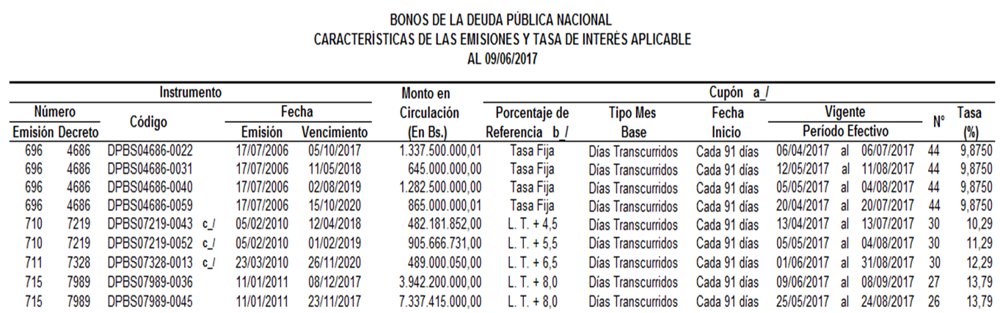
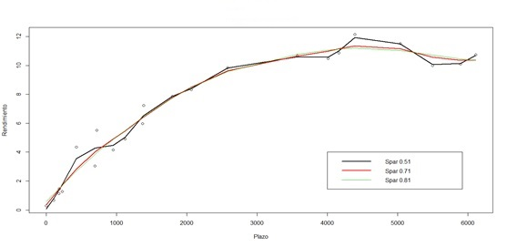

\mainmatter

#Manual de Usuario

##Curva de Rendimientos

En esta sección el usuario puede calcular los precios teóricos de los instrumentos de la Deuda Pública Nacional (TIF ó VEBONOS) para una fecha específica y para una metodología en específico. Las metodologías disponibles son Nelson y Siegel, Svensson, Diebold-Li y Splines cúbicos de suavizado.

###Metodología Nelson y Siegel

Para el cálculo de esta metodología es importante contar con los precios promedios de los instrumentos a considerar puesto que a partir de los mismos se realizará un proceso de optimización el cual busca encontrar los parámetros más adecuados de esta metodología de manera que los precios teóricos obtenidos se asemejen a los precios promedio.

Esta sección cuenta con una pestaña denominada Datos, mediante la cual se obtendrán de manera automática los archivos necesarios para el cálculo de los precios teóricos de los instrumentos a considerar. Los archivos necesarios son obtenidos de la página del Banco Central de Venezuela, ellos son,

+ Documento de operaciones del mercado secundario (resumersec)
+ Documento de las características de los instrumentos de la Deuda Pública Nacional 


###Elaboracion Base de datos Splines

La fuente principal de información para calcular la curva de rendimientos para los títulos de la deuda pública nacional es el Banco Central de Venezuela (BCV), el cual diariamente publica las operaciones realizadas con estos instrumentos y los publica en el documento "resumersec" (Ver Figura \@ref(fig:bcv). Es importante destacar, que en este documento se encuentran por día dos pestañas, la $``0-22"$ y la $``0-23"$, en la primera pestaña se encuentran las operaciones interbancarias, por su parte la segunda pestaña muestra información sobre las operaciones realizadas por entes privados, en este caso el precio pautado en la operación no está disponible, razón por la cual esta pestaña no se toma en consideración. La información disponible en la pestaña $``0-22"$ es la siguiente,

+ Código del instrumento: código único que se asocia a cada instrumento.
+ Fecha de vencimiento: fecha de maduración de cada instrumento.
+ Plazo: cantidad de días que faltan para que el instrumento venza.
+ Cantidad de Operaciones: número de operaciones realizadas con cada instrumento.
+ Monto en Bolívares: monto total involucrado en la operación.
+ Precio mínimo: precio más bajo pautado en la operación.
+ Precio máximo: precio más alto pautado en la operación.
+ Precio promedio: precio promedio pautado en la la operación. Cabe destacar que si existe una sóla operación, los precios mínimo, máximo y promedio serán iguales.
+ Cupón: tasa de interés pagadera por cada instrumento.

```{r , echo=FALSE, fig.align='center',fig.cap="Pestaña 0-22",label=bcv}
knitr::include_graphics("images/Imagen022.png")
```

Es importante recordar que dentro de los títulos de la Deuda Pública Nacional se encuentran los títulos de interés fijo (TIF) y los títulos de tasa variable (VEBONO), los primeros se caracterizan por poseer una tasa de cupón que no varia, por su parte los VEBONO poseen una tasa de interés variable.

Esta información también es suministrada por el BCV, en su documento de las "Características de la Deuda Pública Nacional" (Ver Figura \@ref(fig:carac) ), por lo cual el mismo se debe revisar con cierta frecuencia, con el fin de actualizar la tasa de cupón de los VEBONO. En este documento se muestra información que caracteriza a cada instrumento, el mismo posee varias pestañas, en este trabajo sólo se considerará la pestaña $``DPN"$ en donde se encuentra información sobre los instrumentos emitidos en moneda nacional. La información disponible en este documento se muestra a continuación,

+ Número-Emisión-Decreto: información sobre emisión de cada instrumento.
+ Código: código único que se asocia a cada instrumento.
+ Fecha de emisión: fecha cuando se emitió cada instrumento.
+ Fecha de vencimiento: fecha de maduración de cada instrumento.
+ Monto en Circulación: monto total de cada instrumento en circulación.
+ Porcentaje de referecia: indica si el instrumento es de tasa fija o tasa variable.
+ Fecha de inicio: indica cada cuanto tiempo el instrumento paga cupón.
+ Período vigente: indica el período (fecha inicio y fecha fin) cuando cada instrumento paga cupón.
+ Tasa: cupón asociado a cada instrumento.

```{r , echo=FALSE, fig.align='center',fig.cap="Características",label=carac}

```

A partir de la pestaña "0-22" y del documento de las características, se creó la base de datos con la cual se va a trabajar, la misma contiene no sólo la información suministrada por la pestaña "0-22", sino alguna información adicional tomada del documento de las características. En dicha base de datos se contará con la siguiente información,

+ Tipo Instrumento: Indica el tipo de instrumento.
+ Nombre: Proporciona el nombre corto del título, usualmente este nombre se conforma por el tipo de título más su mes y año de vencimiento, por ejemplo, el título TIF032028, representa al título TIF con vencimiento en marzo del 2028.
+ Fecha de operación: Indica la fecha en que se efectuó dicha operación.
+ Fuente: Indica la fuente de donde se tomó la información, esta se puede tomar de dos fuentes, la primera mediante la pestaña 0-22 (mercado secundario) y  la otra mediante el documento de las subastas (mercado primario, información suministrada por el BCV).
+ Sicet: Proporciona el código asociado a cada título.
+ Fecha de vencimiento: Indica la fecha de maduración (vencimiento) del instrumento.
+ Plazo: Indica la cantidad de días que falta para que el instrumento se venza.
+ Cantidad de operaciones: Proporciona la cantidad de operaciones efectuadas con un insrumento en específico.
+ Monto: Indica el monto en Bolívares, por el cual se efectuó la operación u operaciones.
+ Precio mínimo: Indica el precio mínimo, por el cual se transó la operación.
+ Precio máximo: Indica el precio máximo, por el cual se transó la operación.
+ Precio promedio: Indica el precio promedio, por el cual se transó la operación, cabe destacar que en dado caso de existir una sola operación el valor del precio mínimo, máximo y promedio van a coincidir.
+ Cupón: Proporciona la tasa de cupón asociado a cada instrumento.
+ Frecuencia: Indica con que frecuencia el instrumento paga cupón, para los TIF y VEBONO, esta es 4, pues los mismos pagan cu\'pon trimestralmente, así se obtiene este valor pues existen 4 trimestres en el año.

Una vez obtenida la base de datos esta según sea el caso puede ser depurada mediante ciertos criterios, el primero es que aquellas operaciones con un monto menor a los 10 milllones no se consideran. El segundo es considerar la operación mas reciente, es decir, si en la base de datos se tiene que para un mismo instrumento existen diferentes operaciones en diferentes días, sólo se considerará la operación más reciente.


Para efectuar la depuración, a la base de datos anterior se le añadirán dos columnas nuevas una que indica el rendimiento al vencimiento de cada instrumento y la otra que indica la decisión que se tomó en base a los criterios descritos anteriormente (Ver Figura \@ref(fig:base)). Esta última será una variable dicotómica, es decir solo con dos valores (0 ó 1), en donde "0" me indica que no selecciono el título y "1" me indica que si lo tomo en cuenta para el estudio a realizar.

```{r , echo=FALSE, fig.align='center',fig.cap="Base de datos",label=base}
knitr::include_graphics("images/Imagenbase.png")
```

Una vez calculados los precios estimados asociados a cada instrumento, se procederá a comparar los mismo con aquellos obtenidos por una metodología distinta. La metodología con la cual se va a comparar es la de Svensson, la cual es una metodología paramétrica.


Los instrumentos a considerar serán aquellos pertencientes al portafolio de inversiones de una institución financiera, de tal manera que para un día especifico sea posible conocer cuanta es la ganancia o pérdida que generan estos instrumentos. y por ende saber si es viable la venta o compra de determinado instrumento.

A partir de la data obtenida (Ver Figura \@ref(fig:base)), se procederá a añadir unas columnas nuevas con el fin de clasificar las observaciones para los distintos instrumentos en diferentes períodos de vencimiento. Los períodos de vencimiento son,


+ Corto plazo: se refiere al vencimiento más cercano, los instrumentos que se encuentran aquí son aquellos que poseen un vencimiento menor a un año.
+ Mediano plazo: en esta clasificación se encuentran los instrumentos cuyo vencimiento este entre uno y diez años.
+ Largo plazo: hace referencia a aquellos instrumentos que tengan un vencimiento mayor a diez años.


Luego de separar la data por tipo de instrumento, la nueva data con la que se trabajará es la siguiente,

```{r , echo=FALSE, fig.align='center',fig.cap="Base de datos TIF",label=baset}
knitr::include_graphics("images/data_nueva.png")
```

Con el fin de contar con la data más reciente a partir de la fecha de valoración, se creó la función "extrae" la cual selecciona de la data de la Figura (\@ref(fig:baset)) una determinada cantidad de observaciones, la cual es especificada por el usuario, esta función cuenta con los siguientes argumentos,

+ fv: indica la fecha de valoración para la cual se está realizando el estudio.
+ dias: indica la cantidad de días que el usuario desea, a partir de este valor se va a obtener la data con la que se va a trabajar.
+ data: hace referencia a la data completa para cada tipo de instrumento, a partir de la misma se procedera a extraer parte de ella a partir del número de dias seleccionado.


Luego de selecionar la data, la misma se procede a depurar, es decir, se van a eliminar las observaciones duplicadas considerando sólo aquellas que sean más recientes. 


Así a partir de esta data sólo se consideraran las columnas plazo y rendimiento con el fin de tener una nube de puntos a partir de la cual se haga el ajuste de la función spline, y así obtener la curva de rendimientos.


La data obtenida a partir de la depuración anterior es,

```{r , echo=FALSE, fig.align='center',fig.cap="Data depurada TIF",label=datadep}
knitr::include_graphics("images/cand.png")
```


Una vez obtenida la data para los Tif y Vebono se utilizó la función "smooth.spline" del programa estadístico R, para ajustar un spline cúbico a la data ingresada. Los argumentos requeridos por esta función son los siguientes,

+ X: representa el vector de la variable predictiva.
+ Y: representa el vector de la variable repuesta.
+ cv: (TRUE/FALSE) variable del tipo lógico que representa si se va a utilizar la validación cruzada generalizada al momento de calcular el parámetro de suavizamiento.
+ Spar: representa el parámetro de suavizamiento, típicamente (aunque no necesariamente) ubicado entre 0 y 1. Es el coeficiente lambda que acompaña a la integral del cuadrado de la segunda derivada de la función f.

De esta manera el siguiente comando ajusta un spline cubico a la data ingresada,


spline1=smooth.spline(X=datT1\$Plazo,Y=datT1\$Rendimiento,cv=TRUE, spar=1.35)

y lo guarda en la variable ``spline1".

Es importante señalar lo crucial de la escogencia del parámetro "spar", pues de él depende que tan suave sea la curva, la Figura (\@ref(fig:compspar) muestra como varía la curva cuando se cambia  el valor del ``spar", para esta comparación se usó tres valores, el primero fue 0.51 con el cual se obtiene una curva con ciertos picos la cual no es suave en lo absoluto. 

Usando el valor de 0.71 se obtiene la curva roja la cual presenta una mayor suavidad. Mientras que usando el valor de 0.81 se obtiene un mejor resultado aunque similar al anterior. De esta manera, se puede observar la importancia de la elección correcta de este parámetro, mientras este valor se aproxime a 1 se obtendrá una curva con mayor suvidad.

```{r , echo=FALSE, fig.align='center',fig.cap="Curva de rendimiento Vebono para diferentes valores de suavizado",label=compspar}

```

Cabe destacar que para cada versión el parámetro usado en la variable "spar" cambió. Esto debido a la diferente cantidad de puntos que tiene cada versión. Así el valor del parámetro "spar" para los TIF se ubicó en el siguiente intervalo [0.4,0.6], por su parte para los VEBONOS la elección de dicho parámetro esta en [0.3,0.5]. Los mismos se obtuvieron mediante ensayo y error. Para los valores ubicados dentro de los intervalos mencionados siempre se obtuvo una curva suave.

Una vez que se obtiene la curva estimada y es guardada en una variable (en este caso, la variable es spline1), se procede a aplicar el comando "predict", para estimar el rendimiento de algún plazo que se ingrese.

Así con el fin de calcular el precio estimado de cada título, se creó la función "precio" mediante R, para determinar de forma automática dichos valores. Los imputs de dicha función son los siguientes,


+ Tit: representa el nombre de cada título, al cual se le quiere estimar su precio, el mismo debe ser un carácter, ej: TIF102017 ó VEBONO112017.
+ Spline1: representa la variable donde se guardo la curva ajustada mediante el spline.
+ Fv: indica la fecha de valoración, para la cual se desea conocer el precio estimado.


Una vez ingresado los imputs, la función internamente busca el nombre del título en el documento de las características más reciente, y extrae del mismo la fecha de pago del próximo cupón y su fecha de vencimiento, con el fin de crear un vector de flujos.

Por ejemplo, si se quiere conocer el precio estimado del título "TIF032022"  al "01/03/2018", la función busca su fecha de vencimiento $(03/03/2022)$ y la fecha de pago del próximo cupón la cual es en este caso $08/03/2018$. Luego con dichos valores calcula la Tabla \ref{tabla1}, que representa los cupones que le quedan por pagar al título,

\renewcommand{\tablename}{Tabla}
\begin{table}[H]
\centering
%\begin{center}
{\begin{tabular}[t]{|l |c |c |c |c |c |r|}
\hline
Fecha & Plazo título & Plazo años & Rend estimado & Exp & Cupón & Producto \\
\hline
08/03/2018 & 7  & 0,0191780 & 0,45\% & 0,9999131 & 4& 3,999652\\
\hline
07/06/2018 & 98 & 0,2684931 & 1,05\% & 0,9971804 & 4& 3,988721\\
\hline
06/09/2018 & 189 & 0,5178082 & 1,64\% & 0,9915025 & 4& 3,966010\\
\hline
06/12/2018 & 280 & 0,7671232 & 2,23\% & 0,9829646 & 4& 3,931859\\
\hline
07/03/2019 & 317 & 1,0164383 & 2,82\% & 0,9717013 & 4& 3,886805\\
\hline
06/06/2019 & 462 & 1,2657534 & 3,39\% & 0,9578928 & 4& 3,831571\\
\hline
05/09/2019 & 553 & 1,5150684 & 3,96\% & 0,9417596 & 4& 3,767038\\
\hline
05/12/2019 & 644 & 1,7643835 & 4,50\% & 0,9235567 & 4& 3,694227\\
\hline
05/03/2020 & 735 & 2,0136986 & 5,03\% & 0,9035668 & 4& 3,614267\\
\hline
04/06/2020 & 826 & 2,2630137 & 5,54\% & 0,8820934 & 4& 3,528373\\
\hline
03/09/2020 & 917 & 2,5123287 & 6,02\% & 0,8594532 & 4& 3,437813\\
\hline
03/12/2020 & 1008 & 2,7616438 & 6,48\% & 0,8359698 & 4& 3,343879\\
\hline
04/03/2021 & 1099 & 3,0109589 & 6,91\% & 0,8119665 & 4& 3,247866\\
\hline
03/06/2021 & 1190 & 3,2602739 & 7,31\% & 0,7877226 & 4& 3,150890\\
\hline
02/09/2021 & 1281 & 3,5095890 & 7,69\% & 0,7634473 & 4& 3,053789\\
\hline
02/12/2021 & 1372 & 3,7589041 & 8,03\% & 0,7393192 & 4& 2,957277\\
\hline
03/03/2022 & 1463 & 4,0082191 & 8,35\% & 0,7154912 & 104 & 74,411084\\
\hline
% Precio &  &  &  & & & 112,688809\\
\multicolumn{6}{|c|}{Precio} & 131,8111 \\
\hline
\end{tabular}
}
%\caption{Tabla}
%\end{center}
\caption{Cálculos función precio.}
\label{tabla1}
\end{table}

Así la primera columna (Fecha) se obtiene de sumarle a la fecha de pago del próximo cupón ($08/03/2018$) 91 días, que representa el tiempo cada cuando el título paga cupón, esto se realiza  hasta llegar a la fecha de vencimiento.

Luego la columna "Plazo título", se obtiene realizando la diferencia entre la columna 1 y la fecha de valoración (01/03/2018). Luego la columna 3 se obtiene dividiendo el valor de la columna 2 entre 365, para pasar dicho valor a años. Después evalúo los valores de la columna 2 en el spline obtenido, para así obtener los rendimientos estimados (columna 4). Posteriormente en la columna 5 (EXP) calculo la exponencial del producto de menos uno con el plazo en años (columna 3) y con el rendimiento estimado (columna 4).


La columna 6 (Cupón) la calculo dividiendo el valor del cupón del título entre 4, ya que cada cupón se paga cada tres meses, a diferencia del último al cual se le debe sumar el valor de 100. Finalmente en la última columna (Producto) calculo el producto del valor de la columna EXP con la columna Cupón, para luego realizar la sumatoria de todas sus filas y así obtener el precio estimado (131,8111 en este caso).


El mismo procedimiento se repite para cada título ya sea Tif o Vebono. Es importante señalar que los títulos considerados fueron aquellos que pertenecían al portafolio de inversiones del banco en un tiempo determinado.

###Estimación de parámetros y curva de rendimiento

Una vez construida la base de datos, se procederá a utilizar los splines de suavizado para obtener los parámetros necesarios para la curva de rendimientos. Recordemos que esta curva relaciona el plazo del instrumento con su rendimiento.


Es importante señalar que se estimará una curva por cada tipo de instrumento, así se obtendrá un curva para los TIF y una curva para los VEBONO. Por tal razón a partir de la base de datos, se separará los TIF de los VEBONOS, y se considerarán sólo las columnas Plazo y Rendimiento para estimar dicha curva. Según sea el caso, sólo considerarán aquellas observaciones que tengan decisión 1.


Aunado a cada tipo de instrumento (TIF ó VEBONO), se considerará un instrumento de otro tipo este es la letra del tesoro, este tipo de instrumento representará el punto inicial la curva, cabe destacar que la letra a considerar debe ser aquella cuya fecha de operación sea la más reciente con respecto a la fecha de valoración (día en que se quiere conocer los rendimientos estimados).

A partir de la curva de rendimientos obtenida (Ver Figura (\@ref(fig:crend)) es posible calcular un rendimiento estimado para algún tipo de instrumento a partir de su plazo, que no es más que la cantidad de días que faltan por transcurrir hasta su vencimiento. Este valor es de suma importancia ya que a partir del mismo es posible calcular el precio estimado asociado a cada instrumento en un día específico. Con lo cual es posible saber a partir de la historia (base de datos), el precio estimado de algún instrumento que le interese a cierta institución y por ende saber si ese título es rentable o no, es decir, si vale la pena invertir en el mismo o no.


```{r , echo=FALSE, fig.align='center',fig.cap="Curva de Rendimiento",label=crend}
knitr::include_graphics("images/curvarend.jpeg")
```


Como se dijo anteriormente, los resultados de los precios obtenidos mediante el uso de la metodología de splines de suavizado serán comparados con los precios obtenidos a través de la metodología de Svensson. En dicha metodología existe un proceso de optimización el cual permite encontrar los parámetros idóneos, de tal manera que la diferencia entre los precios promedio de cada instrumento y su precio teórico sea lo más pequeña posible. El proceso de esta optimización se muestra a continuación.


###Proceso de Optimización de Svensson


Para aplicar este proceso es necesario tener una función objetivo, sobre la cual se realizará el proceso de optimización, ya sea para maximizar ó minimizar dicha función. Dependiendo de la forma de dicha función el proceso de optimización será lineal o no lineal. En nuestro caso particular se llevará a cabo un proceso de optimización no lineal donde se buscará minimizar la función objetivo.


En el cálculo de nuestra función objetivo inteviene el concepto de la duración de un bono ó título, la cuál es una medida del vencimiento medio ponderado de todos los flujos que paga un bono. La misma viene dada mediante la siguiente expresión, 


$$\displaystyle{Duracion = \frac{1+r}{r} - \frac{n(c-r)+(1+r)}{c(1+r)^{n}-(c-r)}}$$

donde

+ r es el rendimiento al vencimiento del bono durante el período considerado.
+ n es el número de períodos que restan hasta la fecha de vencimiento del bono.
+ c es el cupón del bono.

Así nuestra función objetivo viene dada mediante la siguiente expresión,


$$
  f(x) = \sum_{i=1}^{n} (w_{i}\epsilon(x)_{i} )^2
$$


donde $w_{i}$ representan las ponderaciones, y se calculan mediante la siguiente expresión,


$$\displaystyle{w_{i} = \frac{\frac{1}{D_{i}}}{\sum_{j=1}^{N}\frac{1}{D_{j}}}}$$

 por su parte, $\epsilon_{i}(x)= \hat{Pr}_{i}(x)-Pr_{i}$, donde $Pr_{i}$ representan los precios promedios de los títulos a considerar, de entrada este es un parámetro ó valor con el que se cuenta. Por otra parte $\hat{Pr}_{i}(x)$ representa los precios estimados donde $x$ es el parámetro que va a variar y es el valor que se quiere optimizar.


Mediante la función objetivo descrita anteriormente se busca minimizar la diferencia que existe entre los precios promedios y los precios estimados, calculando un valor óptimo del parámetro $x$ mediante el proceso de optimización no lineal.


El proceso de optimización se realizó mediante el software estadístico R, mediante el paquete "nloptr". En este paquete, se encuentra el comando "aulag" el cual minimiza un función objetivo y devuelve entre otros valores el parámetro más óptimo, que hace que la función sea mínima. Un ejemplo del uso de este comando se presenta acontinuación,


$$ala2=auglag(1.22, fn=mifuncion, hin=res)$$
donde el primer argumento debe ser el valor inicial del parámetro a optimizar, el segundo argumento "fn" se refiere a la función que se desea optimizar, finalmente en el tercer parámetro "hin" se indican las restricciones sobre el parámetro a optimizar, en este caso la restricción establecida es que el parámetro sea mayor a cero.


Recordemos que la tasa cero cupón que se obtiene mediante la metodología de Svensson está dada por la siguiente expresión,


$$\displaystyle{s(m) = \beta_{0}+ \beta_{1}\frac{\left(1-e^\frac{-m}{\tau_{1}}\right)}{m/\tau_{1}} + \beta_{2} \left(\frac{\left(1-e^\frac{-m}{\tau_{1}}\right)}{m/\tau_{1}} -  e^\frac{-m}{\tau_{1}}\right) + \beta_{3} \left(\frac{\left(1-e^\frac{-m}{\tau_{2}}\right)}{m/\tau_{2}} -  e^\frac{-m}{\tau_{2}}\right)}$$

esta expresión está sujeta a las siguientes restricciones,

+ $\beta_{0} > 0$
+ $\beta_{0}+\beta_{1} > 0$
+ $\tau_{1} > 0$
+ $\tau_{2} > 0$

cada parámetro controla una sección de la curva. La fórmula anterior es de suma importancia ya que ella interviene en el cálculo del precio teórico de cada instrumento. El proceso de optimización actúa directamente sobre esta fórmula, ya que el mismo se centra en variar los parámetros de tal manera que la función objetivo sea minimizada.

Como se observó en las secciones anteriores el parámetro de suavizamiento fué elegido mediante el método de ensayo y error el cual no es para nada óptimo pues a priori este método no nos garantiza que el valor seleccionado sea el mejor, ya que se contarían con una gran cantidad de posibles valores a seleccionar, con el fin  de encontrar dicho parámetro el procedimiento anteriormente explicado puede ser implementado. 

Sin embargo, al realizar este proceso, se obtienen curvas que no son para nada suaves y en ocasiones no poseen ningunas de las formas usuales de la curva de rendimientos. Esto es debido a que en este caso este proceso, varía el parámetro de suavizamiento de tal manera que la diferencia entre el precio promedio y el precio teórico sea lo mas pequeña posible y en este proceso no existe un parámetro que controle la forma de la curva obtenida. Por lo tanto, su aplicación presenta algunos inconvenientes.  


###Curva de rendimientos individual

###Curva de rendimientos comparativo

###Datos

###Metodologías

###Precios Estimados

###Curvas

##Valor en Riesgo

###Datos

###Distribución

###VaR

###Gráficos

###Históricos

##Backtesting

###Datos

###Resultados

##Pruebas de Estrés