<script src="https://cdn.datacamp.com/datacamp-light-latest.min.js"></script>

--- 
title: "Riesgo de Mercado"
subtitle: "Ciencia de los Datos Financieros"
author: "Synergy Vision"
date: "2019-09-26"
knit: "bookdown::render_book"
documentclass: krantz
biblio-style: apalike
link-citations: yes
colorlinks: yes
lot: yes
lof: yes
fontsize: 12pt
monofontoptions: "Scale=0.8"
keep_md: yes
site: bookdown::bookdown_site
description: ""
url: 'http\://synergy.vision/Riesgo-de-Mercado/'
github-repo: synergyvision/Riesgo-de-Mercado/
cover-image: images/cover.png
---


# Prefacio {-}

<a href="https://synergy.vision/LibrosInteractivos/" target="_blank"></a>


  
La versión en línea de este libro se comparte bajo la licencia [Creative Commons Attribution-NonCommercial-ShareAlike 4.0 International License](http://creativecommons.org/licenses/by-nc-sa/4.0/).

## ¿Por qué  leer este libro? {-}

Este libro es el resultado de enfocarnos en proveer la mayor cantidad de material sobre Probabilidad y Estadística Matemática con un desarrollo teórico lo más explícito posible, con el valor agregado de incorporar ejemplos de las finanzas y la programación en `R`. Finalmente tenemos un libro interactivo que ofrece una experiencia de aprendizaje distinta e innovadora.

El un mundo abierto, ya no es tanto el acceso a la información, sino el acceso al conocimiento. Este libro es la base teórica para nuestro Diplomado en Probabilidades y Estadística Matemática aplicado a las Finanzas. Aunque es un material de corte general, hay ejemplos específicos traido de las finanzas. En el Diplomado nos enfocamos en el participante, el propósito es que el instructor ocupa a lo sumo el 20% del tiempo y el resto del tiempo los participantes se dedican a practicar y resolver ejercicios, tanto teóricos como de programación y modelaje en `R` al nivel de un curso de Postgrado. Ésta es la base de un programa en Ciencia de los Datos Financieros.

Es mucha la literatura, pero son pocas las opciones donde se pueda navegar el libro de forma amigable y además contar con ejemplos en `R` y ejercicios interactivos, además del contenido multimedia. Esperamos que ésta sea un contribución sobre nuevas prácticas para publicar el contenido y darle vida, crear una experiencia distinta, una experiencia interactiva y visual. El reto es darle vida al contenido asistidos con las herramientas de Internet.

Finalmente este es un intento de ofrecer otra visión sobre la enseñanza y la generación de material más accesible. Estamos en un mundo multidisciplinado, es por ello que ahora hay que generar contenido que conjugue en un mismo lugar las matemáticas, estadística, finanzas y la computación.

Lo dejamos público ya que las herramientas que usamos para ensamblarlo son abiertas y públicas.

## Estructura del libro {-}

TODO: Describir la estructura

## Información sobre los programas y convenciones {-}

Este libro es posible gracias a una gran cantidad de desarrolladores que contribuyen en la construcción de herramientas para generar documentos enriquecidos e interactivos. En particular al autor de los paquetes Yihui Xie xie2015.

## Prácticas interactivas con R {-}

Vamos a utilizar el paquete [Datacamp Tutorial](https://github.com/datacamp/tutorial) que utiliza la librería en JavaScript [Datacamp Light](https://github.com/datacamp/datacamp-light) para crear ejercicios y prácticas con `R`. De esta forma el libro es completamente interactivo y con prácticas incluidas. De esta forma estamos creando una experiencia única de aprendizaje en línea.

<div data-datacamp-exercise data-height="300" data-encoded="true">eyJsYW5ndWFnZSI6InIiLCJwcmVfZXhlcmNpc2VfY29kZSI6ImIgPC0gNSIsInNhbXBsZSI6IiMgQ3JlYSB1bmEgdmFyaWFibGUgYSwgaWd1YWwgYSA1XG5cblxuIyBNdWVzdHJhIGVsIHZhbG9yIGRlIGEiLCJzb2x1dGlvbiI6IiMgQ3JlYSB1bmEgdmFyaWFibGUgYSwgaWd1YWwgYSA1XG5hIDwtIDVcblxuIyBNdWVzdHJhIGVsIHZhbG9yIGRlIGFcbmEiLCJzY3QiOiJ0ZXN0X29iamVjdChcImFcIilcbnRlc3Rfb3V0cHV0X2NvbnRhaW5zKFwiYVwiLCBpbmNvcnJlY3RfbXNnID0gXCJBc2VnJnVhY3V0ZTtyYXRlIGRlIG1vc3RyYXIgZWwgdmFsb3IgZGUgYGFgLlwiKVxuc3VjY2Vzc19tc2coXCJFeGNlbGVudGUhXCIpIn0=</div>


## Agradecimientos {-}

A todo el equipo de Synergy Vision que no deja de soñar. Hay que hacer lo que pocos hacen, insistir, insistir hasta alcanzar. Lo más importante es concretar las ideas. La idea es sólo el inicio y solo vale cuando se concreta.


\BeginKnitrBlock{flushright}<p class="flushright">Synergy Vision, Caracas, Venezuela</p>\EndKnitrBlock{flushright}


<!--chapter:end:index.Rmd-->


# Acerca del Autor {-}

Este material es un esfuerzo de equipo en Synergy Vision, (<http://synergy.vision/nosotros/>).		 

El propósito de este material es ofrecer una experiencia de aprendizaje distinta y enfocada en el estudiante. El propósito es que realmente aprenda y practique con mucha intensidad. La idea es cambiar el modelo de clases magistrales y ofrecer una experiencia más centrada en el estudiante y menos centrado en el profesor. Para los temas más técnicos y avanzados es necesario trabajar de la mano con el estudiante y asistirlo en el proceso de aprendizaje con prácticas guiadas, material en línea e interactivo, videos, evaluación contínua de brechas y entendimiento, entre otros, para procurar el dominio de la materia.
  		  
Nuestro foco es la Ciencia de los Datos Financieros y para ello se desarrollará material sobre: **Probabilidad y Estadística Matemática en R**, **Programación Científica en R**, **Mercados**, **Inversiones y Trading**, **Datos y Modelos Financieros en R**, **Renta Fija**, **Inmunización de Carteras de Renta Fija**, **Teoría de Riesgo en R**, **Finanzas Cuantitativas**, **Ingeniería Financiera**, **Procesos Estocásticos en R**, **Series de Tiempo en R**, **Ciencia de los Datos**, **Ciencia de los Datos Financieros**, **Simulación en R**, **Desarrollo de Aplicaciones Interactivas en R**, **Minería de Datos**, **Aprendizaje Estadístico**, **Estadística Multivariante**, **Riesgo de Crédito**, **Riesgo de Liquidez**, **Riesgo de Mercado**, **Riesgo Operacional**, **Riesgo de Cambio**, **Análisis Técnico**, **Inversión Visual**, **Finanzas**, **Finanzas Corporativas**, **Valoración**, **Teoría de Portafolio**, entre otros.

Nuestra cuenta de Twitter es (https://twitter.com/bysynergyvision) y nuestros repositorios están en GitHub (https://github.com/synergyvision).
  		  
 **Somos Científicos de Datos Financieros**

<!--chapter:end:000-author.Rmd-->

\mainmatter

# Introducción 

Conocer en qué se invierte es un problema fundamental en la gestión del capital propio o de terceros, es el problema primario en la gestión de inversiones. La gestión de inversiones es un campo con muchos avances que, hoy en día, demanda métodos basados en las ciencias. En particular las matemáticas, probabilidades y la computación.

Un primer avance en la solución de este problema es ofrecido por Harry Markowitz en 1952 e inaugura una nueva era en la aplicación de los métodos matemáticos para obtener carteras de inversión con características especiales, para conocer la relación entre el riesgo y el rendimiento. Este avance es reconocido con el precio Nobel en Economía en 1990 e inaugura la era de las Finanzas Cuantitativas, las Finanzas Computaciones, las Matemáticas Financieras, la Ingenería Financiera, entre otras prácticas.

Markowitz desarrolla  un modelo que considera los retornos de cada instrumento como una variable aleatoria y combina estas variables aleatorias para obtener el riesgo y el rendimiento de dicha combinación. Esta combinación de intrumentos es lo que denominamos portafolios y el objeto de Markowitz es encontrar los portafolios óptimos. Los portafolios óptimos son combinaciones de activos financieros que generan el mayor rendimiento posible con el menor riesgo. La combinación de activos nos lleva a la idea de la diversificación y su efecto en la gestión del riesgo, ya que ahora también es importante la relación que existe entre los instrumentos como un factor determinante del riesgo de la cartera.

Si los instrumentos tienen una correlación positiva, el riesgo no disminuye, sin embargo si la correlación es negativa es posible, mediante la diversificación, disminuir el riesgo de la cartera.

En la práctica es muy complejo obtener instrumentos no correlacionados, ya que los mercados tienen a seguir ciclos alcistas o bajistas y los instrumentos tienen a moverse de forma acompasada. Es decir, que la diversificación no necesariamente logra el objetivo de disminuir el riesgo de la cartera.

Con estos avances ahora el rendimiento no se discute de forma aislada, el rendimiento siempre viene acompañado del riesgo y ahora la selección del inversionista debe considerar ambas variables para tomar su decisión. Este terreno es un campo con muchos avances ya que se aplican diversos métodos de optimización, de simulación o de medición del riesgo para conseguir las carteras que cumplen con la mejor relación para el inversionista.

Este trabajo pretende abordar el campo de la distribución del capital en activos financieros que cumplen con ciertas condiciones partiendo de los datos disponibles. En este trabajo partiremos de la historia de los instrumentos para obtener sus características y conformar portafolios óptimos de acuerdo a la metodología de Markowitz. Adicionalmente se desarrollarán herramientas para facilitar el procesamiento de los datos y obtener dichos portafolios.

## Motivation

La historia reciente de los mercados, se caracteriza por la presencia de varias burbujas o grandes choques en los mercados. En el mercado americano, iniciemos desde 1999-2000 con la burbuja de las empresas tecnológicas que surgen con el auge de Internet y tienen como objetivo el desarrollo de la nueva economía virtual, hoy día es evidente que Amazon y Google son las grandes empresas que capitalizaron gran parte del potencial, el gran impacto generado por la caida de las Torres Gemelas en Septiembre del 2001 y luego la gran crisis inmobiliaria durante el 2007-2008 de la cual se ha recuperado apenas en 2015-2016. Hoy de nuevo, en el año 2017, estamos en presencia de un mercado alcista que alcanza nuevo territorio, ha alcanzado nuevos altos históricos y es inevitable la pregunta: ¿Estamos en presencia de una nueva burbuja?. Esta pregunta no tiene el objetivo de predecir que el mercado va a caer en algún momento, de hecho lo normal es que lo haga, el mercado cumple ciclos contínuamente y no tiene nada de innovador señalar que va a caer cuando hace altos históricos. El mercado se mueve en ondas. Lo que nos interesa de esta dinámica es cómo construir carteras de inversión que puedan sobrevivir estos choques, estos mercados bajistas y al mismo tiempo aprovechar al máximo los mercados alcistas.

Desde 1952 y más notablemente desde 1990 que recibe el premio Nobel de Economía, Harry Markowitz es señalado como el padre de la Teoría Moderna de Portafolio. Su objetivo es definir una metodología que partiendo de un grupo de activos, se generan las carteras eficientes. Mucho ha ocurrido desde que la Economía reconoce como un área de desarrollo la aplicación de los modelos Matemáticos para ofrecer luz sobre la dedicación óptima del capital.

Este reconocimiento al aporte de la ciencia en la Economía genera dos grandes líneas de trabajo que intenta responder dos preguntas fundamentales: ¿Dónde coloco el capital y en qué cantidad? y ¿Cuál es el precio de un activo financiero?. Este trabajo elabora sobre la primera pregunta. La segunda pregunta tiene que ver con el trabajo de Black, Scholes y Merton sobre la Valoración de opciones y derivados financieros, que también reciben el premio Nobel de Economía en 1997, apenas hace 20 años. Esta línea de trabajo donde se conjugan varias disciplinas como las Finanzas, Matemáticas, Estadística y más recientemente la Computación, genera un nuevo sector de Analistas Financieros Multidisciplinados que denominaremos Científicos de Datos Financieros.

La demanda principal a estos analistas consiste en partir de los datos y generar inferencias sobre los mismos aplicando la ciencia y la tecnología. Gran parte del trabajo de Markowitz ha sido la aplicación de métodos de optimización de portafolios con el uso de las computadoras y asistido por sistemas.

Las grandes burbujas y choques al mercado generan una gran preocupación sobre la gestión apropiada del riesgo y al mismo tiempo un entendimiento de la relación entre el riesgo que se asume y los beneficios posibles. El rendimiento es el resultado de una inversión después de un período de tiempo específico, podemos ganar o perder cuando realizamos una inversión, entonces el rendimiento es la variación (porcentual) del valor de un activo financiero en un período de tiempo. La variación del valor en términos absolutos es la ganancia o pérdida en valor monetario. Por otra parte el riesgo, en este caso, se puede definir como el grado de variabilidad de dicho rendimiento, esta es la medida propuesta por Markowitz y más recientemente han surgido nuevas medidas como el Valor en Riesgo (VaR) o el VaR Condicional (CVaR).

Usualmente para rendimientos iguales, en teoría, y de acuerdo a la teoría de decisiones racionales bajo incertidumbre, un inversionista debería preferir la inversión con menor riesgo y por otra parte para riesgos iguales, en general, deberíamos preferir la inversión de mayor rendimiento.

En este trabajo vamos a concentrarnos en la primera pregunta y nos basaremos en las aspiraciones del inversionista para conocer cuales instrumentos pueden formar parte de la cartera y en qué cantidad son requeridos para alcanzar un objetivo de inversión que combina la medida de rentabilidad y la medida de riesgo.

Los gerentes e inversionistas se enfrentan a situaciones donde deben escoger entre distintas alternativas de inversión basándose en estas dos variables principales, a saber, el rendimiento y el riesgo. Las preguntas son diversas y típicas como por ejemplo:

\begin{itemize}
\item ¿Cuál inversión es preferible? ¿Una con rendimiento promedio $8\%$ y riesgo (desviación estándar) de $4\%$ o una con $8\%$ y $3\%$ respectivamente?
\item ¿Cuál inversión es preferible? ¿Una con rendimiento promedio $8\%$ y riesgo (desviación estándar) de $4\%$ o una con $10\%$ y $4\%$ respectivamente?
\item ¿Cuál inversión es preferible? ¿Una con rendimiento promedio $8\%$ y riesgo (desviación estándar) de $4\%$ o una con $10\%$ y $5\%$ respectivamente?
\item ¿Cómo disminuyo el riesgo de una cartera de inversión, si deseo mantener el rendimiento?
\item ¿Cómo aumento la rentabilidad de una cartera de inversión, sin aumentar el riesgo?
\item ¿Cuál es al balance óptimo entre activos de inversión para lograr un máximo rendimiento al menor riesgo posible?
\end{itemize}

El problema fundamental es encontrar el balance adecuado entre un grupo de activos para alcanzar el máximo rendimiento con el mínimo riesgo.

Debido a los ciclos y choques que reciben los mercados, el mundo de hoy está retado a trabajar en un ambiente donde la incertidumbre sobre el desempeño de las inversiones es un hecho palpable y sin embargo desde el punto de vista de los inversionistas o accionistas es necesario ofrecer proyecciones de desempeño que si no se cumplen generan un cuestionamiento sobre el profesionalismo de los gerentes del portafolio o de productos.

Esto nos lleva a la valoración del riesgo debido a la incertidumbre inherente a los instrumentos de inversión, inclusive a nivel regulatorio la evaluación del riesgo con métodos más rigurosos ya empieza a ser necesario.

El trabajo de tesis consiste en la investigación documental del estado del arte en la conformación de portafolios de inversión y la aplicación de sus métodos, partiendo del trabajo de Harry Markowitz como base, con el objetivo de entender el desempeño de estas carteras en cada burbuja o choque que han recibido los mercado y además comparar algunas combinaciones de medidas de riesgo y rendimiento. Adicionalmente vamos a continuar la construcción de una aplicación Web interactiva para aplicar los métodos y valernos lo más posible de las diversas librerías construidas en R para este fin.


<!--chapter:end:010-introduction.Rmd-->

---
output:
  html_document: default
  pdf_document: default
---
\mainmatter

# Curva de Rendimientos

<!-- La curva de rendimientos es una herramienta utilizada ampliamente, por quienes toman las decisiones de política monetaria o planifican sus inversiones, de acuerdo con la valoración, negociación o cobertura sobre instrumentos financieros. Se ha comprobado que la geometría de la curva de rendimientos en los mercados desarrollados incorpora información relevante para la predicción de las recesiones económicas. De igual manera, en finanzas la curva de rendimientos se convierte en un vector de precios de referencia importante para la fijación de las tasas de interés a diferentes plazos y por riesgo de crédito para bancos, prestamistas, colocadores de bonos y, en general, para todos los participantes del mercado de dinero. -->

<!-- Los resultados revelan las bondades en el ajuste de las redes neuronales artificiales (RNA), la curva de Svensson, la curva de Nelson-Siegel y los polinomios locales. No obstante, se recomienda utilizar la curva de Svensson en la estimación de las tasas de interés, debido a la interpretabilidad de sus parámetros y a su superioridad sobre la -->
<!-- Curva de Nelson-Siegel. -->

La curva de rendimientos es una representación grafica que muestra la relación que existe entre los rendimientos de una clase particular de títulos valores y el tiempo que falta para su vencimiento, lo cual es conocido como la estructura temporal de la tasa de interés (ETTI) para instrumentos con riesgo similar pero con diferentes plazos de maduración. La ETTI es un indicador de la evolución futura de los tipos de interés y de inflación, además, la mayoría de los activos financieros se valoran mediante este indicador, por lo cual también se considera básico en el diseño de estrategias de gestión de riesgos y en la toma de decisiones de inversión y financiación. Existen cuatro formas que puede adoptar una curva de rendimientos:


+ **Curva ascendente**: generalmente, la curva de rendimientos tiene esta      forma, lo que indica que los inversionistas requieren mayores rendimientos     para vencimientos de más largo plazo, es decir, que los rendimientos         varían directamente con los plazos. 
+ **Curva descendente**: indica que los rendimientos disminuyen a medida que   aumentan los plazos.
+ **Curva horizontal**: indica que independientemente del plazo de vencimient   o, los rendimientos son los mismos; para períodos muy largos, todas las      curvas de rendimientos tienden a aplanarse.

+ **Curva horizontal**: indica que independientemente del plazo de vencimiento, los rendimientos son los mismos; para períodos muy largos, todas las      curvas de rendimientos tienden a aplanarse.

+ **Curva creciente y decreciente**: es el reflejo de una situación en la    que los rendimientos de corto y largo plazo son los mismos y los rendimientos  de mediano plazo son los que varían.

<!-- \begin{figure}[h] -->
<!--   \scalebox{0.80}{\includegraphics{images/tipo_curvas.jpg}} -->
<!-- \caption{Tipos de curva de rendimiento.} -->
<!-- \label{tipos_c} -->
<!-- \end{figure} -->


<!--  -->


<div class="figure" style="text-align: center">

<p class="caption">(\#fig:tipos)Tipos de Curvas</p>
</div>

Es de esperar que una pendiente negativa de la curva de rendimientos (Ver Figura \@ref(fig:tipos) ) o curva invertida (tasas de largo plazo menores a las de corto plazo) indique expectativas de una recesión futura y, por lo tanto, menores tasas de interés futuras; esto se puede explicar ya que los rendimientos esperados contienen información sobre los planes de consumo de los agentes. 

Entre las teorías que explican la pendiente de la curva de rendimientos, se encuentran:


+ **La teoría de la preferencia por la liquidez**: consiste en que los inversionistas prefieren manejar títulos a corto plazo, pues éstos tienen una sensibilidad menor a los cambios en las tasas de interés y ofrecen una mayor flexibilidad en las inversiones si se compara con los títulos de largo plazo. Además, los prestatarios prefieren deuda a largo plazo, pues la de corto plazo los expone al riesgo de hacer una refinanciación de la deuda en condiciones adversas. Ambas situaciones, generan entonces, tasas de corto plazo relativamente bajas. En su conjunto, estos dos grupos de preferencias implican que en condiciones normales existe una Prima de Riesgo por Vencimiento (PRV) que aumenta en función de los años de vencimiento, haciendo que la curva de rendimientos posea una pendiente ascendente \cite{DO}.

+ **La teoría de la segmentación del mercado**: considera el mercado de renta fija como una serie de distintos mercados, los inversionistas y los emisores están restringidos por el sector específico de maduración. De acuerdo con esta teoría, la curva de rendimientos refleja una serie de condiciones de oferta y demanda que crean una secuencia de precios de equilibrio de mercado (tasas de interés) de los fondos \cite{DO}.

+ **La teoría del Hábitat Preferido**: plantea que los inversionistas intentarán liquidar sus inversiones en el menor plazo posible mientras que los prestamistas querrán tomar un plazo más largo; por lo tanto, dado que no se encuentran oferta y demanda de fondos para un mismo plazo, algunos inversionistas o prestatarios se verán motivados a cambiar el plazo de la inversión o el financiamiento pero, para lograrlo, deben ser compensados con un premio por el riesgo cuyo tamano reflejará la extesión de la aversión al riesgo.

+ **La Hipótesis de las Expectativas (HE)**: plantea que las tasas de interés de largo plazo deben reflejar por completo la información revelada por las futuras tasas de interés de corto plazo esperadas \cite{YS}, o sea que los tipos de largo plazo no son más que una suma ponderada de los tipos de corto plazo esperados \cite{FR}. Así, se puede afirmar entonces que la HE es una teoría que plantea que las tasas de interés exclusivamente representan las tasas previstas en el futuro.

##Metodologías de estimación de la Curva de Rendimientos.

La curva de rendimientos presenta empíricamente una serie de dificultades, debido a que se construye a través de una serie de precios (tasas) de instrumentos financieros discontinuos en el tiempo que, por lo general, están lejos de ser una curva suave. Para su estimación existen diversas metodologías, las paramétricas y las no paramétricas. Las metodologías paramétricas se basan en modelos asociados a una familia funcional que obedece al comportamiento de alguna distribución de probabilidad, sobre la cual suponemos que las características de la población de interés pueden ser descritas. Es así como, los modelos diseñados en este contexto, basados en regresión, buscan describir el comportamiento de una variable de interés con otras llamadas exógenas, a través de funciones de vínculo lineales o no lineales.


## Metodologías Paramétricas.

Estadísticamente, un modelo paramétrico es una familia funcional que
obedece al comportamiento de alguna distribución de probabilidad, sobre la cual suponemos que las características de la población de interés
pueden ser descritas. Es así como, los modelos diseñados en este contexto,
basados en regresión, buscan describir el comportamiento de una
variable de interés con otras llamadas exógenas, a través de funciones de
vínculo lineales o no lineales.


### Metodología Nelson y Siegel

Nelson y Siegel introducen un modelo paramétrico para el ajuste
de los rendimientos hasta la madurez de los bonos del tesoro de Estados
Unidos que se caracteriza por ser parsimonioso y flexible en modelar
cualquier forma típica asociada con las curvas de rendimientos. La estructura
paramétrica asociada a este modelo permite analizar el comportamiento
a corto y a largo plazo de los rendimientos y ajustar -sin
esfuerzos adicionales-, curvas monótonas, unimodales o del tipo S.


Una clase de funciones que genera fácilmente las formas usuales de las
curvas de rendimientos es la asociada con la solución de ecuaciones en
diferencia. La teoría de expectativas sobre la estructura de las tasas de
interés promueve la investigación en este sentido, dado que si las tasas
spot son producidas por medio de una ecuación diferencial, entonces las
tasas forward -siendo pronósticos-, serán la solución de las ecuaciones
diferenciales. La expresión paramétrica propuesta por Nelson y Siegel
 que describe las tasas forward es exhibida a continuación:


$$\displaystyle{f(m) = \beta_{0} + \beta_{1} e^{\frac{-m}{\tau}} +\beta_{2} \left(\frac{-m}{\tau}\right)e^{\frac{-m}{\tau}}}$$

donde $m$ denota la madurez del activo y $\beta_{0}$, $\beta_{1}$, $\beta_{2}$ y $\tau$ los parámetros a ser
estimados. Puesto que las tasas spot pueden ser obtenidas a través de tasas
forward por medio de la expresión:

$$\displaystyle{s(m) = \int_{0}^{m}f(x)dx}$$

la ecuación que determina las tasas spot $s(m)$ de activos con madurez m es dada por:

$$\displaystyle{s(m) = \beta_{0}+ \beta_{1}\frac{\left(1-e^\frac{-m}{\tau}\right)}{m/\tau} + \beta_{2} \left(\frac{\left(1-e^\frac{-m}{\tau}\right)}{m/\tau} -  e^\frac{-m}{\tau}\right)}$$

cuya ecuación es lineal si conocemos $\tau$ .

El valor límite del rendimiento es $\beta_{0}$ cuando el plazo al vencimiento $m$ es grande, mientras que, cuando el plazo al vencimiento $m$ es pequeño el
rendimiento en el límite es $\beta_{0}+\beta_{1}$. Igualmente, los coeficientes del
modelo de tasas forward pueden ser interpretados como medidas de
fortaleza al corto, mediano y largo plazo. La contribución al largo plazo
es determinada por $\beta_{0}$, $\beta_{1}$ lo hace al corto plazo ponderado por la
función monótona creciente (decreciente) $e^{\frac{-m}{\tau}}$ cuando $\beta_{1}$ es negativo
(positivo) y $\beta_{2}$ lo hace al mediano plazo ponderado por la función
monótona creciente (decreciente) $(\frac{-m}{\tau}) e^{\frac{-m}{\tau}}$ cuando $\beta_{2}$ es negativo
(positivo). Una de las principales utilidades de la curva ha sido para
propósitos de control de la política monetaria.

Consecuentemente, $s(m)$ será la ecuación utilizada para captar la relación
subyacente entre los rendimientos y los plazos al vencimiento o madurez,
sin recurrir a modelos más complejos que involucren un mayor número
de parámetros. Adicionalmente, dado que la curva de Nelson-Siegel
proporciona tasas spot compuestas continuas, estas deben transformarse
en cantidades discretas, a través de la función de descuento.


$$\displaystyle{s_{d}(m) = e^{\frac{s(m)}{100}} - 1}$$

### Metodología Svensson

En la curva de Nelson-Siegel se destaca que cada coeficiente del modelo
contribuye en el comportamiento de las tasas forward en el corto,
mediano y largo plazo; no obstante, Svensson \cite{Sv} propone una nueva
versión de la curva de Nelson-Siegel donde un cuarto término es incluido
para producir un efecto adicional y semejante al proporcionado por:
$\beta_{3}(\frac{m}{\tau_{2}})e^{\frac{-m}{\tau_{2}}}$.

En este caso, la función para describir la dinámica de las tasas forward es,


$$\displaystyle{f(m) = \beta_{0} + \beta_{1} e^{\frac{-m}{\tau_{1}}} +\beta_{2} \left(\frac{-m}{\tau_{1}}\right)e^{\frac{-m}{\tau_{1}}} + \beta_{3}\left(\frac{-m}{\tau_{2}}\right)e^{\frac{-m}{\tau_{2}}} }$$


La curva spot de Svensson puede ser derivada a partir de la curva
forward en forma semejante a la descrita para el modelo de Nelson-
Siegel, obteniendo la siguiente expresión:

$$\displaystyle{s(m) = \beta_{0}+ \beta_{1}\frac{\left(1-e^\frac{-m}{\tau_{1}}\right)}{m/\tau_{1}} + \beta_{2} \left(\frac{\left(1-e^\frac{-m}{\tau_{1}}\right)}{m/\tau_{1}} -  e^\frac{-m}{\tau_{1}}\right) + \beta_{3} \left(\frac{\left(1-e^\frac{-m}{\tau_{2}}\right)}{m/\tau_{2}} -  e^\frac{-m}{\tau_{2}}\right)}$$


La función de descuento tiene que ser utilizada con el fin de obtener las
tasas estimadas para cada día de negociación o trading. Svensson \cite{Sv}
propone estimar los parámetros de la curva cero cupón (curva spot),
minimizando una medida de ajuste tal como la suma de cuadrados del
error sobre los precios spot; sin embargo, enfatiza en que los precios
pueden llegar a ser mal ajustados para los activos de madurez corta. En
lugar de llevar el análisis por este camino, propone estimar los
rendimientos fundamentado, principalmente, en que las decisiones de la
política económica se basan en el comportamiento de las tasas y que
obteniendo las tasas a través de la curva, los precios pueden ser
calculados una vez la función de descuento es evaluada. De esta manera,
los parámetros son escogidos minimizando la suma de cuadrados de la
diferencia entre los rendimientos observados y estimados por la curva.

La estimación es realizada por medio de máxima verosimilitud, mínimos
cuadrados no lineales o el método de momentos generalizados. En
muchos casos, como afirma Svensson \cite{Sv}, el modelo de Nelson-
Siegel proporciona ajustes satisfactorios, aunque en algunos casos
cuando la estructura de las tasas de interés es más compleja, el ajuste del
modelo de Nelson-Siegel es poco satisfactorio y el modelo de Svensson
logra desempeñarse mejor.

### Polinomios de componentes principales.

Hunt y Terry \cite{HT} propone un ajuste de la curva de rendimientos
utilizando polinomios. Si frecuentemente la curva es especificada como,

(@ecu1) 
$$
y(\tau) = \beta_{0} + \beta_{1}\tau +\beta_{2}\tau^2 +\beta_{3}\tau^3
$$

La cual puede captar todas la formas que puede asumir la curva, su
principal problema recae en el ajuste para aquellas tasas con períodos de
vencimiento bastante largos. Aunque los autores conocen sobre las
propiedades de parsimonia y de ajuste asociados con la curva de Nelson-
Siegel, critican los problemas que acarrea la estimación de sus
parámetros, proponiendo el ajuste de la curva de polinomios, bajo
algunas modificaciones.

Una transformación sobre el término de plazos ($\tau$) que remueve la
inestabilidad asociada con las tasas a largo plazo del polinomio de la ecuación @ecu1 es
sugerida. El modelo recomendado, siguiendo la notación de Hunt y
Terry (1998) es:

(@ecu2)
$$
y(\tau) = \beta_{0} + \sum_{i=1}^{p} \beta_{i} \frac{1}{(1+\tau)^i}
$$

donde,

$$\displaystyle{y(0) = \sum_{i=0}^{p}\beta_{i},   \text{ con } y(\infty) = \beta_{0}   }$$


Investigaciones relacionadas con curvas de rendimientos, han llegado a
la conclusión que modelos con tres o cuatro parámetros son suficientes
para obtener un buen ajuste de los datos (Hunt \cite{H}). Por tal motivo,
Hunt y Terry \cite{HT} proponen restringir $p$ a tres o cuatro. Aunque este
número de parámetros no necesariamente determina si realmente la
bondad de ajuste pueda llegar a ser satisfactoria, los autores proponen
utilizar componentes principales sobre los primeros $p$ términos
polinomiales $1/(1 + \tau)$, con el fin de seleccionar $k<p$ variables, a ser
incluidas en la ecuación @ecu2. Utilizar las componentes principales
proporcionará un menor error de ajuste en comparación con la ecuación @ecu1,
debido a su capacidad para captar variabilidad. Una descripción
detallada respecto al cálculo de las componentes principales en el
esquema polinomial es dada por Hunt y Terry \cite{HT}.

### Polinomios trigonométricos.

Las funciones trigonométricas pueden ser utilizadas para capturar de
forma satisfactoria las distintas configuraciones que pueden asumir las
curvas de rendimientos. En este caso, el modelo puede ser descrito como
$y(\tau) = \beta_{0} + \beta_{1}cos(\gamma_{1}\tau) + \beta_{2}sen(\gamma_{2}\tau)$; donde $\tau$ representa la duración o la
madurez del papel, en tanto que $\beta_{0}$, $\beta_{1}$, $\beta_{2}$, $\gamma_{1}$ y $\gamma_{2}$ son los parámetros
objeto de interés. Cualquier metodología de optimización no lineal puede
ser utilizada para estimar los parámetros del modelo (Nocedal y Wright
\cite{NW}). Aunque podría asumirse un parámetro de fase en el modelo, este
no es considerado por motivos de parsimonia.


### Metodología Diebold-Li

#### Modelos de factores de la curva de rendimientos

Estos modelos son conocidos porque utilizan factores latentes asociados directamente a los componentes de la curva; generalmente el nivel, la pendiente y la curvatura de la misma.

El modelo más simple y conocido es el de Nelson y Siegel, pues genera aproximaciones muy acertadas en cuanto a la simulación de la curva, además de representar de manera adecuada sus características: como lo mencionan en (Christensen, Diebold, & Rudebusch, 2009) se pueden encontrar las diferentes formas de la curvatura, es más volátil la parte corta en comparación con el mediano y largo plazo y está acotado con límites superiores e inferiores para las tasas.

$$\displaystyle{s(m) = \beta_{0}+ \beta_{1}\frac{\left(1-e^\frac{-m}{\tau}\right)}{m/\tau} + \beta_{2} \left(\frac{\left(1-e^\frac{-m}{\tau}\right)}{m/\tau} -  e^\frac{-m}{\tau}\right)}$$

La ecuación anterior corresponde al modelo de Nelson – Siegel, donde $s(m)$ es el rendimiento de los títulos con vencimiento $m$. Este modelo propone interpretar los parámetros $\beta_0$ como el factor de largo plazo o nivel, $\beta_2-\beta_1$ como el factor de corto plazo o pendiente y $\beta_2$ como el factor de mediano plazo o curvatura. Siendo el anterior modelo la base para muchos desarrollos, se han encontrado diferentes estudios que buscan utilizar las características favorables de éste y un mejor ajuste a través de modificaciones, tal y como lo hacen en (Christensen et al., 2009) con el modelo sin arbitraje de Nelson y Siegel el cual es una generalización a través de cinco factores.

$$\displaystyle{s(m) = L_t + S_{t}^{1}(\frac{1-e^{-\lambda_1 m}}{\lambda_1 m})+S_{t}^{2}(\frac{1-e^{-\lambda_2 m}}{\lambda_2 m})+C_{t}^{1}(\frac{1-e^{-\lambda_1 m}}{\lambda_1 m}-e^{-\lambda_1 m})+C_{t}^{2}(\frac{1-e^{-\lambda_2 m}}{\lambda_2 m}-e^{-\lambda_2 m})}$$

Donde,

* $L_t$ corresponde al nivel.
* $S_{t}^{1}$ y $S_{t}^{2}$ corresponden a dos factores de pendiente.
* $C_{t}^{1}$ y  $C_{t2}^{2}$ hacen referencia a dos factores asociados a la curvatura.

Dentro de sus conclusiones, los autores resaltan de este modelo que además de ser libre de arbitraje, tiene un aumento en la cantidad de factores y un muy buen desempeño en el ajuste de la curva.

Dentro del pool de autores que se ha dedicado a encontrar las mejores aproximaciones para el modelado de la estructura a plazo se encuentre Diebold, quien en compañía de Li y Francis, en su artículo (Francis Diebold & Li, 2005) proponen un ajuste a través de un modelo con variaciones del modelo de Nelson y Siegel para modelar la curva, periodo a periodo, con factores. Básicamente realizan una reinterpretación de la curva de Nelson y Siegel con un modelo dinámico en el tiempo que utiliza tres factores (nivel, pendiente y curvatura) teniendo muy buenos resultados para plazos superiores a un año, y aunque no es libre de arbitraje, resaltan su buen desempeño por su sencillez y parsimonia.

$$\displaystyle{s_t(m) = \beta_{0t}+ \beta_{1t}\frac{\left(1-e^\frac{-m}{\tau_t}\right)}{m/\tau_t} + \beta_{2t} \left(\frac{\left(1-e^\frac{-m}{\tau_t}\right)}{m/\tau_t} -  e^\frac{-m}{\tau_t}\right)}$$

Donde $\beta_{0t}$, $\beta_{1t}$ y $\beta_{2t}$ son interpretados como los factores latentes. De manera que $\beta_{0t}$, al igual que en el modelo de Nelson y Siegel corresponde al factor de largo plazo nivel, $\beta_{1t}$ es el factor negativo asociado a la pendiente de la curva o factor de corto plazo y $\beta_{2t}$ se asocia a la curvatura. Con respecto al modelo de Nelson y Siegel, la interpretación es más sencilla pues los factores tienen una interpretación directa.


## Metodologías no Paramétricas

La regresión no paramétrica se ha convertido en los últimos años en un
área de excesivo estudio, debido a sus ventajas relativas respecto a los
modelos de regresión basado en funciones. Entre las características más
importantes de estos modelos tenemos, la flexibilidad en los supuestos y
el ajuste dirigido específicamente a través de los datos.


Dentro de un marco estadístico supondremos que tenemos un conjunto
de n observaciones $(x_{i}, y_{i})$, $i= 1, 2,., n$, independientes, donde se intenta
establecer las relaciones existentes entre una respuesta y un conjunto de
variables explicativas de forma semejante a los modelos de regresión
clásica.


El modelo que relaciona este conjunto de variables es dado por:

$$\displaystyle{y_{i} = m(x_{i}) + \epsilon_{i}}$$


donde la función $m(.)$ no específica una relación paramétrica, sino
permitir que los datos determinen la relación funcional apropiada. Bajo
estas condiciones la idea es que la media m(.) sea suave, suavidad que
puede controlarse acotando la segunda derivada, $|m''(x)| \leq M$, para todo
$x$ y $M$ una constante.

### Regresión Kernel

El método más simple de suavizamiento es el suavizador Kernel. Un
punto x se fija en el soporte de la función $m(.)$ y una ventana de
suavizamiento es definida alrededor de x. Frecuentemente, la ventana de
suavizamiento es simplemente un intervalo de la forma $(x - h, x + h)$,
donde h es un parámetro conocido como bandwidth.

La estimación Kernel es un promedio ponderado de las observaciones
dentro de la ventana de suavizamiento,

(@ecu3)
$$
\hat{m}(x) = \frac{\sum_{i=1}^{n} K(\frac{x_{i}-x}{h}) y_{i}}{\sum_{i=1}^{n} K(\frac{x_{i}-x}{h})}
$$

donde $K(.)$ es la función Kernel de ponderación. La función Kernel es escogida
de tal forma que las observaciones más próximas a x reciben mayor peso. Una
función frecuentemente utilizada es la bicuadrática:


$$
K(x) = \left\{
\begin{array}{ll}
(1-x^2)^2 &  \text{ si }  -1 \leq x  \leq 1 \\
0   & \text{ si }  x \ge 1,  x<-1
\end{array}
\right.
$$

Sin embargo, otro tipo de funciones de peso son utilizadas, tal como la
gaussiana, $K(x) = (2 \sqrt{\pi})^{-1} e^{\frac{-x^2}{2}}$ y la familia beta simétrica $K(x) = \frac{(1-x^2)_{+}^{\gamma}}{Beta(0.5,\gamma+1)}, \text{ con } \gamma = 0,1,...$

Note que cuando escogemos $\gamma = 0, 1, 2$ y $3$ obtenemos las funciones Kernel uniforme (Box), de Epanechnikov, la bipeso y la tripeso, respectivamente.

El suavizador Kernel puede ser representado como,


(@ecu4)
$$
\hat{m}(x) = \sum_{i=1}^{n} l_{i}(x) y_{i} 
$$

donde,

$$\displaystyle{l_{i} = \frac{K(\frac{x_{i}-x}{h})}{\sum_{j=1}^{n} K(\frac{x_{j}-x}{h})} }$$


La estimación Kernel en la ecuación @ecu3 es llamada la estimación de Nadaray- Watson, en honor a sus creadores. Su simplicidad lo hace de fácil comprensión e implementación; no obstante, se sabe que los ajustes en los extremos son sesgados. Una referencia ideal para un desarrollo más completo sobre este tema puede encontrarse en Fan y Gijbels \cite{FG}.

### Polinomios locales


Conocida también como regresión local, la idea es aproximar la función suave m(.) por medio de un polinomio de bajo orden en una vecindad entorno de un punto x. Por ejemplo, una aproximación lineal local es $m(x_{i}) \approx a_{0} + a_{1}(x_{i}-x)$ para $x - h \leq x_{i} \leq x+h$. Una aproximación local cuadrática es:

$$\displaystyle{m(x_{i}) \approx  a_{0} + a_{1}(x_{i}-x) + \frac{a_{2}}{2}(x_{i}-x)^2}$$


La aproximación local puede ser ajustada a través de mínimos cuadrados ponderados localmente. Una función Kernel y un bandwidth son definidos como en la regresión Kernel. Los coeficientes $$\hat{a}_{0}$$ y $$\hat{a}_{1}$$, son escogidos de tal forma que se pueda minimizar la expresión,


(@ecu5)
$$
 \sum_{i=1}^{n} K(\frac{x_{i}-x}{h}) (y_{i}-a_{0}-a_{1}(x_{i}-x))^2 
$$

Reescribiendo la ecuación @ecu5 en términos matriciales obtenemos, $$X^{T}W(\tilde{Y}-X \tilde{a})$$. Donde X es la matriz diseño para cada regresión lineal, $$\tilde{a}$$ el vector de
parámetros, W la matriz diagonal de pesos $K(\frac{x_{i}-x}{h})$ y $$\tilde{Y}$$ el vector de observaciones de orden n.

El vector de parámetros estimado está dado por $$\hat{\tilde{a}} = (X^{T}WX)X^{T}W \tilde{Y} $$
y en forma semejante con la ecuación @ecu4, tenemos que: $$l(x)_{nx1} = e_{1}^{T} (X^{T}WX)X^{T} \tilde{Y}$$ donde $e_{1}^{T}$
es un vector de ceros de tamaño n, exceptuando la primera entrada cuyo valor es 1.

Finalmente, la selección del h está basado en procedimientos de bondad de ajuste que permite obtener el mejor modelo. Entre los más utilizados sobresalen los métodos de validación cruzada generalizada y plug-in, los cuales son descritos detalladamente en Fan y Gijbels \cite{FG}.

### Splines suavizados

Las funciones polinomiales se caracterizan por tener todas las derivadas en cualquier punto de su soporte; no obstante, cuando ciertas funciones no poseen un alto grado de suavidad en determinados puntos, el ajuste debido a estas funciones de polinomios no siempre será satisfactoria en estos tramos.

Para sobrellevar esta desventaja, el ajuste de polinomios de bajo orden localmente, con discontinuidades en ciertos puntos (knots), resulta en el conocido método de splines.


### Splines de polinomios

Suponga que queremos aproximar la función $m(.)$ por una función spline. Frecuentemente, el spline cúbico es utilizado para esta aproximación, sin embargo, otro tipo de splines pueden ser definidos.


Siguiendo la notación de Fan y Gijbels \cite{FG}, sea $t_{1}, t_{2}, t_{3},...,t_{J}$ el conjunto de nodos o knots en orden creciente, tal que en cada intervalo  ($-\infty$, $t_{1}$], $[t_{1}, t_{2}],..., [t_{J-1}, t_{J}]$, [$t_{J}, \infty$), funciones cúbicas continuas diferenciables son ajustadas. En este caso el espacio parámetrico es (J+4)-dimensional.

Un conjunto de splines cúbicos son ampliamente utilizados en la obtención de la función de splines, estas son las bases de potencias. Las mismas se definen como sigue, $(x- t_{j})_{+}^{3}, j= 1,2,...,J,1,x,x^2,x^3$ donde $x_{+}$ es la parte positiva de x. Así por ejemplo, la función de suavizamiento puede ser expresada como,

(@ecu6)
$$
m(x) = \sum_{j=1}^{J+4} \theta_{j}B_{j}(x) 
$$

siendo $B_{j}(x), j = 1, 2,... , J+4$, la base polinomial descrita anteriormente.

Los regresores definidos de esta forma pueden ocasionar problemas de estimación (multicolinealidad), motivo por el cual, los $B_{j}(x)$ son
redefinidos como,


$$\displaystyle{ B_{j}(x) = \frac{x-x_{j}}{x_{j+k-1}-x_{j}} B_{j,k-1}(x) + \frac{x_{j+k}-x}{x_{j+k}-x_{j}} B_{j+1,k-1}(x) }$$
suponiendo que $B_{j,1}=1$ para $x_{j} \leq x \leq x_{j+1}$ y cero en caso contrario. El proceso de estimación de la ecuación @ecu6 es realizado a través de mínimos cuadrados penalizados.

Adicionalmente, una desventaja del método, es su sensibilidad al número y ubicación de los nodos, motivo por el cual han sido propuestos diferentes procedimientos para su selección.

### Splines suavizados

El proceso de suavizamiento a través de este método está basado en la minimización de la funcíon,

$$\displaystyle{ \sum_{i=1}^{n} (y_{i}-m(x_{i})^2 + \lambda \int m''(x)^2dx  }$$
donde $\lambda$ es una constante especificada de suavizamiento. El mecanismo de optimización intenta crear un balance entre el sesgo de estimación y la suavidad de la curva ajustada. El parámetro $\lambda$ puede asumirse variable (Abramovich y Steinberg \cite{AS}) y estimado a través de validación cruzada generalizada.

### Supersuavizador de Friedmann


Las metodologías usuales de suavizamiento asumen que el parámetro suavizador es constante, factor que sumado a la forma de la curva subyacente puede hacer que surjan problemas, tal como el aumento en la varianza de la componente del error y/o a variaciones incontrolables de la segunda derivada de la función subyacente sobre el conjunto predictor. El suavizador propuesto por Friedman \cite{F} intenta corregir estos problemas, asumiendo que el bandwidth es variable sobre el conjunto de predictores.


Formalmente, se puede estimar un bandwidth para cada $x$, al igual que el correspondiente valor óptimo de suavizamiento, minimizando la expresión $e^{2}(m,h) = E(Y - m(X|h(X)))^2$ con respecto a las funciones $m(x)$ y $h(x)$. La expresión anterior puede reescribirse como,

(@ecu7)
$$
e^{2}(m,h) = E(E(Y - m(X|h(X)))^2|X)
$$

de tal forma que podemos minimizar el error con respecto a $m$ y $h$ para cada valor de $x$.

Como en el caso del bandwidth constante, se comienza aplicando un suavizador lineal local muchas veces sobre diferentes valores discretos de $h$, $0 < h < n$. Friedman \cite{F} propone utilizar tres conjuntos de valores, $h=0,05n$, $h=0,2n$ y $h=0,5n$, los cuales llama suavizadores ``tweeter", ``midrange" y ``woofer", respectivamente.

Para estimar la ecuación @ecu7 se utiliza el residual de la validación cruzada de la ecuación @ecu8 cuya descripción completa puede encontrarse en Friedman \cite{F},


(@ecu8)
$$
 r_{i}(h)= \frac{|y_{i}-m(x_{i}|h)|}{\left(1-\frac{1}{h}-\frac{(x_{i}-\bar{x}_{h})^2}{V_{h}}\right)}  
$$

siendo $\bar{x}_{h}$ y $V_{h}$, la media y varianza de los $x$, bajo un $h$ preeestablecido. Igualmente, Friedman \cite{F} aconseja suavizar $|r_{i}(h)|$ contra $x_{i}$, utilizando los $\hat{e}(m, h|x_{i})$, en procura de seleccionar la mejor amplitud de intervalo o bandwith, $\hat{e}(m, h_{vc}(x_{i})|x_{i})=min_{h} \hat{e}(m, h|x_{i})$, donde $h_{vc} (x_{i})$ es el mejor bandwidth bajo la validación cruzada respecto a cada $x_{i}$ , mientras que $h$ toma los valores de los suavizadores antes definidos.

De esta manera, el mejor valor suavizado dado $x_{i}$, siguiendo la notación de Friedman \cite{F}, $s^{*}(x_{i})$, estará asociado con el bandwidth: "tweeter", "midrange"  o "woofer" que minimice el error bajo la validación cruzada. Es posible a través de esta metodología obtener para cada vecindad en torno a $x_{i}$ diferentes bandwith y suavizados que proporcionan resultados óptimos, por tal razón, Friedman \cite{F} propone seleccionar la mejor amplitud de intervalo, suavizando los $h_{vc} (x_{i})$ contra $x_{i}$ utilizando el suavizador ``midrange", mientras que la curva estimada es obtenida interpolando entre los dos suavizadores con los bandwith estimados más parecidos.


Una suposición general establece que la curva subyacente que describe el comportamiento de los datos es suave, así que sería posible modificar el bandwidth en procura de un mayor suavizamiento, sacrificando exactitud numérica. Con este fin, Friedman \cite{F} propone un método de cálculo del bandwidth,

$$\displaystyle{h(x_{i}) = h_{vc}(x_{i}) + (h_{w} - h_{vc}(x_{i}))R_{i}^{10-\alpha}}$$

 con, 


$$\displaystyle{R_{i} = \left[\frac{\hat{e}(h_{vc}(x_{i})|x_{i})}{\hat{e}(h_{w}(x_{i})|x_{i})} \right] }$$


donde $0 < \alpha < 10$, $h_{w}$ es la amplitud calculada utilizando 
el suavizador "woofer" y $h_{vc}(.)$ la amplitud obtenida bajo la validación cruzada para cada observación. Sin importar el $\alpha$, cuando la contribución relativa de cada una de estas amplitudes no difiere significativamente, la amplitud de intervalo o bandwidth seleccionada es la determinada por el suavizador "woofer"; no obstante, si la eficiencia relativa está asociada con la amplitud bajo la validación cruzada, entonces, la ecuación en proporcionará esta amplitud. En otros casos, dependiendo del desempeño relativo y el parámetro $\alpha$ definido por el usuario, la ecuación proporcionará una amplitud, resultado de la combinación lineal entre el suavizador ``woofer" \hspace*{0.01 cm} y el obtenido bajo validación cruzada.

Una vez el bandwidth de suavización variable ha sido obtenido, los siguientes pasos son realizados sobre el conjunto de observaciones,


+ Suavice los datos con los bandwidth "tweeter", "midrange" y "woofer".
+ Suavice los residuales absolutos (12) obtenidos bajo cada bandwidth en el paso anterior, utilizando una amplitud de intervalo "midrange".
+ Seleccione el mejor bandwidth para cada observación, minimizando el error sobre la salida del paso (2).
+ Suavice los mejores bandwidth estimados en el paso (3) utilizando amplitud de intervalo "midrange".
+ Utilice los bandwidth suavizados para interpolar entre los valores suavizados obtenidos en el paso 1.


Las principales deficiencias atribuidas a esta técnica están asociadas con la pérdida de independencia entre los residuales $\epsilon_{i}$ relativo al orden de los predictores $x_{i}$, subestimando (sobre-estimando) cuando la correlación es positiva-alta (negativa-alta).

### Redes neuronales artificiales

Los recientes desarrollos investigativos han mostrado la capacidad de las redes neuronales para la detección de patrones, clasificación y predicción a través del aprendizaje por medio de la experiencia. Su importancia actual, sin lugar a dudas, es consecuencia del desarrollo computacional, punto de partida para su divulgación, desenvolvimiento teórico y práctico en diversos campos del conocimiento.

Una de las mayores áreas de aplicación de las redes neuronales es la predicción (Sharda \cite{SH}). Dentro de este contexto, las redes resultan ser una herramienta atractiva para los investigadores, comparada con las metodologías tradicionales basada en modelos de funciones.

Las redes neuronales artificiales intentan emular el comportamiento biológico del cerebro humano. Como sabemos, el cerebro humano es un conjunto complejo de interconexiones de elementos simples llamados nodos o neuronas. Cada nodo recibe una señal de entrada proveniente de otros nodos o a través de estímulos externos; localmente el nodo procesa la información recibida por medio de una función de transferencia o activación y produce una señal de salida transformada, que irá hacia otros nodos o como una respuesta, consecuencia de un estímulo. Aunque cada nodo individualmente no proporciona información realmente valiosa, en conjunto, pueden realizar un sorprendente número de tareas de forma eficiente. Esta característica hace de las redes neuronales un mecanismo poderoso computacionalmente para aprender a partir de ejemplos y después generalizar para casos nunca antes considerados.


Aunque diferentes arquitecturas de redes neuronales han sido propuestas (Haykin \cite{Ha}), la más utilizada es la red multilayer Perceptron (MLP). Una red MLP está compuesta de varias capas y nodos o neuronas. Los nodos de la primera capa son los encargados de recibir la información del exterior, mientras que la última capa es encargada de proporcionar la respuesta asociada a esta información. Entre estas dos capas puede haber innumerables capas y nodos. Adicionalmente, los nodos de capas adyacentes están completamente conectados.

Para un problema de pronóstico con redes neuronales, las entradas a la red son asociadas con variables independientes o explicativas. En este caso la relación funcional estimada establecida por la red neuronal será de la forma $y_{t}=f(x_{1}, x_{2},..., x_{p})$; donde $x_{1}, x_{2},..., x_{p}$ son p variables exógenas y y una variable endógena. En este sentido la red es equivalente a un modelo de regresión no lineal. Igualmente, en el contexto del pronóstico de series temporales, las entradas de la red son series rezagadas de la original y la salida representa su valor futuro. En este caso la red haría un mapeo de la siguiente forma $y_{t}= f (y{t-1}, y{t-2}, ..., y{t-p})$, donde $y_{t}$ es la observación en el tiempo t. Bajo estas características la red asemeja un modelo autorregresivo en el pronóstico de series temporales. Una discusión respecto a la relación existente entre las redes neuronales y la metodología de Box-Jenkins es dada por Suykens, Vandewalle y Moor \cite{SVM}.

Antes de que la red sea utilizada para realizar alguna tarea específica, debe ser entrenada. Básicamente, entrenar es el proceso de determinar los pesos (eje central de la red neuronal). El conocimiento aprendido por la red es almacenado en cada una de los arcos que representan las conexiones entre los nodos. Es a través de estas conexiones que las redes pueden realizar complejos mapeos no lineales desde los nodos de entrada hasta los nodos de salida. El entrenamiento de la MLP es supervisado, caso en el cual la respuesta deseada o valor objetivo para cada patrón de entrada o ejemplo está siempre disponible.

Los datos de entrenamiento son ingresados a la red en forma de vectores de variables o como patrones de entrada. Cada elemento en el vector de entrada es asociado con un nodo de la capa de entrada; de esta forma, el número de entradas a la red es igual a la dimensión del vector de entrada. Para el pronóstico de series temporales el número de variables de entrada es difícil de establecer, no obstante, una ventana de rezagos fija es constituida a lo largo de la serie. El total de datos disponible es usualmente dividido en un conjunto de entrenamiento y otro de prueba. El primero es utilizado para estimar los pesos de la red, mientras que el segundo es empleado para evaluar la capacidad de generalización de la red.


Para el proceso de entrenamiento, patrones de entrada son ingresados a la red. Los valores de activación de los nodos de entrada son multiplicados por su peso respectivo y acumulados en cada nodo sobre la primera capa. El total es evaluado en una función de activación y asumido como la salida del respectivo nodo. A esta salida algunos investigadores la identifican como la activación del nodo y es la entrada de otros nodos en capas siguientes de la red hasta que los valores de activación de la salida sean encontrados. El algoritmo de entrenamiento es utilizado para encontrar los pesos que minimicen una medida global de error tal como la suma de cuadrados del error (SSE).


En el pronóstico con series temporales, un patrón de entrenamiento consiste de un conjunto de valores fijos de variables en rezago de la serie. Suponga que tenemos N observaciones $y_{1}, y_{2}, ..., y_{N}$ para el proceso de entrenamiento y se requiere pronosticar un paso al frente, entonces con una red neuronal de n nodos de entrada, tenemos $N-n$ patrones de entrenamiento. El primer patrón de entrenamiento estará conformado por $y_{1}, y_{2}, ..., y_{n}$ como las entradas y $y_{n+1}$ como el valor objetivo. El segundo patrón de entrenamiento será $y_{2}$, $y_{3}$, ..., $y_{n+1}$ y el valor de salida deseado $y_{n+2}$. Finalmente, el último patrón de entrada será $y_{N-n}, y_{N-n+1}, ..., y_{N-1}$ y $y_{N}$ el valor objetivo. Frecuentemente, una función objetivo basada en la SSE es minimizada durante el proceso de entrenamiento,


$$\displaystyle{E = \frac{1}{2} \sum_{i=n+1}^{N}(y{i}-a{i})^2 }$$

donde $a_{i}$ es la salida actual de la red.

Una descripción más detallada sobre las diferentes arquitecturas de red existentes, el número óptimo de capas ocultas y neuronas, las funciones de activación más utilizadas, los algoritmos de entrenamiento, la normalización de los datos, como también de otros temas relacionados con sus ventajas y deficiencias (Haykin \cite{Ha}, Kaastra y Boyd \cite{KB}, Zhang, Patuwo y Hu \cite{ZPH}, Isasi y Galván \cite{IG}), entre otros.


### Metodología Splines Cúbicos de Suavizado

#### Teoría de interpolación

En el subcampo matemático del análisis numérico, se denomina interpolación a la obtención de nuevos puntos partiendo del conocimiento de un conjunto discreto de puntos. En ciertos casos el usuario conoce el valor de una función $f(x)$ en una serie de puntos $x_{1}, x_{2},..., x_{N}$, pero no se conoce una 
expresión analítica de $f(x)$ que permita calcular el valor de la función para un punto arbitrario. 

Un ejemplo claro son las mediciones de laboratorio, donde se mide cada minuto un valor, pero se requiere el valor en otro punto que no ha sido medido. Otro ejemplo son mediciones de temperatura en la superficie
de la Tierra, que se realizan en equipos o estaciones meteorológicas y se necesita calcular la temperatura en un punto cercano, pero distinto al punto de medida.

La idea de la interpolación es poder estimar $f(x)$ para un valor de x arbitrario, a partir de la construcción de una curva o superficie que une los puntos donde se han realizado las mediciones y cuyo valor si se conoce. Se asume que el punto arbitrario x se encuentra dentro de los límites de los puntos de medición, en caso contrario se llamaría extrapolación. Un proceso de interpolación se realiza en dos etapas:


+ Hacer un ajuste de los datos disponibles con una función interpolante.
+ Evaluar la función interpolante en el punto de interés x.


Este proceso en dos etapas no es necesariamente el más 
eficiente. La mayoría de algoritmos comienzan con un punto cercano $f(x_{i})$, y poco a poco van aplicando correcciones más pequenas a medida que la información de valores $f(x_{i})$ más distantes son incorporadas. El procedimiento toma aproximadamente $O(N^{2})$ operaciones. Si la función tiene un comportamiento suave, la última correción será la más pequeña y puede ser utilizada para estimar un límite a rango de error.

Dentro de las intepolaciones más usadas podemos destacar,


+ Interpolación lineal.
+ Interpolación de Hermite.
+ Interpolación polinómica.
+ Interpolación de Splines.


#### Interpolación lineal

La interpolación lineal es un procedimiento muy utilizado para estimar los valores que toma una función en un intervalo del cual conocemos sus valores en los extremos $(x_{1}, f(x_{1}))$ y $(x_{2},f(x_{2}))$. Para estimar este valor utilizamos la aproximación a la función $f(x)$ por medio de una recta $r(x)$ (de ahí el nombre de interpolación lineal, ya que también existe la interpolación cuadrática). 


La expresión de la interpolación lineal se obtiene del polinomio interpolador de Newton de grado uno. Aunque sólo existe un único polinomio que interpola una serie de puntos, existen diferentes formas de calcularlo. Este método es útil para situaciones que requieran un número bajo de puntos para interpolar, ya que a medida que crece el número de puntos, también lo hace el grado del polinomio.

Existen ciertas ventajas en el uso de este polinomio respecto al polinomio interpolador de Lagrange. Por ejemplo, si fuese necesario añadir algún nuevo punto o nodo a la función, tan sólo habría que calcular este último punto, dada la relación de recurrencia existente y demostrada anteriormente. El primer paso para hallar la fórmula de la interpolación es definir la pendiente de orden $n$ de manera recursiva, así,


+ $f_{0}(x_{i})$ es el término i-ésimo de la secuencia. 
+ $\displaystyle{f_{1}(x_{0},x_{1}) = \frac{f_{0}(x_{1})-f_{0}(x_{0})}{x_{1}-x_{0}}}$
  \item $\displaystyle{f_{2}(x_{0},x_{1},x_{2}) = \frac{f_{1}(x_{1},x_{2})-f_{1}(x_{0},x_{1})}{x_{2}-x_{0}}}$

En general,

$$\displaystyle{f_{i}(x_{0},x_{1},...,x_{i-1},x_{i}) = \frac{f_{i-1}(x_{1},...,x_{i-1},x_{i})-f_{i-1}(x_{0},x_{1},...,x_{i-1} )}{x_{i}-x_{0}}}$$

donde  $\displaystyle{x_{i}-x_{j}}$ representa la distancia entre dos elementos.

Puede apreciarse cómo en la definición general se usa la pendiente del paso anterior, $f_{i-1}(x_{1},...,x_{i-1},x_{i})$, a la cual se le resta la pendiente previa de mismo orden, es decir, el subíndice de los términos se decrementa en 1, como si se desplazara, para obtener $f_{i-1}(x_{0},x_{1},...,x_{i-1})$.

Nótese también que aunque el término inicial siempre es $x_{0}$ este puede ser en realidad cualquier otro, por ejemplo, se puede definir $f_{1}(x_{i-1},x_{i})$ de manera análoga al caso mostrado arriba. Una vez conocemos la pendiente, ya es posible definir el polinomio de grado $n$ de manera también recursiva, así,


+ $p_{0}(x) = f_{0} (x_{0}) =x_{0}$.  Se define así ya que este valor es el único que se ajusta a la secuencia original para el primer término. 
+ $\displaystyle{p_{1}(x) = p_{0}(x) +  f_{1} (x_{0},x_{1}) (x-x_{0})}$.
+ $\displaystyle{p_{2}(x) = p_{1}(x) +  f_{2} (x_{0},x_{1},x_{2}) (x-x_{0})(x-x_{1})}$.

En general,

$$\displaystyle{p_{i}(x) = p_{i-1}(x) +  f_{i} (x_{0},x_{1},...,x_{i-1},x_{i}) \prod_{j=0}^{i-1}(x-x_{j})}$$

#### Interpolación de Lagrange

Empezamos con un conjunto de $n+1$ puntos en el plano (que tengan diferentes coordenadas x), $(x_{0}, y_{0}), (x_{1}, y_{1}), (x_{2}, y_{2}),...,(x_{n}, y_{n})$. Así, queremos encontrar una función polinómica que pase por esos $n+1$ puntos y que tengan el menor grado posible. Un polinomio que pase por varios puntos determinados se llama un polinomio de interpolación.

Una posible solución viene dada por el  polinomio de interpolación de Lagrange. Lagrange publicó su fórmula en 1795 pero ya había sido publicada en 1779 por Waring y redescubierta por Euler en 1783.

Dado un conjunto de $k + 1$ puntos $(x_{0}.x_{1}),...,(x_{k}.x_{k+1})$, donde todos los $x_{j}$ se asumen distintos, el polinomio interpolador en la forma de Lagrange es la combinación lineal,

$$\displaystyle{L(x) = \sum_{j=0}^{k} y_{j} l_{j}(x)}$$
donde $ l_{j}(x)$ son las bases polinómicas de Lagrange,


$$\displaystyle{l_{j}(x) = \prod_{i=0,i \neq j}^{k} \frac{x-x_{i}}{x_{j}-x_{i}}  }$$

La función que estamos buscando es una función polinómica $L(x)$ de grado $k$ con el problema de interpolación puede tener tan solo una solución, pues la diferencia entre dos tales soluciones, sería otro polinomio de grado $k$ a lo sumo, con $k+1$ ceros. Por lo tanto, $L(x)$ es el único polinomio interpolador.


Si se aumenta el número de puntos a interpolar (o nodos) con la intención de mejorar la aproximación a una función, también lo hace el grado del polinomio interpolador así obtenido, por norma general. De este modo, aumenta la dificultad en el cálculo, haciéndolo poco operativo manualmente a partir del grado 4, dado que no existen métodos directos de resolución de ecuaciones de grado 4, salvo que se puedan tratar como ecuaciones bicuadradas, situación extremadamente rara.

La tecnología actual permite manejar polinomios de grados superiores sin grandes problemas, a costa de un elevado consumo de tiempo de computación. Pero, a medida que crece el grado, mayores son las oscilaciones entre puntos consecutivos o nodos. Se podría decir que a partir del grado 6 las oscilaciones son tal que el método deja de ser válido, aunque no para todos los casos.

Sin embargo, pocos estudios requieren la interpolación de tan sólo 6 puntos. Se suelen contar por decenas e incluso centenas. En estos casos, el grado de este polimonio sería tan alto que resultaría inoperable. Por lo tanto, en estos casos, se recurre a otra técnica de interpolación, como por ejemplo a la Interpolación polinómica de Hermite o a los splines cúbicos. Otra gran desventaja, respecto a otros métodos de interpolación, es la necesidad de recalcular todo el polinomio si se varía el número de nodos.

Aunque el polinomio interpolador de Lagrange se emplea mayormente para interpolar funciones e implementar esto fácilmente en una computadora, también tiene otras aplicaciones en el campo del álgebra exacta, lo que ha hecho más célebre a este polinomio, por ejemplo en el campo de los proyectores ortogonales.

#### Interpolación de Hermite

El objetivo de esta interpolación Hermite es minimizar el error producido en la interpolación de Lagrange de la función $f(x)$ sobre el intervalo $[a, b]$ sin aumentar el grado del polinomio interpolador.


Dados un entero no negativo N y  N + 1 puntos $(x_{0},..., x_{N})$ de la recta distintos dos a dos y los valores $f^{(j)} (x_{i})$, donde $0<i<N$ y $0<j<k_{i-1}$ de una función f y de sus derivadas, encontrar un polinomio de grado $m = (k_{0} +k_{1} +...+k_{n-1},)$ tal que,

$$\displaystyle{P^{(j)} (x_{i}) = f^{(j)} (x_{i}), para \hspace{0.2cm} 0<i<N \hspace{0.2cm}y \hspace{0.2cm} 0<j<k_{i-1}}$$
El problema de interpolación de Hermite tiene solución única, que se llama polinomio interpolador de Hermite. En lugar de interpolar sobre un soporte de puntos (de Tchebycheff) donde en general se desconoce el valor de la función, de hace de otra manera, imponiendo unas condiciones al polinomio,

+ Igualar el valor de la función en en los puntos del soporte, $P (x_{i}) = f^{(j)}$.
+ Igualar el valor de algunas derivadas de la función también en los puntos del soporte, $P^{(j)} (x_{i}) = f^{(j)} (x_{i})$.


Por lo que podemos dejar el polinomio de Hermite de grado (n-1) expresado de la siguiente manera,

$$\displaystyle{L(x) = \sum_{j=0}^{k} y_{j} l_{j} (x) }$$
donde $l_{j}(x)$ son los polinomios de la base de Lagrange.

#### Interpolación Polinómica

Asumamos que se tiene una tabla con $n$ puntos, $(x_{1},y_{1})...,(x_{n},y_{n})$, donde los valores $x_{i}$, para $i=1,...,n$ están ordenados de forma creciente y todos ellos son distintos. Supongamos que dichos puntos se representan en un plano cartesiano y se quiere determinar una curva suave que interpole dichos valores. Así, se desea determinar una curva que esté definida para todos los $x$ y tome los valores correspondientes de $y$, esto es, que interpole todos los datos de la tabla. Cabe destacar que los puntos considerados se les conoce como nodos.


La primera idea natural es usar una función polinomial que represente esta curva, la cual se puede representar como sigue,


$$\displaystyle{P_{n} = \sum_{i=0}^{n-1} a_{i}x^{i}}$$
tal curva se le conoce como función polinomial interpoladora de grado n. Nótese que en cada nodo se satisface que $P_{n}(x_{k})=y_{k}$, donde $k=1,...,n$.


Así, se tiene que si la tabla es representada mediante una función subyacente $f(x)$ tal que $f(x_{k})=y_{k}$, para todo $k$, entonces esta función puede ser aproximada mediante $P_{n}$, en los puntos intermedios.


No sería erróneo pensar que a medida que los nodos se incrementan, la aproximación sería cada vez mejor, lamentablemente esto no siempre es cierto, debido a que en el caso de tener una data con mucho ruido la interpolación no tendría mucho sentido ya que la varianza de los valores interpolados sería muy grande. En este caso, los polinomios interpoladores resultantes serían una mala representación de la función subyacente.

Para evitar este fenómeno, puede ser de utilidad relajar la condición de que $f(x)$ debería ser una función que interpole todos los valores dados y en su lugar usar un trozo de un polinomio local de interpolación. La función mediante la cual se logra esta interpolación se le conoce como spline.

#### Splines

Una función spline $S(x)$ es una función que consta de trozos de polinomios unidos por ciertas condiciones de suavizado. Un ejemplo simple, es una función poligonal (spline de primer grado), la cual se forma por polinomios lineales unidos, los cuales se definen entre cada par de nodos. Entre los nodos $x_{j}$ y $x_{j+1}$ se define un spline de primer grado como sigue, 

$$\displaystyle{S(x) = a_{j}x + b_{j} = S_{j}(x)}$$

este spline es lineal. Usualmente $S(x)$ se define como $S_{1}(x)$ para $x<x_{1}$ y como $S_{n-1}(x)$ para $x>x_{n}$, donde $x_{1}$ y $x_{n}$ son nodos frontera (Ver Figura \@ref(fig:spline1)).

<div class="figure" style="text-align: center">

<p class="caption">(\#fig:spline1)Spline Lineal</p>
</div>

Un spline de segundo grado es una unión de polinomios cuadráticos tal que $S(x)$ y su derivada $S^{(1)}(x)$ son continuas (Ver Figura \@ref(fig:spline2)). Los polinomios $P(x)$ a través de los que construimos el Spline tienen grado 2. Esto quiere decir, que va a tener la forma $P(x) = ax^2 + bx + c$.

<div class="figure" style="text-align: center">
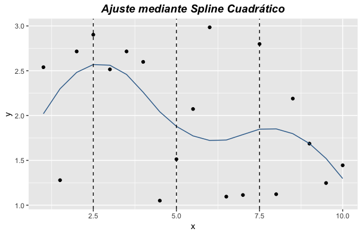
<p class="caption">(\#fig:spline2)Spline Cuadrático</p>
</div>


Como en la interpolación segmentaria lineal, vamos a tener $N-1$ ecuaciones (donde N son los puntos sobre los que se define la función). La interpolación cuadrática nos va a asegurar que la función que nosotros generemos a trozos con los distintos $P(x)$ va a ser continua, ya que para sacar las condiciones que ajusten el polinomio, vamos a determinar como condiciones,

+ Que las partes de la función a trozos P(x) pasen por ese punto. Es decir, que las dos Pn(x) que rodean al f(x) que queremos aproximar, sean igual a f(x) en cada uno de estos puntos.
+ Que la derivada en un punto siempre coincida para ambos "lados" de la función definida a trozos que pasa por tal punto común.
+ Esto sin embargo no es suficiente, y necesitamos una condición más, la cual se obtiene a partir de una condición de borde.

Por su parte un spline cúbico, se representa mediante la unión de polinomios cúbicos con primera y segunda derivada continuas (Ver Figura \@ref(fig:spline3)). Este spline debido a su flexibilidad es el más usado en las aplicaciones.

<div class="figure" style="text-align: center">

<p class="caption">(\#fig:spline3)Spline Cúbico</p>
</div>

Formalmente un spline cúbico con nodos $x_{1},...x_{n}$ se define a partir de un conjunto de polinomios de la forma,\\


$$\displaystyle{S_{j}(x) = a_{j} + b_{j}x +c_{j}x^2 +d_{j}x^3}$$
con $x_{j}<x<x_{j+1}$, sujeto a las siguientes condiciones,


$$
\begin{array}{cc}
 \displaystyle{a_{j-1} + b_{j-1}x_{j} +c_{j-1}x_{j}^2 +d_{j-1}x_{j}^3 = a_{j} + b_{j}x_{j} +c_{j}x_{j}^2 +d_{j}x_{j}^3} \\
\displaystyle{ b_{j-1} +2c_{j-1}x_{j} +3d_{j-1}x_{j}^2 = b_{j} +2c_{j}x_{j} +3d_{j}x_{j}^2} \\
\displaystyle{ 2c_{j-1} +6d_{j-1}x_{j} = 2c_{j} +6d_{j}x_{j}}\\
\displaystyle{ c_{0} = d_{0} = c_{n} =d_{n}}
\end{array}
$$

Así para n nodos, existen $4(n-1)$ variables y $4(n-1)-2$ restricciones. Las mismas se deben a la necesidad de que el spline cúbico sea igual en los valores dados en cada nodo. Las primeras tres restricciones aseguran que la función resultante en su primera y segunda derivada sean continuas en los nodos. La restricción final significa que el spline cúbico es lineal en el punto inicial y final de la muestra. Sin embargo, es importante resaltar que el spline cúbico tiene tercera derivada discontinua en los nodos.

Debido a que hacen falta dos restricciones de borde, estas se deben añadir. Así  $S^{(2)}(x_{1}) = S^{(2)}(x_{n}) = 0$ son las restricciones faltantes, estan hacen referencia a que el spline sea un spline cúbico natural. Como se mencionó al inicio si se considera una interpolación polinomial global de un conjunto de datos con mucho ruido pueden surgir aproximaciones no deseables e inestables. En constrate, un spline cúbico de interpolación encaja perfectamente con la suavidad de la función subyacente.

<div class="figure" style="text-align: center">

<p class="caption">(\#fig:spline4)Comparativo Splines</p>
</div>


Otra característica de los splines es que con la adición de un parámetro sólo se aumenta la dimensionalidad del espacio de parámetros en una unidad, ya que tres de los cuatro parámetros están restringidos. De igual forma, al incrementar el número de nodos los splines toman formas funcionales más flexibles, lo cual muestra la relación entre el grado aproximación que se logra con el spline y el número de nodos que lo definen. Un comparativo para la interpolación lineal usando splines de primer, segundo y tercer grado, se muestra en la Figura \@ref(fig:spline4).


Mientras que las funciones spline son una herramienta interesante para interpolar funciones suaves, encontrarlas numéricamente no es tarea fácil. Una manera eficiente y muy estable para generar los splines necesarios para aproximar la función subyacente $f(x)$, es usando las bases de los B-splines cúbicos.

#### Bases de splines

En el subcampo matemático de análisis numérico, una B-spline o Basis spline (o traducido una línea polinómica suave básica), es una función spline que tiene el mínimo soporte con respecto a un determinado grado, suavidad y partición del dominio. Un teorema fundamental establece que cada función spline de un determinado grado, suavidad y partición del dominio, se puede representar como una combinación lineal de B-splines del mismo grado y suavidad, y sobre la misma partición. El término B-spline fue propuesto por Isaac Jacob Schoenberg y es la abreviatura de spline básica. Las B-splines pueden ser evaluadas de una manera numéricamente estable por el algoritmo de Boor. De un modo simplificado, se han creado variantes potencialmente más rápidas que el algoritmo de Boor, pero adolecen comparativamente de una menor estabilidad.


Una B-spline es simplemente una generalización de una curva de Bézier, que puede evitar el fenómeno Runge sin necesidad de aumentar el grado de la B-spline. Este fenómeno, se presenta al realizar interpolación lineal usando nodos equidistantes, básicamente es un problema que se presenta con el error de aproximaci\'n en los extremos del intervalo que se este considerando, así a medida que crece el número de nodos el error de aproximación se incrementa. 


Supongamos que tenemos un conjunto infinito de nodos $...<x_{-2}<x_{-1}<x_{0}<x_{1}<x_{2}<...$, entonces el j-ésimo B-spline de grado cero es igual a $B^{0}_{j}(x)=1$, si $x_{j} \leq x \leq x_{j+1}$ y $B^{0}_{j}(x)=0$ en otro caso. Con la función $B^{0}_{j}(x)$ como punto de partida se puede generar B-splines de grados mayores mediante la siguiente fórmula recursiva,\\


$$\displaystyle{B^{k}_{j}(x) = \frac{(x-x_{j})B^{k-1}_{j}(x)}{x_{j+k}-x_{j}} + \frac{(x_{j+k+1}-x)B^{k-1}_{j+1}(x)}{x_{j+k+1}-x_{j+1}}}$$
para $k\geq 1$. Así un B-spline de grado $k$ se define como,\\


$$\displaystyle{S^{k}(x) = \sum_{j=-\infty}^{\infty} \theta^{k}_{j} B^{k}_{j-k}(x)}$$
Los coeficientes $\theta^{k}_{j}$ se llaman puntos de control o puntos de Boor. Hay $m-(n+1)$ puntos de control que forman una envoltura convexa. Note que los B-splines de grado positivo no son ortogonales y por ende no poseen una expresión simple para sus coeficientes.

Sin embargo, los cálculos empleados para los B-splines interpoladores de grado cero y uno, son bastante sencillos,\\


$$\displaystyle{S^{0}(x) = \sum_{j=-\infty}^{\infty} y_{j} B^{0}_{j}(x),\hspace{0.4cm} S^{1}(x) = \sum_{j=-\infty}^{\infty} y_{j} B^{1}_{j-1}(x) }$$
Cuando los nodos son equidistantes, la B-spline se dice que es uniforme, de otro modo será no uniforme. Si dos nodos tj son idénticos, cualquiera de las posibles formas indeterminadas 0/0 se consideran 0.


#### B-spline uniforme

Cuando la B-spline es uniforme, las B-splines básicas para un determinado grado n son sólo copias cambiadas de una a otra. Una alternativa no recursiva de la definición de la B-splines $m-n+1$ básica es,


$$\displaystyle{B_{j}^{n}(t)= B_{n}(t-t_{j}), \hspace{0.2cm}para \hspace{0.2cm}j=0,...,m-n-1 }$$
con,

$$\displaystyle{B_{n}(t):= \frac{n+1}{n} \sum_{i=0}^{n+1}w_{i}^{n}(t - t_{i})_{+}^{n}   }$$
donde,

$$\displaystyle{w_{i}^{n} := \prod_{j=0, j\neq i}^{n+1} \frac{1}{t_{j}- t_{i}}}$$
nótese que $(t - t_{i})_{+}^{n}$ es la función potencia truncada definida como,


$$
(t - t_{i})_{+}^{n} :=  \left\{
\begin{array}{ll}
0 &  \text{ si }  t < t_{i} \\
(t - t_{i})^{n}   & \text{ si }  t \ge t_{i}
\end{array}
\right.
$$

#### B-spline cardinal

Si se define $B_{0}$ como la función característica de ${\displaystyle [-{\tfrac {1}{2}},{\tfrac {1}{2}}]}$, y $B_{k}$ recursivamente como el producto convolución,


$$\displaystyle{B_{k} := B_{k-1}*B_{0}, \hspace{0.2cm} k=1,2,... }$$

entonces $B_{k}$ se llaman B-splines cardinales (centradas). Esta definición se remonta a Schoenberg. $B_{k}$ tiene soporte compacto ${\displaystyle [-{\tfrac {k+1}{2}},{\tfrac {k+1}{2}}]}$ y es una función impar. Como ${\displaystyle k\rightarrow \infty }$ las B-splines cardinales normalizadas tienden a la función de Gauss.

Cuando el número de puntos de control de Boor es el mismo que el grado, la B-Spline degenera en una curva de Bézier. La forma de las funciones base es determinada por la posición de los nodos. Escalar o trasladar el vector de nodo no altera las funciones de base.

El spline está contenido en el casco convexo de sus puntos de control. Una B-spline básica de grado n $B_{i}^{n}(t)$ es distinta de cero sólo en el intervalo $[t_{i}, t_{i+n+1}]$ esto es,


$$
B_{i}^{n}(t)  = \left\{
\begin{array}{ll}
> 0 &  \text{ si }  t_{i}  \leq  t < t_{i+n+1} \\
0   & \text{ si }  resto
\end{array}
\right.
$$

En otras palabras si manipulamos un punto de control cambiamos sólo el comportamiento local de la curva y no el comportamiento global como con las curvas de Bézier. La función base se pueda obtener del polinomio de Bernstein. Algunos ejemplos de las bases B-splines se muestran a continuación,

#### B-spline constante

La B-spline constante es la spline más simple. Se define en un solo tramo de nodo y ni siquiera es continua en los nodos. Es sólo la función indicador de los diferentes tramos de nodo.

$$
B_{j}^{0}(t) = 1_{[t_{j},t_{j+1})}  = \left\{
\begin{array}{ll}
1 &  \text{ si }  t_{j}  \leq  t < t_{j+1}1 \\
0   & \text{ si }  resto
\end{array}
\right.
$$

#### B-spline lineal

La B-spline lineal se define en dos tramos de nodo consecutivos y es continua sobre los nodos, pero no diferenciable.

$$
B_{j}^{1}(t) = \left\{
\begin{array}{ll}
\frac{t-t_{j}}{t_{j+1}-t_{j}} &  \text{ si } t_{j}  \leq  t < t_{j+1} \\
\frac{t_{j+2}-t}{t_{j+2}-t_{j+1}}    & \text{ si }  t_{j+1}  \leq  t < t_{j+2} \\
0 &  \text{ si } resto
\end{array}
\right.
$$

#### B-spline cuadrática uniforme

Las B-splines cuadráticas con nodo-vector uniforme es una forma común de B-spline. La función base puede ser calculada fácilmente , y es igual para cada segmento, en este caso.

$$
B_{j}^{2}(t) = \left\{
\begin{array}{ll}
\frac{1}{2} (1-t)^2 \\
-t^2+t+\frac{1}{2} \\
\frac{1}{2} t^2
\end{array}
\right.
$$

Escrito en forma de matriz, esto es,


$$\displaystyle{S_{i}(t) = \begin{bmatrix} t^2 & t & 1  \end{bmatrix} \frac{1}{2} \begin{bmatrix} 1 & -2 & 1\\ -2 & 2 & 0  \\ 1 & 1 & 0 \end{bmatrix} \begin{bmatrix}  \theta_{i-1} \\ \theta_{i} \\ \theta_{i+1}  \end{bmatrix} , \hspace{0.2cm} para \hspace{0.2cm} t \in [0,1],\hspace{0.2cm}  i=1,2,...,m-1 }$$


#### B-spline cúbica

Una formulación B-spline para un solo segmento puede ser escrita como,

$$\displaystyle{S_{i}(t) = \sum_{k=0}^{3} \theta_{i-3+k} B_{i-3+k}^{3}(t) \hspace{0.2cm} con \hspace{0.2cm} t \in [0,1]  }$$

donde $S_{i}$ es el i-ésimo segmento B-spline, $\theta$ es el conjunto de puntos de control, el segmento i y k es el índice del punto de control local y $ B_{i-3+k}^{3}(t)$ representa la base de B-spline de grado 3. Un conjunto de puntos de control $\theta$ sería  ${\displaystyle \theta_{i}^{w}=(w_{i}x_{i},w_{i}y_{i},w_{i}z_{i},w_{i})}$ donde el ${\displaystyle w_{i}}$ es el peso, tirando de la curva hacia el punto de control ${\displaystyle \theta_{i}}$ mientras que aumenta o se desplazan fuera de la curva, a la vez que disminuye.

Toda una serie de segmentos se definiría como,

$$\displaystyle{S(t) = \sum_{i=0}^{m-1} \theta_{i} B_{i}^{3}(t)  }$$

donde i es el número de puntos de control y t es un parámetro global dados los valores de los nodos. Esta formulación expresa una curva B-spline como una combinación lineal de funciones B-spline básicas, de ahí el nombre.

Hay dos tipos de B-spline - uniforme y no uniforme. Una B-spline no uniforme es una curva donde los intervalos entre los puntos sucesivos de control no son, o no necesariamente son, iguales (el vector de nodos de espacios de nodo interiores no son iguales). Una forma común es donde los intervalos se reducen sucesivamente a cero, interpolando los puntos de control.

#### B-spline cúbica uniforme

La B-spline cúbica con vector-nodo uniforme es la forma más usual de B-spline. La función base puede ser fácilmente calculada, y es igual para cada segmento, en este caso. Puesto en forma de matriz, esto es,

$$\displaystyle{S_{i}(t) = \begin{bmatrix} t^3  & t^2 & t & 1  \end{bmatrix} \frac{1}{6} \begin{bmatrix} -1 & 3 & -3 & 1 \\ 3 & -6 & 3 & 0 \\ -3 & 0 & 3 & 0 \\ 1 & 4 & 1 & 0 \end{bmatrix} \begin{bmatrix}  \theta_{i-1} \\ \theta_{i} \\ \theta_{i+1} \\ \theta_{i+2}  \end{bmatrix} , \hspace{0.2cm} para \hspace{0.2cm} t \in [0,1] }$$

Para splines de grados más elevados, algunas arbitrariedades surgen al momento de calcular los coeficientes $\theta_{i}^{k}$. Por lo tanto, debido a que en las aplicaciones estadisticas existe un mayor interés por encontrar una aproximación que una interpolación, la técnica de minimos cuadros puede ser empleada para calcular estos valores.

Ahora bien, supongamos que se tiene un conjunto de $m$ funciones diferenciables $f(x)$, con soporte en el intervalo $[a,b]$, las cuales satifacen las siguientes condiciones,

+ $f(x_{i})=y_{i}$, para $i=1...,n$.
+ La m-1 derivada $f^{(m-1)}(x)$, es continua en x.

El problema es encontrar entre todas esas funciones, una función tal que tenga la mínima integral del cuadro de su segunda derivada, esto es, una función que tenga el valor más pequeño de $\int_{a}^{b} (f^{(m)}(x))^2 dx$. Dicha función será la elección más óptima al momento de hallar un balance entre suavidad y ajuste de los datos.

Se puede desmostrar que la solución de este problema es única y la función en cuestión es un spline polinomial que cumple la condición i), y además satisface que,


+ f es un pilinomio de grado no mayor que $m-1$ cuando $x \in [a,x_{1}]$ y $x \in [x_{n},b]$ .
+ F es un polinomio de grado no mayor a $2m-1$ para puntos interiores, $x \in [x_{i},x_{i+1}]$ con i=1,...,n.
+ f(x) tiene $2m-2$ derivadas continuas en el eje real.

En resumen, la función $f$ mínima es un spline el cual está conformado por trozos de polinomios unidos en los nodos $x_{i}$, donde dicha función tiene $2m-2$ derivadas continuas. Nótese que en muchas aplicaciones $m=2$ es un valor muy utilizado y cuya solución viene dada mediante el spline cúbico natural.

### Regresión no paramétrica

La teoría clásica de la regresión se basa, en gran parte, en el supuesto que las observaciones son independientes y se encuentran idéntica y normalmente distribuidas. Si bien existen muchos fenómenos del mundo real que pueden modelarse de esta manera, para el tratamiento de ciertos problemas, la normalidad de los datos es insostenible. En el intento de eliminar esa restricción se diseñaron métodos que hacen un número mínimo de supuestos sobre los modelos que describen las observaciones.

La teoría de los métodos no paramétricos trata, esencialmente, el desarrollo de procedimientos de inferencia estadística, que no realizan una suposición explícita con respecto a la forma funcional de la 
distribución de probabilidad de las observaciones de la muestra. Si bien en la Estadística no paramétrica también aparecen modelos y parámetros, ellos están definidos de una manera más general que en su contrapartida paramétrica.

La regresión no paramétrica es una colección de técnicas para el ajuste de funciones de regresión cuando existe poco conocimiento a priori acerca de su forma. Proporciona funciones suavizadas de la relación y el procedimiento se denomina suavizado.

Los fundamentos de los métodos de suavizado son antiguos pero sólo lograron el estado actual de desarrollo gracias a los avances de la computación y los estudios por simulación han permitido evaluar sus comportamientos.

La técnica más simple de suavizado, los promedios móviles, fue la primera en usarse, sin embargo han surgido nuevas técnicas como la estimación mediante núcleos (``kernel") o la regresión local ponderada. Estos estimadores de regresión no paramétrica son herramientas poderosas para el análisis de datos, tanto como una técnica de estimación para resumir una relación compleja que no puede ser aprendida por un modelo paramétrico, como para suplementar (o complementar) un análisis de regresión paramétrico.

En los análisis paramétricos se comienza haciendo supuestos rígidos sobre la estructura básica de los datos, luego se estiman de la forma más eficiente posible los parámetros que definen la estructura y por último se comprueba si los supuestos iniciales se cumplen.

La regresión no paramétrica, en cambio, desarrolla un ``modelo libre" \hspace{0.02cm} para predecir la respuesta sobre el rango de valores de los datos. Básicamente está constituida por métodos que proporcionan una estimación suavizada de la relación para un conjunto de valores (de- nominado ventana) de la variable explicativa. Estos valores son ponderados de modo que, por ejemplo, los vecinos más cercanos tengan mayor peso que los más alejados dentro de una ventana de datos. Se pueden utilizar diversas funciones de ponderación, que son los pesos en que se basan los estimadores. La combinación de la función de ponderación y el ancho de la ventana inciden sobre la bondad de la estimación resultante.


La mayor parte de las publicaciones sobre regresión no paramétrica consideran el caso de un solo regresor a pesar de que, a simple vista no pareciera de gran utilidad, ya que las aplicaciones más interesantes involucran varias variables explicativas. Sin embargo, la regresión no paramétrica simple es importante por dos motivos:


+ En etapas preliminares del análisis de datos o en pruebas de diagnóstico se utilizan gráficos de dispersión en los cuales puede ser muy útil ajustar una "curva suavizada". Por ejemplo, para explorar la forma de la función respuesta, para confirmar una función respuesta en particular que haya sido ajustada a los datos, para obtener estimaciones de la respuesta media sin especificar la forma de la función respuesta, para estudiar el cumplimientos de supuestos, etc.
+ Forma la base a partir de la cual se extienden los conceptos para regresión no paramétrica múltiple.

### Regresión no paramétrica mediante splines de suavizado

Consideremos el siguiente modelo de regresión homocedástico,


$$\displaystyle{Y_{i}=f(X_{i})+\epsilon_{i}}, \hspace{0.3cm} para \hspace{0.2cm} i=1,...,n$$
donde los $\epsilon_{i}$ son errores de media cero independientes e idénticamente distribuidos.

Uno de los posibles métodos para emplear splines es aproximar la función de regresión subyacente mediante las bases de splines, por ejemplo, la base de los B-splines cúbicos. Así, se escoge una secuencia fija de nodos $-\infty<t_{1}<t_{2}<...<t_{J}<\infty$, los cuales pueden diferir de los predictores. Luego, se calculan los elementos de la base cúbica de spline correspondiente.

Es posible mostrar que sólo son necesarios $J+4$ elementos de esta base. Denotemos a estos elementos por $B_{j}(x)$, así el spline polinomial lo podemos expresar como sigue,


$$\displaystyle{S(x)=\sum_{j=1}^{J+4} \theta_{j}B_{j}(x)}$$
Entonces los coeficientes $\theta_{j}$ pueden ser calculados al ser considerados como los parámetros que se obtienen al minimizar la suma de los errores al cuadrado,


$$\displaystyle{\sum_{i=1}^{n} \left[ Y_{i} - \sum_{j=1}^{J+4} \theta_{j}B_{j}(X_{j})\right]^2}$$
Denotamos por $\hat{\theta_{j}}$ al estimador de mínimos cuadrados y definimos el estimador del spline polinomial como sigue,

$$\displaystyle{ \hat{f}_{n}(x) = \sum_{j=1}^{J+4} \hat{\theta_{j}}B_{j}(x)}$$
Otro enfoque, se basa en la idea de encontrar un curva suave que minimize la suma penalizada de errores al cuadrado, es decir, que minimize la siguiente expresión,

(@ecu9)
$$
  n^{-1}\sum_{j=1}^{n}(Y_{j}-f(X_{j}))^2+\mu \int_{a}^{b} [f^{(m)} (x)]^2 dx
$$

para algún $\mu > 0$. Así como el enfoque de interpolación anterior, la solución de este problema de minimización es un spline, el cual recibe el nombre de estimador de spline de suavizado.


En particular, para el caso $m=2$ el minimizador de la ecuación @ecu9, es un spline cúbico natural. Note que $\mu$ juega el papel de parámetro de suavizado, este término se puede interpretar como una penalización por rugosidad de la función. Curvas que cambian lenta o suavemente presentan un valor pequeño de la integral, por ejemplo, en una función lineal la integral toma el valor de cero.


De hecho, la primera suma en la ecuación @ecu9 penaliza la falta de fidelidad de la aproximación de la data mediante el spline. El segundo término es el responsable de la suavidad de la aproximación obtenida mediante el spline. Para ver esto considérese los casos extremos, es decir, cuando $\mu =0$ y $\mu=\infty$. El primer caso conduce a una interpolación, esto es $\hat{f}(X_{i})=Y_{i}$ para $i=1,...,n$. El otro caso, conduce a una regresión lineal pues $f^{(2)}(x)\equiv 0$.


Por lo tanto $\mu$ es el parámetro de suavizado que controla la medida del estimador del spline polinomial, el cual puede variar desde el modelo más complicado e inestable hasta el modelo más simple. En otras palabras, la ecuación @ecu9 representa un balance entre la fidelidad o ajuste de los datos, representado mediante la suma de los residuos al cuadrado y la suavidad de la curva resultante, la cual se representa por la integral del cuadrado de la m-émisa derivada.

### Proceso de Optimización de Nelson y Siegel y Svensson


Para aplicar este proceso es necesario tener una función objetivo, sobre la cual se realizará el proceso de optimización, ya sea para maximizar ó minimizar dicha función. Dependiendo de la forma de dicha función el proceso de optimización será lineal o no lineal. En nuestro caso particular se llevará a cabo un proceso de optimización no lineal donde se buscará minimizar la función objetivo.


En el cálculo de nuestra función objetivo inteviene el concepto de la duración de un bono ó título, la cuál es una medida del vencimiento medio ponderado de todos los flujos que paga un bono. La misma viene dada mediante la siguiente expresión, 


$$\displaystyle{Duracion = \frac{1+r}{r} - \frac{n(c-r)+(1+r)}{c(1+r)^{n}-(c-r)}}$$

donde

+ r es el rendimiento al vencimiento del bono durante el período considerado.
+ n es el número de períodos que restan hasta la fecha de vencimiento del bono.
+ c es el cupón del bono.

Así nuestra función objetivo viene dada mediante la siguiente expresión,


$$
  f(x) = \sum_{i=1}^{n} (w_{i}\epsilon(x)_{i} )^2
$$


donde $w_{i}$ representan las ponderaciones, y se calculan mediante la siguiente expresión,


$$\displaystyle{w_{i} = \frac{\frac{1}{D_{i}}}{\sum_{j=1}^{N}\frac{1}{D_{j}}}}$$

 por su parte, $\epsilon_{i}(x)= \hat{Pr}_{i}(x)-Pr_{i}$, donde $Pr_{i}$ representan los precios promedios de los títulos a considerar, de entrada este es un parámetro ó valor con el que se cuenta. Por otra parte $\hat{Pr}_{i}(x)$ representa los precios estimados donde $x$ es el parámetro que va a variar y es el valor que se quiere optimizar.


Mediante la función objetivo descrita anteriormente se busca minimizar la diferencia que existe entre los precios promedios y los precios estimados, calculando un valor óptimo del parámetro $x$ mediante el proceso de optimización no lineal.


El proceso de optimización se realizó mediante el software estadístico R, mediante el paquete "nloptr". En este paquete, se encuentra el comando "aulag" el cual minimiza un función objetivo y devuelve entre otros valores el parámetro más óptimo, que hace que la función sea mínima. Un ejemplo del uso de este comando se presenta acontinuación,


$$ala2=auglag(1.22, fn=mifuncion, hin=res)$$
donde el primer argumento debe ser el valor inicial del parámetro a optimizar, el segundo argumento "fn" se refiere a la función que se desea optimizar, finalmente en el tercer parámetro "hin" se indican las restricciones sobre el parámetro a optimizar, en este caso la restricción establecida es que el parámetro sea mayor a cero.


Recordemos que la tasa cero cupón que se obtiene mediante la metodología de Svensson está dada por la siguiente expresión,


$$\displaystyle{s(m) = \beta_{0}+ \beta_{1}\frac{\left(1-e^\frac{-m}{\tau_{1}}\right)}{m/\tau_{1}} + \beta_{2} \left(\frac{\left(1-e^\frac{-m}{\tau_{1}}\right)}{m/\tau_{1}} -  e^\frac{-m}{\tau_{1}}\right) + \beta_{3} \left(\frac{\left(1-e^\frac{-m}{\tau_{2}}\right)}{m/\tau_{2}} -  e^\frac{-m}{\tau_{2}}\right)}$$

esta expresión está sujeta a las siguientes restricciones,

+ $\beta_{0} > 0$
+ $\beta_{0}+\beta_{1} > 0$
+ $\tau_{1} > 0$
+ $\tau_{2} > 0$

cada parámetro controla una sección de la curva. La fórmula anterior es de suma importancia ya que ella interviene en el cálculo del precio teórico de cada instrumento. El proceso de optimización actúa directamente sobre esta fórmula, ya que el mismo se centra en variar los parámetros de tal manera que la función objetivo sea minimizada.

Como se observó en las secciones anteriores el parámetro de suavizamiento fué elegido mediante el método de ensayo y error el cual no es para nada óptimo pues a priori este método no nos garantiza que el valor seleccionado sea el mejor, ya que se contarían con una gran cantidad de posibles valores a seleccionar, con el fin  de encontrar dicho parámetro el procedimiento anteriormente explicado puede ser implementado. 

Sin embargo, al realizar este proceso, se obtienen curvas que no son para nada suaves y en ocasiones no poseen ningunas de las formas usuales de la curva de rendimientos. Esto es debido a que en este caso este proceso, varía el parámetro de suavizamiento de tal manera que la diferencia entre el precio promedio y el precio teórico sea lo mas pequeña posible y en este proceso no existe un parámetro que controle la forma de la curva obtenida. Por lo tanto, su aplicación presenta algunos inconvenientes.  


### Elaboracion Base de datos para la metodología Splines y Diebold-Li

La fuente principal de información para calcular la curva de rendimientos para los títulos de la deuda pública nacional es el Banco Central de Venezuela (BCV), el cual diariamente publica las operaciones realizadas con estos instrumentos y los publica en el documento "resumersec" (Ver Figura \@ref(fig:bcv). Es importante destacar, que en este documento se encuentran por día dos pestañas, la $``0-22"$ y la $``0-23"$, en la primera pestaña se encuentran las operaciones interbancarias, por su parte la segunda pestaña muestra información sobre las operaciones realizadas por entes privados, en este caso el precio pautado en la operación no está disponible, razón por la cual esta pestaña no se toma en consideración. La información disponible en la pestaña $``0-22"$ es la siguiente,

+ Código del instrumento: código único que se asocia a cada instrumento.
+ Fecha de vencimiento: fecha de maduración de cada instrumento.
+ Plazo: cantidad de días que faltan para que el instrumento venza.
+ Cantidad de Operaciones: número de operaciones realizadas con cada instrumento.
+ Monto en Bolívares: monto total involucrado en la operación.
+ Precio mínimo: precio más bajo pautado en la operación.
+ Precio máximo: precio más alto pautado en la operación.
+ Precio promedio: precio promedio pautado en la la operación. Cabe destacar que si existe una sóla operación, los precios mínimo, máximo y promedio serán iguales.
+ Cupón: tasa de interés pagadera por cada instrumento.

<div class="figure" style="text-align: center">

<p class="caption">(\#fig:bcv)Pestaña 0-22</p>
</div>

Es importante recordar que dentro de los títulos de la Deuda Pública Nacional se encuentran los títulos de interés fijo (TIF) y los títulos de tasa variable (VEBONO), los primeros se caracterizan por poseer una tasa de cupón que no varia, por su parte los VEBONO poseen una tasa de interés variable.

Esta información también es suministrada por el BCV, en su documento de las "Características de la Deuda Pública Nacional" (Ver Figura \@ref(fig:carac) ), por lo cual el mismo se debe revisar con cierta frecuencia, con el fin de actualizar la tasa de cupón de los VEBONO. En este documento se muestra información que caracteriza a cada instrumento, el mismo posee varias pestañas, en este trabajo sólo se considerará la pestaña $``DPN"$ en donde se encuentra información sobre los instrumentos emitidos en moneda nacional. La información disponible en este documento se muestra a continuación,

+ Número-Emisión-Decreto: información sobre emisión de cada instrumento.
+ Código: código único que se asocia a cada instrumento.
+ Fecha de emisión: fecha cuando se emitió cada instrumento.
+ Fecha de vencimiento: fecha de maduración de cada instrumento.
+ Monto en Circulación: monto total de cada instrumento en circulación.
+ Porcentaje de referecia: indica si el instrumento es de tasa fija o tasa variable.
+ Fecha de inicio: indica cada cuanto tiempo el instrumento paga cupón.
+ Período vigente: indica el período (fecha inicio y fecha fin) cuando cada instrumento paga cupón.
+ Tasa: cupón asociado a cada instrumento.

<div class="figure" style="text-align: center">

<p class="caption">(\#fig:carac)Características</p>
</div>

A partir de la pestaña "0-22" y del documento de las características, se creó la base de datos con la cual se va a trabajar, la misma contiene no sólo la información suministrada por la pestaña "0-22", sino alguna información adicional tomada del documento de las características. En dicha base de datos se contará con la siguiente información,

+ Tipo Instrumento: Indica el tipo de instrumento.
+ Nombre: Proporciona el nombre corto del título, usualmente este nombre se conforma por el tipo de título más su mes y año de vencimiento, por ejemplo, el título TIF032028, representa al título TIF con vencimiento en marzo del 2028.
+ Fecha de operación: Indica la fecha en que se efectuó dicha operación.
+ Fuente: Indica la fuente de donde se tomó la información, esta se puede tomar de dos fuentes, la primera mediante la pestaña 0-22 (mercado secundario) y  la otra mediante el documento de las subastas (mercado primario, información suministrada por el BCV).
+ Sicet: Proporciona el código asociado a cada título.
+ Fecha de vencimiento: Indica la fecha de maduración (vencimiento) del instrumento.
+ Plazo: Indica la cantidad de días que falta para que el instrumento se venza.
+ Cantidad de operaciones: Proporciona la cantidad de operaciones efectuadas con un insrumento en específico.
+ Monto: Indica el monto en Bolívares, por el cual se efectuó la operación u operaciones.
+ Precio mínimo: Indica el precio mínimo, por el cual se transó la operación.
+ Precio máximo: Indica el precio máximo, por el cual se transó la operación.
+ Precio promedio: Indica el precio promedio, por el cual se transó la operación, cabe destacar que en dado caso de existir una sola operación el valor del precio mínimo, máximo y promedio van a coincidir.
+ Cupón: Proporciona la tasa de cupón asociado a cada instrumento.
+ Frecuencia: Indica con que frecuencia el instrumento paga cupón, para los TIF y VEBONO, esta es 4, pues los mismos pagan cu\'pon trimestralmente, así se obtiene este valor pues existen 4 trimestres en el año.

<!-- Una vez obtenida la base de datos esta según sea el caso puede ser depurada mediante ciertos criterios, el primero es que aquellas operaciones con un monto menor a los 10 milllones no se consideran. El segundo es considerar la operación mas reciente, es decir, si en la base de datos se tiene que para un mismo instrumento existen diferentes operaciones en diferentes días, sólo se considerará la operación más reciente. -->


<!-- Para efectuar la depuración, a la base de datos anterior se le añadirán dos columnas nuevas una que indica el rendimiento al vencimiento de cada instrumento y la otra que indica la decisión que se tomó en base a los criterios descritos anteriormente (Ver Figura \@ref(fig:base)). Esta última será una variable dicotómica, es decir solo con dos valores (0 ó 1), en donde "0" me indica que no selecciono el título y "1" me indica que si lo tomo en cuenta para el estudio a realizar. -->

<!-- ```{r , echo=FALSE, fig.align='center',fig.cap="Base de datos",label=base} -->
<!--  -->
<!-- ``` -->

<!-- Una vez calculados los precios estimados asociados a cada instrumento, se procederá a comparar los mismo con aquellos obtenidos por una metodología distinta. La metodología con la cual se va a comparar es la de Svensson, la cual es una metodología paramétrica. -->


<!-- Los instrumentos a considerar serán aquellos pertencientes al portafolio de inversiones de una institución financiera, de tal manera que para un día especifico sea posible conocer cuanta es la ganancia o pérdida que generan estos instrumentos. y por ende saber si es viable la venta o compra de determinado instrumento. -->

<!-- A partir de la data obtenida (Ver Figura \@ref(fig:base)), se procederá a añadir unas columnas nuevas con el fin de clasificar las observaciones para los distintos instrumentos en diferentes períodos de vencimiento. Los períodos de vencimiento son, -->


<!-- + Corto plazo: se refiere al vencimiento más cercano, los instrumentos que se encuentran aquí son aquellos que poseen un vencimiento menor a un año. -->
<!-- + Mediano plazo: en esta clasificación se encuentran los instrumentos cuyo vencimiento este entre uno y diez años. -->
<!-- + Largo plazo: hace referencia a aquellos instrumentos que tengan un vencimiento mayor a diez años. -->


<!-- Luego de separar la data por tipo de instrumento, la nueva data con la que se trabajará es la siguiente, -->

<!-- ```{r , echo=FALSE, fig.align='center',fig.cap="Base de datos TIF",label=baset} -->
<!-- knitr::include_graphics("images/data_nueva.png") -->
<!-- ``` -->

<!-- Con el fin de contar con la data más reciente a partir de la fecha de valoración, se creó la función "extrae" la cual selecciona de la data de la Figura (\@ref(fig:baset)) una determinada cantidad de observaciones, la cual es especificada por el usuario, esta función cuenta con los siguientes argumentos, -->

<!-- + fv: indica la fecha de valoración para la cual se está realizando el estudio. -->
<!-- + dias: indica la cantidad de días que el usuario desea, a partir de este valor se va a obtener la data con la que se va a trabajar. -->
<!-- + data: hace referencia a la data completa para cada tipo de instrumento, a partir de la misma se procedera a extraer parte de ella a partir del número de dias seleccionado. -->


<!-- Luego de selecionar la data, la misma se procede a depurar, es decir, se van a eliminar las observaciones duplicadas considerando sólo aquellas que sean más recientes.  -->


<!-- Así a partir de esta data sólo se consideraran las columnas plazo y rendimiento con el fin de tener una nube de puntos a partir de la cual se haga el ajuste de la función spline, y así obtener la curva de rendimientos. -->


<!-- La data obtenida a partir de la depuración anterior es, -->

<!-- ```{r , echo=FALSE, fig.align='center',fig.cap="Data depurada TIF",label=datadep} -->
<!-- knitr::include_graphics("images/cand.png") -->
<!-- ``` -->


<!-- Una vez obtenida la data para los Tif y Vebono se utilizó la función "smooth.spline" del programa estadístico R, para ajustar un spline cúbico a la data ingresada. Los argumentos requeridos por esta función son los siguientes, -->

<!-- + X: representa el vector de la variable predictiva. -->
<!-- + Y: representa el vector de la variable repuesta. -->
<!-- + cv: (TRUE/FALSE) variable del tipo lógico que representa si se va a utilizar la validación cruzada generalizada al momento de calcular el parámetro de suavizamiento. -->
<!-- + Spar: representa el parámetro de suavizamiento, típicamente (aunque no necesariamente) ubicado entre 0 y 1. Es el coeficiente lambda que acompaña a la integral del cuadrado de la segunda derivada de la función f. -->

<!-- De esta manera el siguiente comando ajusta un spline cubico a la data ingresada, -->


<!-- spline1=smooth.spline(X=datT1\$Plazo,Y=datT1\$Rendimiento,cv=TRUE, spar=1.35) -->

<!-- y lo guarda en la variable ``spline1". -->

<!-- Es importante señalar lo crucial de la escogencia del parámetro "spar", pues de él depende que tan suave sea la curva, la Figura (\@ref(fig:compspar) muestra como varía la curva cuando se cambia  el valor del ``spar", para esta comparación se usó tres valores, el primero fue 0.51 con el cual se obtiene una curva con ciertos picos la cual no es suave en lo absoluto.  -->

<!-- Usando el valor de 0.71 se obtiene la curva roja la cual presenta una mayor suavidad. Mientras que usando el valor de 0.81 se obtiene un mejor resultado aunque similar al anterior. De esta manera, se puede observar la importancia de la elección correcta de este parámetro, mientras este valor se aproxime a 1 se obtendrá una curva con mayor suvidad. -->

<!-- ```{r , echo=FALSE, fig.align='center',fig.cap="Curva de rendimiento Vebono para diferentes valores de suavizado",label=compspar} -->
<!-- knitr::include_graphics("images/curvavbv2.jpg") -->
<!-- ``` -->

<!-- Cabe destacar que para cada versión el parámetro usado en la variable "spar" cambió. Esto debido a la diferente cantidad de puntos que tiene cada versión. Así el valor del parámetro "spar" para los TIF se ubicó en el siguiente intervalo [0.4,0.6], por su parte para los VEBONOS la elección de dicho parámetro esta en [0.3,0.5]. Los mismos se obtuvieron mediante ensayo y error. Para los valores ubicados dentro de los intervalos mencionados siempre se obtuvo una curva suave. -->

<!-- Una vez que se obtiene la curva estimada y es guardada en una variable (en este caso, la variable es spline1), se procede a aplicar el comando "predict", para estimar el rendimiento de algún plazo que se ingrese. -->

<!-- Así con el fin de calcular el precio estimado de cada título, se creó la función "precio" mediante R, para determinar de forma automática dichos valores. Los imputs de dicha función son los siguientes, -->


<!-- + Tit: representa el nombre de cada título, al cual se le quiere estimar su precio, el mismo debe ser un carácter, ej: TIF102017 ó VEBONO112017. -->
<!-- + Spline1: representa la variable donde se guardo la curva ajustada mediante el spline. -->
<!-- + Fv: indica la fecha de valoración, para la cual se desea conocer el precio estimado. -->


<!-- Una vez ingresado los imputs, la función internamente busca el nombre del título en el documento de las características más reciente, y extrae del mismo la fecha de pago del próximo cupón y su fecha de vencimiento, con el fin de crear un vector de flujos. -->

<!-- Por ejemplo, si se quiere conocer el precio estimado del título "TIF032022"  al "01/03/2018", la función busca su fecha de vencimiento $(03/03/2022)$ y la fecha de pago del próximo cupón la cual es en este caso $08/03/2018$. Luego con dichos valores calcula la Tabla \ref{tabla1}, que representa los cupones que le quedan por pagar al título, -->

<!-- \renewcommand{\tablename}{Tabla} -->
<!-- \begin{table}[H] -->
<!-- \centering -->
<!-- %\begin{center} -->
<!-- {\begin{tabular}[t]{|l |c |c |c |c |c |r|} -->
<!-- \hline -->
<!-- Fecha & Plazo título & Plazo años & Rend estimado & Exp & Cupón & Producto \\ -->
<!-- \hline -->
<!-- 08/03/2018 & 7  & 0,0191780 & 0,45\% & 0,9999131 & 4& 3,999652\\ -->
<!-- \hline -->
<!-- 07/06/2018 & 98 & 0,2684931 & 1,05\% & 0,9971804 & 4& 3,988721\\ -->
<!-- \hline -->
<!-- 06/09/2018 & 189 & 0,5178082 & 1,64\% & 0,9915025 & 4& 3,966010\\ -->
<!-- \hline -->
<!-- 06/12/2018 & 280 & 0,7671232 & 2,23\% & 0,9829646 & 4& 3,931859\\ -->
<!-- \hline -->
<!-- 07/03/2019 & 317 & 1,0164383 & 2,82\% & 0,9717013 & 4& 3,886805\\ -->
<!-- \hline -->
<!-- 06/06/2019 & 462 & 1,2657534 & 3,39\% & 0,9578928 & 4& 3,831571\\ -->
<!-- \hline -->
<!-- 05/09/2019 & 553 & 1,5150684 & 3,96\% & 0,9417596 & 4& 3,767038\\ -->
<!-- \hline -->
<!-- 05/12/2019 & 644 & 1,7643835 & 4,50\% & 0,9235567 & 4& 3,694227\\ -->
<!-- \hline -->
<!-- 05/03/2020 & 735 & 2,0136986 & 5,03\% & 0,9035668 & 4& 3,614267\\ -->
<!-- \hline -->
<!-- 04/06/2020 & 826 & 2,2630137 & 5,54\% & 0,8820934 & 4& 3,528373\\ -->
<!-- \hline -->
<!-- 03/09/2020 & 917 & 2,5123287 & 6,02\% & 0,8594532 & 4& 3,437813\\ -->
<!-- \hline -->
<!-- 03/12/2020 & 1008 & 2,7616438 & 6,48\% & 0,8359698 & 4& 3,343879\\ -->
<!-- \hline -->
<!-- 04/03/2021 & 1099 & 3,0109589 & 6,91\% & 0,8119665 & 4& 3,247866\\ -->
<!-- \hline -->
<!-- 03/06/2021 & 1190 & 3,2602739 & 7,31\% & 0,7877226 & 4& 3,150890\\ -->
<!-- \hline -->
<!-- 02/09/2021 & 1281 & 3,5095890 & 7,69\% & 0,7634473 & 4& 3,053789\\ -->
<!-- \hline -->
<!-- 02/12/2021 & 1372 & 3,7589041 & 8,03\% & 0,7393192 & 4& 2,957277\\ -->
<!-- \hline -->
<!-- 03/03/2022 & 1463 & 4,0082191 & 8,35\% & 0,7154912 & 104 & 74,411084\\ -->
<!-- \hline -->
<!-- % Precio &  &  &  & & & 112,688809\\ -->
<!-- \multicolumn{6}{|c|}{Precio} & 131,8111 \\ -->
<!-- \hline -->
<!-- \end{tabular} -->
<!-- } -->
<!-- %\caption{Tabla} -->
<!-- %\end{center} -->
<!-- \caption{Cálculos función precio.} -->
<!-- \label{tabla1} -->
<!-- \end{table} -->

<!-- Así la primera columna (Fecha) se obtiene de sumarle a la fecha de pago del próximo cupón ($08/03/2018$) 91 días, que representa el tiempo cada cuando el título paga cupón, esto se realiza  hasta llegar a la fecha de vencimiento. -->

<!-- Luego la columna "Plazo título", se obtiene realizando la diferencia entre la columna 1 y la fecha de valoración (01/03/2018). Luego la columna 3 se obtiene dividiendo el valor de la columna 2 entre 365, para pasar dicho valor a años. Después evalúo los valores de la columna 2 en el spline obtenido, para así obtener los rendimientos estimados (columna 4). Posteriormente en la columna 5 (EXP) calculo la exponencial del producto de menos uno con el plazo en años (columna 3) y con el rendimiento estimado (columna 4). -->


<!-- La columna 6 (Cupón) la calculo dividiendo el valor del cupón del título entre 4, ya que cada cupón se paga cada tres meses, a diferencia del último al cual se le debe sumar el valor de 100. Finalmente en la última columna (Producto) calculo el producto del valor de la columna EXP con la columna Cupón, para luego realizar la sumatoria de todas sus filas y así obtener el precio estimado (131,8111 en este caso). -->


<!-- El mismo procedimiento se repite para cada título ya sea Tif o Vebono. Es importante señalar que los títulos considerados fueron aquellos que pertenecían al portafolio de inversiones del banco en un tiempo determinado. -->


<!--chapter:end:011-Curva_de_Rendimientos.Rmd-->

\mainmatter

# Valor en Riesgo

El valor en riesgo, conocido comúnmente como VaR (Value at Risk), es una técnica estadística para medir el riesgo financiero de una inversión. Indica la probabilidad (normalmente 1% o 5%) de sufrir una determinada pérdida durante un periodo de tiempo (normalmente 1 día, 1 semana o 1 mes).

Dicho de otro modo, el VaR establece la pérdida máxima que puede experimentar una inversión dentro de un horizonte temporal, dado un nivel de confianza (1- $\alpha$), normalmente 95% o 99%. Por ejemplo, la pérdida máxima será durante un mes con un 95% de probabilidad igual o menor que 5 millones de euros. O lo que es lo mismo, existe una probabilidad del 5% de que la pérdida sea como mínimo de 5 millones de euros en un mes. Por lo tanto, también mide la pérdida mínima que sufrirá una inversión para un nivel de significación ($\alpha$).

El VaR mide el riesgo financiero de una inversión, por lo que tiene una amplia aplicación en el mundo de las finanzas. Se puede calcular la pérdida máxima tanto para un solo activo financiero como para una cartera de activos financieros. Es muy utilizado en análisis de riesgos para medir y controlar el nivel de riesgo que una empresa es capaz de soportar. El gestor de riesgos es asegurarse de que no se incurre en riesgos mayores de los que la empresa podría afrontar.

Se trata de un método para cuantificar la exposición al riesgo de mercado, utilizando técnicas estadísticas tradicionales. Partamos de la base de que los agentes económicos de hoy enfrentan riesgos de diferente naturaleza, como por ejemplo de crédito, de mercado, de liquidez, operacional, legal, etc. El Valor en Riesgo vendría a medir la pérdida que se podría sufrir en condiciones normales de mercado en un intervalo de tiempo y con un cierto nivel de probabilidad o de confianza.

Este método fue desarrollado por matemáticos y estadísticos de JP Morgan a principios de los 90, y fue adaptado rápidamente por el resto de las firmas financieras de Wall Street gracias al gran éxito inicial y a su simplicidad de concepto. Sin embargo, no nos olvidemos de que el VaR mide probabilidades. Es decir, solo proporciona una medida resumida del riesgo del mercado. Se puede distinguir entre el VaR absoluto y el VaR relativo. En función del tipo, se pueden utilizar distintos tipos de métodos para hallarlo.

<!-- Un ejemplo práctico puede ser que una entidad financiera podría considerar que el VaR diario de una cartera operativa es de 50 millones de euros, con un nivel de confianza del 90%. Esto quiere decir que solamente hay 1 posibilidad en 10, en condiciones normales de mercado, de que haya una pérdida superior a los 40 millones de euros. -->

<!-- Si la misma entidad fija un nivel de confianza del 99%, entonces significa que las posibilidades de que las pérdidas excedan al VaR es de solo un 1%. Lo cual implicaría, una inversión segura. -->

<!-- ¿Es útil este indicador? -->
Durante años, el VaR fue la panacea de los gurúes de Wall Street. Pero tantas noticias buenas les nubló la razón, y no se percataron de que lo único que mide el VaR son probabilidades. Es decir, hay un 99% de probabilidades de no perder. Pero nadie miró a ese 1% restante hasta que finalmente sucedió. Ese 1% se materializó y las pérdidas se acumularon en miles de millones. Se podría decir que el VaR hundió a Wall Street, ya que no tomaron en cuenta las probabilidades matemáticas negativas. Lo cierto es que la matemática no falla. Y las probabilidades, por mínimas que parezcan, pueden volverse en nuestra contra.

<!-- ## Otra Fuente -->

<!-- La técnica del Valor en Riesgo o Value at Risk (VaR), es una metodología que permite homogeneizar el cálculo de los diferentes riesgos que acontecen en una empresa. -->

<!-- Si el riesgo se define como la probabilidad de obtener un resultado diferente al esperado, los factores de los que dependerá serán, la posición de la entidad, el factor de riesgo considerado y el período de tiempo de cálculo. -->

<!-- De esta forma, el VaR pretende establecer cuantitativamente en unidades monetarias el riesgo, definiéndolo como la pérdida máxima probable en una posición, durante un intervalo concreto, según las condiciones del mercado donde se negocia el factor de riesgo. -->

La metodología VaR constituye el desarrollo natural de la Teoría de Carteras de Markowitz de los años cincuenta. Su principal impulso en el mundo financiero lo recibió de J.P. Morgan, cuando un alto ejecutivo preguntó por la máxima pérdida probable en las siguientes veinticuatro horas, surgiendo así el informe posterior al cierre, denominado 4:15, que hoy día da nombre a la aplicación de la metodología desarrolla por esta entidad financiera (Risk MetricsTM).

El VaR puede entenderse de diversas maneras, cada una de las cuáles constituye una definición:

+ Cuantía máxima de dinero que puede perderse en un período para un nivel específico de confianza.
+ Procedimiento numérico, estadístico o matemático que genera un VaR monetario.
+ Metodologías o conjunto de procedimientos que permiten estimar el valor monetario del riesgo.
+ Técnica de gestión del riesgo, que conlleva una reestructuración de la entidad y de sus posiciones, en función del binomio rendimiento-riesgo, medido este último en términos VaR.

En cuanto la propuesta Risk Metrics, destacar, en primer lugar, que se trata de un estudio sobre el riesgo de mercado y su medición a través de la metodología VaR, y dentro del mismo, aparecen las características técnicas de la propuesta de JP Morgan, así como la posibilidad de que esta entidad suministre la base de datos necesaria. Su aplicación está fundamentada en una contabilidad mark-to-market, realizándose las estimaciones no sobre precios, sino sobre rentabilidades.

En esta propuesta pueden diferenciarse dos partes, una destinada al análisis de la metodología VaR, y otra que presenta el estudio de la propuesta concreta. A esta última parte le acompaña un completo estudio estadístico, sobre el que se fundamenta, en lo referente al comportamiento de la volatilidad y de las correlaciones entre factores de riesgo; destaca en este apartado estadístico la aplicación de la descomposición de Cholesky, empleada por JP Morgan en la estimación de la matriz de covarianzas tanto para la propuesta delta-normal como para la de simulación de Monte Carlo.

En definitiva, según cuáles sean los parámetros iniciales y en base al modelo empleado, existen infinidad de posibilidades de estimación del riesgo según la metodología VaR, lo que hace difícil elegir una aplicación práctica concreta, de manera que cada entidad deberá buscarla para cubrir sus necesidades y objetivos.

De todo ello se deduce que el VaR no es un único valor, sino que fluctuará en función de las decisiones iniciales que se adopten sobre el modelo, por tanto el análisis del riesgo a través de esta metodología quedaría incompleto si no se acompañase de otros análisis complementarios. Se pretende pues, establecer más que la bondad del modelo VaR empleado, lo cual será un objetivo estadístico, completar la información suministrada, con la intención de facilitar la toma de decisiones.

<!-- El VaR se articularía en tres pasos: -->

<!-- + La dirección fija los objetivos de riesgo. -->
<!-- + Se estimaría el VaR de la posición. -->
<!-- + Se negociarían nuevas posiciones, normalmente derivados, que permitiesen cubrir el riesgo de la posición inicial, de forma que el VaR conjunto tienda al objetivo marcado. -->

<!-- ##Definicion teórica -->

<!-- El Valor en Riesgo (VaR) es una de las medidas utilizadas para evaluar el riesgo de una determinada posición o cartera de activos Önancieros. La deÖnición del VaR puede hacerse en tÈrminos de rentabilidades o en tÈrminos de PÈrdidas y Ganancias P&L (tÈrminos nominales); la deÖnición tambiÈn depende de que se aplique a una posición larga (comprada), como es habitual, o a una posi- ción corta (vendida) en un activo Önanciero. Consideremos la situación de un inversor que ha comprado un determinado activo o cartera. El VaR responde entonces a la pregunta: dado un determinado horizonte de gestión (se denom- ina horizonte de riesgo) y con una cierta probabilidad reducida, por ejemplo, p =0,1% ó 1%, øcu·l es la caÌda en el valor del activo que ser· sobrepasada sólo con una probabilidad del p%; o un porcentaje p% de los dÌas? Una interpretación equivalente es que con probabilidad 1

<!-- El VaR puede calcularse para perÌodos de inversiÛn de un dÌa o tambiÈn superiores, como una semana o un mes. De hecho, para el c·lculo del VaR hay que especiÖcar el nivel de signiÖcaciÛn p o equivalentemente, el nivel de conÖanza 1


<!-- El horizonte debe estar asociado al tiempo durante el cual pensamos que vamos a estar expuestos al riesgo con la posiciÛn asumida por el activo o cartera. Ese perÌodo de tiempo es menor en los activos muy liquidos, y mayor en los activos poco liquidos. Por eso, al calcular el VaR en un banco, no es extraÒo hablar del VaR a 1 aÒo. Esto es lo natural si estamos evaluando la posibilidad de insolvencia de una compaÒÌa, es decir, al evaluar riesgo de crÈdito, y tambien lo es al estimar el nivel de riesgo operacional. En cambio, al hablar de activos que cotizan en mercados liquidos como son las acciones, puede ser adecuado calcular el VaR a un dÌa. Esto es m·s habitual en mesas de TesorerÌa. Cuando se Öjan limites de negociaciÛn a los traders, se suele trabajar con el VaR a 1 dÌa al nivel de conÖanza del 95%, umbral que un trader no debe sobrepasar con excesiva frecuencia (por ejemplo, m·s del 5% de los dÌas). Un nivel de conÖanza superior darÌa excesiva libertad al trader.  -->

<!-- Para Öjar el capital regulatorio de los bancos, Basilea II adoptÛ como criterio est·ndar el c·lculo del VaR 1% para la rentabilidad a 10 dÌas (2 semanas de mercado). Pero, en media, se deberÌa obtener una pÈrdida superior al VaR 1% en uno de cada 100 dias, es decir, una vez cada cuatro aÒos. Esto puede ser inasumible para el supervisor bancario, de ahÌ que se multiplique el VaR por un factor de 3 Û 4 para obtener el capital regulatorio exigible a la entidad. -->
<!-- Sea V (h) la variaciÛn en el valor de los activos de una posiciÛn Önanciera entre t y t + h; medida en unidades monetarias. En t; el valor que la posiciÛn tenga en t+h es aleatorio, y denotamos por Fh(x) la funciÛn de distribuciÛn de V (h). DeÖnimos el V aR nominal de una posiciÛn larga en el horizonte de h dÌas, con probabilidad p; como la cantidad V aR que satisface: -->

<!-- $$ -->
<!-- p= P[\Delta V(h) \leq VaR] = F_{h}(VaR) -->
<!-- $$ -->
<!-- Puesto que la probabilidad de los valores posibles de V (h) estar· repartida -->
<!-- de manera relativamente equilibrada entre valores positivos y negativos se tendr· -->
<!-- que, para valores reducidos de la probabilidad p; el V aR ser· habitualmente -->
<!-- negativo, por lo que se proporciona cambiado de signo: 
<!-- est· dado, la distribuciÛn de probabilidad de V (h) tiene asociada de modo -->
<!-- biunÌvoco una distribuciÛn de probabilidad para Vt+h; de modo que una vez -->
<!-- estimado el VaR V (h); tendremos asimismo un umbral V  para el propio -->
<!-- t+h -->
<!-- Para posiciones cortas, la pÈrdida se producir· ante una elevaciÛn del precio -->
<!-- valor de la cartera: V  = Vt + V (h): t+h -->
<!-- de la cartera de magnitud poco habitual, por lo que tendrÌamos: -->

<!-- $$ -->
<!-- p= P[\Delta V(h) \geq VaR] = 1- P[\Delta V(h) \leq VaR] = 1- F_{h}(VaR) -->

<!-- $$ -->
<!-- y para una p pequeÒa, tal cantidad ser· positiva. Por tanto, la cola izquierda de la distribuciÛn de Fh(x) es la relevante para posiciones largas, mientras que la cola derecha es la relevante para las posiciones cortas. -->
### Importancia del VaR

Tras el estallido de la crisis en 2008, el VaR cobra especial importancia, sobre todo en las salas de tesorería de los bancos. La creciente exigencia de capital (Basilea III) hacia el sector bancario y en consecuencia un mayor control de riesgos, hacen que los departamentos de riesgos asignen (menores cantidades de consumo de VaR), un VaR diario, semanal y mensual a las diferentes mesas de tipo de interés, bonos, trading, volatilidad u otros instrumentos negociables en los mercados. No obstante, también tiene especial importancia en el mundo de la gestión de activos, en la gestión de carteras o en otros sectores en contacto con los mercados financieros.

## Metodologías para calcular el VaR

Existen tres principales métodos para calcular el VaR:

+ VaR paramétrico: utiliza datos de rentabilidad estimados y asume una distribución normal de la rentabilidad.
+ VaR histórico: utiliza datos históricos.
+ VaR por Monte Carlo: utiliza un software informático para generar cientos o miles de posibles resultados según unos datos iniciales introducidos por el usuario.


<!-- + Agrega todo el riesgo de una inversión en un solo número, lo que hace muy fácil de valorar el riesgo -->
<!-- + Es una medida de riesgo muy estandarizada y por tanto se puede comparar por ser ampliamente calculada. -->
<!-- + Cuando la correlación entre diferentes inversiones es menor que 1 el conjunto del VaR será menor que la suma de los VaR. -->

<!-- ### Desventajas del VaR -->


<!-- Existen distintos enfoques para el c·lculo del VaR: i) el modelo lineal, ii) el VaR histÛrico, y iii) el mÈtodo de simulaciÛn de Monte Carlo, y sÛlo para el primero de ellos es necesario establecer un supuesto acerca de la distribuciÛn de probabilidad de las rentabilidades, lo cual es bastante conveniente. -->
<!-- 1. mÈtodo paramÈtrico de VaR, en el que suponemos que la distribuciÛn de las rentabilidades de los factores sigue una distribuciÛn Normal multivari- ante y la cartera es funciÛn lineal de los factores. Su ventaja es que es tratable analÌticamente, pero solo se puede generalizar a una pocas for- mas paramÈtricas, como la Normal, la t-Student, o mixturas de Normales o de t-Student. Cuando se incluyen tipos de interÈs entre los factores las relaciones son no lineales, pero la no linealidad ya est· incorporada en los tÈrminos PV01. El modelo no puede aplicarse, sin embargo, a carteras con opciones. En este modelo no podemos predecir la matriz de covarianzas utilizando un modelo GARCH, porque ello signiÖca que las rentabilidades no son i., i.d.. Como consecuencia, la regla de la raiz cuadrada en la ex- trapolaciÛn de la varianza no es v·lida. Pero el mayor problema es que en ese caso, desconocemos cual es la distribuciÛn de las rentabilidades h dias a partir de hoy: -->

<!-- 2. mÈtodo de simulaciÛn histÛrica, que utiliza un gran cantidad de datos histÛricos para estimar el VaR pero hace el mÌnimo de supuestos acerca de la distribuciÛn de probabilidad seguida por las rentabilidades de los factores. Supone que todas las variaciones futuras posibles en los precios de los activos ya se han observado en el pasado. Esto impone restricciones no muy realistas en los datos. -->
<!-- 3. mÈtodo VaR Monte Carlo, que hace supuestos similares a los del modelo lineal Normal. Se puede aplicar a carteras no lineales, activos con pagos path-dependent, etc.. Pero es computacionalmente intensivo y los errores de simulaciÛn pueden ser considerables, por lo que conviene utilizar mÈto- dos numÈricos de cierto nivel de soÖsticaciÛn. -->

<!-- ##Otra fuente -->

<!-- El VaR es una teoría creada para la administración de los riesgos financieros de una empresa. Los riesgos financieros son aquellos que provienen de posibles pérdidas en el mercado financiero, por ejemplo variaciones en los tipos de cambio, cambios en las tasas de interés, entre otros. Todos esos riesgos, que son los que trata de administrar la teoría del VaR pueden subdividirse en: -->
<!-- + Riesgo de mercado: movimientos en los niveles o volatilidad en los precios de mercado. -->
<!-- + Riesgo de crédito: posibilidad de que la contraparte se niegue o no pueda cumplir con los compromisos de pagos que adquirió en el pasado. -->
<!-- + Riesgo de liquidez: este riesgo puede dividirse en dos, por una parte que sea difícil liquidar los activo al precio correspondiente (puede ser debido al tamaño de la posición por ejemplo), por lo que haya que disminuir su precio para deshacerse del activo. Por otro lado el hecho de tener que liquidar tempranamente una posición para así poder cumplir con las obligaciones de pago. -->
<!-- + Riesgo operacional: viene dado por posibles errores técnicos o humanos.   -->
<!-- + Riesgo Legal: eventualidad de que un contrato no se pueda hacer cumplir legalmente. -->

##VaR Paramétrico

El VaR paramétrico es un método para estimar el VaR (Valor en Riesgo) utilizando datos de rentabilidad estimados y asumiendo una distribución normal de la rentabilidad. También se conoce como método varianza-covarianza o método analítico.

Cuando tenemos los datos de rentabilidad esperados y el riesgo histórico (medido por la desviación típica) utilizamos la siguiente fórmula:

$$VaR = |R – z·\delta|· V$$

Siendo R, la rentabilidad esperada, z, el valor correspondiente para un nivel de significancia (por ejemplo 1,645 para 5%), $\delta$, la desviación típica de la rentabilidad y V, el valor de la inversión.

El método del VaR paramétrico es el método más fácil de calcular, ya que el VaR histórico aunque puede ser más fácil de entender es bastante más laborioso de calcular y aunque es menos preciso que el VaR por Montecarlo es más sencillo de aplicar. Este método se basa en la hipótesis de la distribución conjunta normal de los rendimientos de la cartera, y en la hipótesis de la relación lineal (a lo más cuadrática) entre los factores de riesgo del mercado y el valor de la empresa.

Ventajas:

+ La estimación de VaR a través de éste método es simple y rápida, lo que lo hace atractivo cuando se trabaja en tiempo real.

Desventajas:

+ Sobreestima el VaR para niveles bajos de confianza, y lo subestima para niveles altos de confianza (inconveniente derivado de la suposición de normalidad en los retornos de la cartera y no capturar el fenómeno de las colas gruesas).
+ Otra desventaja es que la hipótesis de linealidad condiciona a este método a ser aplicable a carteras lineales, en un mundo donde los activos no lineales toman cada día mas fuerza. 
+ Por último, incluso ampliando la aproximación del valor de la cartera a una cuadrática, no se logra una buena precisión en la estimación del VaR de carteras no lineales. Teniendo en cuenta que la aplicación complica el cálculo de VaR, disminuyendo de esa forma una de las ventajas más claras que tiene el método.

## VaR Simulación Histórica

El VaR histórico o VaR por simulación histórica es un método para estimar el VaR (Valor en Riesgo) que utiliza datos históricos.Una de las maneras de calcular el VaR por el método histórico es acumulando las rentabilidades pasadas y ordenarlas desde la más alta hasta la más baja. Después, identificamos el 5% de datos con rentabilidades más bajas y el mayor de ese 5% de rentabilidades más bajas será el VaR.

Los datos para calcular el VaR histórico son los precios históricos de los títulos. Por tanto, una serie histórica más grande (por ejemplo 5 o 10 años) dará resultado a mayores resultados simulados y por tanto será más precisa que una serie histórica de 3 meses. La principal desventaja del modelo histórico para calcular el VaR es que se asume que las rentabilidades obtenidas en el pasado se van a repetir en el futuro.

El VAR por simulación histórica es una de las formas del cálculo del VaR, siempre un poco más laboriosa que el VaR paramétrico y menos precisa que el VaR por simulación de montecarlo. Se trata de aplicar a la cartera de activos financieros, variaciones históricas del precio de los títulos para generar escenarios contrastables con la posición inicial (conocida como spot en inglés), generando diferentes posibles resultados simulados a partir de los cuales se obtendrá el VAR.

Es un método aplicable tanto a carteras lineales como no lineales, debido a que es un método no paramétrico, que no depende de ninguna de las hipótesis sobre distribuciones de probabilidad subyacente y, por lo tanto, permite capturar el fenómeno de las colas gruesas al mismo tiempo que elimina la necesidad de estimar y trabajar con volatilidades y correlaciones, evitando en gran medida el riesgo de modelización.

Ventajas:

+ Las ventajas fueron mencionadas en su definición, y hace que este método sea preferible al de matriz varianza-covarianza, especialmente cuando se trata del cálculo del VaR para carteras de instrumentos no lineales.

Desventajas: 

+ La principal desventaja del método de simulación histórica viene dada por las características de los datos utilizados, que supone que ningún evento que no haya ocurrido en el pasado podrá ocurrir en el futuro.

<!-- Métodos de simulación histórica. En éstos, la variación máxima que puede experimentar el valor de una cartera como consecuencia de la exposición frente al riesgo de mercado se cal- -->
<!-- cula como la máxima variación que hubiera experimentado dicha cartera (o los factores de riesgo considerados), a lo largo de un período histórico determinado, dentro de un percentil prefijado. Este percentil, precisamente, ofrece el nivel de fiabilidad estadística del importe calculado. El punto clave de estos métodos, en los que no se realizan hipótesis estadísticas sobre el comportamiento de los rendimientos, lo constituye la elección del período histórico a considerar. Propuestas y aplicaciones de métodos de simulación histórica aparecen recogi- das, entre otros, en los trabajos de González Mosquera (1994) y de Hendricks (1996). -->


## VaR Simulación MonteCarlo

### Origenes

La invención del método de MonteCarlo se asigna a Stanislaw Ulam y a John von Neumann. Ulam ha explicado cómo se le ocurrió la idea mientras jugaba un solitario durante una enfermedad en 1946. Advirtió que resulta mucho más simple tener una idea del resultado general del solitario haciendo pruebas múltiples con las cartas y contando las proporciones de los resultados que computar todas las posibilidades de combinación formalmente. Se le ocurrió que esta misma observación debía aplicarse a su trabajo de Los Álamos sobre difusión de neutrones, para la cual resulta prácticamente imposible solucionar las ecuaciones íntegro-diferenciales que gobiernan la dispersión, la absorción y la fisión. “La idea consistía en probar con experimentos mentales las miles de posibilidades, y en cada etapa, determinar por casualidad, por un número aleatorio distribuido según las probabilidades, qué sucedería y totalizar todas las posibilidades y tener una idea de la conducta del proceso físico”.

Podían utilizarse máquinas de computación, que comenzaban a estar disponibles, para efectuar las pruebas numéricas y en efecto reemplazar el aparato experimental del físico. Durante una de las visitas de von Neumann a Los Álamos en 1946, Ulam le mencionó el método. Después de cierto escepticismo inicial, von Neumann se entusiasmó con la idea y pronto comenzó a desarrollar sus posibilidades en un procedimiento sistemático. Ulam expresó que MonteCarlo “comenzó a tener forma concreta y empezó a desarrollarse con todas sus fallas de teoría rudimentaria después de que se lo propuse a Johnny”.

A principios de 1947 Von Neumann envió una carta a Richtmyer a Los Álamos en la que expuso de modo influyente tal vez el primer informe por escrito del método de MonteCarlo. Su carta fue encuadernada junto con la respuesta de Richtmyer como un informe de Los Álamos y distribuida entre los miembros del laboratorio. Von Neumann sugería aplicar el método para rastrear la generación isótropa de neutrones desde una composición variable de material activo a lo largo del radio de una esfera. Sostenía que el problema era adecuado para el ENIAC y estimaba que llevaría 5 horas calcular la acción de 100 neutrones a través de un curso de 100 colisiones cada uno.

Ulam estaba particularmente interesado en el método MonteCarlo para evaluar integrales múltiples. Una de las primeras aplicaciones de este método a un problema determinista fue llevada a cabo en 1948 por Enrico Fermi, Ulam y von Neumann cuando consideraron los valores singulares de la ecuación de Schrödinger.


### Definición

El VaR por MonteCarlo es un método para estimar el VaR (Valor en Riesgo) que utiliza un software informático para generar cientos o miles de posibles resultados según unos datos iniciales introducidos por el usuario.

Los resultados obtenidos se ordenan desde la rentabilidad más alta a la más pequeña como en el cálculo del VaR por el método histórico. Después, identificamos el 5% de datos con rentabilidades más bajas y el mayor de ese 5% de rentabilidades más bajas será el VaR. Los datos se suelen presentar de forma gráfica para tener una mejor visualización de los resultados y su frecuencia.

La principal ventaja de estimar el VaR por el método de Monte Carlo es a su vez su principal desventaja, ya que dependiendo de los datos iniciales introducidos se generarán una serie de presunciones que guiarán los resultados (path dependency o dependiente del camino escogido). Dada la complejidad de Monte Carlo, se puede tener una falsa sensación de fiabilidad, pero si los datos introducidos (inputs) no son correctos la información no será fiable. A pesar de ello suele ser más preciso que el método del VaR paramétrico.

<!-- El método de Montecarlo1 es un método no determinista o estadístico numérico, usado para aproximar expresiones matemáticas complejas y costosas de evaluar con exactitud. -->

El método se llamó así en referencia al Casino de Montecarlo (Mónaco) por ser “la capital del juego de azar”, al ser la ruleta un generador simple de números aleatorios. El nombre y el desarrollo sistemático de los métodos de Montecarlo datan aproximadamente de 1944 y se mejoraron enormemente con el desarrollo de la computadora.

<!-- El uso de los métodos de Montecarlo como herramienta de investigación, proviene del trabajo realizado en el desarrollo de la bomba atómica durante la Segunda Guerra Mundial en el Laboratorio Nacional de Los Álamos en EE. UU. Este trabajo conllevaba la simulación de problemas probabilísticos de hidrodinámica concernientes a la difusión de neutrones en el material de fisión. Esta difusión posee un comportamiento eminentemente aleatorio. En la actualidad es parte fundamental de los algoritmos de raytracing para la generación de imágenes 3D. -->

<!-- En la primera etapa de estas investigaciones, John von Neumann y Stanislaw Ulam refinaron esta ruleta y los métodos "de división" de tareas. Sin embargo, el desarrollo sistemático de estas ideas tuvo que esperar al trabajo de Harris y Herman Kahn en 1948. Aproximadamente en el mismo año, Enrico Fermi, Nicholas Metropolis y Ulam obtuvieron estimadores para los valores característicos de la ecuación de Schrödinger para la captura de neutrones a nivel nuclear usando este método. -->

El método de Montecarlo proporciona soluciones aproximadas a una gran variedad de problemas matemáticos posibilitando la realización de experimentos con muestreos de números pseudoaleatorios en una computadora. El método es aplicable a cualquier tipo de problema, ya sea estocástico o determinista. A diferencia de los métodos numéricos que se basan en evaluaciones en N puntos en un espacio M-dimensional para producir una solución aproximada, el método de Montecarlo tiene un error absoluto de la estimación que decrece como 
${\displaystyle {\frac {1}{\sqrt {N}}}}$ en virtud del teorema del límite central.

<!-- 3. Método de simulación de Monte Carlo: Es un método de valoración global, tanto paramétrico como no paramétrico. Eliminando la necesidad de establecer aproximaciones que introducen imprecisión en los cálculos. Este método es aplicable tanto a posiciones lineales como no lineales. En el caso del modelo no paramétrico, al no estar sujeto a ninguna distribución de probabilidad subyacente, evita mayormente el riesgo de modelización y permite capturar el fenómeno de las colas gruesas, eliminando al mismo tiempo, la necesidad de trabajar con volatilidades y correlaciones. -->
<!-- La simulación de Monte Carlo ofrece una descripción más realista del riesgo ya que la distribución de las variaciones en los precios refleja un abanico completo de todas las realizaciones y sus posibilidades. -->

Ventajas: 

+ Las ventajas fueron mencionadas anteriormente, y ubican a este método de simulación por sobre los otros dos métodos analizados anteriormente.

Desventajas: 

+ La mayor desventaja de este método es su lentitud, pero este inconveniente se va solucionando rápidamente a través del tiempo debido al desarrollo informático que se esta teniendo.

<!-- - Métodos de simulación de Montecarlo. En ellos se parte de la generación de series de n ŭme- ros aleatorios, que no tiene otra finalidad sino la de fijar una distribución de probabilidad pa- ra la posible evolución futura, bien del factor o factores de riesgo considerados, o bien de la propia cartera. Es habitual la utilización de n ŭmeros aleatorios normalmente distribuidos, en los que los parámetros de la distribución (media y desviación típica) han sido obtenidos en base a datos históricos. Aplicaciones concretas del método de Montecarlo para el cálculo del VaR se pueden encontrar, entre otros, en los trabajos de Beder (1995) y Singh (1997). Métodos de varianzas-covarianzas. En éstos se asume que el Valor en Riesgo es proporcio- nal a la desviación típica del rendimiento de la cartera, calculada en base a información his- tórica.  -->


## Limitaciones del VaR

Principalmente las limitaciones del VaR vienen dadas por:

+ La suposición de normalidad es inadecuada para la medición de riesgo en las colas de la distribución. En un mercado heterocedástico, la varianza no es un múltiplo del horizonte temporal y, por ejemplo, la varianza semanal no tiene relación con la varianza diaria.
+ El VaR no tiene en cuenta que el riesgo de liquidez puede ser el mayor riesgo en algunos mercados. En algunos instrumentos que son nuevos o ilíquidos, y que no están muy anidados al mercado los costes liquidez son casi indistinguibles de los riesgos de mercado, por lo que la venta de un paquete grande de éstos activos, sobre todo si es una venta forzada, podría alterar fuertemente los precios de mercado de éstos.
+ Tanto la diversificación, como la correlación entre activos falla en los momentos de tensión. La evidencia empírica lo muestra en épocas de crisis, como son por ejemplo la crisis de la bolsa en 1987, la de tipos de cambio en 1992, bonos en 1994, entre otras, en donde las correlaciones desaparecen y la diversificación se ve afectada por éste hecho.
+ La volatilidad no es observable, por lo que siempre se hace necesario estimarla. Para esta estimación no existe un acuerdo sobre que método es mejor, e incluso si es mejor o no utilizar estimaciones
implícitas.
+ Los derivados presentan una no linealidad que dificulta
el cálculo del VaR. No existe ningún tipo de convención que establezca de que forma se debe calcular el VaR en carteras con estas posiciones.
+ El VaR es tan útil como buenos sean los resultados que se han utilizado para calcularlo. Si los datos incluidos no son correctos, el VaR no será útil.
+ El VaR no considera todos los peor escenarios posibles. Para solventar esto, el VaR se complementa con los test de estrés, que consideran extremos escenarios no contemplados por el VaR.
+ Algunos métodos para calcularlo son costosos y difíciles de aplicar (MonteCarlo).
+ Los resultados obtenidos por diferentes métodos pueden ser diferentes.
+ Genera una falsa sensación de seguridad, cuando es tan solo una probabilidad. + No tiene porque darse por sentado.
+ No calcula la cuantía de la pérdida esperada que se queda en el porcentaje de probabilidad.
<!-- , es decir, si hay un 1% de perder más de 5 millones de euros, ¿cuál será la cantidad de pérdida esperada? Para eso se utiliza la técnica de la pérdida espera o Tail VaR. -->
+ A veces la diversificación que otorga el VaR no es intuitiva. Podemos pensar que es mejor invertir solo en los sectores que tienen mayores rendimientos por cada unidad de riesgo, pero de esta manera no diversificamos el riesgo.


<!-- ##ejemplo -->

<!-- Los programas de diseño asistido por ordenador (CAD) pueden determinar rápidamente el volumen de modelos muy complejos. Estos modelos, en general, no tienen una expresión analítica para determinar su volumen (por ejemplo, para un prisma, área de la base multiplicada por la altura), y la única solución es dividir el modelo en un conjunto de pequeños submodelos (teselación) cuyo volumen pueda determinarse (por ejemplo, dividir el modelo en miles de tetraedros). Sin embargo, esto consume muchos recursos, tanto para la teselación como para el cálculo del volumen de cada uno de los elementos. Por ello utilizan métodos de Montecarlo, más robustos y eficientes. -->

<!-- Como el software sí que conoce la expresión analítica de la geometría del modelo (posición de los nodos, aristas y superficies) puede determinar si un punto está dentro del modelo o está fuera con un coste mucho menor que el de determinar un volumen. -->

<!-- + En primer lugar el software coloca el modelo dentro de un volumen conocido (por ejemplo, dentro de un cubo de 1 m3 de volumen). -->
<!-- + A continuación, genera un punto aleatorio del interior del volumen conocido, y registra si el punto "ha caído" dentro o fuera del modelo. Esto se repite un gran número de veces (miles o millones), consiguiendo un registro muy grande de cuántos puntos han quedado dentro y cuántos fuera. -->

<!-- + Como la probabilidad de que caiga dentro es proporcional al volumen del modelo, la proporción de puntos que han caído dentro con respecto al total de puntos generados es la misma proporción de volumen que ocupa el modelo dentro del cubo de 1 m3. -->
<!-- Si el 50% de los puntos han caído dentro, el modelo ocupa el 50% el volumen total, es decir, 0.5 m3. Evidentemente, cuantos más puntos genere el software, menor será el error de la estimación del volumen. -->

<!--chapter:end:012-Valor_en_Riesgo.Rmd-->

\mainmatter

# Backtesting

## Definición

El Valor en Riesgo (VaR) se ha convertido en un modelo ampliamente empleado por las instituciones financieras y administradores de portafolios para medir el riesgo de mercado. Sin embargo, los modelos de VaR son útiles sólo si se predicen con exactitud los riesgos futuros. Con la finalidad de evaluar la calidad de las estimaciones de los modelos de Valor en Riesgo, se debe emplear el Backtesting que es un procedimiento estadístico donde las ganancias y las pérdidas reales se comparan sistemáticamente con el modelo de medición de riesgos.

<!-- El Valor en Riesgo es un modelo estadístico que permite estimar la pérdida potencial que puede tener el portafolio de inversión en un horizonte de tiempo determinado y con un nivel de confianza dado. Para verificar que el modelo esté midiendo el riesgo adecuadamente se recomienda realizar pruebas de Backtesting con el fin de verificar si el modelo es adecuado y, en caso de no ser, realizar ajustes y calibrar el modelo. -->

El rol que juega el VaR en la actualidad como una medida de riesgo incrementa la necesidad de evaluar la calidad de sus estimaciones. El Backtesting es un proceso donde los beneficios o pérdidas actuales son comparados con la estimación del modelo de Valor en Riesgo, los métodos de Backtesting pueden ser incondicionales o condicionales.

Los métodos incondicionales cuentan el número de excepciones y las comparan con el nivel de confianza, si las excepciones están dentro de los límites estadísticos definidos el modelo es aceptado, y en caso contrario rechazado. Por el contrario, los métodos condicionales evalúan la independencia de las excepciones. Dentro de los métodos incondicionales se encuentran el Test de kupiec y el semáforo propuesto por Basilea, por su parte el Test de Haas y la Prueba Mixta de Kupiec son ejemplos de los métodos condicionales.


El concepto de Backtesting es esencial en el proceso de evaluar y calibrar los modelos de medición de riesgos. Para realizar un backtesting es necesario comparar el valor en riesgo observado con las pérdidas y ganancias reales. En esta prueba lo que se mide es la eficiencia en el modelo, contando las observaciones de pérdidas y ganancias que fueron mayor al VaR.

<!-- Los pasos a seguir para la realización de un backtesting son los siguientes: -->
<!-- Las pérdidas y ganancias se calculan con cambios en la valoración o mark-to-mark -->
<!-- Se debe comparar periódicamente el valor en riesgo observado ajustado a un día con las pérdidas y ganancias diarias (se recomienda 250 observaciones, es decir, una ventana de un año). -->
<!-- Los errores o excepciones detectados se calculan contando el número de veces que las pérdidas y ganancias exceden el valor en riesgo. -->
<!-- El nivel de eficiencia del modelo será número de excepciones/número de observaciones. -->

<!-- Con el objetivo de medir la eficiencia del modelo de Valor en Riesgo del BNC se utilizó los métodos condicionales, específicamente se han empleado el Test propuesto por Kupiec (1995) y el Test propuesto por Basilea (Semáforo) y para los métodos condicionales se usó el Test Propuesto por Haas (2001) y la Prueba Mixta de Kupiec. -->


## Prueba de Kupiec

Uno de los principales métodos desarrollados para calibrar y validar los modelos de riesgo es el test de Kupiec. El planteamiento propuesto por Paul H. Kupiec en 1995, permite determinar si la proporción de excepciones observadas de un modelo es consistente con la proporción de excepciones esperada, si se tiene en cuenta tanto el modelo VaR elegido como el nivel de confianza del mismo.

<!-- La prueba consiste en realizar el conteo de las pérdidas y/o ganancias que exceden el VaR (excepciones) durante un periodo determinado, de forma que pueda concluirse si estadísticamente las proporciones son iguales o no, lo que determina la calidad del modelo evaluado. -->

<!-- Asumiendo n como el total de observaciones, x como el número de excepciones y (1-α) como el nivel de confianza al cual se encuentra calculado el modelo VaR, se contrasta la hipótesis de que la proporción observada de excepciones (x/n) es estadísticamente igual a la probabilidad de error considerada para el VaR (α). -->

<!-- Kupiec planteó un estadístico de prueba, que sigue una distribución t-student cuya expresión se describe a continuación: -->


Dado que la realización del VaR no es observable, se tienen que realizar varias consideraciones para evaluar las diferentes aproximaciones para estimar el VaR. La manera más intuitiva para comprobar la bondad del modelo propuesto será comprobar cuál es la proporción de períodos de la muestra en que se observa una pérdida superior a la predicción del modelo (es decir, superior al VaR). Dicha proporción debería ser en promedio igual al nivel de significancia. En otras palabras, el modelo debe proveer la cobertura no condicionada esperada por el diseño.

La prueba consiste en contar las veces que las pérdidas y ganancias exceden el VaR durante un período (porcentaje de excepciones). Se asume que T es el número de observaciones que exceden la pérdida o ganancia, y para un nivel de confianza dado (1-P), se prueba si la N observada es estadísticamente diferente a la probabilidad de error p que se considera para el cálculo del VaR.

La probabilidad de observar N excesos durante un período de T observaciones en total, se explica con una distribución binomial dada por:

$$f(x) = \left(\frac{T}{x}\right) p^{x}(1-p)^{T-x}$$

Kupiec desarrolló unas regiones de confianza con base en una distribución chi-cuadrado con un grado de libertad, considerando la hipótesis nula de que p es estadísticamente igual a la probabilidad utilizada para el VaR, contra la hipótesis alternativa de que p sea diferente a dicha probabilidad.

Las regiones fueron determinadas de los extremos de máxima verosimilitud dada por la siguiente ecuación: 

$$Lrpof = -2* Ln(\frac{(1-p)^{T-x}p^{x}}{\left[1-\left(\frac{T}{x}\right)\right]^{T-x}\left(\frac{T}{x}\right)^{x}})$$

La máxima probabilidad del resultado observado bajo la hipótesis nula se define en el numerador y la máxima probabilidad del resultado observado bajo la hipótesis alternativa se define en el denominador. La decisión se basará en el valor del ratio. Mientras más pequeño es el ratio, mayor será el estadístico L, si el valor del estadístico es mayor que el valor crítico de la distribución chi-cuadrado, la hipótesis nula será rechazada.

## Test de Prueba Mixta de Kupiec (Haas)

El Test de Haas plantea como hipótesis nula que las excepciones son independientes y por ende también lo son sus estadísticos, al ser los estadísticos independientes los mismos pueden sumarse, en vista de que el Test de Haas establece que el estadístico se comporta como una distribución chi cuadrado con n grados de libertad igual al número de las excepciones, la distribución chi cuadrado también será aditiva de esta manera podemos sumar los valores críticos, como resultado se tiene un Test de Independencia donde se plantea como Hipotesis Nula $H_0$: que las Excepciones son Independientes, al tener n excepciones, el correspondiente estadístico es

$$L_{ind} = \sum_{i=2}^{n} \left[- 2Ln\left( \frac{p(1-p)^{v_i-1}}{\left(\frac{1}{v_i}\right) \left( 1- \frac{1}{v_i}\right)^{v_i-1}}\right)\right] - 2Ln\left( \frac{p(1-p)^{v-1}}{\left(\frac{1}{v}\right) \left( 1- \frac{1}{v}\right)^{v-1}}\right)$$

Donde el valor $v_i$ ubicado en el primer término de la ecuación corresponde al tiempo entre la excepción $i$ y la excepción  $i-1$ y el segundo término corresponde al Test de Kupiec: (Tiempo Hasta la Primera Excepción), por su parte $v$ es el tiempo donde ocurre la primera excepción. Una vez calculado del Test de Haas podemos realizar la prueba conjunta de condicionalidad e independencia, la cual consiste en sumar el Test de Kupiec ($L_{rpof}$) y el Test de Haas ($L_{ind}$).

$$L_{mix} = L_{rpof}+L_{rind}$$

El valor crítico será obtenido de una distribución chi cuadrado con n+1 grados de libertad, donde n es el número de excepciones del período en estudio.


## Marco de referencia Comité de Basilea (1996).


El comité de Basilea de Supervisión Bancaria elaboró un marco para la incorporación de backtesting en los modelos de valoración de riesgo, con el objetivo de diferenciar claramente modelos precisos de modelos imprecisos, ya que en la actualidad se siguen desarrollando nuevos enfoques que permiten perfeccionar los diferentes métodos. El objetivo del marco de referencia es promover enfoques más rigurosos en el desarrollo del backtesting y en la interpretación de los resultados (Basel Committee on Banking Supervision 1996).


El marco abarca la comparación periódica del valor en riesgo diario con la pérdida y/o ganancia diaria real, y permite comparar si el porcentaje real de los resultados cubiertos por la medida de riesgo es consistente con un nivel de 99% de confianza; adicionalmente, se encuentra propuesto para el uso de medidas de riesgo calibradas para un período de tenencia de un día.

El Comité de Basilea prevé que el requisito mínimo de capital (RMC) para cubrir el riesgo de mercado, sea calculado como el máximo valor entre el VaR del día anterior y el producto entre el promedio de los últimos 60 VaR diarios y un factor multiplicativo, calculado como la suma entre 3 y un factor aditivo !! que se encuentra relacionado con la calidad del modelo y que se fija dependiendo del número de pérdidas que exceden al VaR (excepciones). La expresión para hallar el RMC se encuentra a continuación:

$$
RMC_{t+1} = max[VaR_t , (3+s_t)*\frac{1}{60}\sum_{i=1}^{60} VaR_{t-1} ]+SR_t
$$


Para evaluar la precisión del modelo VaR, se emplea el backtesting interpretando los resultados de acuerdo a la clasificación en tres zonas que se distinguen por colores y que jerarquizan los resultados. Las zonas, que se clasifican en verde, amarilla y roja, se encuentran determinadas de forma que se equilibren los tipos de errores estadísticos en los que es posible caer: (error tipo I) clasificar un modelo preciso siendo impreciso y (error tipo II) clasificar un modelo impreciso como un modelo preciso.


+  Zona verde

Los resultados que se encuentran en este rango requieren de poca información adicional. En esta región el modelo no necesita ser calibrado, ya que no presenta problemas de calidad. Para una muestra de 250 observaciones y con un método calculado con el 99% de confianza, se espera que un máximo de cuatro excepciones.
La expresión que permite calcular el umbral de esta zona, para una muestra de $n$ observaciones, se describe a continuación:

$$
\binom{x}{n} * 0,01*(1-0.01)^{n-x} < 0.95
$$

al despejar $x$ de la desigualdad resulta el valor máximo de la zona verde, lo que quiere decir que esta zona está comprendida entre 0 y $x$ excepeciones.


+ Zona amarilla

En esta zona, la interpretación de resultados es válida tanto para modelos precisos como para modelos imprecisos; sin embargo, para este rango la probabilidad de concluir que el modelo es inexacto cuando realmente no lo es, aumenta con el aumento del número de excepciones. Para un modelo de 250 observaciones, con el 99% de confianza, el umbral de la zona amarilla corresponde a nueve excepciones. La expresión que permite calcular el umbral de esta zona, para una muestra de ! observaciones, se describe a continuación:

$$
\binom{y}{n} * 0,01*(1-0.01)^{n-y} < 0.99
$$  

al despejar $y$ de esta desigualdad, se obtiene el límite superior de la zona amarilla, lo que quiere decir que esta zona está comprendida entre $x+1$  y $y$ excepeciones.

+ Zona roja

Los resultados que se encuentran en la zona roja indican automáticamente un problema en calidad del modelo y en la confiabilidad del mismo, debido a que no se considera la posibilidad de que un modelo exacto genere tantas excepciones independientes. Con esta conclusión, se pone en evidencia la necesidad de modificar la estimación. Para un modelo de 250 observaciones la zona roja corresponde a mínimo 10 excepciones.
La construcción de este marco incentiva la utilización de modelos precisos, de forma que premian con un factor multiplicativo más pequeño los modelos bien calibrados, y penalizan un factor multiplicativo mayor a aquellos modelos que tengan excepciones que caigan en el límite de la zona amarilla y en la zona roja.


<!--chapter:end:013-Backtesting.Rmd-->

\mainmatter

# Pruebas de Estrés

## Definición

Las Pruebas de Estrés aplicables al Sistema Financiero son una medida de la exposición al riesgo de un grupo de instituciones financieras a un escenario macroeconómico o microfinanciero particular, ya sea histórico o hipotético, por lo que constituyen una herramienta útil para analizar la vulnerabilidad actual y futura de las entidades de intermediación financiera ante choques adversos.

Desde el punto de vista regulador, los ejercicios de estrés resultan relevantes para monitorear los distintos riesgos a que está expuesto el sistema, en la medida en que proporcionan alertas sobre potenciales resultados adversos e informan sobre el capital necesario para enfrentar las pérdidas que pudieran materializarse. 

De hecho, las pruebas de tensión son un requisito presente en los estándares internacionales de buenas prácticas de gestión de riesgos tales como Basilea II, donde se requiere el uso de pruebas de tensión en el cálculo directo del capital mínimo regulatorio por riesgo de crédito y mercado (Pilar I), así como en la evaluación interna de la suficiencia de capital de cada entidad de intermediación financiera.

Mediante la realización de Pruebas de Estrés es posible identificar las áreas de vulnerabilidad y/o el grado de exposición al riesgo del Sistema Financiero ante variaciones en las variables macroeconómicas y variables especificas de las entidades. Asimismo, es posible analizar el impacto de cambios en aspectos regulatorios, además de determinar el requerimiento de capital adicional necesario para mantener la estabilidad financiera ante choques de índole macroeconómica o microprudencial.

La realización de Pruebas de Estrés involucra un conjunto de técnicas estadísticas, econométricas y de análisis, y su uso está ampliamente arraigado en las Superintendencias de Bancos, Bancos Centrales, Organismos Multilaterales, así como en Entidades de Intermediación Financiera, en razón de su evidente utilidad para el análisis de estabilidad financiera, el cual requiere una vigilancia sistemática de todas las fuentes y vulnerabilidades de riesgo, considerando también la medida en que las perturbaciones pueden ser absorbidas por el sistema financiero.


<!-- ## Definición de Pruebas de Estrés -->

<!-- Las pruebas de estrés son una medida de la exposición al riesgo de un grupo de instituciones financieras a un escenario macroeconómico o micro financiero particular, ya sea histórico o hipotético. En este sentido, constituyen un instrumento de evaluación del perfil de riesgo financiero, que se utiliza para cuantificar el impacto potencial en el sistema de un evento específico o de cambios simultáneos en variables macroeconómicas y financieras. -->
<!-- Las pruebas de estrés son una herramienta útil para determinar el requerimiento de capital adicional necesario para mantener la estabilidad del sistema ante un shock severo, ya sea de índole macro o micro prudencial. -->

## Utilidad

<!-- Las pruebas de estrés son una técnica de gestión de riesgos que se utiliza para evaluar la situación financiera de una institución. En ellas se hacen análisis sobre el efecto que tendrían eventos excepcionales pero plausibles sobre los balances de dicha institución. En las pruebas se incluyen análisis de escenarios y pruebas de sensibilidad. -->

Las pruebas de estrés son realmente necesarias después de largos períodos donde las condiciones económicas y financieras han sido favorables, debido a que la buena marcha de la economía durante tanto tiempo puede conducir a la complacencia y a la infravaloración del riesgo.

También se emplea como una herramienta clave en la gestión de riesgos durante los períodos de expansión, cuando la innovación conduce a nuevos productos con alta demanda, de los cuales no se tiene ninguna experiencia histórica.

En definitiva, lo que tratan de medir y analizar las pruebas de estrés es la solvencia financiera de una institución ante escenarios extremadamente adversos y muy volátiles.

Estas pruebas deben ser realizadas por las empresas para mejorar en su toma de decisiones, estableciendo límites de exposición al riesgo, y que sirven para la evaluación de las opciones estratégicas en la planificación empresarial a largo plazo.

<!-- ¿Para qué sirven los tests de estrés? -->

Las pruebas de estrés deberían servir para los siguientes fines:

+ Identificación del riesgo

Los tests de estrés deben estar incluidos en las actividades de gestión de riesgos de las instituciones en los distintos niveles. En particular, se debe utilizar para abordar e identificar los riesgos en toda la institución.

+ Complemento a otras herramientas de gestión de riesgos

Las pruebas de estrés deben complementar a otras metodologías de cuantificación del riesgo que se basan en complejos modelos cuantitativos que analizan datos históricos y realizan proyecciones a futuro para tratar de conocer cuáles serán los escenarios a los que se van a enfrentar.

En particular, los resultados de las pruebas de estrés para una cartera pueden proporcionar información acerca de la validez de los modelos estadísticos, por ejemplo los que se utilizan para determinar el VaR (Value at Risk).

+ Apoyo a la gestión del capital

Estas pruebas también deben formar parte de la gestión del capital interno de las entidades, donde con visión de futuro, tratarán de identificar problemas graves, incluyendo una serie de eventos de capitalización o cambios en las condiciones de mercado que podrían afectar negativamente  a la institución.

+ Mejora en la gestión de la liquidez

Los tests de estrés deben ser la herramienta central en la identificación, medición y control de los riesgos de liquidez de financiación. En particular debe servir para identificar el perfil de liquidez de la institución y la adecuación de sus reservas en caso de que tanto la institución como el mercado estén en riesgo.

<!-- + ¿Qué riesgos tienen que cubrir los tests de estrés? -->

Las pruebas de estrés tienen que cubrir una serie de riesgos y áreas de negocio, así como a nivel de toda la institución. Una empresa debe ser capaz de integrar de manera efectiva y significativa, en toda la gama de sus actividades, las pruebas de estrés para proporcionar una imagen completa de los riesgos en toda la institución.

Antes de cualquier prueba de estrés debe definirse el nivel de granularidad adecuado para el propósito de las pruebas, así como qué efectos se van a evaluar a través de todos los factores de riesgo que se agreguen al test. Además también será necesario tener en cuenta las interrelaciones entre todos los factores.

Los riesgos típicos que se suelen tener en cuenta en estas pruebas son los siguientes:

+ Riesgo de crédito, incluyendo la contraparte y el riesgo de reaseguro.
+ Riesgo de mercado
+ Riesgo de seguro
+ Riesgo de liquidez
+ Riesgo operacional y legal
+ Riesgo de concentración
+ Riesgo de contagio
+ Riesgo de reputación
+ Riesgo regulatorio
+ Riesgo de inflación

Las pruebas de estrés deben llevarse a cabo con flexibilidad e imaginación, con el fin de mejorar la probabilidad de identificar las vulnerabilidades ocultas de la institución. La omisión de factores de riesgo puede dar lugar a una subestimación de la severidad de los efectos que puedan producir eventos extremos.

Estos tests deben ofrecer una amplia gama de niveles de gravedad, incluyendo eventos capaces de generar el mayor daño a la institución, ya sea daño financiero o cualquier otro daño que provoque una gran caída de la reputación de la empresa frente a terceros.

<!-- ##Otra fuente -->

<!-- Los test de estrés son pruebas que se realizan a las entidades para valorar su situación financiera y comprobar la estabilidad del sistema financiero ante posibles escenarios de riesgo de contagio o sistémico. El test de estrés es un caso de escenario extremo en el análisis de escenarios. -->

<!-- Para realizar estas pruebas, los componentes de activo y de pasivo de un Banco o empresa se someten a diferentes situaciones tanto en escenarios que van con la tendencia positiva de la economía y la macroeconomía, como en escenarios más complicados. Este tipo de prácticas son simulaciones que pretenden contener y anticipar momentos de pánico bancario o bank run en inglés. -->

<!-- En el mundo de la inversión se utiliza a menudo como complemento del análisis VAR, porque refleja resultados que no aparecen en el VAR. El test de estrés -->

<!-- Los países de la Unión Europea pretenden demostrar a los inversores después de las ayudas públicas otorgadas- 4,6 billones de euros entre avales que las entidades tienen que pagar por las garantías ofrecidas, recapitalizaciones y fusiones- que se están tomando medidas para evitar situaciones adversas por el deterioro en el volumen de negocio y la aparición de pérdidas en la cartera de crédito, así como en el deterioro en la valoración de determinados activos, especialmente los inmobiliarios. -->

<!-- Las primeras pruebas de resistencia bancaria se llevaron a cabo por el Comité de Supervisores Bancarios desde 2009 y se realizan cada año, contando con la colaboración del Banco Central Europeo (BCE) y la Comisión Europea (CE). -->

<!-- Método de cálculo del test de estrés -->

<!-- Con el objetivo de poder enfrentarse a crisis financieras dónde se cumplen determinadas condiciones como el aumento del nivel de desempleo, impago de créditos concedidos por parte de los Bancos y pérdida de valor de inversiones, los test de stress siguen la siguiente metodología general de cálculo. -->

<!-- Se miden a partir del indicador Tier 1 o Nivel 1. Este coeficiente mide la solvencia de los bancos. En este caso, las pruebas analizan lo que cada banco tiene en capital más reservas, beneficios no distribuidos y participaciones preferentes perpetuas (o cuotas participativas en el caso de las cajas) para hacer frente a los activos, créditos concedidos, acciones y otras inversiones de riesgo. Esto es, el dinero que tienen garantizado o recursos propios, en relación con aquel que tienen comprometido en alguna inversión no del todo segura. Como norma general, los supervisores han fijado un mínimo de Tier 1 del 6%. Cuanto mayor es este porcentaje, mayor es la solvencia. -->

<!-- En los acuerdos de Basilea se puede ver la evolución en las directrices marcadas en este aspecto, con la finalidad de corregir problemas adicionales como la liquidez, riesgo de incumplimiento o el apalancamiento financiero. -->

<!-- Escenarios posibles de la prueba de estrés -->

<!-- Se establecen los siguientes escenarios para el cálculo de estas pruebas de rendimiento: -->

<!-- + Escenario normal: Este es el más estable en el plano macroeconómico. Se estudian las cuentas de los Bancos y se concilian para ver si cumplen con la situación actual del mercado. -->
<!-- + Escenario complicado: Deterioro de la situación macroeconómica, se analiza los efectos de una caída del PIB del 3%, nivel a partir del cuál se deja de crear empleo de forma sostenible, se analizan los activos de los bancos ponderados por su nivel de riesgo, por ejemplo, un préstamo concedido sin garantías pondera al 100%, sin embargo, un bono del estado alemán como el Bund pondera al 0%, las pérdidas de valor de activos financieros y el capital final que se obtiene después de contabilizar las ayuda públicas recibidas. -->
<!-- + Crisis de deuda de un país: Es el escenario más complicado. Pretende establecer una solvencia en caso de que la deuda de un país tenga cifras arrolladoras como el caso de Grecia en un 25%, Portugal con un 15% o España con un 12%. -->

<!--  Aquellos bancos o entidades que no pasen los test de estrés tienen mecanismos para salir de esta situación, y son los siguientes: -->

<!-- Acudir al sector privado y al mercado para poder financiarse. -->
<!-- Fondo de emergencia de la UE para la defensa del euro. -->
<!-- Fondo de reestructuración ordenada bancaria (FROB) en el caso de España. -->

<!-- Ejemplo test de estrés -->

<!-- Ante caídas del PIB desde los inicios de la crisis hasta ahora cercanas al 4,5%, un ejemplo de transparencia en las pruebas lo ha sido España. -->

<!-- Al publicar los datos de más del 95% de su sistema financiero, incluso entrando en más aspectos que el del resto de Europa, como por ejemplo, en las carteras de inmuebles de sus bancos. En el año 2014, de los 15 bancos españoles a los que se realizaron las pruebas, solamente uno, Liberbank, fue suspendido en una de las fases de la prueba con un déficit de capital de 35 millones de euros (dato relativamente bajo comparado con la media). Además, después de analizar la calidad de sus activos, el dato fue de 1,6 en comparación con la media de UE, que fue un 3,5%. -->

<!--chapter:end:014-Pruebas_de_estres.Rmd-->

\mainmatter

<!-- # Función de precios teóricos mediante la metodología de Svensson -->

<!-- La función principal utilizada para estimar los precios teóricos mediante la metodología de Svensson es la denominada "Tabla.sven", a grandes razgos esta función estima los precios teóricos para los títulos que se consideren ya sean Tif o Vebono. -->

<!-- ## Paquetes y funciones a utilizar -->

<!-- Los paquetes necesarios para correr la función principal "Tabla.sven" son, -->

<!-- * jrvFinance: necesario para calcular rendimientos y duraciones de los bonos considerados. -->
<!-- * xlsx: necesario para leer y exportar archivos en excel. -->
<!-- * nloptr: necesario para realizar una optimización no lineal. -->
<!-- * alabama: igual que el paquete anterior, se usa para realizar una optimización no lineal mediante un método diferente. -->


<!-- Las funciones que utiliza la función principal son las siguientes, -->

<!-- 1. sort.data.frame : función que permite ordenar un data frame según una columna específica. La misma cuenta con los siguientes parámetros, -->
<!--  * form: data frame a ordenar. -->
<!--  * dat: indica el nombre de la columna por el que se quiere ordenar. -->

<!-- 2. sven: función que calcula el rendimiento cero cupón, mediante la metodología de Svensson, la misma utiliza la siguiente fórmula para su cálculo, -->


<!-- $$r_m =  \beta_0 + (\beta_1+\beta_2)*\left(\frac{1-\exp{\left(-\frac{m}{\tau_1}\right)}}{\left(\frac{m}{\tau_1}\right)}\right) -\beta_2*\exp{\left(-\frac{m}{\tau_1}\right)} + \beta_3*\left(\frac{1-\exp{\left(-\frac{m}{\tau_2}\right)}}{\left(\frac{m}{\tau_2}\right)}\right) - \beta_3*\exp{\left(-\frac{m}{\tau_2}\right)} $$ -->
<!-- Dicha función necesita los siguientes argumentos, -->

<!-- * pa: vector que indica los parámetros $\beta_0, \beta_1, \beta_2, \beta_3,\tau_1$ y  $\tau_2$. -->
<!-- * t: vector que indica el tiempo para el cual se quiere calcular el rendimiento cero cupón. -->

<!-- 3. Carac: lee y guarda en un data frame la información disponible en el documento de las características de la deuda pública nacional que se obtiene de la página del BCV. La función posee un solo argumento, -->

<!-- * ruta: caracter que especifica la ruta donde se ubica el documento de las caracteristicas de la deuda pública nacional que ya se ha descargado de la página del BCV. -->

<!-- 4. precio.sven: función que calcula los precios teóricos de los títulos considerados mediante la metodología de Svensson, la misma necesita de los siguientes argumentos, -->

<!-- * tit: vector de caracter ó caracteres donde se indica el nombre  corto del título al cual se le quiere estimar su precio teórico, por ejemplo "TIF082018" ó "VEBONO072018". -->

<!-- * fv: caracter que indica la fecha de valoración, por ejemplo "06/07/2018". -->

<!-- * C: data frame que se obtiene de ejecutar la función "Carac", esta variable contiene la información del documento de las caracteristicas de la deuda pública nacional que se obtiene de la página del BCV. -->

<!-- * pa: vector que indica los parámetros $\beta_0, \beta_1, \beta_2, \beta_3,\tau_1$ y  $\tau_2$. -->

<!-- Una vez ingresado los imputs, la función internamente busca el nombre del título en el documento de las características más reciente, y extrae del mismo la fecha de pago del próximo cupón y su fecha de vencimiento, con el fin de crear un vector de  fujos, que representa cuantos cupones le quedan por pagar al título en consideración. -->

<!-- Por ejemplo, si se quiere conocer el precio estimado del título "TIF102020" al "02/06/2017", -->
<!-- la función busca su fecha de vencimiento (15/10/2020) y la fecha de pago del próximo cupón -->
<!-- la cual es en este caso 20/07/2017. Luego con dichos valores calcula la siguiente tabla, que -->
<!-- representa los cupones que le quedan por pagar al título, -->

<!-- | Fecha      | Plazo | Plazo años | Rend Estimado | Exp        | Cupón     | Producto   | -->
<!-- |------------|-------|------------|---------------|------------|-----------|------------| -->
<!-- | 20/07/2017 |   48  |  0,1350685 |     0,03%     | 0,99995494 |  2,46875  | 2,46863876 | -->
<!-- | 19/10/2017 |  139  | 0,38082192 |     0,57%     | 0,99781633 |  2,46875  | 2,46335906 | -->
<!-- | 18/01/2018 |  230  | 0,63013699 |     1,11%     | 0,99300575 |  2,46875  | 2,45148295 | -->
<!-- | 19/04/2018 |  321  | 0,87945205 |     1,65%     | 0,98555214 |  2,46875  | 2,43308184 | -->
<!-- | 19/07/2018 |  412  | 1,12876712 |     2,20%     | 0,97548422 |  2,46875  | 2,40822667 | -->
<!-- | 18/10/2018 |  503  | 1,37808219 |     2,75%     | 0,96286752 |  2,46875  | 2,37707920 | -->
<!-- | 17/01/2019 |  594  | 1,62739726 |     3,28%     | 0,94796138 |  2,46875  | 2,34027965 | -->
<!-- | 18/04/2019 |  685  | 1,87671233 |     3,80%     | 0,93117489 |  2,46875  | 2,29883801 | -->
<!-- | 18/07/2019 |  776  |  2,1260274 |     4,29%     | 0,91282638 |  2,46875  | 2,25354012 | -->
<!-- | 17/10/2019 |  867  | 2,37534247 |     4,75%     | 0,89320395 |  2,46875  | 2,20509724 | -->
<!-- | 16/01/2020 |  958  | 2.62465753 |     5,19%     | 0,87257101 |  2,46875  | 2,15415967 | -->
<!-- | 16/04/2020 |  1049 |  2,8739726 |     5,61%     | 0,85116993 |  2,46875  | 2,10132576 | -->
<!-- | 16/07/2020 |  1140 | 3,12328767 |     6,00%     | 0,82922554 |  2,46875  | 2,04715055 | -->
<!-- | 15/10/2020 |  1231 | 3,37260274 |     6,36%     | 0,80694407 | 102,46875 | 82,6865498 | -->
<!-- |            |       |            |     Precio    |            |           | 112,688809 | -->

<!-- Así la primera columna (Fecha) se obtiene de sumarle a la fecha de pago del próximo cupón (20/07/2017) 91 días, que representa el tiempo cada cuando el título paga cupón, esto se realiza hasta llegar a la fecha de vencimiento. -->

<!-- Luego la columna "Plazo título", se obtiene realizando la diferencia entre la columna 1 y la fecha de valoración (02-06-2017). Luego la columna 3 se obtiene dividiendo el valor de la columna 2 entre 365, para pasar dicho valor a años. Después evalúo los valores de la columna 2 en el spline obtenido, para así obtener los rendimientos estimados (columna 4). Posteriormente en la columna 5 (EXP) calculo la exponencial del producto de menos uno con el plazo en años (columna 3) y con el rendimiento estimado (columna 4). -->

<!-- La columna 6 (Cupón) la calculo dividiendo el valor del cupón del título entre 4, ya que cada cupón se paga cada tres meses, a diferencia del último al cual se le debe sumar el valor de 100. Finalmente en la última columna (Producto) calculo el producto del valor de la columna EXP con la columna Cupón, para luego realizar la sumatoria de todas sus filas y así obtener el precio estimado (112.688809 en este caso). El mismo procedimiento se repite para cada título ya sea Tif o Vebono. -->

<!-- ## Función Tabla.sven -->

<!-- Esta función a parte de usar todas las funciones descritas anteriormente necesita de los siguientes argumentos para su correcto funcionamiento, -->

<!-- * fv: caracter que indica la fecha de valoración, por ejemplo "06/07/2018". -->
<!-- * tit: vector de caracter ó caracteres donde se indica el nombre  corto del título al cual se le quiere estimar su precio teórico, por ejemplo "TIF082018" ó "VEBONO072018". -->
<!-- * pr: vector numérico que indica los precios promedios de los títulos considerados, esta variable es de suma importancia al momento de realizar el proceso de optimización. -->
<!-- * pa: vector que indica los parámetros $\beta_0, \beta_1, \beta_2, \beta_3,\tau_1$ y  $\tau_2$. -->
<!-- * ind: entero, 0 ó 1 que indica si se trabajará con TIF (0) ó con VEBONOS (1). -->
<!-- * C: data frame que se obtiene de ejecutar la función "Carac", esta variable contiene la información del documento de las caracteristicas de la deuda pública nacional que se obtiene de la página del BCV. -->

<!-- Inicialmente la función crea la siguiente tabla donde muestra los resultados de los precios estimados además de información adicional de cada instrumento considerado, -->

<!-- |                                 |    TIF082018   |    TIF042019   |    TIF082019   |    TIF112019   |    TIF102020   | -->
<!-- |---------------------------------|:--------------:|:--------------:|:--------------:|:--------------:|:--------------:| -->
<!-- | ISIN                            | DPBS08773-0034 | DPBS08772-0026 | DPBS04686-0040 | DPBS09115-0024 | DPBS04686-0059 | -->
<!-- | Fecha de Liquidación            |   06/07/2018   |   06/07/2018   |   06/07/2018   |   06/07/2018   |   06/07/2018   | -->
<!-- | Fecha de emisión                |   11/01/2012   |   11/01/2012   |   17/07/2006   |   26/07/2012   |   17/07/2006   | -->
<!-- | Fecha de Vencimiento            |   23/08/2018   |   18/04/2019   |   02/08/2019   |   21/11/2019   |   15/10/2020   | -->
<!-- | Tasa de Cupón                   |      0,16      |      0,16      |     0,09875    |      0,16      |     0,09875    | -->
<!-- | Precio Prom                     |       101      |       112      |       110      |    121,0234    |    116,5251    | -->
<!-- | Fecha último Pago               |   24/05/2018   |   19/04/2018   |   04/05/2018   |   24/05/2018   |   19/04/2018   | -->
<!-- | Fecha próximo pago              |   23/08/2018   |   19/07/2018   |   03/08/2018   |   23/08/2018   |   19/07/2018   | -->
<!-- | RDTO al VMTO                    |   0,07608461   |   0,00577764   |   0,004909042  |   0,006009809  |   0,023786201  | -->
<!-- | Duración                        |   0,130555556  |   0,730395202  |   1,018624797  |   1,254346022  |   2,032862623  | -->
<!-- | Inverso de la duración          |   7,659574468  |   1,369121809  |   0,981715744  |   0,797228183  |   0,491917156  | -->
<!-- | Ponderación                     |   0,677865002  |   0,121165968  |   0,086880903  |   0,07055393   |   0,043534197  | -->
<!-- | Precio Modelo Svensson Ajustado |   102,9921258  |   116,0085721  |   111,9889864  |   122,104268   |   114,3006826  | -->
<!-- | Residuos al cuadrado            |   1,823559602  |   0,23590694   |   0,029861545  |   0,005815509  |   0,009377642  | -->
<!-- |                                 |                |                |                |                |    2,10E+00    | -->


<!-- En la tabla anterior en cada columna se muestra el nombre corto de cada título considerado, en este caso se tomaron en cuenta cinco TIF (TIF082018, TIF042019, TIF082019,TIF112019, TIF102020). Por otra parte, cada fila contiene información adicional de cada instrumento, en la primera fila se encuentra el ISIN, el cual es un código único que identifica a cada  título. En la segunda fila se encuentra la fecha de liquidación, la cual no es más que la fecha de valoración que se eligió anteriormente. En la tercera y cuarta fila se ubica la fecha de emisión y la fecha de vencimiento respectivamente. En la quinta fila se encuentra la tasa de cupón asociada a cada TIF, en la sexta fila está el precio promedio de cada instrumento. En la septima y octava fila se encuentra la fecha de último pago y la fecha de próximo pago del cupón de cada título. -->

<!-- Toda la información anterior a excepción de la sexta fila (precio promedio) se obtiene del documento de las características de la deuda pública nacional que se obtiene de la página del BCV. La información de la fila 6, se obtiene del documento de "resumersec" del BCV donde se observan las operaciones del mercado secundario. La información ubicada entre la novena y decima segunda fila, es necesaria para realizar la optimización no lineal sobre los parámetros de la metodología de Svensson. En la fila número nueve se encuentra el rendimiento al vencimiento de cada título, en la décima fila se ubica la duración, en la fila once se encuentra el inverso de la fila anterior. En la doceava fila se encuentra la ponderación , la cual se calcula en base a la duración de cada instrumento. En la fila número trece se ubica el precio obtenido mediante la función "precio.sven", finalmente en la última fila se ubica los residuos al cuadrado, los cuales se calculan a partir de la siguiente fórmula, -->

<!-- $$ ((Precio Svensson - Precio Promedio)*Ponderación)^2$$ -->
<!-- La suma de estos errores (SRC) se presenta al final de la tabla y este representa que tanto se asemejan los precios teóricos a los precios promedio. -->

<!-- ## Proceso de optimización -->

<!-- Este proceso se aplica directamente sobre los parámetros $\beta_0, \beta_1, \beta_2, \beta_3,\tau_1$ y  $\tau_2$. Donde se varian dichos parámetros con el fin de encontrar aquellos parámetros que minimicen el valor del SRC. Es importante señalar las restricciones que existen sobre estos parámetros, ellas son, -->

<!-- * $\beta_0 > 0$  -->
<!-- * $\beta_0 + \beta_1 > 0$   -->
<!-- * $\tau_1 > 0$ -->
<!-- * $\tau_2 > 0$ -->

<!-- Para aplicar este proceso es necesario tener una función objetivo, sobre la cual se realizará el proceso de optimización, ya sea para maximizar ó minimizar dicha función. Dependiendo de la forma de dicha función el proceso de optimización será lineal o no lineal. En nuestro caso particular se llevará a cabo un proceso de optimización no lineal donde se buscará minimizar la función objetivo. -->

<!-- En el cálculo de nuestra función objetivo inteviene el concepto de la duración de un bono ó título, la cuál es una medida del vencimiento medio ponderado de todos los flujos que paga un bono. La misma viene dada mediante la siguiente expresión, -->

<!-- $$Duración = \frac{1+r}{r} - \frac{n(c-r)+(1+r)}{c(1+n)^n - (c-r)}  $$ -->

<!-- donde, -->

<!-- * r: es el rendimiento al vencimiento del bono durante el período considerado. -->
<!-- * n: es el número de períodos que restan hasta la fecha de vencimiento del bono. -->
<!-- * c: es el cupón del bono. -->

<!-- Así nuestra función objetivo viene dada mediante la siguiente expresión, -->

<!-- $$ f(x) = \sum_{i=1}^n (w_i \epsilon_i(x))^2$$ -->

<!-- donde $w_i$ representan las ponderaciones, y se calculan mediante la siguiente expresión, -->

<!-- $$ w_i = \frac{\frac{1}{D_i}}{\sum_{j=1}^n\frac{1}{D_j}}$$ -->

<!-- por su parte, $\epsilon_i(x) = \hat{P_i}(x) - P_i$ , donde $P_i$ representan los precios promedios de los títulos a considerar, de entrada este es un parámetro ó valor con el que se cuenta. Por otra parte $\hat{P_i}(x)$ representa los precios estimados donde x es el parámetro que va a variar y es el valor que se quiere optimizar. -->

<!-- Mediante la función objetivo descrita anteriormente se busca minimizar la diferencia -->
<!-- que existe entre los precios promedios y los precios estimados, calculando un valor óptimo del parámetro $x$ mediante el proceso de optimización no lineal. -->

<!-- El proceso de optimización se puede llevar a cabo mediante dos paquetes de R, el primero es "nloptr" el cual utiliza un método Lagrangiano aumentado que agrega términos adicionales a la función objetivo no restringida, diseñada para emular un multiplicador lagrangiano. El segundo paquete es "alabama", este paquete igual que el anterior utiliza un algoritmo de minimización lagrangiana aumentada, con la diferencia de que el mismo permite usar funciones objetivo no lineales con restricciones, las cuales pueden ser lineales ó no lineales. -->

<!-- El método de optimización que usa por defecto el paquete "alabama" es el BFGS (Algoritmo de Broyden–Fletcher–Goldfarb–Shanno) el cual es un método iterativo para resolver problemas no lineasles de optimización. Por su parte, el paquete "nloptr" usa el método LBGS (Limited-memory Broyden–Fletcher–Goldfarb–Shanno) el cual aproxima el algoritmo BFGS usando una cantidad limitada de memoria del computador. Acorde con las pruebas realizadas se puede afirmar que los resultados obtenidos por el paquete nloptr son mejores a los dados por el paquete alabama, esto al comparar los valores SRC obtenidos luego de cada proceso, sin embargo, el paquete nloptr requiere más tiempo de cálculo para llegar a su valor óptimo mientras que el paquete alabama es más rápido en cumplir ese objetivo. A continuación se presentan los resultados obtenidos al aplicar cada uno de los procesos de optimización, es importante señalar que la optimización realizada por el paquete alabama es la mejor, esto se puede observar en el valor SRC (suma de residuos), lo que indica que los precios Svensson obtenidos mediante esta optimización son los que más se parecen a los precios promedio ingresados. -->

<!-- Tabla obtenida mediante la optimización del paquete alabama -->

<!-- |                                 |    TIF082018   |    TIF042019   |    TIF082019   |    TIF112019   |    TIF102020   | -->
<!-- |---------------------------------|:--------------:|:--------------:|:--------------:|:--------------:|:--------------:| -->
<!-- | ISIN                            | DPBS08773-0034 | DPBS08772-0026 | DPBS04686-0040 | DPBS09115-0024 | DPBS04686-0059 | -->
<!-- | Fecha de Liquidación            |   06/07/2018   |   06/07/2018   |   06/07/2018   |   06/07/2018   |   06/07/2018   | -->
<!-- | Fecha de emisión                |   11/01/2012   |   11/01/2012   |   17/07/2006   |   26/07/2012   |   17/07/2006   | -->
<!-- | Fecha de Vencimiento            |   23/08/2018   |   18/04/2019   |   02/08/2019   |   21/11/2019   |   15/10/2020   | -->
<!-- | Tasa de Cupón                   |      0,16      |      0,16      |     0,09875    |      0,16      |     0,09875    | -->
<!-- | Precio Prom                     |       101      |       112      |       110      |    121,0234    |    116,5251    | -->
<!-- | Fecha último Pago               |   24/05/2018   |   19/04/2018   |   04/05/2018   |   24/05/2018   |   19/04/2018   | -->
<!-- | Fecha próximo pago              |   23/08/2018   |   19/07/2018   |   03/08/2018   |   23/08/2018   |   19/07/2018   | -->
<!-- | RDTO al VMTO                    |   0,07608461   |   0,00577764   |   0,004909042  |   0,006009809  |   0,023786201  | -->
<!-- | Duración                        |   0,130555556  |   0,730395202  |   1,018624797  |   1,254346022  |   2,032862623  | -->
<!-- | Inverso de la duración          |   7,659574468  |   1,369121809  |   0,981715744  |   0,797228183  |   0,491917156  | -->
<!-- | Ponderación                     |   0,677865002  |   0,121165968  |   0,086880903  |   0,07055393   |   0,043534197  | -->
<!-- | Precio Modelo Svensson Ajustado |   100,9971913  |   112,1371665  |   109,6489894  |   121,2079619  |   116,5454994  | -->
<!-- | Residuos al cuadrado            |    3,62E-06    |   0,000276221  |   0,000930013  |   0,000169561  |    7,89E-07    | -->
<!-- |                                 |                |                |                |                |    1,38E-03    | -->

<!-- Tabla obtenida mediante la optimización del Nloptr -->

<!-- |                                 |    TIF082018   |    TIF042019   |    TIF082019   |    TIF112019   |    TIF102020   | -->
<!-- |---------------------------------|:--------------:|:--------------:|:--------------:|:--------------:|:--------------:| -->
<!-- | ISIN                            | DPBS08773-0034 | DPBS08772-0026 | DPBS04686-0040 | DPBS09115-0024 | DPBS04686-0059 | -->
<!-- | Fecha de Liquidación            |   06/07/2018   |   06/07/2018   |   06/07/2018   |   06/07/2018   |   06/07/2018   | -->
<!-- | Fecha de emisión                |   11/01/2012   |   11/01/2012   |   17/07/2006   |   26/07/2012   |   17/07/2006   | -->
<!-- | Fecha de Vencimiento            |   23/08/2018   |   18/04/2019   |   02/08/2019   |   21/11/2019   |   15/10/2020   | -->
<!-- | Tasa de Cupón                   |      0,16      |      0,16      |     0,09875    |      0,16      |     0,09875    | -->
<!-- | Precio Prom                     |       101      |       112      |       110      |    121,0234    |    116,5251    | -->
<!-- | Fecha último Pago               |   24/05/2018   |   19/04/2018   |   04/05/2018   |   24/05/2018   |   19/04/2018   | -->
<!-- | Fecha próximo pago              |   23/08/2018   |   19/07/2018   |   03/08/2018   |   23/08/2018   |   19/07/2018   | -->
<!-- | RDTO al VMTO                    |   0,07608461   |   0,00577764   |   0,004909042  |   0,006009809  |   0,023786201  | -->
<!-- | Duración                        |   0,130555556  |   0,730395202  |   1,018624797  |   1,254346022  |   2,032862623  | -->
<!-- | Inverso de la duración          |   7,659574468  |   1,369121809  |   0,981715744  |   0,797228183  |   0,491917156  | -->
<!-- | Ponderación                     |   0,677865002  |   0,121165968  |   0,086880903  |   0,07055393   |   0,043534197  | -->
<!-- | Precio Modelo Svensson Ajustado |   100,9987932  |   112,0987759  |   109,6758328  |   121,2655549  |   116,4765443  | -->
<!-- | Residuos al cuadrado            |    6,69E-07    |   0,00014324   |   0,000793207  |   0,000291897  |    4,47E-06    | -->
<!-- |                                 |                |                |                |                |    1,23E-03    | -->


<!-- ## Ejemplo en R -->

<!-- Una vez cargados todos los paquetes y funciones necesarias para ejecutar la función principal "Tabla.sven", se definen los argumentos necesarios para esta función, primero defino los nombres de los títulos, su precio promedio y los parámetros iniciales. -->


<!-- ```{r} -->
<!-- #Prueba Julio 2018 -->
<!-- #ejemplo -->
<!-- #source('C:/Users/Freddy Tapia/Desktop/Svensson/funciones.R') -->

<!-- #TIF -->
<!-- tit=c("TIF082018","TIF042019","TIF082019", -->
<!--       "TIF112019","TIF102020","TIF112020","TIF022021","TIF032022","TIF042023", -->
<!--       "TIF012024","TIF062025","TIF012026","TIF112027","TIF032028","TIF052028", -->
<!--       "TIF022029","TIF032029","TIF022030","TIF102030","TIF022031","TIF032031", -->
<!--       "TIF022032","TIF032032","TIF032033","TIF052034") -->

<!-- #precios promedio -->
<!-- pr=c(101,112,110,121.0234,116.5251,130.0234, -->
<!--      129.0156,125.0626,128.1000,120,124,122,126.5234,128.5235,128.1913, -->
<!--      129,132.0391,128.5235,129.8875,130.1,128.5313,127,128.5235,127.0156, -->
<!--      127.0156) -->

<!-- #parametros TIF -->

<!-- pa=c(0.133799434790145,-0.01,-0.307885339616438,-0.134075672659356, -->
<!--      0.545398124008073,0.350692201663154) -->
<!-- ``` -->

<!-- Luego creo la variable "C", la cual se genera a partir de la información del documento de las características de la deuda pública nacional que se obtiene de la página del BCV, -->

<!-- ```{r} -->
<!-- #Documento de la características -->
<!-- #C <- Carac("C:/Users/Freddy Tapia/Desktop/29-06-18.xls") -->

<!-- #head(C) -->

<!-- ``` -->

<!-- Finalmente ejecuto la función, -->

<!-- ```{r} -->
<!-- #Tabla11t=Tabla.sven(fv = "06/07/2018",tit = tit,pr = pr,pa = pa,ind = 0,C = C)  -->
<!-- ``` -->

<!-- Inicialmente la función muestra una tabla con los valores iniciales, luego de esto se pregunta al usuario si desea optimizar los precios, en caso afirmativo se ofrecen dos métodos uno mediante el paquete nloptr y el otro mediante alabama. -->


<!--chapter:end:020-Funcion-Svensson.Rmd-->

\mainmatter

# Manual de Usuario

## Curva de Rendimientos

### Curva de rendimientos individual

En esta sección el usuario puede calcular los precios teóricos de los instrumentos de la Deuda Pública Nacional (TIF ó VEBONOS) para una fecha considerada y para una metodología en específico. Las metodologías disponibles son Nelson y Siegel, Svensson, Diebold-Li y Splines cúbicos de suavizado (Ver Figura \@ref(fig:img1)). 

Para el cálculo de las metodología de Nelson y Siegel, así como la de Svensson y Diebold-Li es importante contar con los precios promedios de los instrumentos a considerar puesto que a partir de los mismos se realizará un proceso de optimización el cual busca encontrar los parámetros más adecuados de esta metodología de manera que los precios teóricos obtenidos se asemejen a los precios promedio. Esta sección permite calcular los precios teóricos de los instrumentos de la deuda pública nacional (Ver Figura \@ref(fig:img3)).

<div class="figure" style="text-align: center">

<p class="caption">(\#fig:img1)Sección individual curva de rendimientos</p>
</div>
<div class="figure" style="text-align: center">

<p class="caption">(\#fig:img3)Precios promedio</p>
</div>
### Datos

Esta sección nos permite obtener de manera automática los archivos necesarios para el cálculo de los precios teóricos de los instrumentos a considerar (Ver Figura \@ref(fig:img2)). Los archivos necesarios son obtenidos de la página del Banco Central de Venezuela, ellos son,

+ Documento de operaciones del mercado secundario (resumersec) .
+ Documento de las características de los instrumentos de la Deuda Pública Nacional.

<div class="figure" style="text-align: center">
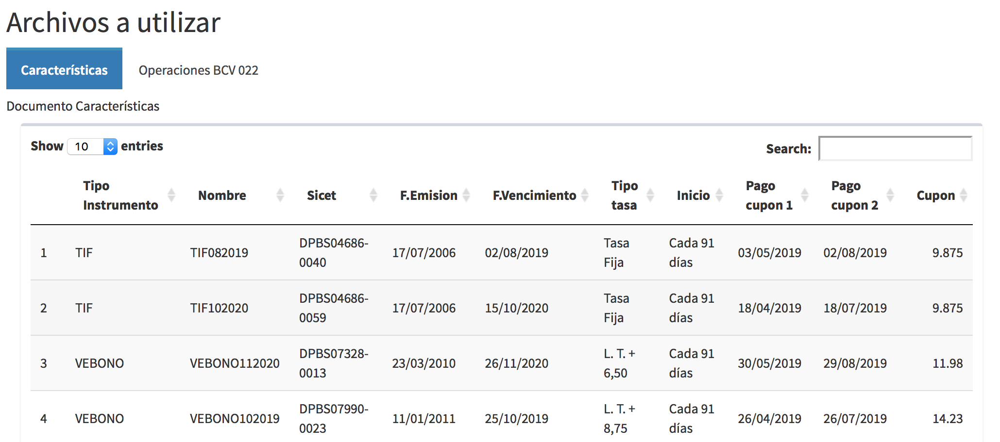
<p class="caption">(\#fig:img2)Sección Datos</p>
</div>


### Metodología Nelson y Siegel

Con el fin de proceder a realizar los cálculos mediante esta metodología el usuario deberá seguir los siguientes pasos,

1. Seleccionar una fecha para la cual se calcularán los precios estimados (Ver Figura \@ref(fig:img4)).

<div class="figure" style="text-align: center">

<p class="caption">(\#fig:img4)Sección Nelson y Siegel individual</p>
</div>

2. Selecionar los instrumentos a considerar ya sean TIF ó VEBONO (Ver Figura \@ref(fig:img5)), para este fin el usuario podrá elegir los mismos selecionando su nombre corto o ingresando un archivo plano (Ver Figura \@ref(fig:img6)). Cabe destacar que este archivo debera tener las siguientes características,
    + Debe ser un archivo plano (txt).
    + Debe contener una columna, la cual debe ser del tipo caracter donde se indicará el nombre corto del instrumento a considerar.
    + Ejemplo estructura fila: Para el TIF cuyo vencimiento es el "02/08/2019". En este caso el nombre corto de este instrumento es "TIF082019". Así para cada fila debe existir la siguiente información "TIF082019".
    + El archivo debe contener tantas filas como instrumentos desee considerar el usuario. Posteriormente se mostraran los títulos seleccionados por el usuario así como su respectivo precio promedio es caso de existir, de lo contrario el precio asignado será de 0. Se mostrará también el documento de las características de los instrumentos financieros venezolanos, con el fin de que el usuario pueda observar en detalle cada instrumento.
<div class="figure" style="text-align: center">

<p class="caption">(\#fig:img5)Selecionar instrumentos</p>
</div>
<div class="figure" style="text-align: center">

<p class="caption">(\#fig:img6)Selecionar instrumentos desde un archivo plano</p>
</div>


3. El usuario debera seleccionar un método para calcular los precios teóricos, los cuales se ubican en estas secciones (Ver Figura \@ref(fig:img7)),
    + Parámetros iniciales: en esta sección los parámetros a considerar serán tomados por defecto y los cálculos del los precios y curva de rendimientos (Ver Figura \@ref(fig:img8)) se realizarán con los mismos.
<div class="figure" style="text-align: center">

<p class="caption">(\#fig:img7)Opción parámetros iniciales</p>
</div>
<div class="figure" style="text-align: center">
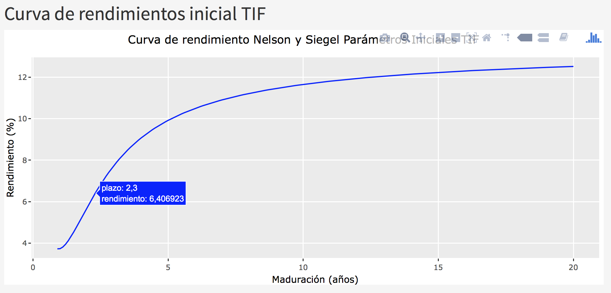
<p class="caption">(\#fig:img8)Curva de rendimientos inicial</p>
</div>
    + Elegir parámetros: en esta sección el usuario podrá elegir los parámetros de está metodología siempre y cuando los mismos cumplan con ciertas restricciones (Ver Figura \@ref(fig:img9)). El usuario deberá seleccionar un valor para las siguientes variables, 
        + $\beta_{0}$.
        + $\beta_{1}$.
        + $\beta_{2}$.
        + $\tau_{1}$.
    + Posteriormente la herramienta generará los siguientes resultados,
        + Nuevos parámetros seleccionados.
        + Verificación de que los parámetros cuamplan con las restricciones necesarias.
        + Precios teóricos de los instrumentos seleccionados.
        + Curva de rendimientos obtenida en base a los parámetros seleccionados.
<div class="figure" style="text-align: center">

<p class="caption">(\#fig:img9)Opción elegir parámetros</p>
</div>
    + Parámetros optimizados: en esta sección los parámetros a utilizar serán los obtenidos luego de realizar un proceso de optimización sobre los mismos (Ver Figura \@ref(fig:img10)). Posteriormente se mostrarán los precios teóricos y curva de rendimientos obtenida para estos parámetros (Ver Figuras \@ref(fig:img11) y \@ref(fig:img12)).

<div class="figure" style="text-align: center">

<p class="caption">(\#fig:img11)Precios optimizados</p>
</div>
<div class="figure" style="text-align: center">
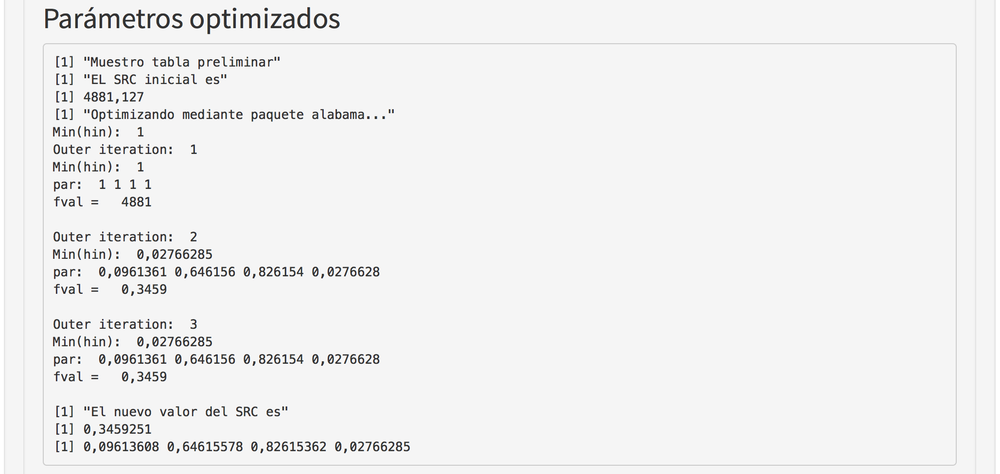
<p class="caption">(\#fig:img12)Parámetros optimizados</p>
</div>
### Metodología Svensson

Con el fin de proceder a realizar los cálculos mediante esta metodología el usuario deberá seguir los siguientes pasos,

1. Seleccionar una fecha para la cual se calcularán los precios estimados (Ver Figura \@ref(fig:img13)).
<div class="figure" style="text-align: center">

<p class="caption">(\#fig:img13)Sección Svensson individual</p>
</div>

2. Selecionar los instrumentos a considerar ya sean TIF ó VEBONO, para este fin el usuario podrá elegir los mismos selecionando su nombre corto o ingresando una archivo plano (Ver Figuras \@ref(fig:img5) y \@ref(fig:img6)). Cabe destacar que este archivo debera tener las siguientes características,
    + Debe ser un archivo plano (txt).
    + Debe contener una columna, la cual debe ser del tipo caracter donde se indicará el nombre corto del instrumento a considerar.
    + Ejemplo estructura fila: Para el TIF cuyo vencimiento es el "02/08/2019". En este caso el nombre corto de este instrumento es "TIF082019". Así para cada fila debe existir la siguiente información "TIF082019".
    + El archivo debe contener tantas filas como instrumentos desee considerar el usuario. Posteriormente se mostraran los títulos seleccionados por el usuario así como su respectivo precio promedio es caso de existir, de lo contrario el precio asignado será de 0. Se mostrará también el documento de las características de los instrumentos financieros venezolanos, con el fin de que el usuario pueda observar en detalle cada instrumento.
3. El usuario debera seleccionar un método para calcular los precios teóricos, los cuales se ubican es estas secciones,
    + Parámetros iniciales: en esta sección los parámetros a considerar serán tomados por defecto y los cálculos del los precios y curva de rendimientos se realizarán con los mismos (Ver Figuras \@ref(fig:img14) y \@ref(fig:img15)).
<div class="figure" style="text-align: center">

<p class="caption">(\#fig:img14)Parámetros iniciales</p>
</div>
<div class="figure" style="text-align: center">

<p class="caption">(\#fig:img15)Curva de rendimientos parámetros iniciales</p>
</div>
    + Elegir parámetros: en esta sección el usuario podrá elegir los parámetros de está metodología siempre y cuando los mismos cumplan con ciertas restricciones (Ver Figura \@ref(fig:img16)). El usuario deberá seleccionar un valor para las siguientes variables,
        + $\beta_{0}$.
        + $\beta_{1}$.
        + $\beta_{2}$.
        + $\beta_{3}$.
        + $\tau_{1}$.
        + $\tau_{2}$.
    + Posteriormente la herramienta generará los siguientes resultados,
        + Nuevos parámetros seleccionados.
        + Verificación de que los parámetros cuamplan con las restricciones necesarias.
        + Precios teóricos de los instrumentos seleccionados.
        + Curva de rendimientos obtenida en base a los parámetros seleccionados.
<div class="figure" style="text-align: center">
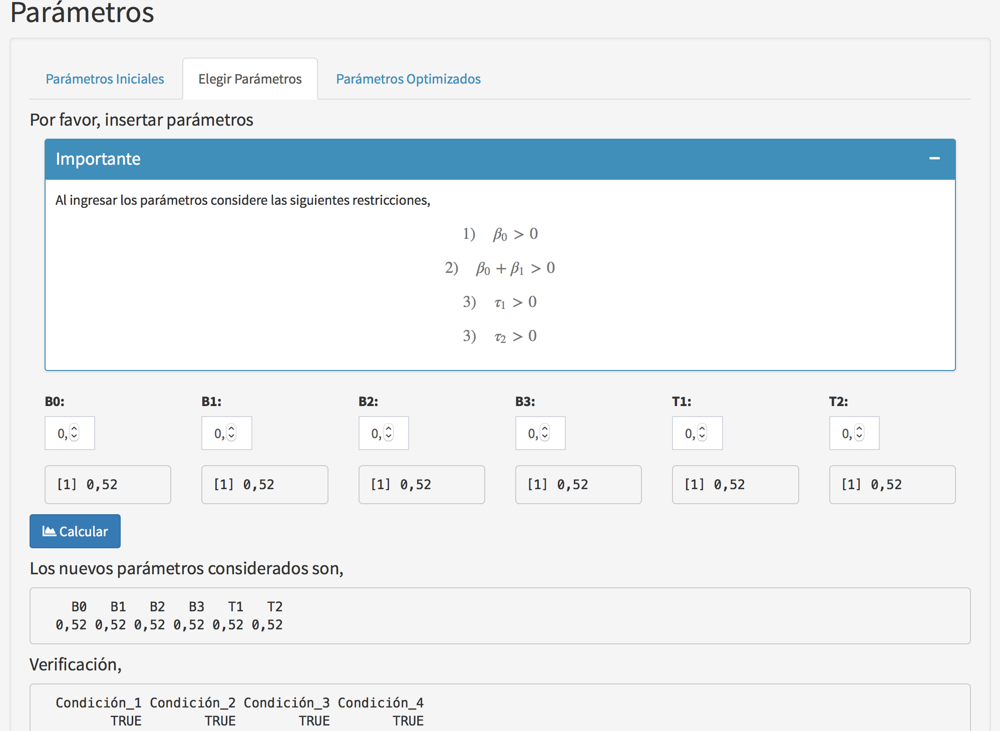
<p class="caption">(\#fig:img16)Elegir parámetros</p>
</div>
    + Parámetros optimizados: en esta sección los parámetros a utilizar serán los obtenidos luego de realizar un proceso de optimización sobre los mismos. Posteriormente se mostrarán los precios teóricos y curva de rendimientos obtenida para estos parámetros (Ver Figuras \@ref(fig:img17) y \@ref(fig:img18)).
<div class="figure" style="text-align: center">
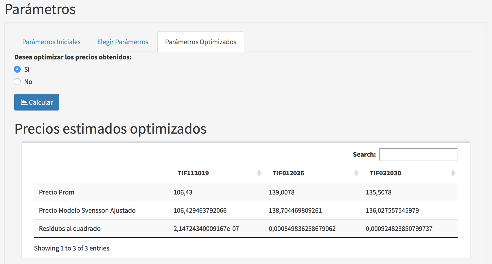
<p class="caption">(\#fig:img17)Precios optimizados</p>
</div>
<div class="figure" style="text-align: center">

<p class="caption">(\#fig:img18)Parámetros optimizados</p>
</div>


### Metodología Diebold-Li

Con el fin de proceder a realizar los cálculos mediante esta metodología el usuario deberá seguir los siguientes pasos,

1. Seleccionar una fecha para la cual se calcularán los precios estimados (Ver Figura \@ref(fig:img19)).
2. Selecionar los instrumentos a considerar ya sean TIF ó VEBONO, para este fin el usuario podrá elegir los mismos selecionando su nombre corto o ingresando una archivo plano. Cabe destacar que este archivo debera tener las siguientes características,
    + Debe ser un archivo plano (txt).
    + Debe contener una columna, la cual debe ser del tipo caracter donde se indicará el nombre corto del instrumento a considerar.
    + Ejemplo estructura fila: Para el TIF cuyo vencimiento es el "02/08/2019". En este caso el nombre corto de este instrumento es "TIF082019". Así para cada fila debe existir la siguiente información "TIF082019".
    + El archivo debe contener tantas filas como instrumentos desee considerar el usuario. Posteriormente se mostraran los títulos seleccionados por el usuario así como su respectivo precio promedio es caso de existir, de lo contrario el precio asignado será de 0. Se mostrará también el documento de las características de los instrumentos financieros venezolanos, con el fin de que el usuario pueda observar en detalle cada instrumento.
<div class="figure" style="text-align: center">

<p class="caption">(\#fig:img19)Sección Diebold-Li</p>
</div>
3. Posteriormente, el usuario en caso de no observar ninguna curva graficada deberá seleccionar una mayor cantidad de observaciones (Ver Figura \@ref(fig:img20)), esto se debe a que no se están considerando la suficiente cantidad de operaciones para graficar la curva de rendimientos a partir de la cual se obtendrán los rendimientos teóricos, los cuales son necesarios para el cálculo de los precios teóricos según esta metodología.
<div class="figure" style="text-align: center">

<p class="caption">(\#fig:img20)Poca cantidad de observaciones</p>
</div>
4. Una vez visualizada la curva ajustada mediante el spline, es necesario calibrar el parámetro de suavizamiento, el mismo controla la suavidad de la curva mostrada (Ver Figura \@ref(fig:img21)).

<div class="figure" style="text-align: center">

<p class="caption">(\#fig:img21)Curva spline</p>
</div>
5. Luego de seleccionar este valor, se mostrará el spline a utilizar en el cálculo de los precios teóricos (Ver Figura \@ref(fig:img22)). Posteriormente se mostrarán los precios estimados y la curva de rendimientos obtenida, la cual en este caso es una superficie (Ver Figura \@ref(fig:img23)). Esto debido a considerar los parámetros de Diebold-Li dinámicos con respecto al tiempo.
<div class="figure" style="text-align: center">
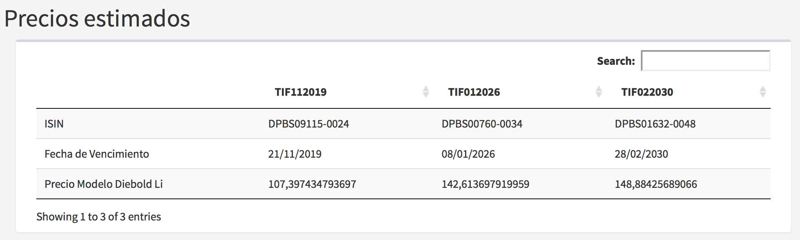
<p class="caption">(\#fig:img22)Precios estimados</p>
</div>
<div class="figure" style="text-align: center">

<p class="caption">(\#fig:img23)Curva de rendimiento Diebold-Li</p>
</div>


### Metodología Splines

Con el fin de proceder a realizar los cálculos mediante esta metodología el usuario deberá seguir los siguientes pasos,

1. Seleccionar una fecha para la cual se calcularán los precios estimados (Ver Figura \@ref(fig:img24)).
2. Selecionar los instrumentos a considerar ya sean TIF ó VEBONO, para este fin el usuario podrá elegir los mismos selecionando su nombre corto o ingresando una archivo plano. Cabe destacar que este archivo debera tener las siguientes características,
    + Debe ser un archivo plano (txt).
    + Debe contener una columna, la cual debe ser del tipo caracter donde se indicará el nombre corto del instrumento a considerar.
    + Ejemplo estructura fila: Para el TIF cuyo vencimiento es el "02/08/2019". En este caso el nombre corto de este instrumento es "TIF082019". Así para cada fila debe existir la siguiente información "TIF082019".
    + El archivo debe contener tantas filas como instrumentos desee considerar el usuario. Posteriormente se mostraran los títulos seleccionados por el usuario así como su respectivo precio promedio es caso de existir, de lo contrario el precio asignado será de 0. Se mostrará también el documento de las características de los instrumentos financieros venezolanos, con el fin de que el usuario pueda observar en detalle cada instrumento.
<div class="figure" style="text-align: center">

<p class="caption">(\#fig:img24)Sección splines</p>
</div>
3. Posteriormente, el usuario en caso de no observar ninguna curva graficada deberá seleccionar una mayor cantidad de observaciones (Ver Figura \@ref(fig:img25)), esto se debe a que no se están considerando la suficiente cantidad de operaciones para graficar la curva de rendimientos a partir de la cual se obtendrán los rendimientos teóricos, los cuales son necesarios para el cálculo de los precios teóricos según esta metodología.
<div class="figure" style="text-align: center">

<p class="caption">(\#fig:img25)Pocas observaciones</p>
</div>
4.  Una vez visualizada la curva ajustada mediante el spline, es necesario calibrar el parámetro de suavizamiento, el mismo controla la suavidad de la curva mostrada (Ver Figura \@ref(fig:img26)).
<div class="figure" style="text-align: center">

<p class="caption">(\#fig:img26)Parámetro de suavizamiento</p>
</div>
5. A continuación se mostraran los títulos candidatos a partir de los cuales la curva de rendimientos será trazada (Ver Figura \@ref(fig:img27)). Posteriormente se mostrarán los precios estimados y la curva de rendimientos obtenida (Ver Figuras \@ref(fig:img28) y \@ref(fig:img29)). 
<div class="figure" style="text-align: center">

<p class="caption">(\#fig:img27)Títulos candidatos</p>
</div>
<div class="figure" style="text-align: center">

<p class="caption">(\#fig:img28)Precios spline</p>
</div>
<div class="figure" style="text-align: center">

<p class="caption">(\#fig:img29)Curva de rendimientos spline</p>
</div>
6. Luego en caso de que el usuario desee eliminar alguna observación en específico, la misma debe ser elegida a partir de la lista desplegable que se muestra (Ver Figura \@ref(fig:img30)). Al seleccionar una observación, se mostrará la nueva data con la que se trabajará (títulos candidatos, ver figura \@ref(fig:img31)) así como los nuevos precios teóricos calculados y nueva curva de rendimientos obtenida (Ver Figura \@ref(fig:img32)).
<div class="figure" style="text-align: center">

<p class="caption">(\#fig:img30)Opción eliminar observaciones</p>
</div>
<div class="figure" style="text-align: center">

<p class="caption">(\#fig:img31)Nuevos títulos candidatos</p>
</div>
<div class="figure" style="text-align: center">

<p class="caption">(\#fig:img32)Nuevos precios y curva de rendimientos</p>
</div>

<!-- ###Estimación de parámetros y curva de rendimiento -->

<!-- Una vez construida la base de datos, se procederá a utilizar los splines de suavizado para obtener los parámetros necesarios para la curva de rendimientos. Recordemos que esta curva relaciona el plazo del instrumento con su rendimiento. -->


<!-- Es importante señalar que se estimará una curva por cada tipo de instrumento, así se obtendrá un curva para los TIF y una curva para los VEBONO. Por tal razón a partir de la base de datos, se separará los TIF de los VEBONOS, y se considerarán sólo las columnas Plazo y Rendimiento para estimar dicha curva. Según sea el caso, sólo considerarán aquellas observaciones que tengan decisión 1. -->


<!-- Aunado a cada tipo de instrumento (TIF ó VEBONO), se considerará un instrumento de otro tipo este es la letra del tesoro, este tipo de instrumento representará el punto inicial la curva, cabe destacar que la letra a considerar debe ser aquella cuya fecha de operación sea la más reciente con respecto a la fecha de valoración (día en que se quiere conocer los rendimientos estimados). -->

<!-- A partir de la curva de rendimientos obtenida (Ver Figura (\@ref(fig:crend)) es posible calcular un rendimiento estimado para algún tipo de instrumento a partir de su plazo, que no es más que la cantidad de días que faltan por transcurrir hasta su vencimiento. Este valor es de suma importancia ya que a partir del mismo es posible calcular el precio estimado asociado a cada instrumento en un día específico. Con lo cual es posible saber a partir de la historia (base de datos), el precio estimado de algún instrumento que le interese a cierta institución y por ende saber si ese título es rentable o no, es decir, si vale la pena invertir en el mismo o no. -->


<!-- ```{r , echo=FALSE, fig.align='center',fig.cap="Curva de Rendimiento",label=crend} -->
<!-- 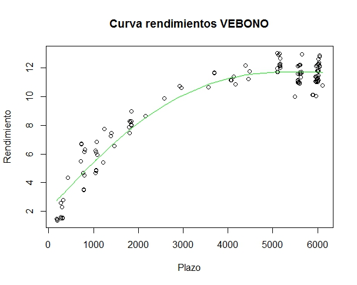 -->
<!-- ``` -->


<!-- Como se dijo anteriormente, los resultados de los precios obtenidos mediante el uso de la metodología de splines de suavizado serán comparados con los precios obtenidos a través de la metodología de Svensson. En dicha metodología existe un proceso de optimización el cual permite encontrar los parámetros idóneos, de tal manera que la diferencia entre los precios promedio de cada instrumento y su precio teórico sea lo más pequeña posible. El proceso de esta optimización se muestra a continuación. -->


### Curva de rendimientos comparativo

En esta sección permite obtener un comparativo de los precios teóricos obtenidos mediante las diferentes metodologías disponibles, las cuales son Nelson y Siegel, Svensson, Diebold-Li y Splines cúbicos de suavizado (Ver Figura \@ref(fig:img33)).

<div class="figure" style="text-align: center">

<p class="caption">(\#fig:img33)Sección comparativo</p>
</div>

### Metodologías

Con el fin de proceder a realizar los cálculos en esta sección el usuario deberá seguir los siguientes pasos,

1. Seleccionar una fecha para la cual se calcularán los precios estimados (Ver Figura \@ref(fig:img34)).
2. Selecionar los instrumentos a considerar ya sean TIF ó VEBONO, para este fin el usuario podrá elegir los mismos selecionando su nombre corto o ingresando una archivo plano. Cabe destacar que este archivo debera tener las siguientes características,
    + Debe ser un archivo plano (txt).
    + Debe contener una columna, la cual debe ser del tipo caracter donde se indicará el nombre corto del instrumento a considerar.
    + Ejemplo estructura fila: Para el TIF cuyo vencimiento es el "02/08/2019". En este caso el nombre corto de este instrumento es "TIF082019". Así para cada fila debe existir la siguiente información "TIF082019".
    + El archivo debe contener tantas filas como instrumentos desee considerar el usuario. Posteriormente se mostraran los títulos seleccionados por el usuario así como su respectivo precio promedio es caso de existir, de lo contrario el precio asignado será de 0. Se mostrará también el documento de las características de los instrumentos financieros venezolanos, con el fin de que el usuario pueda observar en detalle cada instrumento.
<div class="figure" style="text-align: center">

<p class="caption">(\#fig:img34)Selección de instrumentos</p>
</div>
3. Luego de esto, se deberá rellenar la información correspondiente a cada metodología como ya se explico en la sección anterior, esto con el fin de obtener todos los parámetros necesarios para calcular los precios teóricos según cada metodología (Ver Figuras \@ref(fig:img35), \@ref(fig:img36), \@ref(fig:img37), \@ref(fig:img38) y \@ref(fig:img39)). 

<div class="figure" style="text-align: center">

<p class="caption">(\#fig:img35)Metodologías</p>
</div>
<div class="figure" style="text-align: center">

<p class="caption">(\#fig:img36)Metodología Nelson y Siegel</p>
</div>
<div class="figure" style="text-align: center">

<p class="caption">(\#fig:img37)Metodología Svensson</p>
</div>
<div class="figure" style="text-align: center">

<p class="caption">(\#fig:img38)Metodología Diebold-Li</p>
</div>
<div class="figure" style="text-align: center">

<p class="caption">(\#fig:img39)Metodología splines</p>
</div>
### Precios Estimados

Una vez completados todos los parámetros necesarios, los precios obtenidos se presentan en esta sección (Ver Figura \@ref(fig:img40)).

<div class="figure" style="text-align: center">

<p class="caption">(\#fig:img40)Comparativo de precios</p>
</div>

### Curvas

En esta sección se presenta un grafico comparativo donde se grafican las curvas obtenidas mediante las diferentes metodologías. El usuario podrá descargar un reporte en PDF, con los resultados de los precios teóricos obtenidos en cada metodología (Ver Figura \@ref(fig:img41)).

<div class="figure" style="text-align: center">

<p class="caption">(\#fig:img41)Comparativo de curvas</p>
</div>

## Valor en Riesgo

En esta sección el usuario podrá calcular el Valor en Riesgo de los instrumentos financieros que considere, el mismo será calculado mediante tres maneras diferentes las cuales se basan en tres distintas metodologías (Ver Figura \@ref(fig:img42)). El primer VaR a calcular es el VaR paramétrico el cuál se basa en asumir una distribucuión normal de los instrumentos sconsiderados. El segundo VaR es el calculado por simulación histórica. El tercer y último VaR es el calculado mediante la simulación de MonteCarlo, este VaR se subdividirá en dos casos, el primero es asumiendo una distribución Normal para todos los instrumentos, mientras que el segundo es elegiendo una distribución en específico.

<div class="figure" style="text-align: center">

<p class="caption">(\#fig:img42)Sección valor en riesgo</p>
</div>

### Datos

En esta sección el usuario debe ingresar el histórico de precios, así como la posición de cada uno de los instrumentos a considerar (Ver Figura \@ref(fig:img43)), dichos documentos deben poseer las siguientes características,

Para el archivo de precios:

 + El formato del archivo debe ser txt. 
 + El archivo debe contener al menos 252 observaciones por cada instrumento. El archivo debe contener tantas columnas como instrumentos se consideren.
 + La primera columna del archivo deberá contener las fechas de las observaciones (precios), dichas observaciones deben estar ordenadas en forma decreciente. El formato de la fecha debe ser: Año-Mes_Día (ej: 2019-06-07).
 + El resto de las columnas deben representar información para cada instrumento, es decir, cada columna debe contener las observaciones de cada título. Estas columnas deben contener información sobre los precios de cada día de cada instrumento y su contenido debe ser numérico .
 
<div class="figure" style="text-align: center">

<p class="caption">(\#fig:img43)Data precios</p>
</div>

Para el archivo de posiciones:

 + El formato del archivo debe ser txt. 
 + El archivo debe tener dos columnas, la primera debe contener el nombre corto del instrumentos. Por su parte la segunda columna deberá contener la posición del instrumento. En caso de existir decimales usar "." como separación (Ver Figura \@ref(fig:img44)).
 
<div class="figure" style="text-align: center">

<p class="caption">(\#fig:img44)Data posiciones</p>
</div>


Es importante que la información sobre los instrumentos considerada en el archivo de precios y el archivo de posiciones sea la misma, es decir, los títulos que aparecen en el archivo de precios deben ser los mismos que aparecen en el archivo de posiciones. Una ventana ubicada en esta sección (Aviso) realizará esta validación, en caso de existir una discrepancia no se realizará ningún cálculo (Ver Figura \@ref(fig:img45)).
 
<div class="figure" style="text-align: center">

<p class="caption">(\#fig:img45)Aviso data</p>
</div>

### Distribución

En está sección el usuario debe seleccionar las distribuciones asociadas a los rendimientos cada instrumento, con el fin de proceder y realizaf los cáculos del VaR de simulación de MonteCarlo. Para esto existen dos opciones:

1. Elegir Distribución: En esta subsección al inicio se muestra una advertencia referente a si existe problemas con los precios ingresados, usualmente estos problemas surgen cuando existen dos precios iguales y ellos están seguidos. En caso de existir este problema, el instrumento ó instrumentos involucrados serán excluidos del estudio (Ver Figura \@ref(fig:img46)). Posteriormente el usuario debe:
 +  Seleccionar el instrumento, para el cual se realizará la prueba de bondad de ajuste. Una vez seleccionado el instrumento se desplegará una ventana que mostrará las distribuciones que más se asemejan a los rendimientos de los precios del instrumento en estudio.
<div class="figure" style="text-align: center">
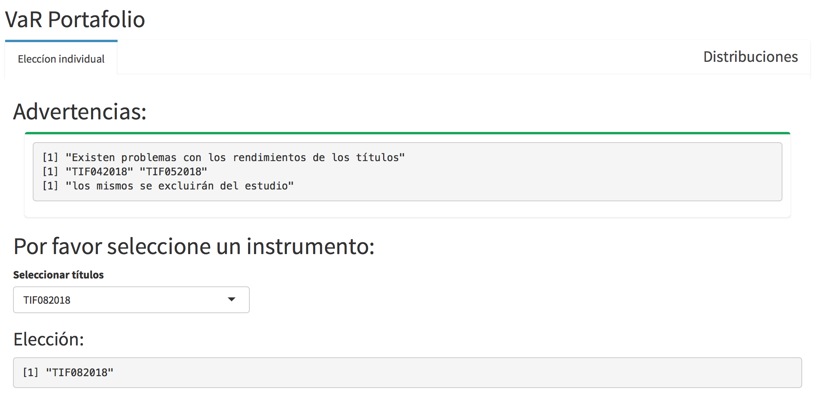
<p class="caption">(\#fig:img46)Elección instrumento</p>
</div>
 + Una vez generado las posibles opciones el usuario debe seleccionar una distribución, luego de esto se mostrarán los parámetros obtenidos a partir de dicho ajuste (Ver Figura \@ref(fig:img47)).
<div class="figure" style="text-align: center">

<p class="caption">(\#fig:img47)Ajuste de distribución</p>
</div>
 + Se debe seleccionar "Si", en el recuadro que pregunta si desea guardar su distribución. Luego de esto la distribución de cada instrumento se guardará para su posterior uso. Esta serie de pasos debe repetirse por cada instrumento considerado (Ver Figura \@ref(fig:img48)).

<div class="figure" style="text-align: center">

<p class="caption">(\#fig:img48)Distribuciones</p>
</div>

2. Seleccionar un archivo que contenga las distribuciones: En caso de elegir esta opción el usuario debe cargar un archivo con las siguientes características:
 + Debe ser un archivo de texto txt.
 + El archivo constará de dos filas, la primera fila debe contener el nombre corto del instrumento a considerar. La segunda fila debe contener el nombre de la distribución que mejor se ajuste, la misma debe ser alguna de las siguientes y debe ser expresada como sigue:
     + Normal = Distribución Normal.  
     + Logistic = Distribución Logística.
     + Exponential = Distribución Exponencial.
     + Cauchy = Distribución Cauchy.
     + Gamma = Distribución Gamma.
     + Lognormal = Distribución Lognormal.
     + Weibull = Distribución Weibull.
     + Student = Distribución t-student.

### VaR

En esta sección se realizan todos los cálculos referentes al VaR, el mismo se calculará por tres metodologías, la primera es la metodología del VaR paramétrico, la segunda es la metodología del VaR por simulación histórica y la tercera es la metodología de VaR por simulación de MonteCarlo. En esta sección se muestran tres pestañas en donde se cálculan las metodologías explicadas anteriormente.

<div class="figure" style="text-align: center">

<p class="caption">(\#fig:img49)Pestañas sección VaR</p>
</div>

 * Pestaña Paramétrico: en esta pestaña se muestra la siguiente información,
    * Rendimientos de cada instrumento, en caso de existir algún problema con un instrumento se mostrará un mensaje de advertencia (Ver Figura \@ref(fig:img50)).
<div class="figure" style="text-align: center">

<p class="caption">(\#fig:img50)Rendimientos</p>
</div>
    * Parámetros seleccionados para cada instrumento suponiendo una distribución Normal (Ver Figura \@ref(fig:img51)).
<div class="figure" style="text-align: center">

<p class="caption">(\#fig:img51)Advertencias y parámetros</p>
</div>
    * Lista de selección, donde el usuario debe elegir el nivel de confianza del VaR, ya sea 90, 95 ó 99% (Ver Figura \@ref(fig:img52)).
<div class="figure" style="text-align: center">

<p class="caption">(\#fig:img52)Nivel de confianza</p>
</div>
    * Luego se seleccionar este valor, se mostrará una tabla con los vares individuales, desviación estándar y el porcentaje que representa cada VaR individual sobre el portafolio.
    * Finalmente se muestra el valor del VaR de portafolio (Ver Figura \@ref(fig:img53)).
<div class="figure" style="text-align: center">

<p class="caption">(\#fig:img53)VaRes</p>
</div>
 * Pestaña Histórico: en esta pestaña se muestra la siguiente información,
    * Una advertencia en caso de existir algún problema con algún instrumento.
    * Pesos de cada instrumento, calculado a partir de su proporción de valor nominal con respecto al total de instrumentos (Ver Figura \@ref(fig:img54)).
<div class="figure" style="text-align: center">

<p class="caption">(\#fig:img54)Pesos</p>
</div>
    * Valor nominal del portafolio.
    * Suma de pesos (Ver Figura \@ref(fig:img55)).
<div class="figure" style="text-align: center">

<p class="caption">(\#fig:img55)Valor nominal y suma de pesos</p>
</div>
    * Escenarios, se refiere a las variaciones que ha sufrido el valor de portafolio de manera diaria esto debido a la variación de los precios de los instrumentos (Ver Figura \@ref(fig:img56)).
<div class="figure" style="text-align: center">

<p class="caption">(\#fig:img56)Escenarios</p>
</div>
    * Lista de selección, donde el usuario debe elegir el nivel de confianza del VaR, ya sea 90, 95 ó 99%.
    * Ubicación de la observación a ser considerada para el cálculo del VaR por simulación Histórica (Ver Figura \@ref(fig:img57)).
<div class="figure" style="text-align: center">

<p class="caption">(\#fig:img57)Nivel de confianza y ubicación</p>
</div>
    * Resultados de los vares individuales, donde se mostrará el valor nominal y el VaR para cada instrumento.
    * VaR del portafolio (Ver Figura \@ref(fig:img58)).
<div class="figure" style="text-align: center">
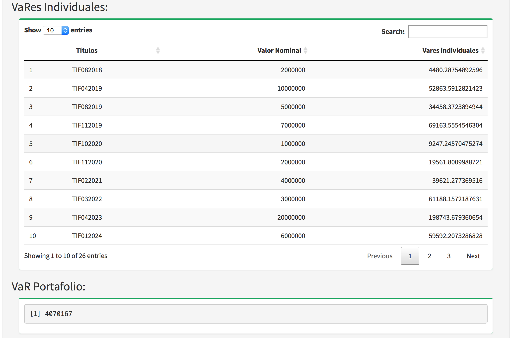
<p class="caption">(\#fig:img58)VaRes</p>
</div>
 * Pestaña Simulación MonteCarlo: esta pestaña se subdivide en dos secciones (Ver Figura \@ref(fig:img59)),
<div class="figure" style="text-align: center">

<p class="caption">(\#fig:img59)Pestañas simulación MonteCarlo</p>
</div>
    * VaR Simulación MonteCarlo asumiendo normalidad: en esta sección se muestra la siguiente información,
        * Rendimientos de cada instrumento, en caso de existir algún problema con un instrumento se mostrará un mensaje de advertencia (Ver Figura \@ref(fig:img60)).
<div class="figure" style="text-align: center">

<p class="caption">(\#fig:img60)Rendimientos</p>
</div>
        * Parámetros seleccionados para cada instrumento suponiendo una distribución Normal.
        * Lista de selección, donde el usuario debe elegir el nivel de confianza del VaR, ya sea 90, 95 ó 99% (Ver Figura \@ref(fig:img61)).
<div class="figure" style="text-align: center">

<p class="caption">(\#fig:img61)Parámetros y nivel de confianza</p>
</div>
        * Lista de selección, donde el usuario debe elegir la cantidad de simulaciones que desea realizar (Ver Figura \@ref(fig:img62)).
<div class="figure" style="text-align: center">

<p class="caption">(\#fig:img62)Cantidad de simulaciones</p>
</div>
        * Resultados de los vares individuales obtenidos mediante esta metodología. Donde se muestra el nombre del instrumento, el valor nominal, el var individual y el porcentaje de cada VaR con respecto al portafolio.
        * Resultado del VaR de portafolio (Ver Figura \@ref(fig:img63)).
<div class="figure" style="text-align: center">

<p class="caption">(\#fig:img63)VaRes</p>
</div>
    * VaR Simulación MonteCarlo considerando mejor distribución: en esta sección se muestra la siguiente información,
        * Rendimientos de cada instrumento, en caso de existir algún problema con un instrumento se mostrará un mensaje de advertencia (Ver Figura \@ref(fig:img64)).
<div class="figure" style="text-align: center">
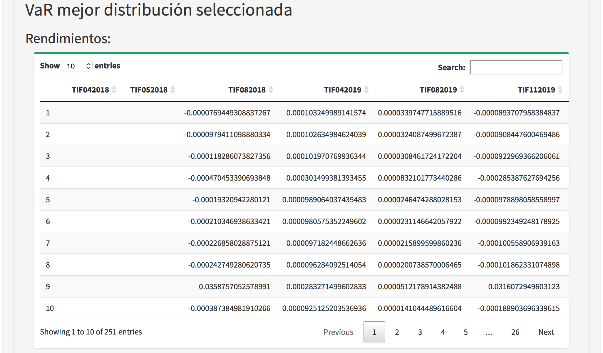
<p class="caption">(\#fig:img64)Rendimientos</p>
</div>
        * Distribuciones seleccionadas para cada instrumento, ya sea seleccionadas mediante la aplicación o mediante un archivo ingresado por el usuario.
        * Lista de selección, donde el usuario debe elegir el nivel de confianza del VaR, ya sea 90, 95 ó 99% (Ver Figura \@ref(fig:img65)).
<div class="figure" style="text-align: center">

<p class="caption">(\#fig:img65)Distribuciones y nivel de confianza</p>
</div>
        * Lista de selección, donde el usuario debe elegir la cantidad de simulaciones que desea realizar (Ver Figura \@ref(fig:img66)).
<div class="figure" style="text-align: center">

<p class="caption">(\#fig:img66)Cantidad de simulaciones</p>
</div>
        * Resultados del VaR individual.
        * Resultado del VaR de portafolio (Ver Figura \@ref(fig:img67)).
<div class="figure" style="text-align: center">

<p class="caption">(\#fig:img67)VaRes</p>
</div>
 
### Gráficos

En esta sección se subdivide en (Ver Figura \@ref(fig:img68)), 

<div class="figure" style="text-align: center">

<p class="caption">(\#fig:img68)Pestañas sección Gráficos</p>
</div>

 * Pestaña Valor nominal: en esta subsección se muestra un gráfico de torta donde se muestra el valor nominal de cada instrumento (Ver Figura \@ref(fig:img69)).
 
<div class="figure" style="text-align: center">

<p class="caption">(\#fig:img69)Gráfico valor nominal</p>
</div>
 
 * VaRes: esta subsección presenta los resultados de los VaRes obtenidos mediante las diferentes metodologías, la misma se divide en (Ver Figura \@ref(fig:img70)),
<div class="figure" style="text-align: center">

<p class="caption">(\#fig:img70)Pestañs VaRes</p>
</div>
    * VaR Paramétrico: en esta subsección se muestran los gráficos correspondientes a esta metodología. La misma se subdivide en (Ver Figura \@ref(fig:img71)),
<div class="figure" style="text-align: center">

<p class="caption">(\#fig:img71)Pestañas VaR paramétrico</p>
</div>
        + VaRes individuales: se muestra un gráfico de torta donde se muestra información sobre los VaRes individuales obtenidos (Ver Figura \@ref(fig:img72)).
<div class="figure" style="text-align: center">
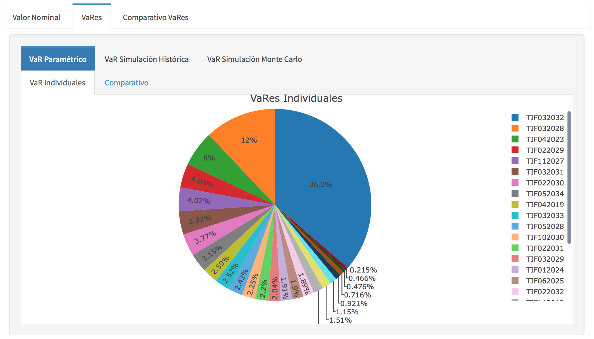
<p class="caption">(\#fig:img72)VaRes individuales</p>
</div>
        + Comparativo: se muestra un gráfico comparativo donde se compara el VaR de portafolio y la suma de los VaRes individuales (Ver Figura \@ref(fig:img73)).
<div class="figure" style="text-align: center">
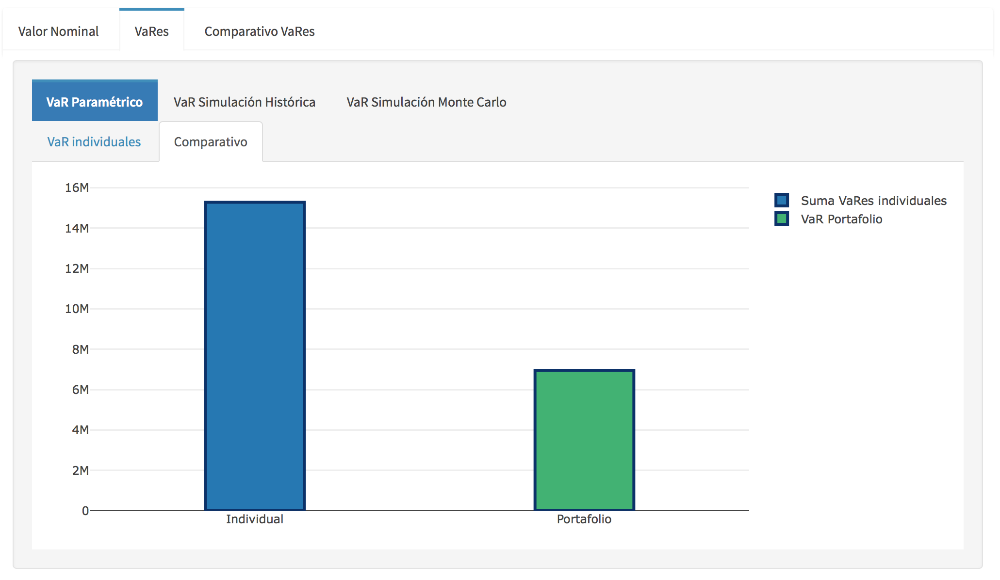
<p class="caption">(\#fig:img73)Comparativo</p>
</div>
    * VaR Simulación Histórica: esta subsección muestra los siguientes gráficos (Ver Figura \@ref(fig:img74)),
<div class="figure" style="text-align: center">

<p class="caption">(\#fig:img74)Pestañas VaR simulación por histórica</p>
</div>
        + Escenarios: muestra un histograma mediante el cual se muestran los diferentes escenarios obtenidos (Ver Figura \@ref(fig:img75)).
<div class="figure" style="text-align: center">

<p class="caption">(\#fig:img75)Histograma escenarios</p>
</div>
        + VaRes individuales: muestra un gráfico de torta donde se muestra información sobre los Vares individuales obtenidos (Ver Figura \@ref(fig:img76)).
<div class="figure" style="text-align: center">

<p class="caption">(\#fig:img76)VaRes individuales</p>
</div>
        + Comparativo: se muestra un gráfico comparativo donde se compara el VaR de portafolio y la suma de los VaRes individuales (Ver Figura \@ref(fig:img77)).
<div class="figure" style="text-align: center">
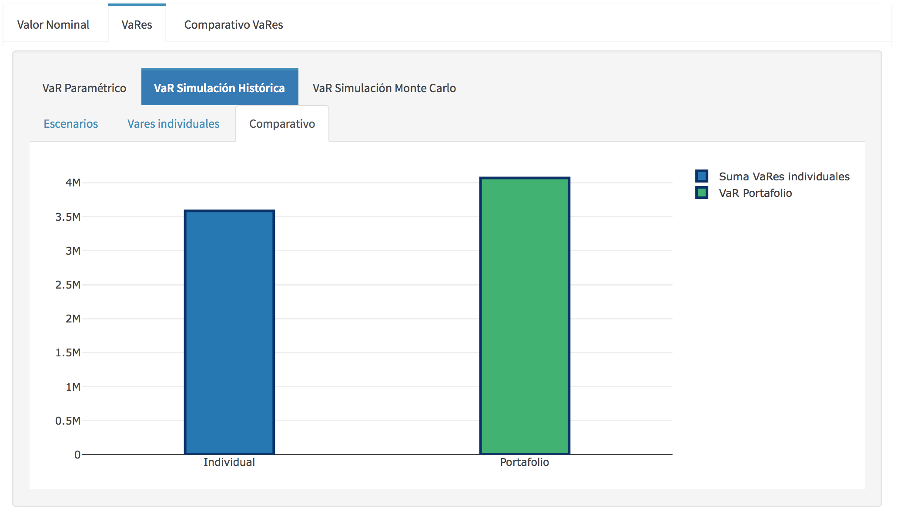
<p class="caption">(\#fig:img77)Comparativo</p>
</div>
    * VaR Simulación MonteCarlo: esta subsección se divide en dos (Ver Figura \@ref(fig:img78)),
<div class="figure" style="text-align: center">

<p class="caption">(\#fig:img78)Pestañas VaR simulación MonteCarlo</p>
</div>
        + Distribución Normal: se muestra los resultados, asumiendo una distribución normal (Ver Figura \@ref(fig:img79)),
<div class="figure" style="text-align: center">

<p class="caption">(\#fig:img79)Pestañas VaR simulación MonteCarlo normal</p>
</div>
            * Escenarios: muestra un histograma mediante el cual se muestran los diferentes escenarios obtenidos (Ver Figura \@ref(fig:img80)).
<div class="figure" style="text-align: center">
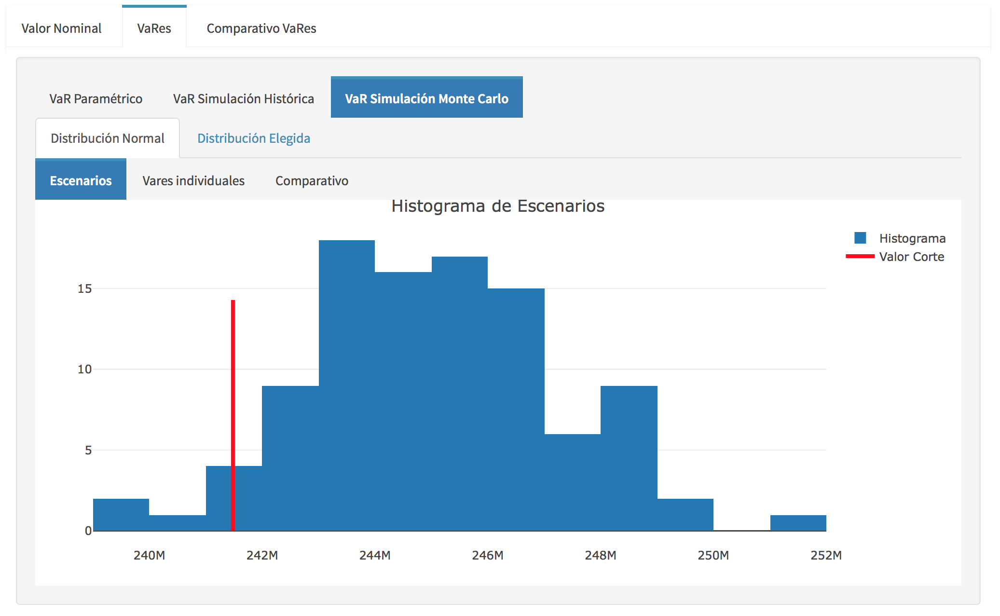
<p class="caption">(\#fig:img80)Histograma escenarios</p>
</div>
            * VaRes individuales: muestra un gráfico de torta donde se muestra información sobre los Vares individuales obtenidos (Ver Figura \@ref(fig:img81)).
<div class="figure" style="text-align: center">

<p class="caption">(\#fig:img81)VaRes individuales</p>
</div>
            * Comparativo: se muestra un gráfico comparativo donde se compara el VaR de portafolio y la suma de los VaRes individuales (Ver Figura \@ref(fig:img82)).
<div class="figure" style="text-align: center">

<p class="caption">(\#fig:img82)Comparativo</p>
</div>
        + Distribución Elegida: se muestran los resultados, asumiendo la mejor distribución (Ver Figura \@ref(fig:img83)),
<div class="figure" style="text-align: center">

<p class="caption">(\#fig:img83)Pestañas VaR simulación MonteCarlo mejor distribución</p>
</div>
            * Escenarios: muestra un histograma mediante el cual se muestran los diferentes escenarios obtenidos (Ver Figura \@ref(fig:img84)).
<div class="figure" style="text-align: center">
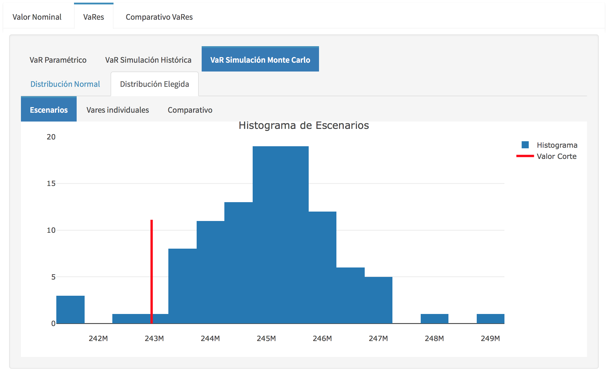
<p class="caption">(\#fig:img84)Histograma escenarios</p>
</div>
            * VaRes individuales: muestra un gráfico de torta donde se muestra información sobre los Vares individuales obtenidos (Ver Figura \@ref(fig:img85)).
<div class="figure" style="text-align: center">

<p class="caption">(\#fig:img85)VaRes individuales</p>
</div>
            * Comparativo: se muestra un gráfico comparativo donde se compara el VaR de portafolio y la suma de los VaRes individuales (Ver Figura \@ref(fig:img86)).
<div class="figure" style="text-align: center">

<p class="caption">(\#fig:img86)Comparativo</p>
</div>
 * Comparativo Vares: en esta subsección se muestra un gráfico comparativo del VaR de portafolio obtenido para cada metodología (Ver Figura \@ref(fig:img87)).
<div class="figure" style="text-align: center">

<p class="caption">(\#fig:img87)Comparativo VaRes</p>
</div>

### Históricos

Esta sección permite calcular el VaR para un rango de fechas en específico, siempre y cuando las mismas se encuentren disponibles en la data histórica considerada. La misma cuenta con las siguientes secciones (Ver Figura \@ref(fig:img88)), 

<div class="figure" style="text-align: center">

<p class="caption">(\#fig:img88)Pestañas sección Históricos</p>
</div>

  * VaR Paramétrico: esta subsección permite calcular el histórico de los VaRes mediante el uso de la metodología del VaR paramétrico, la cual se basa en asumir una distribución normal para cada instrumento. Dentro de esta subsección se encuentra (Ver Figura \@ref(fig:img89)),
    * Rango de fechas disponibles, el cual es obtenido a partir de la data cargada en la sección Datos.
    * Opción para seleccionar el rango de fechas deseado, es importante acotar que la fecha inicial debe ser siempre menor que la fecha final, y las mismas no se pueden salir del rango establecido en el punto anterior.
    * Elección realizada por el usuario.
    * Histórico generado por la metodología del Var paramétrico, consta de dos columnas la primera indica la fecha, mientras que la segunda indica el valor del VaR para ese día en específico.
<div class="figure" style="text-align: center">

<p class="caption">(\#fig:img89)Sección Históricos</p>
</div>
  * VaR Histórico: esta subsección permite calcular el histórico de los Vares mediante el uso de la metodología del VaR por simulación histórica, la cual se caracteriza por no asignar ninguna distribución conocida, sino que trabaja con la distribución empírica de los datos. Dentro de esta subsección se encuentra:
    * Rango de fechas disponibles, el cual es obtenido a partir de la data cargada en la sección Datos.
    * Opción para seleccionar el rango de fechas deseado, es importante acotar que la fecha inicial debe ser siempre menor que la fecha final, y las mismas no se pueden salir del rango establecido en el punto anterior.
    * Elección realizada por el usuario.
    * Histórico generado por la metodología del Var por simulación histórica, consta de dos columnas la primera indica la fecha, mientras que la segunda indica el valor del VaR para ese día en específico.
  
  * VaR SMC Normal: esta subsección permite calcular el histórico de los Vares mediante el uso de la metodología del VaR por simulación de MonteCarlo asumiendo una distribicón normal para cada instrumento, esta metodología se caracteriza por el empleo de simulaciones y el cálculo de diferentes escenarios con el fin de calcular el valor del VaR. Dentro de esta subsección se encuentra:
    * Rango de fechas disponibles, el cual es obtenido a partir de la data cargada en la sección Datos.
    * Opción para seleccionar el rango de fechas deseado, es importante acotar que la fecha inicial debe ser siempre menor que la fecha final, y las mismas no se pueden salir del rango establecido en el punto anterior.
    * Elección realizada por el usuario.
    * Histórico generado por la metodología del Var por simulación de MonteCarlo asumiendo una distribución normal, consta de dos columnas la primera indica la fecha, mientras que la segunda indica el valor del VaR para ese día en específico.
  
  * VaR SMC Mejor Distribución: esta subsección permite calcular el histórico de los Vares mediante el uso de la metodología del VaR por simulación de MonteCarlo considerando la mejor distribución para cada instrumento, las distribuciones consideradas serán las elegidas por el usuario en la sección Distribución. Dentro de esta subsección se encuentra:
    * Rango de fechas disponibles, el cual es obtenido a partir de la data cargada en la sección Datos.
    * Opción para seleccionar el rango de fechas deseado, es importante acotar que la fecha inicial debe ser siempre menor que la fecha final, y las mismas no se pueden salir del rango establecido en el punto anterior.
    * Elección realizada por el usuario.
    * Histórico generado por la metodología del Var por simulación de MonteCarlo considerando la mejor distribución, consta de dos columnas la primera indica la fecha, mientras que la segunda indica el valor del VaR para ese día en específico.
  

## Backtesting

Esta sección permite realizar diversas pruebas al Valor en Riesgo y así poder calibrar y analizar su comportamiento, entre estas pruebas se encuentran el test de Kupiec y  el test de Haas (Ver Figura \@ref(fig:img90)).

<div class="figure" style="text-align: center">

<p class="caption">(\#fig:img90)Pestañas sección Backtesting</p>
</div>

### Datos

En esta subsección el usuario debe ingresar los datos con los cuales se va a trabajar (Ver Figura \@ref(fig:img91)). Este archivo debe contar con las siguientes características:

  * Debe ser un archivo de texto txt.
  * Debe contar con tres columnas, la primera debe proporcionar información sobre la fecha (ej: 27/03/2018), la segunda columna debe contener información sobre el VaR para ese día. Finalmente, la tercera columna debe indicar información sobre el valor nominal del portafolio para el día considerado. Es importante mencionar que el archivo debe contener 252 observaciones (Ver Figura \@ref(fig:img92)).

<div class="figure" style="text-align: center">

<p class="caption">(\#fig:img91)Datos</p>
</div>
<div class="figure" style="text-align: center">

<p class="caption">(\#fig:img92)Data de prueba</p>
</div>

### Resultados

En esta subsección se muestran los resultados obtenidos para las diferentes pruebas. El usuario debe seleccionar el nivel de confianza para realizar la prueba. Una vez seleccionado este valor, los resultados se muestran con la siguiente estructura (Ver Figura \@ref(fig:img93)),

* Número de excepciones negativas, número de excepciones dentro del rango VaR y número total de excepciones.
* Tiempo entre excepciones.
* Resultados de los estadísticos para las pruebas de Kupiec, Haas y prueba mixta.
* Valor crítico asociado a cada prueba.
* Resultado de cada prueba, obtenido al realizar una comparación entre el valor crítico y el valor del estadístico de cada prueba.


<div class="figure" style="text-align: center">

<p class="caption">(\#fig:img93)Resultados</p>
</div>
## Valoración

Esta sección permite realizar los cáculos de valoración de un portafolio, a partir de sus precios y valor nominal para un día determinado en términos de utilidad y pérdida. De igual manera, esta sección permite realizar una prueba de estrés y saber como se comportará la utilidad o périda del portafolio en caso de una posible caida de los precios (Ver Figura \@ref(fig:img94)).

<div class="figure" style="text-align: center">

<p class="caption">(\#fig:img94)Pestañas sección Valoración</p>
</div>


### Datos

En esta subsección el usuario debe ingresar la data (Ver Figura \@ref(fig:img95)) con la cual se va a trabajar, la misma debe tener la siguiente estructura (Ver Figura \@ref(fig:img96)),

* Deber ser un archivo plano txt.
* Debe contener cinco columnas, cada una se explica a continuación,
    * La primera columna, debe indicar el nombre corto del instrumento en consideración.
    * La segunda columna, debe indicar el tipo de instrumento que se está considerando.
    * La tercera columna, debe indicar el valor nominal asociado a cada instrumento.
    * La cuarta columna debe indicar el precio al día de hoy de cada instrumento.
    * La quinta columna debe indicar el precio de mercado (precio obtenido por alguna metodología de estimación de precios teóricos).
  
* El archivo debe contener tantas filas como instrumentos se desee considerar.

<div class="figure" style="text-align: center">

<p class="caption">(\#fig:img95)Datos</p>
</div>
<div class="figure" style="text-align: center">
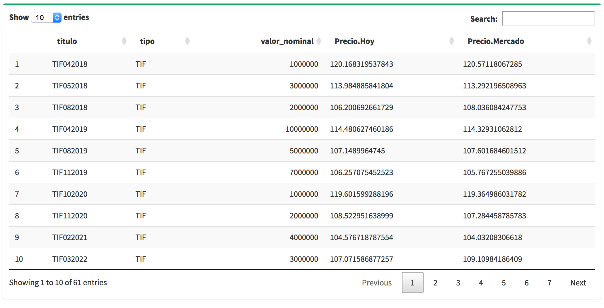
<p class="caption">(\#fig:img96)Datos de prueba</p>
</div>
### Resultados

En esta subsección se muestra los resultados de la valoración, la información está distribuida en dos tablas,

* La primera tabla muestra información acerca del monto invertido en cada instrumento y su valor actual, considerando el precio teórico elegido. También se muestra la ganancia ó perdida que se tiene actualmente con un instrumento. En esta tabla se presenta la información para cada instrumento por separado (Ver Figura \@ref(fig:img97)).
<div class="figure" style="text-align: center">

<p class="caption">(\#fig:img97)Resultados individuales</p>
</div>
* La segunda tabla, muestra un resumen para todo el portafolio, se presenta la suma del valor nominal por tipo de instrumento, el precio promedio ponderado por el valor nominal dpara cada isntrumento, y la ganancia ó pérdida obtenida para cada tipo de instrumento considerado (Ver Figura \@ref(fig:img98)).
<div class="figure" style="text-align: center">

<p class="caption">(\#fig:img98)Resultados portafolio</p>
</div>

### Resultados prueba de estrés

En esta subsección se muestra los resultados de la valoración luego de estresar en forma negativa los precios de mercado de los instrumentos financieros considerados. Con el fin de estresar los precios de mercado es necesario incluir una data de precios históricos (Ver Figura \@ref(fig:img99)), dicha data debe poseer la siguiente estructura (Ver Figura \@ref(fig:img100)),

* Debe ser un archivo plano txt.
* La primera columna debe señalar la fecha del precio en cuestión.
* Cada columna debe representar la historia para cada instrumento.
* El archivo debe contener la misma cantidad de instrumentos considerados en la data anterior.

<div class="figure" style="text-align: center">

<p class="caption">(\#fig:img99)Datos</p>
</div>
<div class="figure" style="text-align: center">
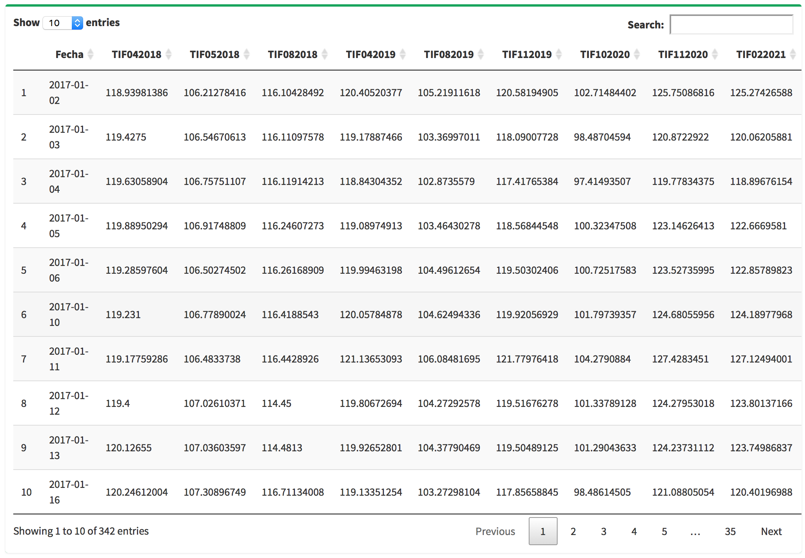
<p class="caption">(\#fig:img100)Datos de prueba</p>
</div>
<div class="figure" style="text-align: center">

<p class="caption">(\#fig:img101)Advertencia</p>
</div>
La información está distribuida en dos tablas,

* La primera tabla muestra información acerca del monto invertido en cada instrumento, su valor actual, el precio teórico elegido, la desviación estandar de cada instrumento, el precio estresado, el Mark to Market (MTM), y la ganancia o pérdida considerando los precios teóricos iniciales y los precios teóricos estresados (Ver Figura \@ref(fig:img102)). 
<div class="figure" style="text-align: center">

<p class="caption">(\#fig:img102)Resultados individuales estresados</p>
</div>

* La segunda tabla, muestra un resumen para todo el portafolio, se presenta la suma del valor nominal por tipo de instrumento, el precio promedio ponderado por el valor nominal para cada instrumento, y la ganancia ó pérdida obtenida para cada tipo de instrumento considerado los precios de mercado y los precios estresados (Ver Figura \@ref(fig:img103)).

<div class="figure" style="text-align: center">
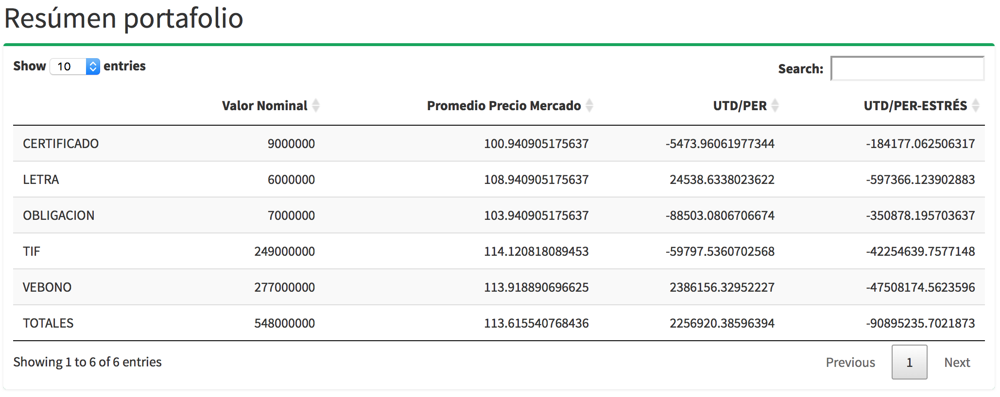
<p class="caption">(\#fig:img103)Resultados portafolio estresados</p>
</div>

<!--chapter:end:300-Manual_de_usuario.Rmd-->

\cleardoublepage 

# (APPENDIX) Apéndice {-}

# Software Tools

For those who are not familiar with software packages required for using R Markdown, we give a brief introduction to the installation and maintenance of these packages.

## R and R packages

R can be downloaded and installed from any CRAN (the Comprehensive R Archive Network) mirrors, e.g., https://cran.rstudio.com. Please note that there will be a few new releases of R every year, and you may want to upgrade R occasionally.

To install the **bookdown** package, you can type this in R:


```r
install.packages("bookdown")
```

This installs all required R packages. You can also choose to install all optional packages as well, if you do not care too much about whether these packages will actually be used to compile your book (such as **htmlwidgets**):


```r
install.packages("bookdown", dependencies = TRUE)
```

If you want to test the development version of **bookdown** on GitHub, you need to install **devtools** first:


```r
if (!requireNamespace('devtools')) install.packages('devtools')
devtools::install_github('rstudio/bookdown')
```

R packages are also often constantly updated on CRAN or GitHub, so you may want to update them once in a while:


```r
update.packages(ask = FALSE)
```

Although it is not required, the RStudio IDE can make a lot of things much easier when you work on R-related projects. The RStudio IDE can be downloaded from https://www.rstudio.com.

## Pandoc

An R Markdown document (`*.Rmd`) is first compiled to Markdown (`*.md`) through the **knitr** package, and then Markdown is compiled to other output formats (such as LaTeX or HTML) through Pandoc.\index{Pandoc} This process is automated by the **rmarkdown** package. You do not need to install **knitr** or **rmarkdown** separately, because they are the required packages of **bookdown** and will be automatically installed when you install **bookdown**. However, Pandoc is not an R package, so it will not be automatically installed when you install **bookdown**. You can follow the installation instructions on the Pandoc homepage (http://pandoc.org) to install Pandoc, but if you use the RStudio IDE, you do not really need to install Pandoc separately, because RStudio includes a copy of Pandoc. The Pandoc version number can be obtained via:


```r
rmarkdown::pandoc_version()
## [1] '2.7.3'
```

If you find this version too low and there are Pandoc features only in a later version, you can install the later version of Pandoc, and **rmarkdown** will call the newer version instead of its built-in version.

## LaTeX

LaTeX\index{LaTeX} is required only if you want to convert your book to PDF. The typical choice of the LaTeX distribution depends on your operating system. Windows users may consider MiKTeX (http://miktex.org), Mac OS X users can install MacTeX (http://www.tug.org/mactex/), and Linux users can install TeXLive (http://www.tug.org/texlive). See https://www.latex-project.org/get/ for more information about LaTeX and its installation.

Most LaTeX distributions provide a minimal/basic package and a full package. You can install the basic package if you have limited disk space and know how to install LaTeX packages later. The full package is often significantly larger in size, since it contains all LaTeX packages, and you are unlikely to run into the problem of missing packages in LaTeX.

LaTeX error messages may be obscure to beginners, but you may find solutions by searching for the error message online (you have good chances of ending up on [StackExchange](http://tex.stackexchange.com)). In fact, the LaTeX code converted from R Markdown should be safe enough and you should not frequently run into LaTeX problems unless you introduced raw LaTeX content in your Rmd documents. The most common LaTeX problem should be missing LaTeX packages, and the error may look like this:

```latex
! LaTeX Error: File `titling.sty' not found.

Type X to quit or <RETURN> to proceed,
or enter new name. (Default extension: sty)

Enter file name: 
! Emergency stop.
<read *> 
         
l.107 ^^M

pandoc: Error producing PDF
Error: pandoc document conversion failed with error 43
Execution halted
```

This means you used a package that contains `titling.sty`, but it was not installed. LaTeX package names are often the same as the `*.sty` filenames, so in this case, you can try to install the `titling` package. Both MiKTeX and MacTeX provide a graphical user interface to manage packages. You can find the MiKTeX package manager from the start menu, and MacTeX's package manager from the application "TeX Live Utility". Type the name of the package, or the filename to search for the package and install it. TeXLive may be a little trickier: if you use the pre-built TeXLive packages of your Linux distribution, you need to search in the package repository and your keywords may match other non-LaTeX packages. Personally, I find it frustrating to use the pre-built collections of packages on Linux, and much easier to install TeXLive from source, in which case you can manage packages using the `tlmgr` command. For example, you can search for `titling.sty` from the TeXLive package repository:

```bash
tlmgr search --global --file titling.sty
# titling:
#	 texmf-dist/tex/latex/titling/titling.sty
```

Once you have figured out the package name, you can install it by:

```bash
tlmgr install titling  # may require sudo
```

LaTeX distributions and packages are also updated from time to time, and you may consider updating them especially when you run into LaTeX problems. You can find out the version of your LaTeX distribution by:


```r
system('pdflatex --version')
## pdfTeX 3.14159265-2.6-1.40.19 (TeX Live 2018)
## kpathsea version 6.3.0
## Copyright 2018 Han The Thanh (pdfTeX) et al.
## There is NO warranty.  Redistribution of this software is
## covered by the terms of both the pdfTeX copyright and
## the Lesser GNU General Public License.
## For more information about these matters, see the file
## named COPYING and the pdfTeX source.
## Primary author of pdfTeX: Han The Thanh (pdfTeX) et al.
## Compiled with libpng 1.6.34; using libpng 1.6.34
## Compiled with zlib 1.2.11; using zlib 1.2.11
## Compiled with xpdf version 4.00
```

<!--chapter:end:400-apendice.Rmd-->

# Referencias {-}


<!-- \begin{thebibliography}{99} -->

<!-- \bibitem{AS}  Abramovich, F. y Steinberg, D.},  Improved Inference in Nonparametric Regression using Lk Smoothing Splines}. Journal of Statistical Planning, 49: 327-341, 1996. -->

<!-- \bibitem{Mm}  Maita B. Miriam A.},  Estimación de una curva de rendimientos para los bonos de la deuda pública interna en Venezuela}, (trabajo de grado Maestría en Administración de Empresas mención Finanzas).  Universidad Católica Andrés Bello, Caracas, Venezuela, 2010. -->

<!-- \bibitem{NS}  Nelson, C. y Siegel, A.}  Parsimonius Modeling of Yield Curves}. Journal of -->
<!-- Business, $60$: $473$-$489$, 1987. -->

<!-- \bibitem{DO}  Douglas, L.G.}  Yield Curve Analysis}. New York Institute of Finance, 1988. -->


<!-- \bibitem{Sv}  Svensson, L.}  Estimating and Interpreting Forward Interest Rates: Sweden 1992-1994}, NBER Working Papers, 4871. Estocolmo: National Bureau of Economic Research, 1994. -->

<!-- \bibitem{HT}  Hunt, B. y Terry, C.}  Zero-Coupon Yield Curve Estimation: A Principal Component-Polynomial Approach}, Technical report 81. Sydney: University of Technology Sydney - School of Finance and Economics, 1998. -->

<!-- \bibitem{H}  Hunt, B.}  Modelling the Yields on Australian Coupon Paying Bonds}, Technical report 9. Sydney: University of Technology Sydney - School of Finance and Economics, 1995. -->

<!-- \bibitem{Ha}  Haykin, S.}  Neural Networks}. New York: McMillan College Publishing Company, 1994. -->

<!-- \bibitem{IG}  Isasi, P. y Galván, I.}  Redes neuronales artificiales: un enfoque práctico.}. Madrid: Pearson-Prentice Hall, 2004. -->

<!-- \bibitem{KB}  Kaastra, I. y Boyd, M.}  Design a Neural Network for Forecasting Financial and Economic Time Series}. Neurocomputing 10: 215-236, 1996. -->

<!-- \bibitem{NW}  Nocedal, J. y Wright, S.}  Numerical Optimization}. New York: Springer-Verlag, 1999. -->


<!-- \bibitem{FG}  Fan, J. y Gijbels, I.}  Local Polynomial Modelling and Its Applications}. New York: Chapman and Hall, 1996. -->

<!-- \bibitem{BW}  B.W. Silverman.}  Some Aspects of the Spline Smoothing Approach to Non-Parametric Regression Curve Fitting}. Journal of the Royal Statistical Society. Series B (Methodological), Vol. 47, No. 1, 1(1985), pp. 1-52, 1984. -->


<!-- \bibitem{F}  Friedman, J. H.}  A Variable Span Smoother}, Technical report 5. Standford: -->
<!-- Standford University - Departament of Statistics, 1984. -->


<!-- \bibitem{SH}  Sharda, R.}  Neural networks for the MS/OR analyst: An application bibliography}. Interfaces, 24(2): 116-130, 1994. -->

<!-- \bibitem{SVM}  Suykens, J.; Vandewalle, J. y Moor, B. D.}  Artificial Neural Networks for Modelling and Control of Nonlinear Systems.}. Boston: Kluwer Academic Publishers, 1996. -->

<!-- \bibitem{FR}  Fernández J.L., Robles, M.D.}   Teoría de las Expectativas y Cambio Estructural: nueva evidencia en los tipos a corto plazo españoles.} Tribuna de Economía No. 827. ICE, 2005. -->

<!-- \bibitem{YS}  Yung-Shi Liau, Jack J.W. Yang.}  The Expectations Hypothesis of Term Structure of Interest Rates in Taiwan's Money Market.} International Research Journal of Finance and Economics, 2009. -->

<!-- \bibitem{ZPH}  Zhang, G.; Patuwo, B. y Hu, Y.}  Forecasting with Artificial Neural Networks: The State of Art.} International Journal of Forecasting, 14: 35-62, 1998. -->

<!-- \end{thebibliography} -->

+  Abramovich, F. y Steinberg, D.,  Improved Inference in Nonparametric Regression using Lk Smoothing Splines. Journal of Statistical Planning, 49: 327-341, 1996.

+  Maita B. Miriam A.,  Estimación de una curva de rendimientos para los bonos de la deuda pública interna en Venezuela, (trabajo de grado Maestría en Administración de Empresas mención Finanzas).  Universidad Católica Andrés Bello, Caracas, Venezuela, 2010.

+  Nelson, C. y Siegel, A.  Parsimonius Modeling of Yield Curves. Journal of
Business, $60$: $473$-$489$, 1987.

+  Douglas, L.G.  Yield Curve Analysis. New York Institute of Finance, 1988.


+  Svensson, L.  Estimating and Interpreting Forward Interest Rates: Sweden 1992-1994, NBER Working Papers, 4871. Estocolmo: National Bureau of Economic Research, 1994.

+  Hunt, B. y Terry, C.  Zero-Coupon Yield Curve Estimation: A Principal Component-Polynomial Approach, Technical report 81. Sydney: University of Technology Sydney - School of Finance and Economics, 1998.

+  Hunt, B.  Modelling the Yields on Australian Coupon Paying Bonds, Technical report 9. Sydney: University of Technology Sydney - School of Finance and Economics, 1995.

+  Haykin, S.  Neural Networks. New York: McMillan College Publishing Company, 1994.

+  Isasi, P. y Galván, I.  Redes neuronales artificiales: un enfoque práctico.. Madrid: Pearson-Prentice Hall, 2004.

+  Kaastra, I. y Boyd, M.  Design a Neural Network for Forecasting Financial and Economic Time Series. Neurocomputing 10: 215-236, 1996.

+  Nocedal, J. y Wright, S.  Numerical Optimization. New York: Springer-Verlag, 1999.

+  Fan, J. y Gijbels, I.  Local Polynomial Modelling and Its Applications. New York: Chapman and Hall, 1996.

+  B.W. Silverman.  Some Aspects of the Spline Smoothing Approach to Non-Parametric Regression Curve Fitting. Journal of the Royal Statistical Society. Series B (Methodological), Vol. 47, No. 1, 1(1985), pp. 1-52, 1984.

+  Friedman, J. H.  A Variable Span Smoother, Technical report 5. Standford:
Standford University - Departament of Statistics, 1984.

+  Sharda, R.  Neural networks for the MS/OR analyst: An application bibliography. Interfaces, 24(2): 116-130, 1994.

+  Suykens, J.; Vandewalle, J. y Moor, B. D.  Artificial Neural Networks for Modelling and Control of Nonlinear Systems.. Boston: Kluwer Academic Publishers, 1996.

+  Fernández J.L., Robles, M.D.   Teoría de las Expectativas y Cambio Estructural: nueva evidencia en los tipos a corto plazo españoles. Tribuna de Economía No. 827. ICE, 2005.

+  Yung-Shi Liau, Jack J.W. Yang.  The Expectations Hypothesis of Term Structure of Interest Rates in Taiwan's Money Market. International Research Journal of Finance and Economics, 2009.

+  Zhang, G.; Patuwo, B. y Hu, Y.  Forecasting with Artificial Neural Networks: The State of Art. International Journal of Forecasting, 14: 35-62, 1998.

<!--chapter:end:500-references.Rmd-->

