--- 
title: "Riesgo de Mercado"
subtitle: "Ciencia de los Datos Financieros"
author: "Synergy Vision"
date: "2019-09-26"
knit: "bookdown::render_book"
documentclass: krantz
biblio-style: apalike
link-citations: yes
colorlinks: yes
lot: yes
lof: yes
fontsize: 12pt
monofontoptions: "Scale=0.8"
keep_md: yes
site: bookdown::bookdown_site
description: ""
url: 'http\://synergy.vision/Riesgo-de-Mercado/'
github-repo: synergyvision/Riesgo-de-Mercado/
cover-image: images/cover.png
---

# Prefacio {-}

Placeholder


## ¿Por qué  leer este libro? {-}
## Estructura del libro {-}
## Información sobre los programas y convenciones {-}
## Prácticas interactivas con R {-}
## Agradecimientos {-}

<!--chapter:end:index.Rmd-->


# Acerca del Autor {-}

Este material es un esfuerzo de equipo en Synergy Vision, (<http://synergy.vision/nosotros/>).		 

El propósito de este material es ofrecer una experiencia de aprendizaje distinta y enfocada en el estudiante. El propósito es que realmente aprenda y practique con mucha intensidad. La idea es cambiar el modelo de clases magistrales y ofrecer una experiencia más centrada en el estudiante y menos centrado en el profesor. Para los temas más técnicos y avanzados es necesario trabajar de la mano con el estudiante y asistirlo en el proceso de aprendizaje con prácticas guiadas, material en línea e interactivo, videos, evaluación contínua de brechas y entendimiento, entre otros, para procurar el dominio de la materia.
  		  
Nuestro foco es la Ciencia de los Datos Financieros y para ello se desarrollará material sobre: **Probabilidad y Estadística Matemática en R**, **Programación Científica en R**, **Mercados**, **Inversiones y Trading**, **Datos y Modelos Financieros en R**, **Renta Fija**, **Inmunización de Carteras de Renta Fija**, **Teoría de Riesgo en R**, **Finanzas Cuantitativas**, **Ingeniería Financiera**, **Procesos Estocásticos en R**, **Series de Tiempo en R**, **Ciencia de los Datos**, **Ciencia de los Datos Financieros**, **Simulación en R**, **Desarrollo de Aplicaciones Interactivas en R**, **Minería de Datos**, **Aprendizaje Estadístico**, **Estadística Multivariante**, **Riesgo de Crédito**, **Riesgo de Liquidez**, **Riesgo de Mercado**, **Riesgo Operacional**, **Riesgo de Cambio**, **Análisis Técnico**, **Inversión Visual**, **Finanzas**, **Finanzas Corporativas**, **Valoración**, **Teoría de Portafolio**, entre otros.

Nuestra cuenta de Twitter es (https://twitter.com/bysynergyvision) y nuestros repositorios están en GitHub (https://github.com/synergyvision).
  		  
 **Somos Científicos de Datos Financieros**

<!--chapter:end:000-author.Rmd-->


# Introducción 

Placeholder


## Motivation

<!--chapter:end:010-introduction.Rmd-->


# Curva de Rendimientos

Placeholder


## Metodologías Paramétricas.
### Metodología Nelson y Siegel
### Metodología Svensson
### Polinomios de componentes principales.
### Polinomios trigonométricos.
### Metodología Diebold-Li
#### Modelos de factores de la curva de rendimientos
## Metodologías no Paramétricas
### Regresión Kernel
### Polinomios locales
### Splines suavizados
### Splines de polinomios
### Splines suavizados
### Supersuavizador de Friedmann
### Redes neuronales artificiales
### Metodología Splines Cúbicos de Suavizado
#### Teoría de interpolación
#### Interpolación lineal
#### Interpolación de Lagrange
#### Interpolación de Hermite
#### Interpolación Polinómica
#### Splines
#### Bases de splines
#### B-spline uniforme
#### B-spline cardinal
#### B-spline constante
#### B-spline lineal
#### B-spline cuadrática uniforme
#### B-spline cúbica
#### B-spline cúbica uniforme
### Regresión no paramétrica
### Regresión no paramétrica mediante splines de suavizado
### Proceso de Optimización de Nelson y Siegel y Svensson
### Elaboracion Base de datos para la metodología Splines y Diebold-Li

<!--chapter:end:011-Curva_de_Rendimientos.Rmd-->


# Valor en Riesgo

Placeholder


### Importancia del VaR
## Metodologías para calcular el VaR
## VaR Simulación Histórica
## VaR Simulación MonteCarlo
### Origenes
### Definición
## Limitaciones del VaR

<!--chapter:end:012-Valor_en_Riesgo.Rmd-->


# Backtesting

Placeholder


## Definición
## Prueba de Kupiec
## Test de Prueba Mixta de Kupiec (Haas)
## Marco de referencia Comité de Basilea (1996).

<!--chapter:end:013-Backtesting.Rmd-->


# Pruebas de Estrés

Placeholder


## Definición
## Utilidad

<!--chapter:end:014-Pruebas_de_estres.Rmd-->


<!--chapter:end:020-Funcion-Svensson.Rmd-->


# Manual de Usuario

Placeholder


## Curva de Rendimientos
### Curva de rendimientos individual
### Datos
### Metodología Nelson y Siegel
### Metodología Svensson
### Metodología Diebold-Li
### Metodología Splines
### Curva de rendimientos comparativo
### Metodologías
### Precios Estimados
### Curvas
## Valor en Riesgo
### Datos
### Distribución
### VaR
### Gráficos
### Históricos
## Backtesting
### Datos
### Resultados
## Valoración
### Datos
### Resultados
### Resultados prueba de estrés

<!--chapter:end:300-Manual_de_usuario.Rmd-->


# (APPENDIX) Apéndice {-}
# Software Tools

Placeholder


## R and R packages
## Pandoc
## LaTeX

<!--chapter:end:400-apendice.Rmd-->


<!--chapter:end:500-references.Rmd-->

---
title: "Untitled"
author: "Danny Morales"
date: "9/26/2019"
output: pdf_document
---


# Manual de Usuario

## Curva de Rendimientos

### Curva de rendimientos individual

En esta sección el usuario puede calcular los precios teóricos de los instrumentos de la Deuda Pública Nacional (TIF ó VEBONOS) para una fecha considerada y para una metodología en específico. Las metodologías disponibles son Nelson y Siegel, Svensson, Diebold-Li y Splines cúbicos de suavizado (Ver Figura \@ref(fig:img1)). 

Para el cálculo de las metodología de Nelson y Siegel, así como la de Svensson y Diebold-Li es importante contar con los precios promedios de los instrumentos a considerar puesto que a partir de los mismos se realizará un proceso de optimización el cual busca encontrar los parámetros más adecuados de esta metodología de manera que los precios teóricos obtenidos se asemejen a los precios promedio. Esta sección permite calcular los precios teóricos de los instrumentos de la deuda pública nacional (Ver Figura \@ref(fig:img3)).

<div class="figure" style="text-align: center">

<p class="caption">(\#fig:img1)Sección individual curva de rendimientos</p>
</div>
<div class="figure" style="text-align: center">

<p class="caption">(\#fig:img3)Precios promedio</p>
</div>
### Datos

Esta sección nos permite obtener de manera automática los archivos necesarios para el cálculo de los precios teóricos de los instrumentos a considerar (Ver Figura \@ref(fig:img2)). Los archivos necesarios son obtenidos de la página del Banco Central de Venezuela, ellos son,

+ Documento de operaciones del mercado secundario (resumersec) .
+ Documento de las características de los instrumentos de la Deuda Pública Nacional.

<div class="figure" style="text-align: center">

<p class="caption">(\#fig:img2)Sección Datos</p>
</div>


### Metodología Nelson y Siegel

Con el fin de proceder a realizar los cálculos mediante esta metodología el usuario deberá seguir los siguientes pasos,

1. Seleccionar una fecha para la cual se calcularán los precios estimados (Ver Figura \@ref(fig:img4)).

<div class="figure" style="text-align: center">

<p class="caption">(\#fig:img4)Sección Nelson y Siegel individual</p>
</div>

2. Selecionar los instrumentos a considerar ya sean TIF ó VEBONO (Ver Figura \@ref(fig:img5)), para este fin el usuario podrá elegir los mismos selecionando su nombre corto o ingresando un archivo plano (Ver Figura \@ref(fig:img6)). Cabe destacar que este archivo debera tener las siguientes características,
    + Debe ser un archivo plano (txt).
    + Debe contener una columna, la cual debe ser del tipo caracter donde se indicará el nombre corto del instrumento a considerar.
    + Ejemplo estructura fila: Para el TIF cuyo vencimiento es el "02/08/2019". En este caso el nombre corto de este instrumento es "TIF082019". Así para cada fila debe existir la siguiente información "TIF082019".
    + El archivo debe contener tantas filas como instrumentos desee considerar el usuario. Posteriormente se mostraran los títulos seleccionados por el usuario así como su respectivo precio promedio es caso de existir, de lo contrario el precio asignado será de 0. Se mostrará también el documento de las características de los instrumentos financieros venezolanos, con el fin de que el usuario pueda observar en detalle cada instrumento.
<div class="figure" style="text-align: center">
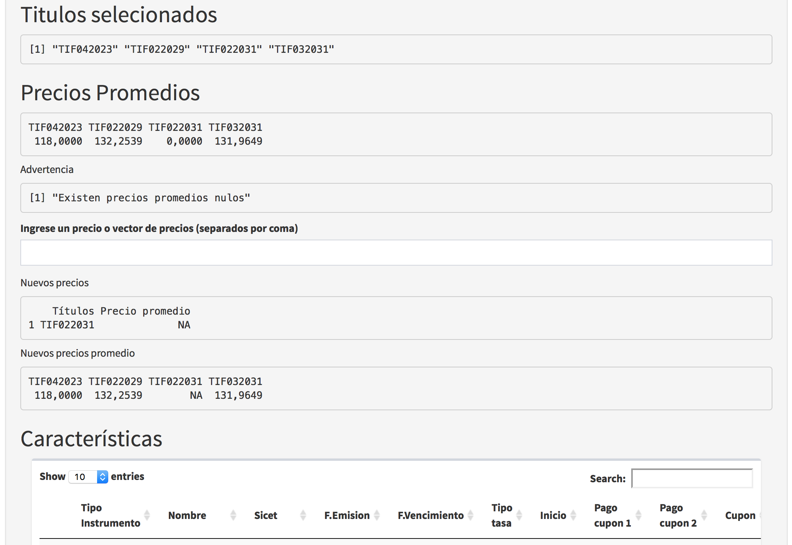
<p class="caption">(\#fig:img5)Selecionar instrumentos</p>
</div>
<div class="figure" style="text-align: center">
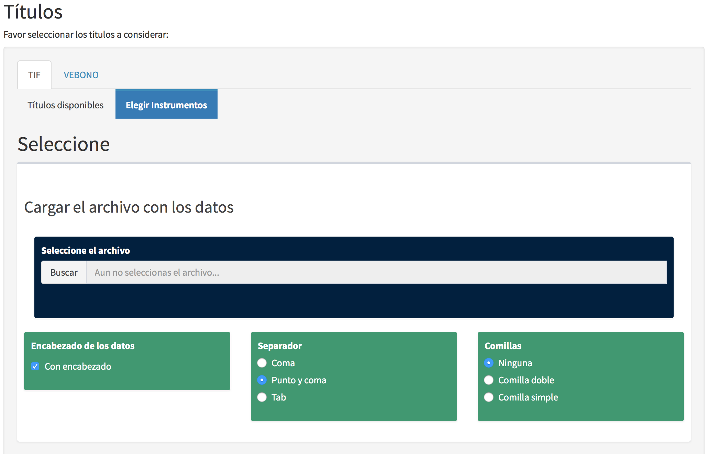
<p class="caption">(\#fig:img6)Selecionar instrumentos desde un archivo plano</p>
</div>


3. El usuario debera seleccionar un método para calcular los precios teóricos, los cuales se ubican en estas secciones (Ver Figura \@ref(fig:img7)),
    + Parámetros iniciales: en esta sección los parámetros a considerar serán tomados por defecto y los cálculos del los precios y curva de rendimientos (Ver Figura \@ref(fig:img8)) se realizarán con los mismos.
<div class="figure" style="text-align: center">
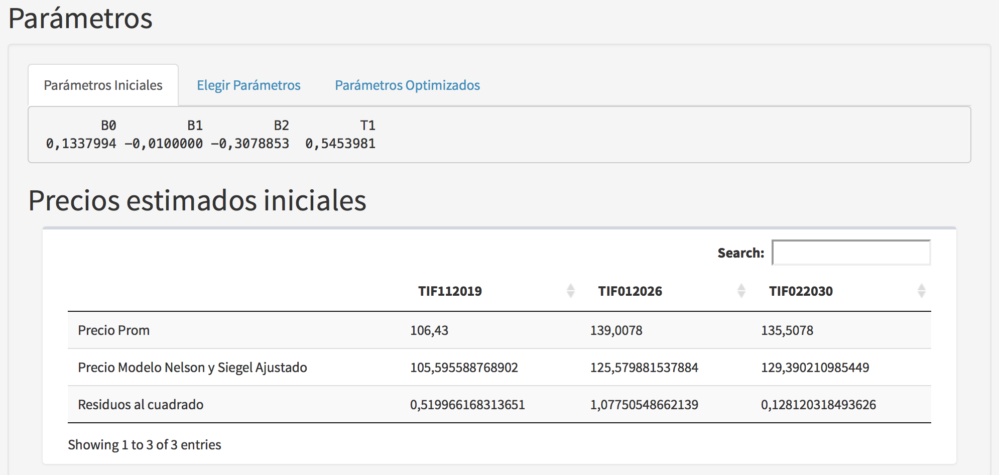
<p class="caption">(\#fig:img7)Opción parámetros iniciales</p>
</div>
<div class="figure" style="text-align: center">

<p class="caption">(\#fig:img8)Curva de rendimientos inicial</p>
</div>
    + Elegir parámetros: en esta sección el usuario podrá elegir los parámetros de está metodología siempre y cuando los mismos cumplan con ciertas restricciones (Ver Figura \@ref(fig:img9)). El usuario deberá seleccionar un valor para las siguientes variables, 
        + $\beta_{0}$.
        + $\beta_{1}$.
        + $\beta_{2}$.
        + $\tau_{1}$.
    + Posteriormente la herramienta generará los siguientes resultados,
        + Nuevos parámetros seleccionados.
        + Verificación de que los parámetros cuamplan con las restricciones necesarias.
        + Precios teóricos de los instrumentos seleccionados.
        + Curva de rendimientos obtenida en base a los parámetros seleccionados.
<div class="figure" style="text-align: center">

<p class="caption">(\#fig:img9)Opción elegir parámetros</p>
</div>
    + Parámetros optimizados: en esta sección los parámetros a utilizar serán los obtenidos luego de realizar un proceso de optimización sobre los mismos (Ver Figura \@ref(fig:img10)). Posteriormente se mostrarán los precios teóricos y curva de rendimientos obtenida para estos parámetros (Ver Figuras \@ref(fig:img11) y \@ref(fig:img12)).

<div class="figure" style="text-align: center">

<p class="caption">(\#fig:img11)Precios optimizados</p>
</div>
<div class="figure" style="text-align: center">

<p class="caption">(\#fig:img12)Parámetros optimizados</p>
</div>
### Metodología Svensson

Con el fin de proceder a realizar los cálculos mediante esta metodología el usuario deberá seguir los siguientes pasos,

1. Seleccionar una fecha para la cual se calcularán los precios estimados (Ver Figura \@ref(fig:img13)).
<div class="figure" style="text-align: center">

<p class="caption">(\#fig:img13)Sección Svensson individual</p>
</div>

2. Selecionar los instrumentos a considerar ya sean TIF ó VEBONO, para este fin el usuario podrá elegir los mismos selecionando su nombre corto o ingresando una archivo plano (Ver Figuras \@ref(fig:img5) y \@ref(fig:img6)). Cabe destacar que este archivo debera tener las siguientes características,
    + Debe ser un archivo plano (txt).
    + Debe contener una columna, la cual debe ser del tipo caracter donde se indicará el nombre corto del instrumento a considerar.
    + Ejemplo estructura fila: Para el TIF cuyo vencimiento es el "02/08/2019". En este caso el nombre corto de este instrumento es "TIF082019". Así para cada fila debe existir la siguiente información "TIF082019".
    + El archivo debe contener tantas filas como instrumentos desee considerar el usuario. Posteriormente se mostraran los títulos seleccionados por el usuario así como su respectivo precio promedio es caso de existir, de lo contrario el precio asignado será de 0. Se mostrará también el documento de las características de los instrumentos financieros venezolanos, con el fin de que el usuario pueda observar en detalle cada instrumento.
3. El usuario debera seleccionar un método para calcular los precios teóricos, los cuales se ubican es estas secciones,
    + Parámetros iniciales: en esta sección los parámetros a considerar serán tomados por defecto y los cálculos del los precios y curva de rendimientos se realizarán con los mismos (Ver Figuras \@ref(fig:img14) y \@ref(fig:img15)).
<div class="figure" style="text-align: center">

<p class="caption">(\#fig:img14)Parámetros iniciales</p>
</div>
<div class="figure" style="text-align: center">
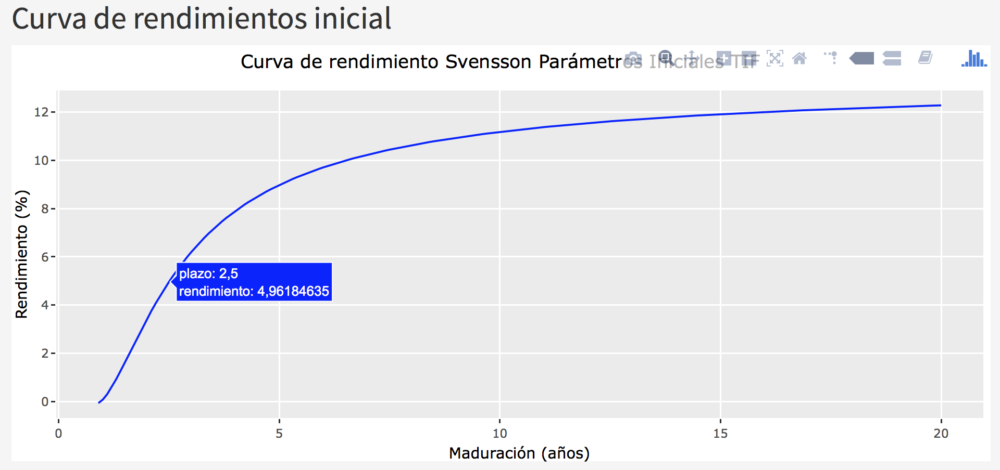
<p class="caption">(\#fig:img15)Curva de rendimientos parámetros iniciales</p>
</div>
    + Elegir parámetros: en esta sección el usuario podrá elegir los parámetros de está metodología siempre y cuando los mismos cumplan con ciertas restricciones (Ver Figura \@ref(fig:img16)). El usuario deberá seleccionar un valor para las siguientes variables,
        + $\beta_{0}$.
        + $\beta_{1}$.
        + $\beta_{2}$.
        + $\beta_{3}$.
        + $\tau_{1}$.
        + $\tau_{2}$.
    + Posteriormente la herramienta generará los siguientes resultados,
        + Nuevos parámetros seleccionados.
        + Verificación de que los parámetros cuamplan con las restricciones necesarias.
        + Precios teóricos de los instrumentos seleccionados.
        + Curva de rendimientos obtenida en base a los parámetros seleccionados.
<div class="figure" style="text-align: center">

<p class="caption">(\#fig:img16)Elegir parámetros</p>
</div>
    + Parámetros optimizados: en esta sección los parámetros a utilizar serán los obtenidos luego de realizar un proceso de optimización sobre los mismos. Posteriormente se mostrarán los precios teóricos y curva de rendimientos obtenida para estos parámetros (Ver Figuras \@ref(fig:img17) y \@ref(fig:img18)).
<div class="figure" style="text-align: center">

<p class="caption">(\#fig:img17)Precios optimizados</p>
</div>
<div class="figure" style="text-align: center">
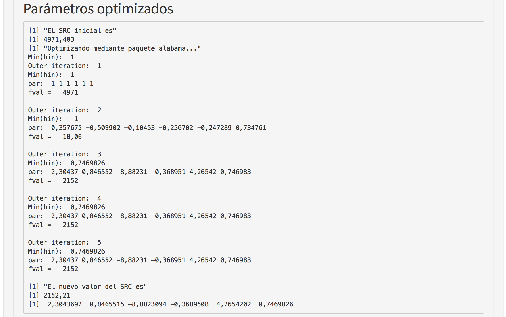
<p class="caption">(\#fig:img18)Parámetros optimizados</p>
</div>


### Metodología Diebold-Li

Con el fin de proceder a realizar los cálculos mediante esta metodología el usuario deberá seguir los siguientes pasos,

1. Seleccionar una fecha para la cual se calcularán los precios estimados (Ver Figura \@ref(fig:img19)).
2. Selecionar los instrumentos a considerar ya sean TIF ó VEBONO, para este fin el usuario podrá elegir los mismos selecionando su nombre corto o ingresando una archivo plano. Cabe destacar que este archivo debera tener las siguientes características,
    + Debe ser un archivo plano (txt).
    + Debe contener una columna, la cual debe ser del tipo caracter donde se indicará el nombre corto del instrumento a considerar.
    + Ejemplo estructura fila: Para el TIF cuyo vencimiento es el "02/08/2019". En este caso el nombre corto de este instrumento es "TIF082019". Así para cada fila debe existir la siguiente información "TIF082019".
    + El archivo debe contener tantas filas como instrumentos desee considerar el usuario. Posteriormente se mostraran los títulos seleccionados por el usuario así como su respectivo precio promedio es caso de existir, de lo contrario el precio asignado será de 0. Se mostrará también el documento de las características de los instrumentos financieros venezolanos, con el fin de que el usuario pueda observar en detalle cada instrumento.
<div class="figure" style="text-align: center">
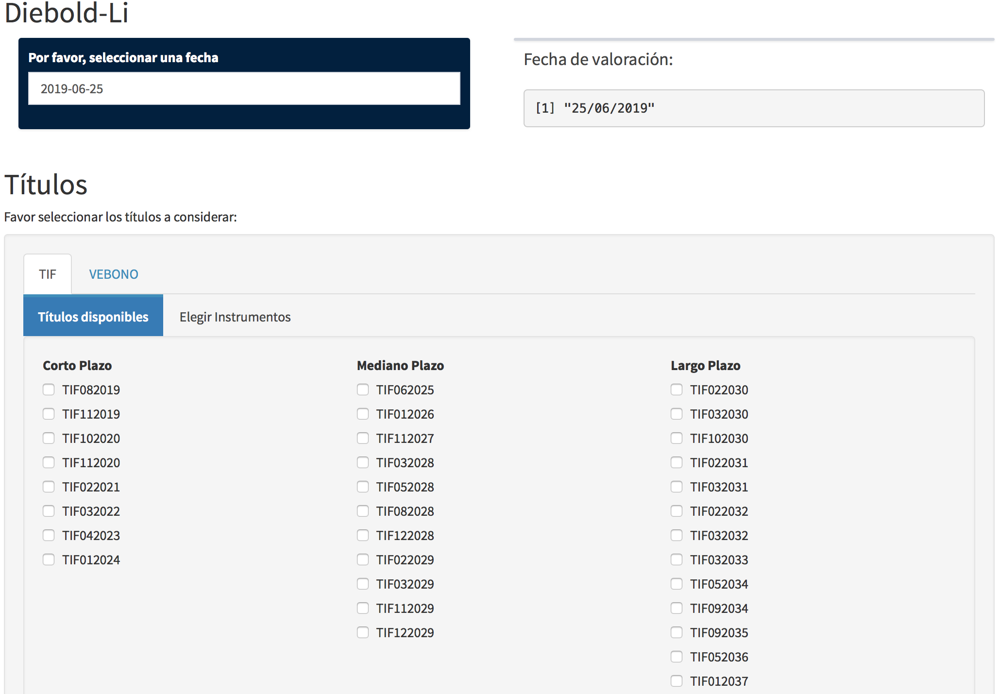
<p class="caption">(\#fig:img19)Sección Diebold-Li</p>
</div>
3. Posteriormente, el usuario en caso de no observar ninguna curva graficada deberá seleccionar una mayor cantidad de observaciones (Ver Figura \@ref(fig:img20)), esto se debe a que no se están considerando la suficiente cantidad de operaciones para graficar la curva de rendimientos a partir de la cual se obtendrán los rendimientos teóricos, los cuales son necesarios para el cálculo de los precios teóricos según esta metodología.
<div class="figure" style="text-align: center">
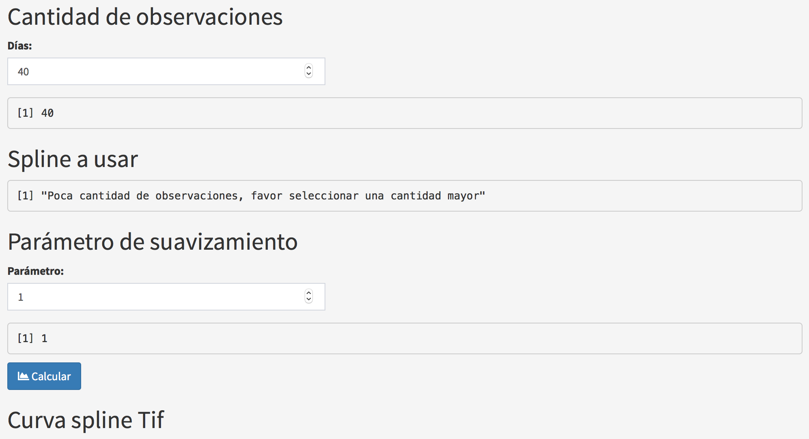
<p class="caption">(\#fig:img20)Poca cantidad de observaciones</p>
</div>
4. Una vez visualizada la curva ajustada mediante el spline, es necesario calibrar el parámetro de suavizamiento, el mismo controla la suavidad de la curva mostrada (Ver Figura \@ref(fig:img21)).
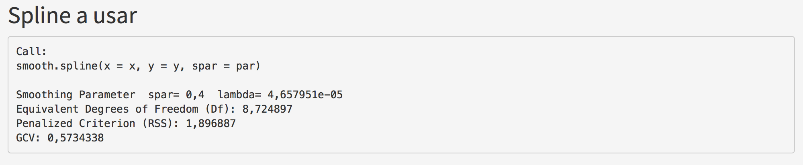
<div class="figure" style="text-align: center">

<p class="caption">(\#fig:img21)Curva spline</p>
</div>
5. Luego de seleccionar este valor, se mostrará el spline a utilizar en el cálculo de los precios teóricos (Ver Figura \@ref(fig:img22)). Posteriormente se mostrarán los precios estimados y la curva de rendimientos obtenida, la cual en este caso es una superficie (Ver Figura \@ref(fig:img23)). Esto debido a considerar los parámetros de Diebold-Li dinámicos con respecto al tiempo.
<div class="figure" style="text-align: center">

<p class="caption">(\#fig:img22)Precios estimados</p>
</div>
<div class="figure" style="text-align: center">

<p class="caption">(\#fig:img23)Curva de rendimiento Diebold-Li</p>
</div>


### Metodología Splines

Con el fin de proceder a realizar los cálculos mediante esta metodología el usuario deberá seguir los siguientes pasos,

1. Seleccionar una fecha para la cual se calcularán los precios estimados (Ver Figura \@ref(fig:img24)).
2. Selecionar los instrumentos a considerar ya sean TIF ó VEBONO, para este fin el usuario podrá elegir los mismos selecionando su nombre corto o ingresando una archivo plano. Cabe destacar que este archivo debera tener las siguientes características,
    + Debe ser un archivo plano (txt).
    + Debe contener una columna, la cual debe ser del tipo caracter donde se indicará el nombre corto del instrumento a considerar.
    + Ejemplo estructura fila: Para el TIF cuyo vencimiento es el "02/08/2019". En este caso el nombre corto de este instrumento es "TIF082019". Así para cada fila debe existir la siguiente información "TIF082019".
    + El archivo debe contener tantas filas como instrumentos desee considerar el usuario. Posteriormente se mostraran los títulos seleccionados por el usuario así como su respectivo precio promedio es caso de existir, de lo contrario el precio asignado será de 0. Se mostrará también el documento de las características de los instrumentos financieros venezolanos, con el fin de que el usuario pueda observar en detalle cada instrumento.
<div class="figure" style="text-align: center">

<p class="caption">(\#fig:img24)Sección splines</p>
</div>
3. Posteriormente, el usuario en caso de no observar ninguna curva graficada deberá seleccionar una mayor cantidad de observaciones (Ver Figura \@ref(fig:img25)), esto se debe a que no se están considerando la suficiente cantidad de operaciones para graficar la curva de rendimientos a partir de la cual se obtendrán los rendimientos teóricos, los cuales son necesarios para el cálculo de los precios teóricos según esta metodología.
<div class="figure" style="text-align: center">

<p class="caption">(\#fig:img25)Pocas observaciones</p>
</div>
4.  Una vez visualizada la curva ajustada mediante el spline, es necesario calibrar el parámetro de suavizamiento, el mismo controla la suavidad de la curva mostrada (Ver Figura \@ref(fig:img26)).
<div class="figure" style="text-align: center">

<p class="caption">(\#fig:img26)Parámetro de suavizamiento</p>
</div>
5. A continuación se mostraran los títulos candidatos a partir de los cuales la curva de rendimientos será trazada (Ver Figura \@ref(fig:img27)). Posteriormente se mostrarán los precios estimados y la curva de rendimientos obtenida (Ver Figuras \@ref(fig:img28) y \@ref(fig:img29)). 
<div class="figure" style="text-align: center">
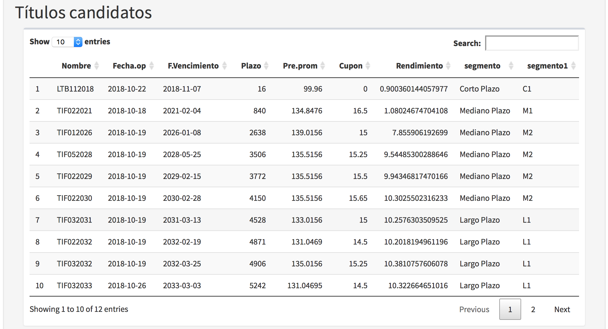
<p class="caption">(\#fig:img27)Títulos candidatos</p>
</div>
<div class="figure" style="text-align: center">
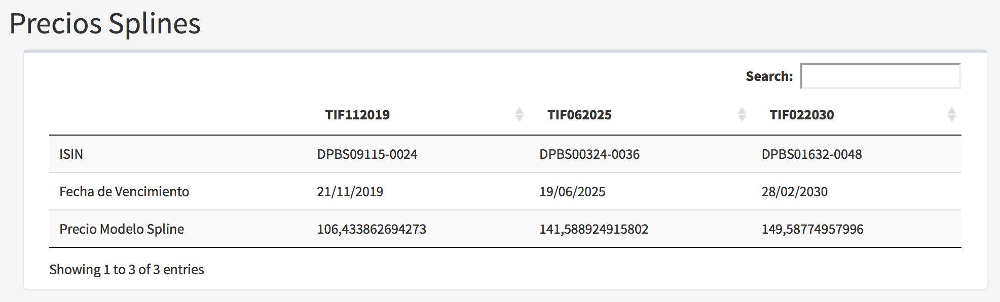
<p class="caption">(\#fig:img28)Precios spline</p>
</div>
<div class="figure" style="text-align: center">

<p class="caption">(\#fig:img29)Curva de rendimientos spline</p>
</div>
6. Luego en caso de que el usuario desee eliminar alguna observación en específico, la misma debe ser elegida a partir de la lista desplegable que se muestra (Ver Figura \@ref(fig:img30)). Al seleccionar una observación, se mostrará la nueva data con la que se trabajará (títulos candidatos, ver figura \@ref(fig:img31)) así como los nuevos precios teóricos calculados y nueva curva de rendimientos obtenida (Ver Figura \@ref(fig:img32)).
<div class="figure" style="text-align: center">
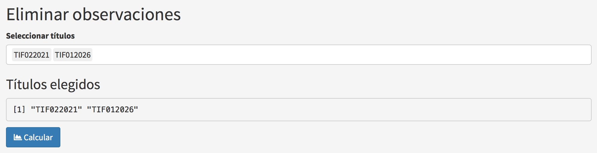
<p class="caption">(\#fig:img30)Opción eliminar observaciones</p>
</div>
<div class="figure" style="text-align: center">

<p class="caption">(\#fig:img31)Nuevos títulos candidatos</p>
</div>
<div class="figure" style="text-align: center">
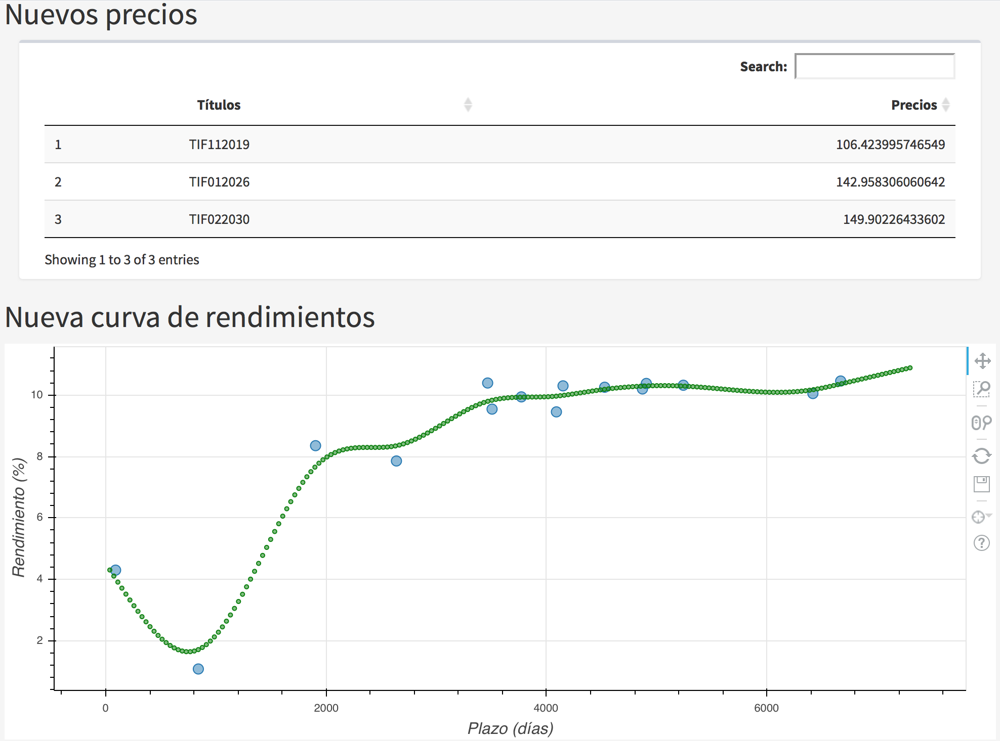
<p class="caption">(\#fig:img32)Nuevos precios y curva de rendimientos</p>
</div>

<!-- ###Estimación de parámetros y curva de rendimiento -->

<!-- Una vez construida la base de datos, se procederá a utilizar los splines de suavizado para obtener los parámetros necesarios para la curva de rendimientos. Recordemos que esta curva relaciona el plazo del instrumento con su rendimiento. -->


<!-- Es importante señalar que se estimará una curva por cada tipo de instrumento, así se obtendrá un curva para los TIF y una curva para los VEBONO. Por tal razón a partir de la base de datos, se separará los TIF de los VEBONOS, y se considerarán sólo las columnas Plazo y Rendimiento para estimar dicha curva. Según sea el caso, sólo considerarán aquellas observaciones que tengan decisión 1. -->


<!-- Aunado a cada tipo de instrumento (TIF ó VEBONO), se considerará un instrumento de otro tipo este es la letra del tesoro, este tipo de instrumento representará el punto inicial la curva, cabe destacar que la letra a considerar debe ser aquella cuya fecha de operación sea la más reciente con respecto a la fecha de valoración (día en que se quiere conocer los rendimientos estimados). -->

<!-- A partir de la curva de rendimientos obtenida (Ver Figura (\@ref(fig:crend)) es posible calcular un rendimiento estimado para algún tipo de instrumento a partir de su plazo, que no es más que la cantidad de días que faltan por transcurrir hasta su vencimiento. Este valor es de suma importancia ya que a partir del mismo es posible calcular el precio estimado asociado a cada instrumento en un día específico. Con lo cual es posible saber a partir de la historia (base de datos), el precio estimado de algún instrumento que le interese a cierta institución y por ende saber si ese título es rentable o no, es decir, si vale la pena invertir en el mismo o no. -->


<!-- ```{r , echo=FALSE, fig.align='center',fig.cap="Curva de Rendimiento",label=crend} -->
<!-- knitr::include_graphics("images/curvarend.jpeg") -->
<!-- ``` -->


<!-- Como se dijo anteriormente, los resultados de los precios obtenidos mediante el uso de la metodología de splines de suavizado serán comparados con los precios obtenidos a través de la metodología de Svensson. En dicha metodología existe un proceso de optimización el cual permite encontrar los parámetros idóneos, de tal manera que la diferencia entre los precios promedio de cada instrumento y su precio teórico sea lo más pequeña posible. El proceso de esta optimización se muestra a continuación. -->


### Curva de rendimientos comparativo

En esta sección permite obtener un comparativo de los precios teóricos obtenidos mediante las diferentes metodologías disponibles, las cuales son Nelson y Siegel, Svensson, Diebold-Li y Splines cúbicos de suavizado (Ver Figura \@ref(fig:img33)).

<div class="figure" style="text-align: center">

<p class="caption">(\#fig:img33)Sección comparativo</p>
</div>

### Metodologías

Con el fin de proceder a realizar los cálculos en esta sección el usuario deberá seguir los siguientes pasos,

1. Seleccionar una fecha para la cual se calcularán los precios estimados (Ver Figura \@ref(fig:img34)).
2. Selecionar los instrumentos a considerar ya sean TIF ó VEBONO, para este fin el usuario podrá elegir los mismos selecionando su nombre corto o ingresando una archivo plano. Cabe destacar que este archivo debera tener las siguientes características,
    + Debe ser un archivo plano (txt).
    + Debe contener una columna, la cual debe ser del tipo caracter donde se indicará el nombre corto del instrumento a considerar.
    + Ejemplo estructura fila: Para el TIF cuyo vencimiento es el "02/08/2019". En este caso el nombre corto de este instrumento es "TIF082019". Así para cada fila debe existir la siguiente información "TIF082019".
    + El archivo debe contener tantas filas como instrumentos desee considerar el usuario. Posteriormente se mostraran los títulos seleccionados por el usuario así como su respectivo precio promedio es caso de existir, de lo contrario el precio asignado será de 0. Se mostrará también el documento de las características de los instrumentos financieros venezolanos, con el fin de que el usuario pueda observar en detalle cada instrumento.
<div class="figure" style="text-align: center">

<p class="caption">(\#fig:img34)Selección de instrumentos</p>
</div>
3. Luego de esto, se deberá rellenar la información correspondiente a cada metodología como ya se explico en la sección anterior, esto con el fin de obtener todos los parámetros necesarios para calcular los precios teóricos según cada metodología (Ver Figuras \@ref(fig:img35), \@ref(fig:img36), \@ref(fig:img37), \@ref(fig:img38) y \@ref(fig:img39)). 

<div class="figure" style="text-align: center">

<p class="caption">(\#fig:img35)Metodologías</p>
</div>
<div class="figure" style="text-align: center">

<p class="caption">(\#fig:img36)Metodología Nelson y Siegel</p>
</div>
<div class="figure" style="text-align: center">
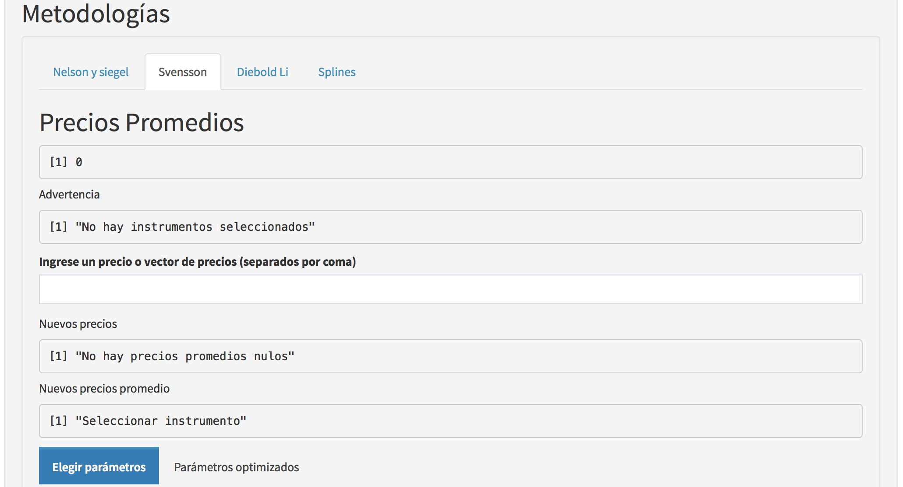
<p class="caption">(\#fig:img37)Metodología Svensson</p>
</div>
<div class="figure" style="text-align: center">
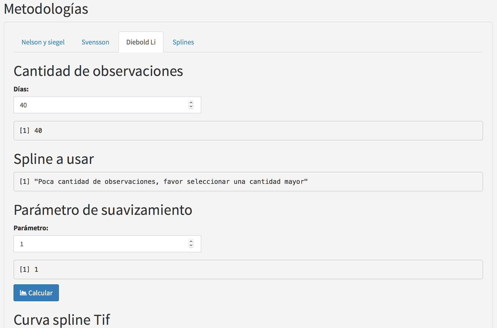
<p class="caption">(\#fig:img38)Metodología Diebold-Li</p>
</div>
<div class="figure" style="text-align: center">
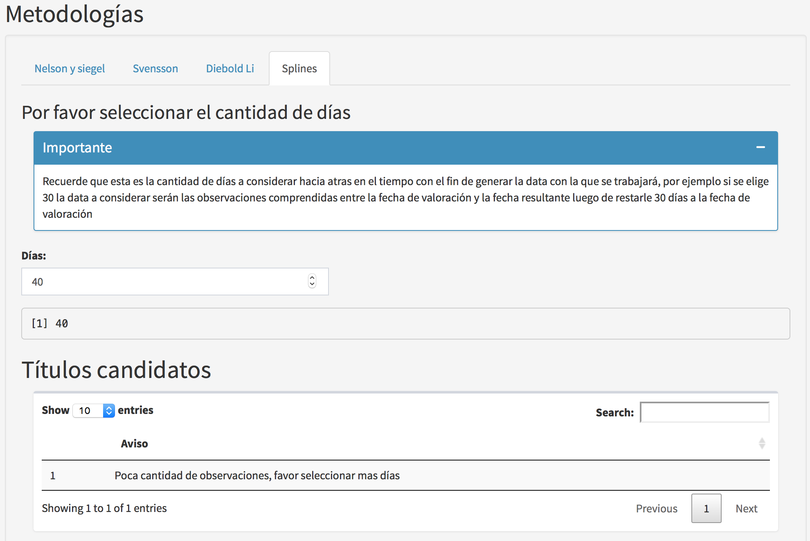
<p class="caption">(\#fig:img39)Metodología splines</p>
</div>
### Precios Estimados

Una vez completados todos los parámetros necesarios, los precios obtenidos se presentan en esta sección (Ver Figura \@ref(fig:img40)).

<div class="figure" style="text-align: center">

<p class="caption">(\#fig:img40)Comparativo de precios</p>
</div>

### Curvas

En esta sección se presenta un grafico comparativo donde se grafican las curvas obtenidas mediante las diferentes metodologías. El usuario podrá descargar un reporte en PDF, con los resultados de los precios teóricos obtenidos en cada metodología (Ver Figura \@ref(fig:img41)).

<div class="figure" style="text-align: center">

<p class="caption">(\#fig:img41)Comparativo de curvas</p>
</div>

## Valor en Riesgo

En esta sección el usuario podrá calcular el Valor en Riesgo de los instrumentos financieros que considere, el mismo será calculado mediante tres maneras diferentes las cuales se basan en tres distintas metodologías (Ver Figura \@ref(fig:img42)). El primer VaR a calcular es el VaR paramétrico el cuál se basa en asumir una distribucuión normal de los instrumentos sconsiderados. El segundo VaR es el calculado por simulación histórica. El tercer y último VaR es el calculado mediante la simulación de MonteCarlo, este VaR se subdividirá en dos casos, el primero es asumiendo una distribución Normal para todos los instrumentos, mientras que el segundo es elegiendo una distribución en específico.

<div class="figure" style="text-align: center">

<p class="caption">(\#fig:img42)Sección valor en riesgo</p>
</div>

### Datos

En esta sección el usuario debe ingresar el histórico de precios, así como la posición de cada uno de los instrumentos a considerar (Ver Figura \@ref(fig:img43)), dichos documentos deben poseer las siguientes características,

Para el archivo de precios:

 + El formato del archivo debe ser txt. 
 + El archivo debe contener al menos 252 observaciones por cada instrumento. El archivo debe contener tantas columnas como instrumentos se consideren.
 + La primera columna del archivo deberá contener las fechas de las observaciones (precios), dichas observaciones deben estar ordenadas en forma decreciente. El formato de la fecha debe ser: Año-Mes_Día (ej: 2019-06-07).
 + El resto de las columnas deben representar información para cada instrumento, es decir, cada columna debe contener las observaciones de cada título. Estas columnas deben contener información sobre los precios de cada día de cada instrumento y su contenido debe ser numérico .
 
<div class="figure" style="text-align: center">

<p class="caption">(\#fig:img43)Data precios</p>
</div>

Para el archivo de posiciones:

 + El formato del archivo debe ser txt. 
 + El archivo debe tener dos columnas, la primera debe contener el nombre corto del instrumentos. Por su parte la segunda columna deberá contener la posición del instrumento. En caso de existir decimales usar "." como separación (Ver Figura \@ref(fig:img44)).
 
<div class="figure" style="text-align: center">

<p class="caption">(\#fig:img44)Data posiciones</p>
</div>


Es importante que la información sobre los instrumentos considerada en el archivo de precios y el archivo de posiciones sea la misma, es decir, los títulos que aparecen en el archivo de precios deben ser los mismos que aparecen en el archivo de posiciones. Una ventana ubicada en esta sección (Aviso) realizará esta validación, en caso de existir una discrepancia no se realizará ningún cálculo (Ver Figura \@ref(fig:img45)).
 
<div class="figure" style="text-align: center">

<p class="caption">(\#fig:img45)Aviso data</p>
</div>

### Distribución

En está sección el usuario debe seleccionar las distribuciones asociadas a los rendimientos cada instrumento, con el fin de proceder y realizaf los cáculos del VaR de simulación de MonteCarlo. Para esto existen dos opciones:

1. Elegir Distribución: En esta subsección al inicio se muestra una advertencia referente a si existe problemas con los precios ingresados, usualmente estos problemas surgen cuando existen dos precios iguales y ellos están seguidos. En caso de existir este problema, el instrumento ó instrumentos involucrados serán excluidos del estudio (Ver Figura \@ref(fig:img46)). Posteriormente el usuario debe:
 +  Seleccionar el instrumento, para el cual se realizará la prueba de bondad de ajuste. Una vez seleccionado el instrumento se desplegará una ventana que mostrará las distribuciones que más se asemejan a los rendimientos de los precios del instrumento en estudio.
<div class="figure" style="text-align: center">

<p class="caption">(\#fig:img46)Elección instrumento</p>
</div>
 + Una vez generado las posibles opciones el usuario debe seleccionar una distribución, luego de esto se mostrarán los parámetros obtenidos a partir de dicho ajuste (Ver Figura \@ref(fig:img47)).
<div class="figure" style="text-align: center">

<p class="caption">(\#fig:img47)Ajuste de distribución</p>
</div>
 + Se debe seleccionar "Si", en el recuadro que pregunta si desea guardar su distribución. Luego de esto la distribución de cada instrumento se guardará para su posterior uso. Esta serie de pasos debe repetirse por cada instrumento considerado (Ver Figura \@ref(fig:img48)).

<div class="figure" style="text-align: center">
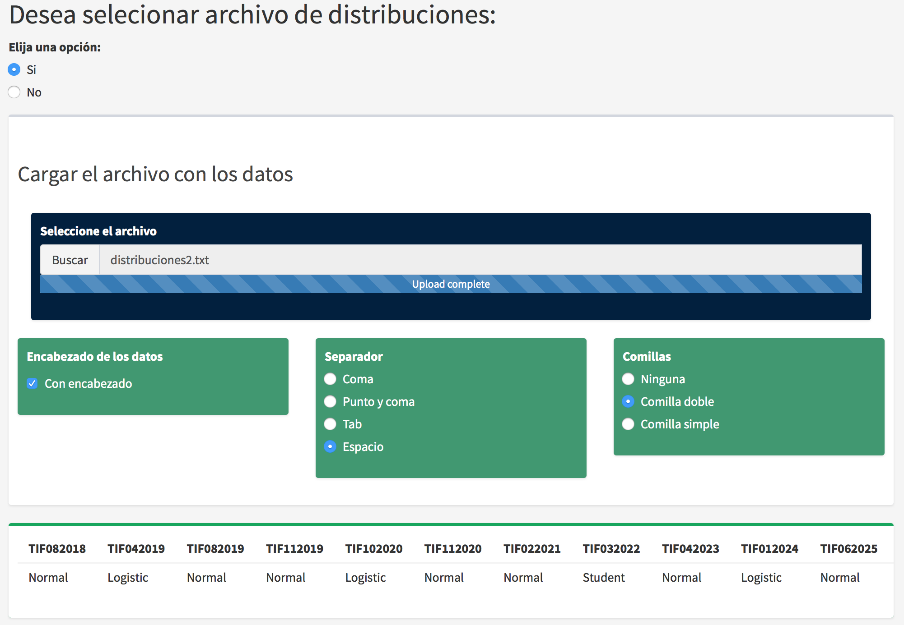
<p class="caption">(\#fig:img48)Distribuciones</p>
</div>

2. Seleccionar un archivo que contenga las distribuciones: En caso de elegir esta opción el usuario debe cargar un archivo con las siguientes características:
 + Debe ser un archivo de texto txt.
 + El archivo constará de dos filas, la primera fila debe contener el nombre corto del instrumento a considerar. La segunda fila debe contener el nombre de la distribución que mejor se ajuste, la misma debe ser alguna de las siguientes y debe ser expresada como sigue:
     + Normal = Distribución Normal.  
     + Logistic = Distribución Logística.
     + Exponential = Distribución Exponencial.
     + Cauchy = Distribución Cauchy.
     + Gamma = Distribución Gamma.
     + Lognormal = Distribución Lognormal.
     + Weibull = Distribución Weibull.
     + Student = Distribución t-student.

### VaR

En esta sección se realizan todos los cálculos referentes al VaR, el mismo se calculará por tres metodologías, la primera es la metodología del VaR paramétrico, la segunda es la metodología del VaR por simulación histórica y la tercera es la metodología de VaR por simulación de MonteCarlo. En esta sección se muestran tres pestañas en donde se cálculan las metodologías explicadas anteriormente.

<div class="figure" style="text-align: center">

<p class="caption">(\#fig:img49)Pestañas sección VaR</p>
</div>

 * Pestaña Paramétrico: en esta pestaña se muestra la siguiente información,
    * Rendimientos de cada instrumento, en caso de existir algún problema con un instrumento se mostrará un mensaje de advertencia (Ver Figura \@ref(fig:img50)).
<div class="figure" style="text-align: center">
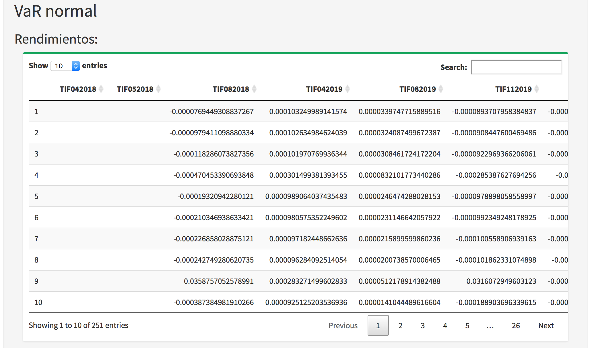
<p class="caption">(\#fig:img50)Rendimientos</p>
</div>
    * Parámetros seleccionados para cada instrumento suponiendo una distribución Normal (Ver Figura \@ref(fig:img51)).
<div class="figure" style="text-align: center">
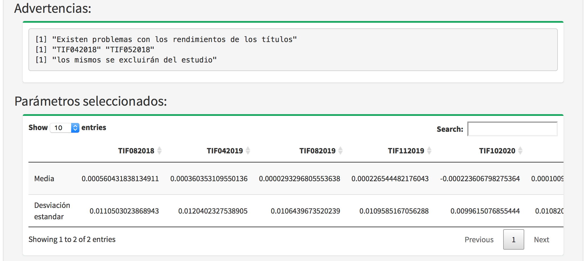
<p class="caption">(\#fig:img51)Advertencias y parámetros</p>
</div>
    * Lista de selección, donde el usuario debe elegir el nivel de confianza del VaR, ya sea 90, 95 ó 99% (Ver Figura \@ref(fig:img52)).
<div class="figure" style="text-align: center">

<p class="caption">(\#fig:img52)Nivel de confianza</p>
</div>
    * Luego se seleccionar este valor, se mostrará una tabla con los vares individuales, desviación estándar y el porcentaje que representa cada VaR individual sobre el portafolio.
    * Finalmente se muestra el valor del VaR de portafolio (Ver Figura \@ref(fig:img53)).
<div class="figure" style="text-align: center">

<p class="caption">(\#fig:img53)VaRes</p>
</div>
 * Pestaña Histórico: en esta pestaña se muestra la siguiente información,
    * Una advertencia en caso de existir algún problema con algún instrumento.
    * Pesos de cada instrumento, calculado a partir de su proporción de valor nominal con respecto al total de instrumentos (Ver Figura \@ref(fig:img54)).
<div class="figure" style="text-align: center">

<p class="caption">(\#fig:img54)Pesos</p>
</div>
    * Valor nominal del portafolio.
    * Suma de pesos (Ver Figura \@ref(fig:img55)).
<div class="figure" style="text-align: center">

<p class="caption">(\#fig:img55)Valor nominal y suma de pesos</p>
</div>
    * Escenarios, se refiere a las variaciones que ha sufrido el valor de portafolio de manera diaria esto debido a la variación de los precios de los instrumentos (Ver Figura \@ref(fig:img56)).
<div class="figure" style="text-align: center">
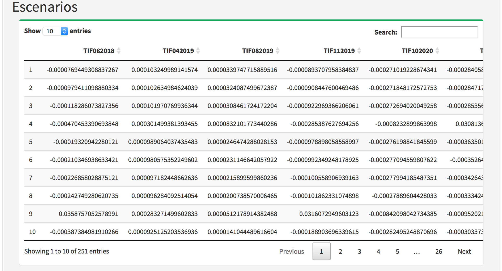
<p class="caption">(\#fig:img56)Escenarios</p>
</div>
    * Lista de selección, donde el usuario debe elegir el nivel de confianza del VaR, ya sea 90, 95 ó 99%.
    * Ubicación de la observación a ser considerada para el cálculo del VaR por simulación Histórica (Ver Figura \@ref(fig:img57)).
<div class="figure" style="text-align: center">
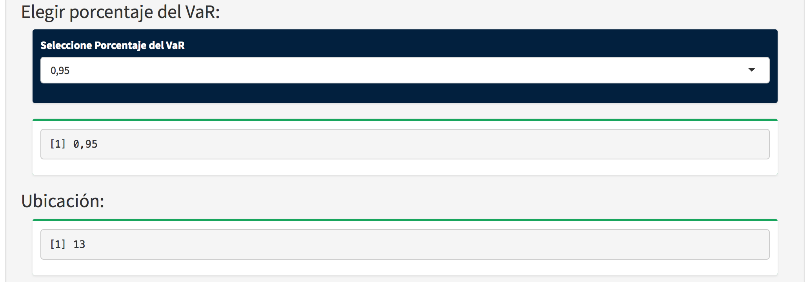
<p class="caption">(\#fig:img57)Nivel de confianza y ubicación</p>
</div>
    * Resultados de los vares individuales, donde se mostrará el valor nominal y el VaR para cada instrumento.
    * VaR del portafolio (Ver Figura \@ref(fig:img58)).
<div class="figure" style="text-align: center">

<p class="caption">(\#fig:img58)VaRes</p>
</div>
 * Pestaña Simulación MonteCarlo: esta pestaña se subdivide en dos secciones (Ver Figura \@ref(fig:img59)),
<div class="figure" style="text-align: center">
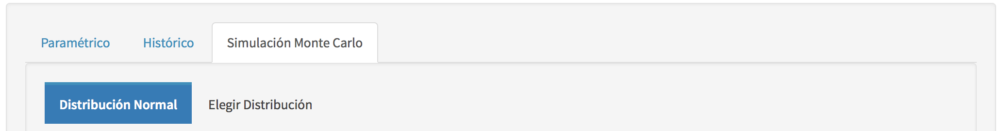
<p class="caption">(\#fig:img59)Pestañas simulación MonteCarlo</p>
</div>
    * VaR Simulación MonteCarlo asumiendo normalidad: en esta sección se muestra la siguiente información,
        * Rendimientos de cada instrumento, en caso de existir algún problema con un instrumento se mostrará un mensaje de advertencia (Ver Figura \@ref(fig:img60)).
<div class="figure" style="text-align: center">
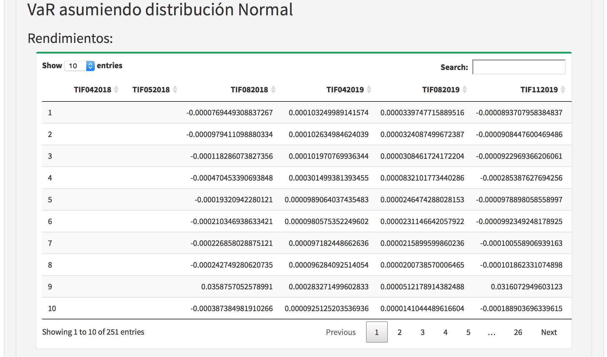
<p class="caption">(\#fig:img60)Rendimientos</p>
</div>
        * Parámetros seleccionados para cada instrumento suponiendo una distribución Normal.
        * Lista de selección, donde el usuario debe elegir el nivel de confianza del VaR, ya sea 90, 95 ó 99% (Ver Figura \@ref(fig:img61)).
<div class="figure" style="text-align: center">

<p class="caption">(\#fig:img61)Parámetros y nivel de confianza</p>
</div>
        * Lista de selección, donde el usuario debe elegir la cantidad de simulaciones que desea realizar (Ver Figura \@ref(fig:img62)).
<div class="figure" style="text-align: center">

<p class="caption">(\#fig:img62)Cantidad de simulaciones</p>
</div>
        * Resultados de los vares individuales obtenidos mediante esta metodología. Donde se muestra el nombre del instrumento, el valor nominal, el var individual y el porcentaje de cada VaR con respecto al portafolio.
        * Resultado del VaR de portafolio (Ver Figura \@ref(fig:img63)).
<div class="figure" style="text-align: center">
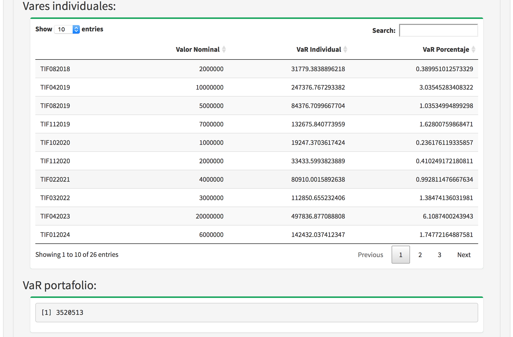
<p class="caption">(\#fig:img63)VaRes</p>
</div>
    * VaR Simulación MonteCarlo considerando mejor distribución: en esta sección se muestra la siguiente información,
        * Rendimientos de cada instrumento, en caso de existir algún problema con un instrumento se mostrará un mensaje de advertencia (Ver Figura \@ref(fig:img64)).
<div class="figure" style="text-align: center">

<p class="caption">(\#fig:img64)Rendimientos</p>
</div>
        * Distribuciones seleccionadas para cada instrumento, ya sea seleccionadas mediante la aplicación o mediante un archivo ingresado por el usuario.
        * Lista de selección, donde el usuario debe elegir el nivel de confianza del VaR, ya sea 90, 95 ó 99% (Ver Figura \@ref(fig:img65)).
<div class="figure" style="text-align: center">
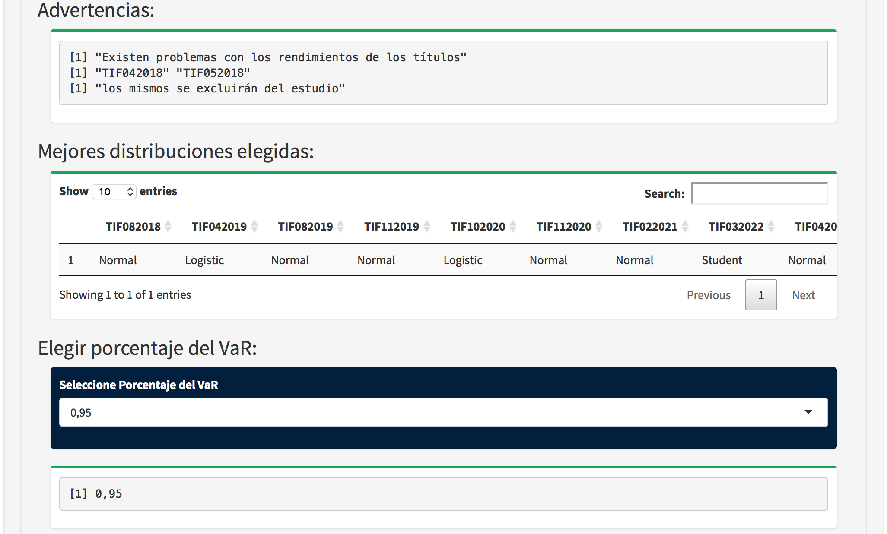
<p class="caption">(\#fig:img65)Distribuciones y nivel de confianza</p>
</div>
        * Lista de selección, donde el usuario debe elegir la cantidad de simulaciones que desea realizar (Ver Figura \@ref(fig:img66)).
<div class="figure" style="text-align: center">

<p class="caption">(\#fig:img66)Cantidad de simulaciones</p>
</div>
        * Resultados del VaR individual.
        * Resultado del VaR de portafolio (Ver Figura \@ref(fig:img67)).
<div class="figure" style="text-align: center">

<p class="caption">(\#fig:img67)VaRes</p>
</div>
 
### Gráficos

En esta sección se subdivide en (Ver Figura \@ref(fig:img68)), 

<div class="figure" style="text-align: center">

<p class="caption">(\#fig:img68)Pestañas sección Gráficos</p>
</div>

 * Pestaña Valor nominal: en esta subsección se muestra un gráfico de torta donde se muestra el valor nominal de cada instrumento (Ver Figura \@ref(fig:img69)).
 
<div class="figure" style="text-align: center">
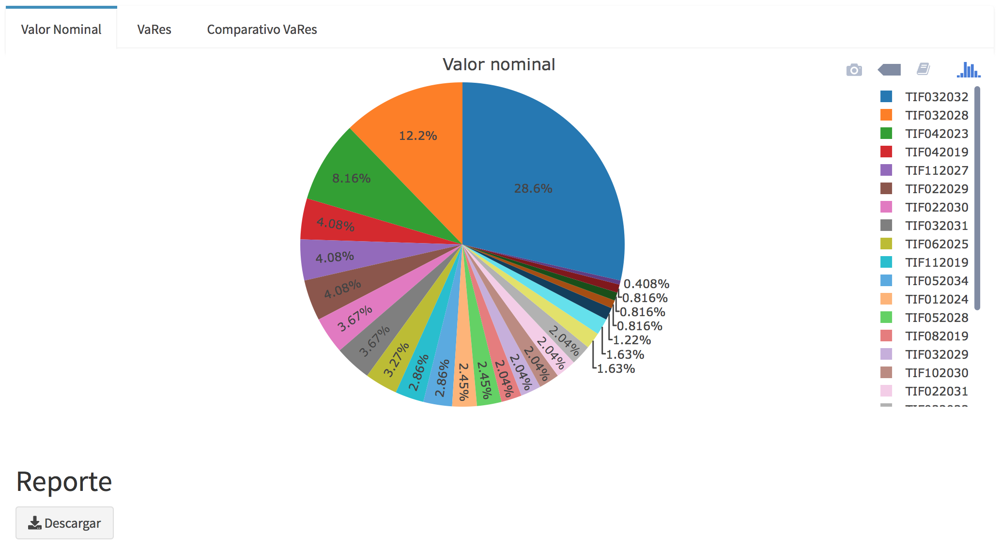
<p class="caption">(\#fig:img69)Gráfico valor nominal</p>
</div>
 
 * VaRes: esta subsección presenta los resultados de los VaRes obtenidos mediante las diferentes metodologías, la misma se divide en (Ver Figura \@ref(fig:img70)),
<div class="figure" style="text-align: center">

<p class="caption">(\#fig:img70)Pestañs VaRes</p>
</div>
    * VaR Paramétrico: en esta subsección se muestran los gráficos correspondientes a esta metodología. La misma se subdivide en (Ver Figura \@ref(fig:img71)),
<div class="figure" style="text-align: center">

<p class="caption">(\#fig:img71)Pestañas VaR paramétrico</p>
</div>
        + VaRes individuales: se muestra un gráfico de torta donde se muestra información sobre los VaRes individuales obtenidos (Ver Figura \@ref(fig:img72)).
<div class="figure" style="text-align: center">

<p class="caption">(\#fig:img72)VaRes individuales</p>
</div>
        + Comparativo: se muestra un gráfico comparativo donde se compara el VaR de portafolio y la suma de los VaRes individuales (Ver Figura \@ref(fig:img73)).
<div class="figure" style="text-align: center">

<p class="caption">(\#fig:img73)Comparativo</p>
</div>
    * VaR Simulación Histórica: esta subsección muestra los siguientes gráficos (Ver Figura \@ref(fig:img74)),
<div class="figure" style="text-align: center">

<p class="caption">(\#fig:img74)Pestañas VaR simulación por histórica</p>
</div>
        + Escenarios: muestra un histograma mediante el cual se muestran los diferentes escenarios obtenidos (Ver Figura \@ref(fig:img75)).
<div class="figure" style="text-align: center">

<p class="caption">(\#fig:img75)Histograma escenarios</p>
</div>
        + VaRes individuales: muestra un gráfico de torta donde se muestra información sobre los Vares individuales obtenidos (Ver Figura \@ref(fig:img76)).
<div class="figure" style="text-align: center">
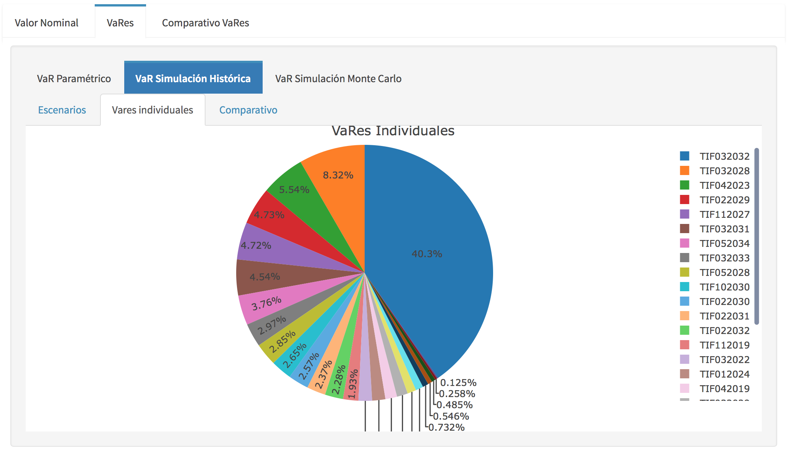
<p class="caption">(\#fig:img76)VaRes individuales</p>
</div>
        + Comparativo: se muestra un gráfico comparativo donde se compara el VaR de portafolio y la suma de los VaRes individuales (Ver Figura \@ref(fig:img77)).
<div class="figure" style="text-align: center">

<p class="caption">(\#fig:img77)Comparativo</p>
</div>
    * VaR Simulación MonteCarlo: esta subsección se divide en dos (Ver Figura \@ref(fig:img78)),
<div class="figure" style="text-align: center">

<p class="caption">(\#fig:img78)Pestañas VaR simulación MonteCarlo</p>
</div>
        + Distribución Normal: se muestra los resultados, asumiendo una distribución normal (Ver Figura \@ref(fig:img79)),
<div class="figure" style="text-align: center">
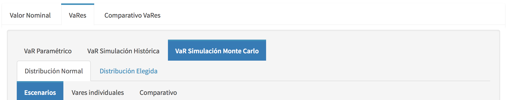
<p class="caption">(\#fig:img79)Pestañas VaR simulación MonteCarlo normal</p>
</div>
            * Escenarios: muestra un histograma mediante el cual se muestran los diferentes escenarios obtenidos (Ver Figura \@ref(fig:img80)).
<div class="figure" style="text-align: center">

<p class="caption">(\#fig:img80)Histograma escenarios</p>
</div>
            * VaRes individuales: muestra un gráfico de torta donde se muestra información sobre los Vares individuales obtenidos (Ver Figura \@ref(fig:img81)).
<div class="figure" style="text-align: center">

<p class="caption">(\#fig:img81)VaRes individuales</p>
</div>
            * Comparativo: se muestra un gráfico comparativo donde se compara el VaR de portafolio y la suma de los VaRes individuales (Ver Figura \@ref(fig:img82)).
<div class="figure" style="text-align: center">

<p class="caption">(\#fig:img82)Comparativo</p>
</div>
        + Distribución Elegida: se muestran los resultados, asumiendo la mejor distribución (Ver Figura \@ref(fig:img83)),
<div class="figure" style="text-align: center">

<p class="caption">(\#fig:img83)Pestañas VaR simulación MonteCarlo mejor distribución</p>
</div>
            * Escenarios: muestra un histograma mediante el cual se muestran los diferentes escenarios obtenidos (Ver Figura \@ref(fig:img84)).
<div class="figure" style="text-align: center">

<p class="caption">(\#fig:img84)Histograma escenarios</p>
</div>
            * VaRes individuales: muestra un gráfico de torta donde se muestra información sobre los Vares individuales obtenidos (Ver Figura \@ref(fig:img85)).
<div class="figure" style="text-align: center">

<p class="caption">(\#fig:img85)VaRes individuales</p>
</div>
            * Comparativo: se muestra un gráfico comparativo donde se compara el VaR de portafolio y la suma de los VaRes individuales (Ver Figura \@ref(fig:img86)).
<div class="figure" style="text-align: center">

<p class="caption">(\#fig:img86)Comparativo</p>
</div>
 * Comparativo Vares: en esta subsección se muestra un gráfico comparativo del VaR de portafolio obtenido para cada metodología (Ver Figura \@ref(fig:img87)).
<div class="figure" style="text-align: center">

<p class="caption">(\#fig:img87)Comparativo VaRes</p>
</div>

### Históricos

Esta sección permite calcular el VaR para un rango de fechas en específico, siempre y cuando las mismas se encuentren disponibles en la data histórica considerada. La misma cuenta con las siguientes secciones (Ver Figura \@ref(fig:img88)), 

<div class="figure" style="text-align: center">

<p class="caption">(\#fig:img88)Pestañas sección Históricos</p>
</div>

  * VaR Paramétrico: esta subsección permite calcular el histórico de los VaRes mediante el uso de la metodología del VaR paramétrico, la cual se basa en asumir una distribución normal para cada instrumento. Dentro de esta subsección se encuentra (Ver Figura \@ref(fig:img89)),
    * Rango de fechas disponibles, el cual es obtenido a partir de la data cargada en la sección Datos.
    * Opción para seleccionar el rango de fechas deseado, es importante acotar que la fecha inicial debe ser siempre menor que la fecha final, y las mismas no se pueden salir del rango establecido en el punto anterior.
    * Elección realizada por el usuario.
    * Histórico generado por la metodología del Var paramétrico, consta de dos columnas la primera indica la fecha, mientras que la segunda indica el valor del VaR para ese día en específico.
<div class="figure" style="text-align: center">

<p class="caption">(\#fig:img89)Sección Históricos</p>
</div>
  * VaR Histórico: esta subsección permite calcular el histórico de los Vares mediante el uso de la metodología del VaR por simulación histórica, la cual se caracteriza por no asignar ninguna distribución conocida, sino que trabaja con la distribución empírica de los datos. Dentro de esta subsección se encuentra:
    * Rango de fechas disponibles, el cual es obtenido a partir de la data cargada en la sección Datos.
    * Opción para seleccionar el rango de fechas deseado, es importante acotar que la fecha inicial debe ser siempre menor que la fecha final, y las mismas no se pueden salir del rango establecido en el punto anterior.
    * Elección realizada por el usuario.
    * Histórico generado por la metodología del Var por simulación histórica, consta de dos columnas la primera indica la fecha, mientras que la segunda indica el valor del VaR para ese día en específico.
  
  * VaR SMC Normal: esta subsección permite calcular el histórico de los Vares mediante el uso de la metodología del VaR por simulación de MonteCarlo asumiendo una distribicón normal para cada instrumento, esta metodología se caracteriza por el empleo de simulaciones y el cálculo de diferentes escenarios con el fin de calcular el valor del VaR. Dentro de esta subsección se encuentra:
    * Rango de fechas disponibles, el cual es obtenido a partir de la data cargada en la sección Datos.
    * Opción para seleccionar el rango de fechas deseado, es importante acotar que la fecha inicial debe ser siempre menor que la fecha final, y las mismas no se pueden salir del rango establecido en el punto anterior.
    * Elección realizada por el usuario.
    * Histórico generado por la metodología del Var por simulación de MonteCarlo asumiendo una distribución normal, consta de dos columnas la primera indica la fecha, mientras que la segunda indica el valor del VaR para ese día en específico.
  
  * VaR SMC Mejor Distribución: esta subsección permite calcular el histórico de los Vares mediante el uso de la metodología del VaR por simulación de MonteCarlo considerando la mejor distribución para cada instrumento, las distribuciones consideradas serán las elegidas por el usuario en la sección Distribución. Dentro de esta subsección se encuentra:
    * Rango de fechas disponibles, el cual es obtenido a partir de la data cargada en la sección Datos.
    * Opción para seleccionar el rango de fechas deseado, es importante acotar que la fecha inicial debe ser siempre menor que la fecha final, y las mismas no se pueden salir del rango establecido en el punto anterior.
    * Elección realizada por el usuario.
    * Histórico generado por la metodología del Var por simulación de MonteCarlo considerando la mejor distribución, consta de dos columnas la primera indica la fecha, mientras que la segunda indica el valor del VaR para ese día en específico.
  

## Backtesting

Esta sección permite realizar diversas pruebas al Valor en Riesgo y así poder calibrar y analizar su comportamiento, entre estas pruebas se encuentran el test de Kupiec y  el test de Haas (Ver Figura \@ref(fig:img90)).

<div class="figure" style="text-align: center">

<p class="caption">(\#fig:img90)Pestañas sección Backtesting</p>
</div>

### Datos

En esta subsección el usuario debe ingresar los datos con los cuales se va a trabajar (Ver Figura \@ref(fig:img91)). Este archivo debe contar con las siguientes características:

  * Debe ser un archivo de texto txt.
  * Debe contar con tres columnas, la primera debe proporcionar información sobre la fecha (ej: 27/03/2018), la segunda columna debe contener información sobre el VaR para ese día. Finalmente, la tercera columna debe indicar información sobre el valor nominal del portafolio para el día considerado. Es importante mencionar que el archivo debe contener 252 observaciones (Ver Figura \@ref(fig:img92)).

<div class="figure" style="text-align: center">

<p class="caption">(\#fig:img91)Datos</p>
</div>
<div class="figure" style="text-align: center">

<p class="caption">(\#fig:img92)Data de prueba</p>
</div>

### Resultados

En esta subsección se muestran los resultados obtenidos para las diferentes pruebas. El usuario debe seleccionar el nivel de confianza para realizar la prueba. Una vez seleccionado este valor, los resultados se muestran con la siguiente estructura (Ver Figura \@ref(fig:img93)),

* Número de excepciones negativas, número de excepciones dentro del rango VaR y número total de excepciones.
* Tiempo entre excepciones.
* Resultados de los estadísticos para las pruebas de Kupiec, Haas y prueba mixta.
* Valor crítico asociado a cada prueba.
* Resultado de cada prueba, obtenido al realizar una comparación entre el valor crítico y el valor del estadístico de cada prueba.

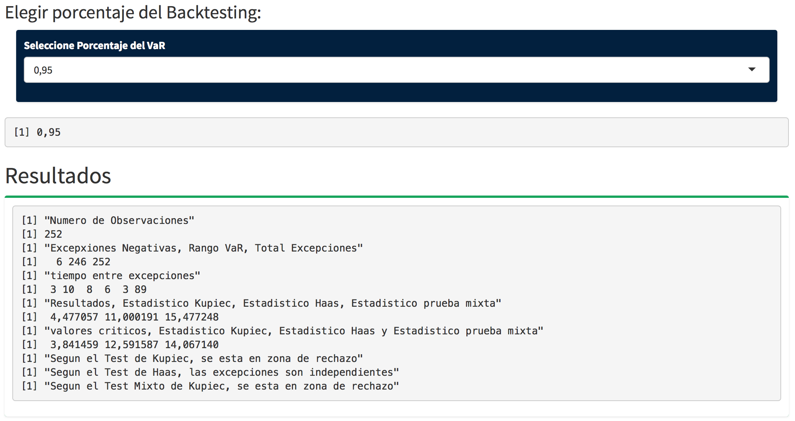
<div class="figure" style="text-align: center">
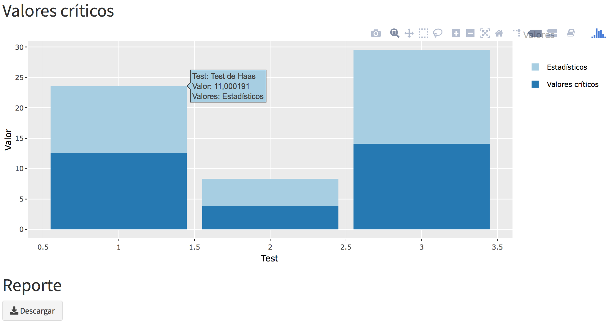
<p class="caption">(\#fig:img93)Resultados</p>
</div>
## Valoración

Esta sección permite realizar los cáculos de valoración de un portafolio, a partir de sus precios y valor nominal para un día determinado en términos de utilidad y pérdida. De igual manera, esta sección permite realizar una prueba de estrés y saber como se comportará la utilidad o périda del portafolio en caso de una posible caida de los precios (Ver Figura \@ref(fig:img94)).

<div class="figure" style="text-align: center">

<p class="caption">(\#fig:img94)Pestañas sección Valoración</p>
</div>


### Datos

En esta subsección el usuario debe ingresar la data (Ver Figura \@ref(fig:img95)) con la cual se va a trabajar, la misma debe tener la siguiente estructura (Ver Figura \@ref(fig:img96)),

* Deber ser un archivo plano txt.
* Debe contener cinco columnas, cada una se explica a continuación,
    * La primera columna, debe indicar el nombre corto del instrumento en consideración.
    * La segunda columna, debe indicar el tipo de instrumento que se está considerando.
    * La tercera columna, debe indicar el valor nominal asociado a cada instrumento.
    * La cuarta columna debe indicar el precio al día de hoy de cada instrumento.
    * La quinta columna debe indicar el precio de mercado (precio obtenido por alguna metodología de estimación de precios teóricos).
  
* El archivo debe contener tantas filas como instrumentos se desee considerar.

<div class="figure" style="text-align: center">

<p class="caption">(\#fig:img95)Datos</p>
</div>
<div class="figure" style="text-align: center">

<p class="caption">(\#fig:img96)Datos de prueba</p>
</div>
### Resultados

En esta subsección se muestra los resultados de la valoración, la información está distribuida en dos tablas,

* La primera tabla muestra información acerca del monto invertido en cada instrumento y su valor actual, considerando el precio teórico elegido. También se muestra la ganancia ó perdida que se tiene actualmente con un instrumento. En esta tabla se presenta la información para cada instrumento por separado (Ver Figura \@ref(fig:img97)).
<div class="figure" style="text-align: center">

<p class="caption">(\#fig:img97)Resultados individuales</p>
</div>
* La segunda tabla, muestra un resumen para todo el portafolio, se presenta la suma del valor nominal por tipo de instrumento, el precio promedio ponderado por el valor nominal dpara cada isntrumento, y la ganancia ó pérdida obtenida para cada tipo de instrumento considerado (Ver Figura \@ref(fig:img98)).
<div class="figure" style="text-align: center">

<p class="caption">(\#fig:img98)Resultados portafolio</p>
</div>

### Resultados prueba de estrés

En esta subsección se muestra los resultados de la valoración luego de estresar en forma negativa los precios de mercado de los instrumentos financieros considerados. Con el fin de estresar los precios de mercado es necesario incluir una data de precios históricos (Ver Figura \@ref(fig:img99)), dicha data debe poseer la siguiente estructura (Ver Figura \@ref(fig:img100)),

* Debe ser un archivo plano txt.
* La primera columna debe señalar la fecha del precio en cuestión.
* Cada columna debe representar la historia para cada instrumento.
* El archivo debe contener la misma cantidad de instrumentos considerados en la data anterior.

<div class="figure" style="text-align: center">

<p class="caption">(\#fig:img99)Datos</p>
</div>
<div class="figure" style="text-align: center">

<p class="caption">(\#fig:img100)Datos de prueba</p>
</div>
<div class="figure" style="text-align: center">

<p class="caption">(\#fig:img101)Advertencia</p>
</div>
La información está distribuida en dos tablas,

* La primera tabla muestra información acerca del monto invertido en cada instrumento, su valor actual, el precio teórico elegido, la desviación estandar de cada instrumento, el precio estresado, el Mark to Market (MTM), y la ganancia o pérdida considerando los precios teóricos iniciales y los precios teóricos estresados (Ver Figura \@ref(fig:img102)). 
<div class="figure" style="text-align: center">
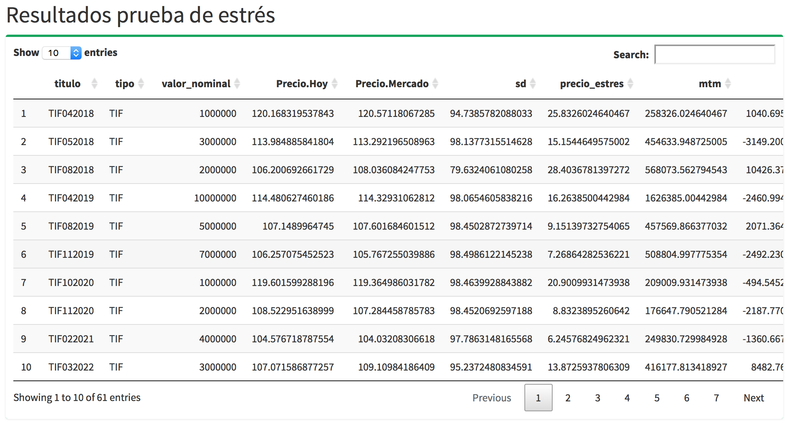
<p class="caption">(\#fig:img102)Resultados individuales estresados</p>
</div>

* La segunda tabla, muestra un resumen para todo el portafolio, se presenta la suma del valor nominal por tipo de instrumento, el precio promedio ponderado por el valor nominal para cada instrumento, y la ganancia ó pérdida obtenida para cada tipo de instrumento considerado los precios de mercado y los precios estresados (Ver Figura \@ref(fig:img103)).

<div class="figure" style="text-align: center">

<p class="caption">(\#fig:img103)Resultados portafolio estresados</p>
</div>

<!--chapter:end:OnlyManual.Rmd-->

